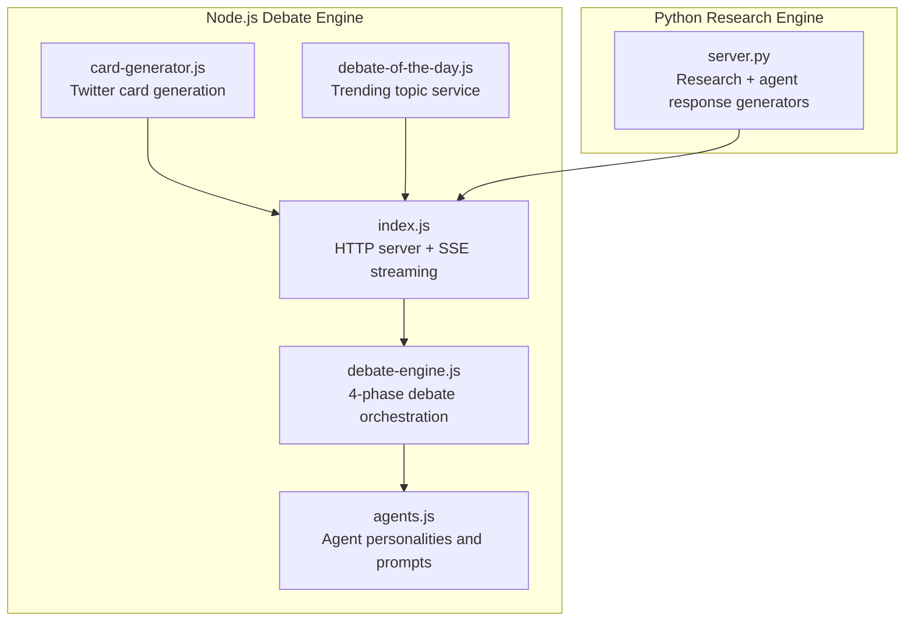
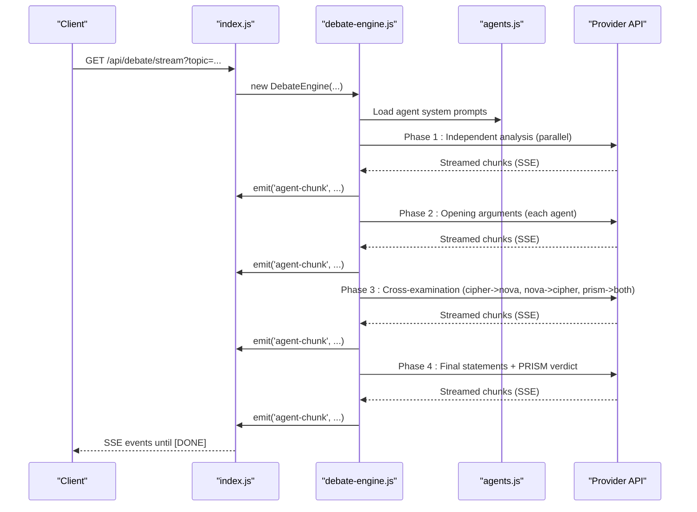
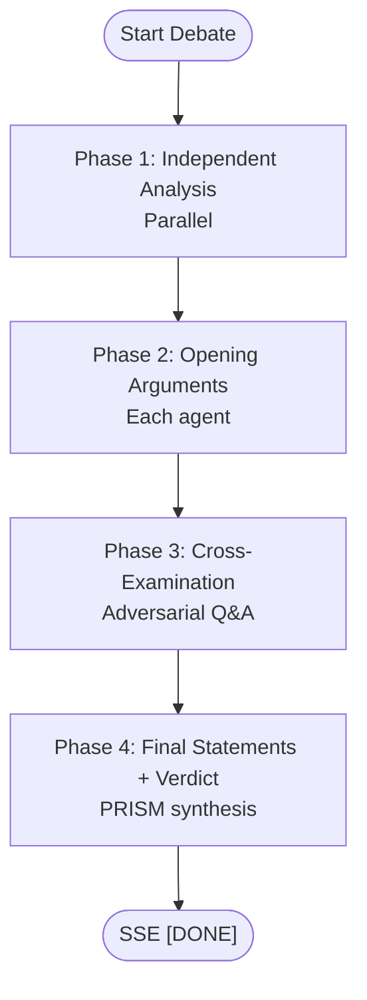
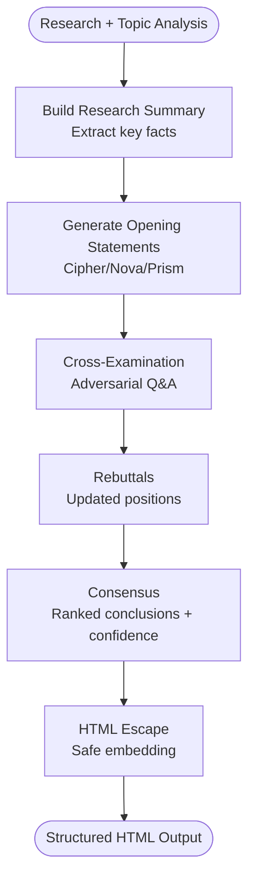
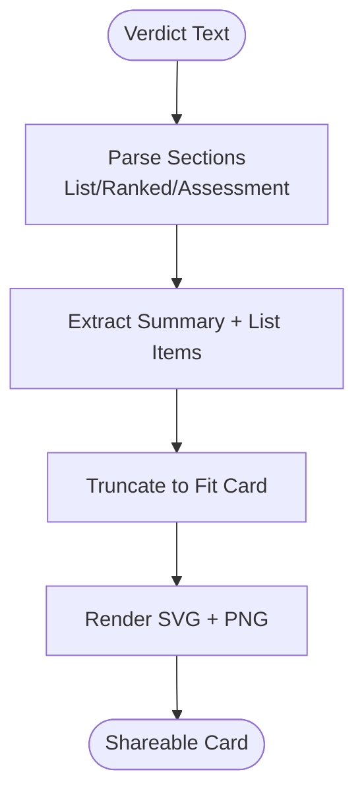
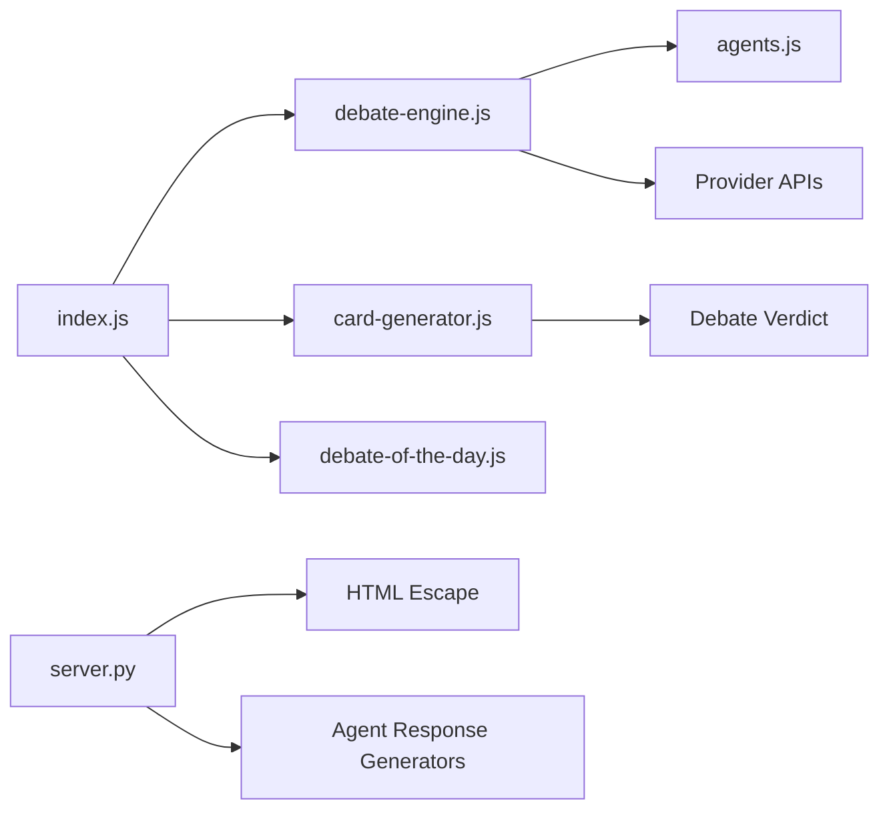

# Agent Response Generation

<cite>
**Referenced Files in This Document**
- [agents.js](file://dissensus-engine/server/agents.js)
- [debate-engine.js](file://dissensus-engine/server/debate-engine.js)
- [index.js](file://dissensus-engine/server/index.js)
- [card-generator.js](file://dissensus-engine/server/card-generator.js)
- [debate-of-the-day.js](file://dissensus-engine/server/debate-of-the-day.js)
- [server.py](file://forum/server.py)
- [README.md](file://README.md)
</cite>

## Table of Contents
1. [Introduction](#introduction)
2. [Project Structure](#project-structure)
3. [Core Components](#core-components)
4. [Architecture Overview](#architecture-overview)
5. [Detailed Component Analysis](#detailed-component-analysis)
6. [Dependency Analysis](#dependency-analysis)
7. [Performance Considerations](#performance-considerations)
8. [Troubleshooting Guide](#troubleshooting-guide)
9. [Conclusion](#conclusion)

## Introduction
This document explains the multi-agent response generation system that orchestrates AI agents to produce structured debate responses across four phases: independent analysis, opening arguments, cross-examination, and final synthesis. It focuses on how the system creates agent-specific opening statements, adversarial questioning, rebuttals, and consensus conclusions. It also documents HTML escaping mechanisms, agent-specific writing styles, and response formatting patterns used to produce evidence-based, structured outputs suitable for sharing and social media distribution.

## Project Structure
The system spans two primary engines:
- A Node.js debate engine that streams multi-phase debate results via Server-Sent Events and integrates with external LLM providers.
- A Python-based research and response generation engine that builds evidence-based agent responses and formats them for display and sharing.

**Diagram sources**
- [agents.js:1-148](file://dissensus-engine/server/agents.js#L1-L148)
- [debate-engine.js:1-389](file://dissensus-engine/server/debate-engine.js#L1-L389)
- [index.js:1-481](file://dissensus-engine/server/index.js#L1-L481)
- [card-generator.js:1-361](file://dissensus-engine/server/card-generator.js#L1-L361)
- [debate-of-the-day.js:1-80](file://dissensus-engine/server/debate-of-the-day.js#L1-L80)
- [server.py:1-495](file://forum/server.py#L1-L495)

**Section sources**
- [README.md:20-29](file://README.md#L20-L29)

## Core Components
- Agent personalities and prompts: Define distinct roles, reasoning styles, and formatting expectations for CIPHER (skeptic), NOVA (advocate), and PRISM (synthesizer).
- Debate engine: Coordinates four phases of debate, streams results via SSE, and integrates with OpenAI, DeepSeek, and Google Gemini.
- Response generators (Python): Produce evidence-based agent responses, adversarial questioning, rebuttals, and consensus conclusions with HTML escaping and formatting.
- Card generator: Produces shareable debate cards optimized for social media distribution.

**Section sources**
- [agents.js:8-146](file://dissensus-engine/server/agents.js#L8-L146)
- [debate-engine.js:41-387](file://dissensus-engine/server/debate-engine.js#L41-L387)
- [server.py:151-421](file://forum/server.py#L151-L421)
- [card-generator.js:170-361](file://dissensus-engine/server/card-generator.js#L170-L361)

## Architecture Overview
The system runs a structured debate across four phases:
1. Independent analysis: Each agent analyzes the topic privately.
2. Opening arguments: Each agent presents a structured position.
3. Cross-examination: Agents challenge each other’s arguments.
4. Final synthesis: PRISM delivers a definitive verdict with ranked conclusions and confidence levels.

**Diagram sources**
- [index.js:220-311](file://dissensus-engine/server/index.js#L220-L311)
- [debate-engine.js:121-386](file://dissensus-engine/server/debate-engine.js#L121-L386)
- [agents.js:8-146](file://dissensus-engine/server/agents.js#L8-L146)

## Detailed Component Analysis

### Agent Personas and Writing Styles
- CIPHER (Skeptic): Emphasizes risk identification, critical analysis, and evidence-driven skepticism. Prompts instruct CIPHER to challenge assumptions, highlight risks, and maintain a sharp, analytical tone.
- NOVA (Advocate): Builds the strongest possible bullish case, focusing on opportunities, catalysts, and evidence. Prompts instruct NOVA to be persuasive yet grounded in facts, with a confident and energetic tone.
- PRISM (Synthesizer): Provides neutral, objective analysis, weighing both sides, identifying where agents agree and disagree, and delivering a definitive verdict with ranked conclusions and confidence levels.

These personas guide the system prompts used in each phase and inform the structured formatting expectations for each agent’s output.

**Section sources**
- [agents.js:8-146](file://dissensus-engine/server/agents.js#L8-L146)

### Debate Orchestration and Streaming
The debate engine coordinates four phases:
- Phase 1: Independent analysis (parallel execution across agents).
- Phase 2: Opening arguments (each agent submits a structured position).
- Phase 3: Cross-examination (adversarial questioning between agents).
- Phase 4: Final statements and PRISM verdict.

The engine streams partial results via Server-Sent Events, emitting events for phase transitions, agent starts/dones, and incremental chunks. It supports multiple providers and models, and enforces input validation and rate limiting.

**Diagram sources**
- [debate-engine.js:121-386](file://dissensus-engine/server/debate-engine.js#L121-L386)

**Section sources**
- [debate-engine.js:41-387](file://dissensus-engine/server/debate-engine.js#L41-L387)
- [index.js:220-311](file://dissensus-engine/server/index.js#L220-L311)

### Evidence-Based Response Generation (Python)
The Python engine constructs agent responses from research findings and topic analysis. It includes:
- HTML escaping to safely embed research facts into responses.
- Agent-specific writing styles:
  - generate_cipher_opening: Risk-focused, skeptical framing, structured risk bullets.
  - generate_nova_opening: Opportunity-focused, bullish framing, structured opportunity bullets.
  - generate_prism_opening: Neutral framework, evaluation criteria, quantified claims.
  - generate_cross_examination: Adversarial questioning, targeted challenges, and pushback.
  - generate_rebuttals: Updated positions, calibrated confidence levels, and synthesis of feedback.
  - generate_consensus: Structured ranked conclusions, confidence levels, and actionable recommendations.

Response formatting patterns:
- Structured paragraphs with emphasis on key points.
- Bullet lists for risks/opportunities/conclusions.
- Explicit confidence levels and caveats when requested.
- Domain-aware adaptations (e.g., crypto-specific rankings).

**Diagram sources**
- [server.py:130-139](file://forum/server.py#L130-L139)
- [server.py:151-193](file://forum/server.py#L151-L193)
- [server.py:196-237](file://forum/server.py#L196-L237)
- [server.py:240-263](file://forum/server.py#L240-L263)
- [server.py:266-305](file://forum/server.py#L266-L305)
- [server.py:308-341](file://forum/server.py#L308-L341)
- [server.py:344-421](file://forum/server.py#L344-L421)
- [server.py:146-148](file://forum/server.py#L146-L148)

**Section sources**
- [server.py:151-421](file://forum/server.py#L151-L421)

### HTML Escaping Mechanisms
The Python engine defines a safe HTML escape function to prevent injection when embedding research facts into agent responses. This ensures that raw text extracted from web searches is rendered safely in the final HTML output.

- Function: esc(text) performs entity escapes for ampersand, less-than, greater-than, and double-quote characters.

**Section sources**
- [server.py:146-148](file://forum/server.py#L146-L148)

### Agent-Specific Writing Styles and Formatting Patterns
- CIPHER: Structured risk analysis with headers, bullet points, and bolded critical findings. Signature phrases and formatting cues are embedded in the agent’s system prompt.
- NOVA: Structured opportunity analysis with headers, bullet points, and bolded compelling insights. Signature phrases and formatting cues are embedded in the agent’s system prompt.
- PRISM: Structured verdict with headers, ranked conclusions, confidence levels, and explicit “Recommended List” or “Ranked Picks” sections when requested.

These patterns are reflected in both the Node.js prompts and the Python response generators.

**Section sources**
- [agents.js:8-146](file://dissensus-engine/server/agents.js#L8-L146)
- [debate-engine.js:341-379](file://dissensus-engine/server/debate-engine.js#L341-L379)
- [server.py:151-193](file://forum/server.py#L151-L193)
- [server.py:196-237](file://forum/server.py#L196-L237)
- [server.py:240-263](file://forum/server.py#L240-L263)

### Debate Dynamics and Example Expressions
- Opening statements: Each agent presents a thesis, 3–5 supporting points with evidence, and a conclusion.
- Cross-examination: CIPHER challenges NOVA’s bull case; NOVA counters CIPHER’s bear case; PRISM challenges both sides.
- Rebuttals: Agents refine positions based on adversarial feedback.
- Consensus: PRISM synthesizes into ranked conclusions, confidence levels, and actionable recommendations.

Examples of agent personality expressions:
- CIPHER signature phrases emphasize evidence-driven skepticism and risk focus.
- NOVA signature phrases emphasize opportunity and asymmetric upside.
- PRISM signature phrases emphasize balanced assessment and definitive synthesis.

**Section sources**
- [agents.js:37-42](file://dissensus-engine/server/agents.js#L37-L42)
- [agents.js:73-78](file://dissensus-engine/server/agents.js#L73-L78)
- [agents.js:109-113](file://dissensus-engine/server/agents.js#L109-L113)

### Twitter Card Generation and Response Formatting
The card generator extracts a concise summary and a ranked list from the debate verdict for shareable cards. It:
- Detects crypto-related topics and adds disclaimers.
- Truncates long text to fit card dimensions.
- Parses “Recommended List,” “Ranked Picks,” or “Ranked Conclusions” sections.
- Renders a compact card with summary, list items, and overall conviction.

**Diagram sources**
- [card-generator.js:87-152](file://dissensus-engine/server/card-generator.js#L87-L152)
- [card-generator.js:170-361](file://dissensus-engine/server/card-generator.js#L170-L361)

**Section sources**
- [card-generator.js:14-39](file://dissensus-engine/server/card-generator.js#L14-L39)
- [card-generator.js:41-85](file://dissensus-engine/server/card-generator.js#L41-L85)
- [card-generator.js:170-361](file://dissensus-engine/server/card-generator.js#L170-L361)

## Dependency Analysis
- Node.js server depends on the debate engine and agents module for orchestration and prompts.
- Debate engine depends on agent prompts and provider configurations for LLM calls.
- Python engine depends on research utilities and response generators for evidence-based outputs.
- Card generator depends on the debate verdict and optional LLM summarization for concise cards.

**Diagram sources**
- [index.js:11-24](file://dissensus-engine/server/index.js#L11-L24)
- [debate-engine.js:11-39](file://dissensus-engine/server/debate-engine.js#L11-L39)
- [agents.js:1-148](file://dissensus-engine/server/agents.js#L1-L148)
- [card-generator.js:1-361](file://dissensus-engine/server/card-generator.js#L1-L361)
- [debate-of-the-day.js:1-80](file://dissensus-engine/server/debate-of-the-day.js#L1-L80)
- [server.py:146-148](file://forum/server.py#L146-L148)
- [server.py:151-421](file://forum/server.py#L151-L421)

**Section sources**
- [index.js:11-24](file://dissensus-engine/server/index.js#L11-L24)
- [debate-engine.js:11-39](file://dissensus-engine/server/debate-engine.js#L11-L39)

## Performance Considerations
- Streaming via Server-Sent Events reduces latency and improves perceived responsiveness.
- Parallel execution of Phase 1 independent analysis accelerates throughput.
- Input validation and rate limiting protect resources and ensure fair usage.
- Optional LLM summarization for cards reduces payload sizes for social sharing.

[No sources needed since this section provides general guidance]

## Troubleshooting Guide
Common issues and remedies:
- API key errors: Ensure provider keys are configured in environment variables or passed by clients when allowed.
- Invalid model/provider: Verify model availability for the selected provider.
- Input validation failures: Confirm topic length and format meet requirements.
- SSE client disconnects: The server handles abrupt disconnections gracefully.

**Section sources**
- [index.js:157-215](file://dissensus-engine/server/index.js#L157-L215)
- [index.js:236-311](file://dissensus-engine/server/index.js#L236-L311)
- [debate-engine.js:48-53](file://dissensus-engine/server/debate-engine.js#L48-L53)

## Conclusion
The multi-agent response generation system combines structured debate orchestration with evidence-based agent responses to produce rigorous, formatted outputs. Agent-specific prompts shape distinct reasoning styles, while adversarial questioning and synthesis yield nuanced conclusions with confidence levels. HTML escaping and card generation ensure safe, shareable presentations of debate outcomes.