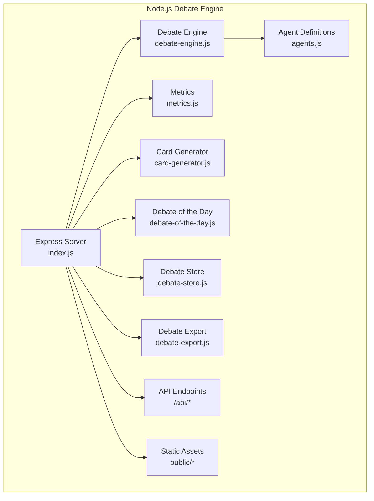
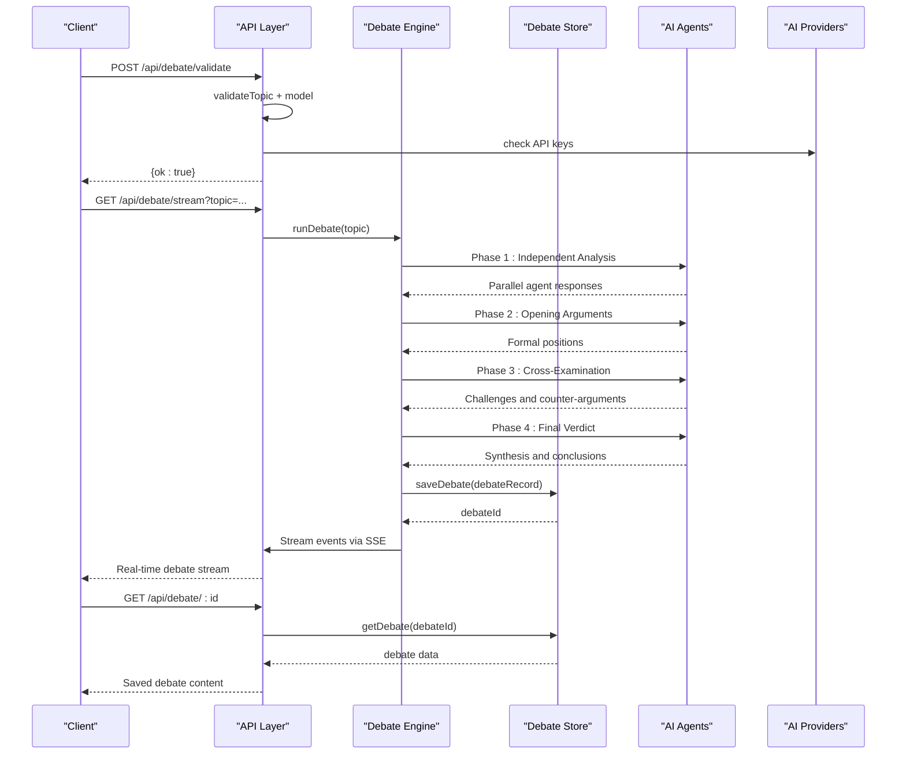
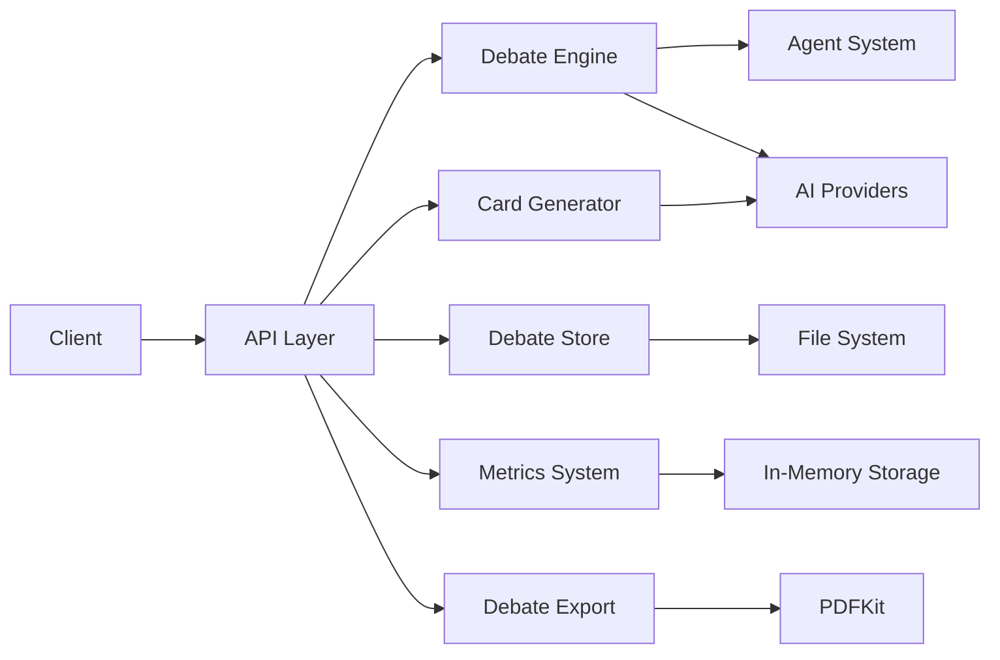

# Discussion API Endpoints

<cite>
**Referenced Files in This Document**
- [index.js](file://dissensus-engine/server/index.js)
- [debate-engine.js](file://dissensus-engine/server/debate-engine.js)
- [agents.js](file://dissensus-engine/server/agents.js)
- [metrics.js](file://dissensus-engine/server/metrics.js)
- [card-generator.js](file://dissensus-engine/server/card-generator.js)
- [debate-of-the-day.js](file://dissensus-engine/server/debate-of-the-day.js)
- [debate-store.js](file://dissensus-engine/server/debate-store.js)
- [debate-export.js](file://dissensus-engine/server/debate-export.js)
- [package.json](file://dissensus-engine/package.json)
- [index.html](file://dissensus-engine/public/index.html)
- [test-api.html](file://dissensus-engine/public/test-api.html)
- [VPS-DEPLOY.md](file://VPS-DEPLOY.md)
- [DEPLOY-VPS.md](file://dissensus-engine/docs/DEPLOY-VPS.md)
</cite>

## Update Summary
**Changes Made**
- Updated debate persistence endpoints documentation to reflect new implementation structure in server/index.js
- Added comprehensive coverage of debate storage, retrieval, and export functionality
- Updated API endpoint locations and routing structure
- Enhanced documentation of debate lifecycle and data persistence
- Added export functionality documentation for JSON and PDF formats

## Table of Contents
1. [Introduction](#introduction)
2. [Project Structure](#project-structure)
3. [Core Components](#core-components)
4. [Architecture Overview](#architecture-overview)
5. [Detailed Component Analysis](#detailed-component-analysis)
6. [Dependency Analysis](#dependency-analysis)
7. [Performance Considerations](#performance-considerations)
8. [Troubleshooting Guide](#troubleshooting-guide)
9. [Conclusion](#conclusion)
10. [Appendices](#appendices)

## Introduction
This document provides comprehensive API documentation for the research discussion endpoints powered by the Node.js debate engine. It focuses on:
- POST /api/debate/validate: Validates debate parameters and checks API key availability
- GET /api/debate/stream: Streams multi-agent debate responses in real-time via Server-Sent Events
- GET /api/health: Service health monitoring endpoint
- GET /api/providers: Returns available AI providers and models
- GET /api/config: Returns server configuration including available providers
- GET /api/debate/:id: Retrieves saved debate by ID
- GET /api/debate/:id/export/json: Exports debate as structured JSON
- GET /api/debate/:id/export/pdf: Exports debate as downloadable PDF
- GET /api/debates/recent: Lists recent debates with metadata
- POST /api/card: Generates shareable debate cards
- GET /api/metrics: Public metrics and analytics
- GET /api/debate-of-the-day: Returns trending debate topics

The system implements a sophisticated 4-phase dialectical debate process with three AI agents (CIPHER, NOVA, PRISM) and provides comprehensive streaming capabilities for real-time debate experiences along with persistent storage and export functionality.

## Project Structure
The research discussion APIs are implemented entirely within the Node.js debate engine with integrated persistence:



**Diagram sources**
- [index.js:1-579](file://dissensus-engine/server/index.js#L1-L579)
- [debate-engine.js:1-425](file://dissensus-engine/server/debate-engine.js#L1-L425)
- [agents.js:1-148](file://dissensus-engine/server/agents.js#L1-L148)
- [metrics.js:1-112](file://dissensus-engine/server/metrics.js#L1-L112)
- [card-generator.js:1-361](file://dissensus-engine/server/card-generator.js#L1-L361)
- [debate-of-the-day.js:1-80](file://dissensus-engine/server/debate-of-the-day.js#L1-L80)
- [debate-store.js:1-115](file://dissensus-engine/server/debate-store.js#L1-L115)
- [debate-export.js:1-127](file://dissensus-engine/server/debate-export.js#L1-L127)

**Section sources**
- [index.js:1-579](file://dissensus-engine/server/index.js#L1-L579)
- [debate-engine.js:1-425](file://dissensus-engine/server/debate-engine.js#L1-L425)
- [agents.js:1-148](file://dissensus-engine/server/agents.js#L1-L148)
- [metrics.js:1-112](file://dissensus-engine/server/metrics.js#L1-L112)
- [card-generator.js:1-361](file://dissensus-engine/server/card-generator.js#L1-L361)
- [debate-of-the-day.js:1-80](file://dissensus-engine/server/debate-of-the-day.js#L1-L80)
- [debate-store.js:1-115](file://dissensus-engine/server/debate-store.js#L1-L115)
- [debate-export.js:1-127](file://dissensus-engine/server/debate-export.js#L1-L127)

## Core Components
- **Debate Engine**: Orchestrates the 4-phase dialectical process with three specialized AI agents
- **Agent System**: Three distinct AI personalities (CIPHER, NOVA, PRISM) with different reasoning styles
- **Streaming Architecture**: Real-time Server-Sent Events for live debate experiences
- **Persistence Layer**: File-based storage system for debate records with indexing
- **Export System**: Structured JSON and PDF export functionality
- **Metrics System**: Comprehensive analytics and usage tracking
- **Card Generation**: Twitter-optimized shareable debate cards
- **Debate of the Day**: Trend-based topic suggestions from CoinGecko

Key integration points:
- Real-time streaming via Server-Sent Events
- Multi-provider AI support (OpenAI, DeepSeek, Google Gemini)
- File-based persistence with JSON storage and index management
- Rate limiting and security middleware
- Static asset serving for frontend integration

**Section sources**
- [debate-engine.js:41-425](file://dissensus-engine/server/debate-engine.js#L41-L425)
- [agents.js:8-148](file://dissensus-engine/server/agents.js#L8-L148)
- [index.js:58-579](file://dissensus-engine/server/index.js#L58-L579)
- [debate-store.js:1-115](file://dissensus-engine/server/debate-store.js#L1-L115)
- [debate-export.js:1-127](file://dissensus-engine/server/debate-export.js#L1-L127)

## Architecture Overview
The debate engine implements a sophisticated 4-phase dialectical process with real-time streaming and persistent storage:



**Diagram sources**
- [index.js:297-408](file://dissensus-engine/server/index.js#L297-L408)
- [debate-engine.js:157-425](file://dissensus-engine/server/debate-engine.js#L157-L425)
- [debate-store.js:34-51](file://dissensus-engine/server/debate-store.js#L34-L51)

## Detailed Component Analysis

### POST /api/debate/validate
Purpose:
- Validates debate parameters before initiating a debate
- Checks topic sanitization, model availability, and API key configuration

Request Schema
- Content-Type: application/json
- Body:
  - topic: string (required). Must be 3-500 characters after sanitization
  - provider: string (optional). Defaults to 'deepseek'
  - model: string (optional). Auto-selected based on provider

Response Schema
- Success (200):
  - ok: boolean (true)
- Client Error (400):
  - error: string (validation failure message)

Processing Logic
- Sanitizes and validates topic length and content
- Validates provider and model combinations
- Checks for server-side API key configuration
- Returns immediate validation result

**Section sources**
- [index.js:188-234](file://dissensus-engine/server/index.js#L188-L234)

### GET /api/debate/stream
Purpose:
- Streams a complete 4-phase debate in real-time via Server-Sent Events
- Implements the full dialectical process with three AI agents
- Persists debate data during streaming for later retrieval

Request Parameters
- topic: string (required). Debate topic to analyze
- provider: string (optional). AI provider ('deepseek', 'openai', 'gemini')
- model: string (optional). Specific model identifier

Response Format
- Server-Sent Events with structured JSON payloads
- Event types: 'debate-start', 'phase-start', 'agent-start', 'agent-chunk', 'agent-done', 'phase-done', 'debate-done'

Processing Phases
1. **Phase 1: Independent Analysis** - All agents analyze topic separately
2. **Phase 2: Opening Arguments** - Formal positions presented
3. **Phase 3: Cross-Examination** - Agents challenge each other
4. **Phase 4: Final Verdict** - PRISM synthesizes conclusions

Persistence Behavior
- Stores debate phases incrementally during streaming
- Adds persistent events to debate record: 'phase-start', 'agent-done', 'phase-done', 'debate-done'
- Generates unique debate ID upon completion

Error Handling
- Returns 400 for validation failures
- Streams error events via SSE for runtime failures
- Graceful degradation with error messages

**Section sources**
- [index.js:297-408](file://dissensus-engine/server/index.js#L297-L408)
- [debate-engine.js:157-425](file://dissensus-engine/server/debate-engine.js#L157-L425)

### GET /api/debate/:id
Purpose:
- Retrieves a saved debate by its unique identifier
- Provides full debate content including phases and agent responses

Request Parameters
- id: string (required). Debate UUID from successful debate completion

Response Schema
- 200 OK: Complete debate object with all phases and metadata
- 404 Not Found: Error indicating debate not found

Response Format
- JSON object containing:
  - id: string (UUID)
  - topic: string
  - provider: string
  - model: string
  - userId: string|null
  - workspaceId: string|null
  - timestamp: string
  - phases: array of debate events
  - agentModels: object (if mixed models used)

**Section sources**
- [index.js:423-428](file://dissensus-engine/server/index.js#L423-L428)
- [debate-store.js:58-68](file://dissensus-engine/server/debate-store.js#L58-L68)

### GET /api/debate/:id/export/json
Purpose:
- Exports a saved debate as structured JSON for external processing
- Converts SSE events into organized phase-based content

Request Parameters
- id: string (required). Debate UUID to export

Response Format
- 200 OK: JSON file attachment with structured debate data
- 404 Not Found: Error indicating debate not found

Export Structure
- metadata: Basic debate information and permalink
- agents: Agent profiles and roles
- phases: Organized content by phase (analysis, arguments, cross-examination, verdict)
- verdict: Final synthesized conclusion

**Section sources**
- [index.js:430-437](file://dissensus-engine/server/index.js#L430-L437)
- [debate-export.js:7-60](file://dissensus-engine/server/debate-export.js#L7-L60)

### GET /api/debate/:id/export/pdf
Purpose:
- Exports a saved debate as a downloadable PDF document
- Creates a professionally formatted PDF with all debate phases

Request Parameters
- id: string (required). Debate UUID to export

Response Format
- 200 OK: PDF file attachment
- 404 Not Found: Error indicating debate not found
- 500 Internal Server Error: PDF generation failure

PDF Structure
- Title page with debate topic and metadata
- Agent profiles section
- Individual pages for each debate phase
- Final verdict page
- Professional A4 formatting with colored agent headers

**Section sources**
- [index.js:439-453](file://dissensus-engine/server/index.js#L439-L453)
- [debate-export.js:62-124](file://dissensus-engine/server/debate-export.js#L62-L124)

### GET /api/debates/recent
Purpose:
- Lists recent debates with metadata for browsing and navigation
- Provides lightweight metadata without full content loading

Request Parameters
- limit: number (optional). Maximum number of debates to return (default: 20, max: 50)

Response Schema
- 200 OK: Array of debate metadata objects
- Each metadata object includes: id, topic, provider, userId, workspaceId, timestamp

**Section sources**
- [index.js:418-421](file://dissensus-engine/server/index.js#L418-L421)
- [debate-store.js:75-85](file://dissensus-engine/server/debate-store.js#L75-L85)

### GET /api/health
Purpose:
- Monitors service health and provider availability

Response Schema
- 200 OK:
  - status: string ("ok")
  - service: string ("dissensus-engine")
  - providers: string (comma-separated provider list)

Operational Notes
- Used by monitoring systems and load balancers
- Indicates server readiness and provider configuration

**Section sources**
- [index.js:112-118](file://dissensus-engine/server/index.js#L112-L118)

### GET /api/providers
Purpose:
- Returns available AI providers and their supported models

Response Schema
- 200 OK:
  - provider: object containing hasServerKey and model details
  - Models include cost information and capabilities

**Section sources**
- [index.js:123-137](file://dissensus-engine/server/index.js#L123-L137)

### GET /api/config
Purpose:
- Returns server configuration including available providers and limits

Response Schema
- 200 OK:
  - availableProviders: array of configured providers
  - maxTopicLength: number (500)

**Section sources**
- [index.js:96-105](file://dissensus-engine/server/index.js#L96-L105)

### POST /api/card
Purpose:
- Generates shareable debate cards in PNG format for social media

Request Schema
- Content-Type: application/json
- Body:
  - topic: string (required). Debate topic
  - verdict: string (required). Debate conclusion

Response Format
- 200 OK: PNG image attachment
- 400/500: Error response with message

Processing Logic
- Validates input parameters
- Generates Twitter-optimized 1200×630 PNG
- Includes crypto disclaimer for relevant topics
- Summarizes long verdicts when server keys available

**Section sources**
- [index.js:480-514](file://dissensus-engine/server/index.js#L480-L514)
- [card-generator.js:170-361](file://dissensus-engine/server/card-generator.js#L170-L361)

### GET /api/metrics
Purpose:
- Provides public metrics and analytics for the debate engine

Response Schema
- 200 OK:
  - totalDebates: number
  - uniqueTopics: number
  - debatesToday: number
  - providerUsage: object
  - uptimeSeconds: number
  - uptimePercent: string
  - debatesLastHour: number
  - recentTopics: array

**Section sources**
- [index.js:527-533](file://dissensus-engine/server/index.js#L527-L533)
- [metrics.js:77-100](file://dissensus-engine/server/metrics.js#L77-L100)

### GET /api/debate-of-the-day
Purpose:
- Returns trending debate topics from CoinGecko or fallback suggestions

Response Schema
- 200 OK:
  - topic: string (trending or fallback topic)

**Section sources**
- [index.js:458-467](file://dissensus-engine/server/index.js#L458-L467)
- [debate-of-the-day.js:66-77](file://dissensus-engine/server/debate-of-the-day.js#L66-L77)

## Dependency Analysis
External Dependencies and Integrations
- **AI Providers**: OpenAI, DeepSeek, Google Gemini with server-side API key management
- **Streaming**: Server-Sent Events for real-time communication
- **Storage**: File-based JSON storage with index management for debate persistence
- **Export**: PDFKit for PDF generation, Satori + Resvg for PNG card creation
- **Static Assets**: Express static file serving for frontend integration
- **Rate Limiting**: Express-rate-limit middleware for abuse prevention



**Diagram sources**
- [index.js:1-579](file://dissensus-engine/server/index.js#L1-L579)
- [debate-engine.js:14-39](file://dissensus-engine/server/debate-engine.js#L14-L39)
- [debate-store.js:1-115](file://dissensus-engine/server/debate-store.js#L1-L115)
- [debate-export.js:1-127](file://dissensus-engine/server/debate-export.js#L1-L127)
- [card-generator.js:7-9](file://dissensus-engine/server/card-generator.js#L7-L9)

**Section sources**
- [package.json:10-25](file://dissensus-engine/package.json#L10-L25)
- [index.js:30-35](file://dissensus-engine/server/index.js#L30-L35)

## Performance Considerations
- **Streaming Optimization**: SSE streaming with minimal buffering for real-time experiences
- **Rate Limiting**: Configurable limits for debates (10/min in production), cards (20/min), exports (30/min), and metrics (120/min)
- **Memory Management**: In-memory metrics with automatic cleanup and daily resets
- **Storage Efficiency**: File-based JSON storage with index management for efficient retrieval
- **API Key Management**: Server-side API keys prevent client-side configuration and reduce overhead
- **Export Optimization**: PDF generation with streaming output to minimize memory usage
- **Image Generation**: Efficient PNG generation with font caching and optimized rendering

## Troubleshooting Guide
Common Issues and Resolutions
- **Validation Failures**:
  - Symptom: 400 error from /api/debate/validate
  - Resolution: Check topic length (3-500 chars), provider/model combinations, and API key configuration
- **Streaming Issues**:
  - Symptom: SSE stream disconnects or buffers
  - Resolution: Verify Nginx configuration has `proxy_buffering off` for /api/debate/stream
- **API Key Errors**:
  - Symptom: "API key required" errors
  - Resolution: Configure server-side API keys in .env file
- **Rate Limiting**:
  - Symptom: 429 Too Many Requests
  - Resolution: Wait for rate limit reset or adjust limits in production
- **Debate Persistence Issues**:
  - Symptom: 404 errors from /api/debate/:id
  - Resolution: Verify debate ID format (UUID) and check data directory permissions
- **Export Failures**:
  - Symptom: 500 errors from export endpoints
  - Resolution: Check PDFKit installation and file system write permissions
- **Health Check Failures**:
  - Symptom: /api/health returns non-200 status
  - Resolution: Check service logs and provider connectivity

**Section sources**
- [index.js:68-91](file://dissensus-engine/server/index.js#L68-L91)
- [index.js:423-453](file://dissensus-engine/server/index.js#L423-L453)
- [debate-store.js:58-68](file://dissensus-engine/server/debate-store.js#L58-L68)

## Conclusion
The Node.js debate engine provides a comprehensive, production-ready solution for multi-agent AI debates with real-time streaming capabilities and robust persistence. The system implements sophisticated agent personalities, streaming architecture, comprehensive analytics, and persistent storage with export functionality. Proper configuration of API keys, rate limiting, storage permissions, and deployment ensures reliable operation for real-time debate experiences with full content retention and sharing capabilities.

## Appendices

### API Usage Examples
- **Parameter Validation**:
  ```javascript
  // POST /api/debate/validate
  const response = await fetch('/api/debate/validate', {
    method: 'POST',
    headers: {'Content-Type': 'application/json'},
    body: JSON.stringify({
      topic: 'Should AI be regulated by governments?',
      provider: 'deepseek',
      model: 'deepseek-chat'
    })
  });
  ```
- **Real-time Debate Streaming**:
  ```javascript
  // GET /api/debate/stream
  const eventSource = new EventSource('/api/debate/stream?topic=AI+regulation&provider=deepseek');
  eventSource.onmessage = (event) => {
    const data = JSON.parse(event.data);
    console.log('Event:', data.type, data);
  };
  ```
- **Retrieving Saved Debates**:
  ```javascript
  // GET /api/debate/:id
  const debate = await fetch('/api/debate/abc123-def456');
  const debateData = await debate.json();
  ```
- **Exporting Debates**:
  ```javascript
  // GET /api/debate/:id/export/json
  const jsonExport = await fetch('/api/debate/abc123-def456/export/json');
  const jsonData = await jsonExport.json();
  
  // GET /api/debate/:id/export/pdf
  window.open('/api/debate/abc123-def456/export/pdf', '_blank');
  ```
- **Health Check**:
  ```javascript
  // GET /api/health
  const health = await fetch('/api/health');
  const status = await health.json();
  ```

### Integration Guidelines
- **Frontend Integration**: Use EventSource for real-time streaming, fetch for validation and metadata
- **Debate Persistence**: Store debate IDs from SSE 'done' event and use them for later retrieval
- **Export Integration**: Provide download buttons for JSON and PDF exports using debate IDs
- **Monitoring**: Poll /api/health and /api/metrics for operational visibility
- **Deployment**: Use PM2 or systemd for process management with proper environment configuration
- **CORS**: Configure at reverse proxy level (Nginx) for cross-origin requests

### Deployment Considerations
- **Single VPS Approach**: Complete system runs on one VPS with Nginx as reverse proxy
- **Process Management**: PM2 or systemd for automatic restarts and monitoring
- **SSL Configuration**: Let's Encrypt certificates via Certbot for HTTPS
- **Static Asset Serving**: Nginx serves public assets directly for optimal performance
- **Storage Permissions**: Ensure write permissions for data/debates directory
- **Reverse Proxy**: Critical SSE streaming requires `proxy_buffering off` configuration

**Section sources**
- [VPS-DEPLOY.md:1-41](file://VPS-DEPLOY.md#L1-L41)
- [DEPLOY-VPS.md:272-383](file://dissensus-engine/docs/DEPLOY-VPS.md#L272-L383)
- [index.js:548-550](file://dissensus-engine/server/index.js#L548-L550)
- [debate-store.js:34-51](file://dissensus-engine/server/debate-store.js#L34-L51)