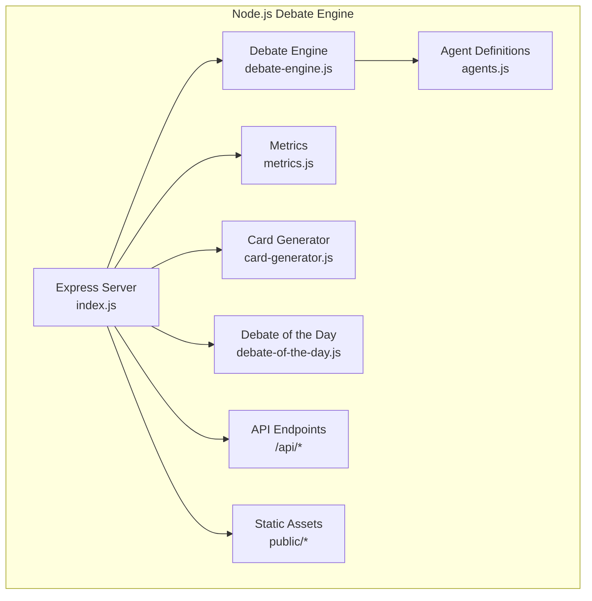
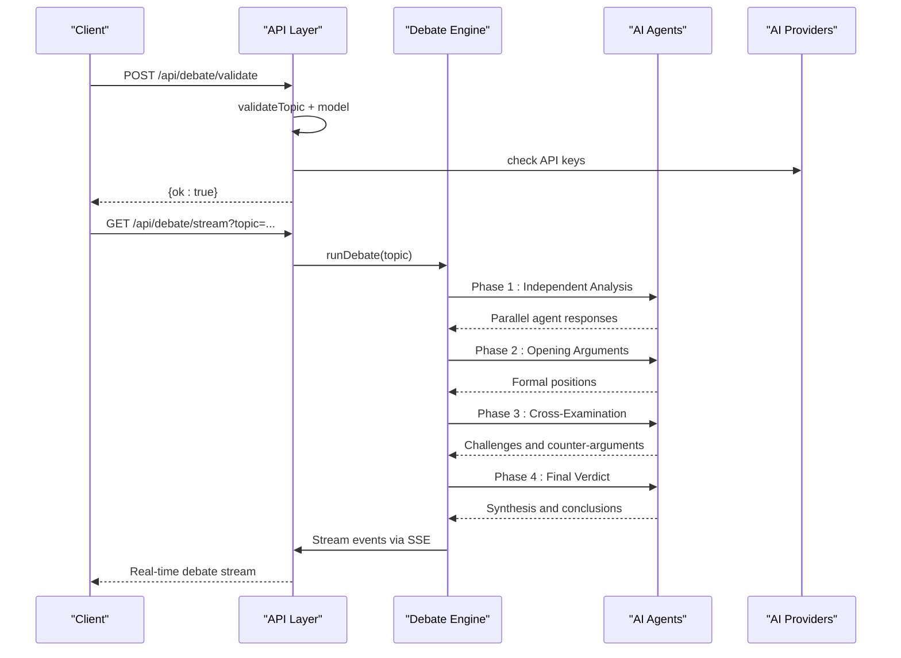
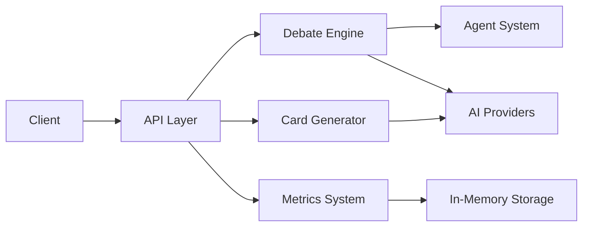

# Discussion API Endpoints

<cite>
**Referenced Files in This Document**
- [index.js](file://dissensus-engine/server/index.js)
- [debate-engine.js](file://dissensus-engine/server/debate-engine.js)
- [agents.js](file://dissensus-engine/server/agents.js)
- [metrics.js](file://dissensus-engine/server/metrics.js)
- [card-generator.js](file://dissensus-engine/server/card-generator.js)
- [debate-of-the-day.js](file://dissensus-engine/server/debate-of-the-day.js)
- [package.json](file://dissensus-engine/package.json)
- [index.html](file://dissensus-engine/public/index.html)
- [test-api.html](file://dissensus-engine/public/test-api.html)
- [VPS-DEPLOY.md](file://VPS-DEPLOY.md)
- [DEPLOY-VPS.md](file://dissensus-engine/docs/DEPLOY-VPS.md)
</cite>

## Update Summary
**Changes Made**
- Removed all references to Python forum backend and `/api/discuss` endpoint
- Consolidated documentation to focus on the current Node.js debate engine architecture
- Updated deployment guidance to reflect single VPS approach
- Revised API endpoints to match the actual Node.js implementation
- Updated architecture diagrams to reflect the current system design

## Table of Contents
1. [Introduction](#introduction)
2. [Project Structure](#project-structure)
3. [Core Components](#core-components)
4. [Architecture Overview](#architecture-overview)
5. [Detailed Component Analysis](#detailed-component-analysis)
6. [Dependency Analysis](#dependency-analysis)
7. [Performance Considerations](#performance-considerations)
8. [Troubleshooting Guide](#troubleshooting-guide)
9. [Conclusion](#conclusion)
10. [Appendices](#appendices)

## Introduction
This document provides comprehensive API documentation for the research discussion endpoints powered by the Node.js debate engine. It focuses on:
- POST /api/debate/validate: Validates debate parameters and checks API key availability
- GET /api/debate/stream: Streams multi-agent debate responses in real-time via Server-Sent Events
- GET /api/health: Service health monitoring endpoint
- GET /api/providers: Returns available AI providers and models
- GET /api/config: Returns server configuration including available providers
- POST /api/card: Generates shareable debate cards
- GET /api/metrics: Public metrics and analytics
- GET /api/debate-of-the-day: Returns trending debate topics

The system implements a sophisticated 4-phase dialectical debate process with three AI agents (CIPHER, NOVA, PRISM) and provides comprehensive streaming capabilities for real-time debate experiences.

## Project Structure
The research discussion APIs are implemented entirely within the Node.js debate engine:



**Diagram sources**
- [index.js:1-382](file://dissensus-engine/server/index.js#L1-L382)
- [debate-engine.js:1-399](file://dissensus-engine/server/debate-engine.js#L1-L399)
- [agents.js:1-148](file://dissensus-engine/server/agents.js#L1-L148)
- [metrics.js:1-112](file://dissensus-engine/server/metrics.js#L1-L112)
- [card-generator.js:1-361](file://dissensus-engine/server/card-generator.js#L1-L361)
- [debate-of-the-day.js:1-80](file://dissensus-engine/server/debate-of-the-day.js#L1-L80)

**Section sources**
- [index.js:1-382](file://dissensus-engine/server/index.js#L1-L382)
- [debate-engine.js:1-399](file://dissensus-engine/server/debate-engine.js#L1-L399)
- [agents.js:1-148](file://dissensus-engine/server/agents.js#L1-L148)
- [metrics.js:1-112](file://dissensus-engine/server/metrics.js#L1-L112)
- [card-generator.js:1-361](file://dissensus-engine/server/card-generator.js#L1-L361)
- [debate-of-the-day.js:1-80](file://dissensus-engine/server/debate-of-the-day.js#L1-L80)

## Core Components
- **Debate Engine**: Orchestrates the 4-phase dialectical process with three specialized AI agents
- **Agent System**: Three distinct AI personalities (CIPHER, NOVA, PRISM) with different reasoning styles
- **Streaming Architecture**: Real-time Server-Sent Events for live debate experiences
- **Metrics System**: Comprehensive analytics and usage tracking
- **Card Generation**: Twitter-optimized shareable debate cards
- **Debate of the Day**: Trend-based topic suggestions from CoinGecko

Key integration points:
- Real-time streaming via Server-Sent Events
- Multi-provider AI support (OpenAI, DeepSeek, Google Gemini)
- Rate limiting and security middleware
- Static asset serving for frontend integration

**Section sources**
- [debate-engine.js:41-399](file://dissensus-engine/server/debate-engine.js#L41-L399)
- [agents.js:8-148](file://dissensus-engine/server/agents.js#L8-L148)
- [index.js:58-382](file://dissensus-engine/server/index.js#L58-L382)

## Architecture Overview
The debate engine implements a sophisticated 4-phase dialectical process with real-time streaming:



**Diagram sources**
- [index.js:183-256](file://dissensus-engine/server/index.js#L183-L256)
- [debate-engine.js:131-396](file://dissensus-engine/server/debate-engine.js#L131-L396)

## Detailed Component Analysis

### POST /api/debate/validate
Purpose:
- Validates debate parameters before initiating a debate
- Checks topic sanitization, model availability, and API key configuration

Request Schema
- Content-Type: application/json
- Body:
  - topic: string (required). Must be 3-500 characters after sanitization
  - provider: string (optional). Defaults to 'deepseek'
  - model: string (optional). Auto-selected based on provider

Response Schema
- Success (200):
  - ok: boolean (true)
- Client Error (400):
  - error: string (validation failure message)

Processing Logic
- Sanitizes and validates topic length and content
- Validates provider and model combinations
- Checks for server-side API key configuration
- Returns immediate validation result

**Section sources**
- [index.js:142-166](file://dissensus-engine/server/index.js#L142-L166)

### GET /api/debate/stream
Purpose:
- Streams a complete 4-phase debate in real-time via Server-Sent Events
- Implements the full dialectical process with three AI agents

Request Parameters
- topic: string (required). Debate topic to analyze
- provider: string (optional). AI provider ('deepseek', 'openai', 'gemini')
- model: string (optional). Specific model identifier

Response Format
- Server-Sent Events with structured JSON payloads
- Event types: 'debate-start', 'phase-start', 'agent-start', 'agent-chunk', 'agent-done', 'phase-done', 'debate-done'

Processing Phases
1. **Phase 1: Independent Analysis** - All agents analyze topic separately
2. **Phase 2: Opening Arguments** - Formal positions presented
3. **Phase 3: Cross-Examination** - Agents challenge each other
4. **Phase 4: Final Verdict** - PRISM synthesizes conclusions

Error Handling
- Returns 400 for validation failures
- Streams error events via SSE for runtime failures
- Graceful degradation with error messages

**Section sources**
- [index.js:183-256](file://dissensus-engine/server/index.js#L183-L256)
- [debate-engine.js:131-396](file://dissensus-engine/server/debate-engine.js#L131-L396)

### GET /api/health
Purpose:
- Monitors service health and provider availability

Response Schema
- 200 OK:
  - status: string ("ok")
  - service: string ("dissensus-engine")
  - providers: string (comma-separated provider list)

Operational Notes
- Used by monitoring systems and load balancers
- Indicates server readiness and provider configuration

**Section sources**
- [index.js:93-99](file://dissensus-engine/server/index.js#L93-L99)

### GET /api/providers
Purpose:
- Returns available AI providers and their supported models

Response Schema
- 200 OK:
  - provider: object containing hasServerKey and model details
  - Models include cost information and capabilities

**Section sources**
- [index.js:104-118](file://dissensus-engine/server/index.js#L104-L118)

### GET /api/config
Purpose:
- Returns server configuration including available providers and limits

Response Schema
- 200 OK:
  - availableProviders: array of configured providers
  - maxTopicLength: number (500)

**Section sources**
- [index.js:77-86](file://dissensus-engine/server/index.js#L77-L86)

### POST /api/card
Purpose:
- Generates shareable debate cards in PNG format for social media

Request Schema
- Content-Type: application/json
- Body:
  - topic: string (required). Debate topic
  - verdict: string (required). Debate conclusion

Response Format
- 200 OK: PNG image attachment
- 400/500: Error response with message

Processing Logic
- Validates input parameters
- Generates Twitter-optimized 1200×630 PNG
- Includes crypto disclaimer for relevant topics
- Summarizes long verdicts when server keys available

**Section sources**
- [index.js:283-317](file://dissensus-engine/server/index.js#L283-L317)
- [card-generator.js:170-361](file://dissensus-engine/server/card-generator.js#L170-L361)

### GET /api/metrics
Purpose:
- Provides public metrics and analytics for the debate engine

Response Schema
- 200 OK:
  - totalDebates: number
  - uniqueTopics: number
  - debatesToday: number
  - providerUsage: object
  - uptimeSeconds: number
  - uptimePercent: string
  - debatesLastHour: number
  - recentTopics: array

**Section sources**
- [index.js:330-342](file://dissensus-engine/server/index.js#L330-L342)
- [metrics.js:77-100](file://dissensus-engine/server/metrics.js#L77-L100)

### GET /api/debate-of-the-day
Purpose:
- Returns trending debate topics from CoinGecko or fallback suggestions

Response Schema
- 200 OK:
  - topic: string (trending or fallback topic)

**Section sources**
- [index.js:261-270](file://dissensus-engine/server/index.js#L261-L270)
- [debate-of-the-day.js:66-77](file://dissensus-engine/server/debate-of-the-day.js#L66-L77)

## Dependency Analysis
External Dependencies and Integrations
- **AI Providers**: OpenAI, DeepSeek, Google Gemini with server-side API key management
- **Streaming**: Server-Sent Events for real-time communication
- **Image Generation**: Satori + Resvg for PNG card creation
- **Static Assets**: Express static file serving for frontend integration
- **Rate Limiting**: Express-rate-limit middleware for abuse prevention



**Diagram sources**
- [index.js:1-382](file://dissensus-engine/server/index.js#L1-L382)
- [debate-engine.js:14-39](file://dissensus-engine/server/debate-engine.js#L14-L39)
- [card-generator.js:7-9](file://dissensus-engine/server/card-generator.js#L7-L9)

**Section sources**
- [package.json:10-25](file://dissensus-engine/package.json#L10-L25)
- [index.js:30-35](file://dissensus-engine/server/index.js#L30-L35)

## Performance Considerations
- **Streaming Optimization**: SSE streaming with minimal buffering for real-time experiences
- **Rate Limiting**: Configurable limits for debates (10/min in production), cards (20/min), and metrics (120/min)
- **Memory Management**: In-memory metrics with automatic cleanup and daily resets
- **API Key Management**: Server-side API keys prevent client-side configuration and reduce overhead
- **Image Generation**: Efficient PNG generation with font caching and optimized rendering

## Troubleshooting Guide
Common Issues and Resolutions
- **Validation Failures**:
  - Symptom: 400 error from /api/debate/validate
  - Resolution: Check topic length (3-500 chars), provider/model combinations, and API key configuration
- **Streaming Issues**:
  - Symptom: SSE stream disconnects or buffers
  - Resolution: Verify Nginx configuration has `proxy_buffering off` for /api/debate/stream
- **API Key Errors**:
  - Symptom: "API key required" errors
  - Resolution: Configure server-side API keys in .env file
- **Rate Limiting**:
  - Symptom: 429 Too Many Requests
  - Resolution: Wait for rate limit reset or adjust limits in production
- **Health Check Failures**:
  - Symptom: /api/health returns non-200 status
  - Resolution: Check service logs and provider connectivity

**Section sources**
- [index.js:66-72](file://dissensus-engine/server/index.js#L66-L72)
- [index.js:283-317](file://dissensus-engine/server/index.js#L283-L317)

## Conclusion
The Node.js debate engine provides a comprehensive, production-ready solution for multi-agent AI debates with real-time streaming capabilities. The system implements sophisticated agent personalities, robust streaming architecture, and comprehensive analytics. Proper configuration of API keys, rate limiting, and deployment ensures reliable operation for real-time debate experiences.

## Appendices

### API Usage Examples
- **Parameter Validation**:
  ```javascript
  // POST /api/debate/validate
  const response = await fetch('/api/debate/validate', {
    method: 'POST',
    headers: {'Content-Type': 'application/json'},
    body: JSON.stringify({
      topic: 'Should AI be regulated by governments?',
      provider: 'deepseek',
      model: 'deepseek-chat'
    })
  });
  ```
- **Real-time Debate Streaming**:
  ```javascript
  // GET /api/debate/stream
  const eventSource = new EventSource('/api/debate/stream?topic=AI+regulation&provider=deepseek');
  eventSource.onmessage = (event) => {
    const data = JSON.parse(event.data);
    console.log('Event:', data.type, data);
  };
  ```
- **Health Check**:
  ```javascript
  // GET /api/health
  const health = await fetch('/api/health');
  const status = await health.json();
  ```

### Integration Guidelines
- **Frontend Integration**: Use EventSource for real-time streaming, fetch for validation and metadata
- **Monitoring**: Poll /api/health and /api/metrics for operational visibility
- **Deployment**: Use PM2 or systemd for process management with proper environment configuration
- **CORS**: Configure at reverse proxy level (Nginx) for cross-origin requests

### Deployment Considerations
- **Single VPS Approach**: Complete system runs on one VPS with Nginx as reverse proxy
- **Process Management**: PM2 or systemd for automatic restarts and monitoring
- **SSL Configuration**: Let's Encrypt certificates via Certbot for HTTPS
- **Static Asset Serving**: Nginx serves public assets directly for optimal performance
- **Reverse Proxy**: Critical SSE streaming requires `proxy_buffering off` configuration

**Section sources**
- [VPS-DEPLOY.md:1-41](file://VPS-DEPLOY.md#L1-L41)
- [DEPLOY-VPS.md:272-383](file://dissensus-engine/docs/DEPLOY-VPS.md#L272-L383)
- [index.js:358-382](file://dissensus-engine/server/index.js#L358-L382)