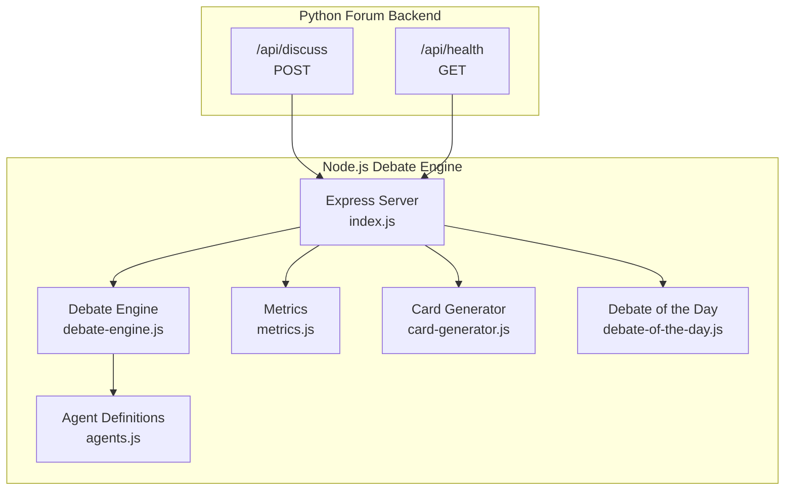
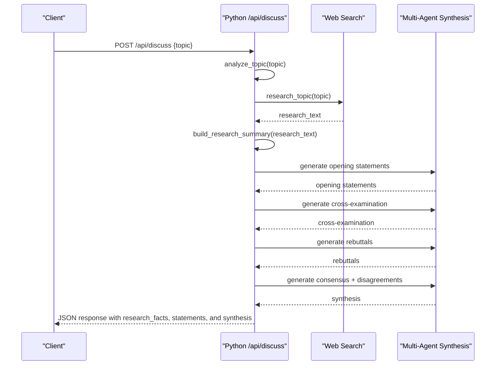
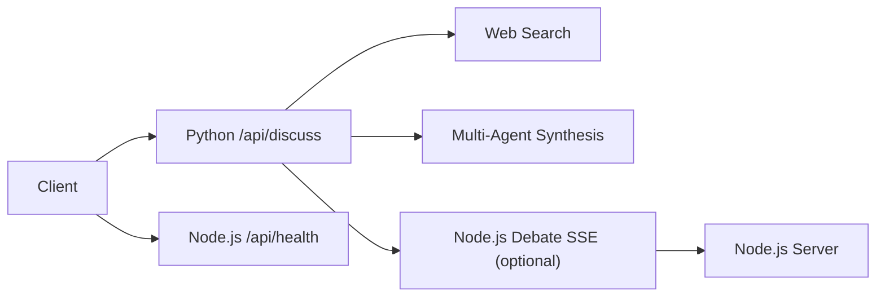

# Discussion API Endpoints

<cite>
**Referenced Files in This Document**
- [index.js](file://dissensus-engine/server/index.js)
- [debate-engine.js](file://dissensus-engine/server/debate-engine.js)
- [agents.js](file://dissensus-engine/server/agents.js)
- [metrics.js](file://dissensus-engine/server/metrics.js)
- [card-generator.js](file://dissensus-engine/server/card-generator.js)
- [debate-of-the-day.js](file://dissensus-engine/server/debate-of-the-day.js)
- [package.json](file://dissensus-engine/package.json)
- [index.html](file://dissensus-engine/public/index.html)
- [test-api.html](file://dissensus-engine/public/test-api.html)
- [server.py](file://forum/server.py)
- [engine.js](file://forum/engine.js)
</cite>

## Table of Contents
1. [Introduction](#introduction)
2. [Project Structure](#project-structure)
3. [Core Components](#core-components)
4. [Architecture Overview](#architecture-overview)
5. [Detailed Component Analysis](#detailed-component-analysis)
6. [Dependency Analysis](#dependency-analysis)
7. [Performance Considerations](#performance-considerations)
8. [Troubleshooting Guide](#troubleshooting-guide)
9. [Conclusion](#conclusion)
10. [Appendices](#appendices)

## Introduction
This document provides comprehensive API documentation for the research discussion endpoints. It focuses on:
- POST /api/discuss: Processes research queries, performs topic analysis, executes web searches, and generates multi-agent responses.
- GET /api/health: Service health monitoring endpoint.
It also covers request/response schemas, parameter validation, error handling, rate limiting, CORS/static file serving, deployment considerations, integration guidelines, troubleshooting, and performance optimization tips.

Note: The repository contains two related but separate systems:
- A Node.js debate engine exposing streaming debate endpoints and metrics.
- A Python forum backend implementing the POST /api/discuss endpoint described in this document.

This document consolidates both systems to provide a unified view of the research discussion APIs.

## Project Structure
The research discussion APIs span two primary systems:
- Node.js debate engine (streaming debate, metrics, cards)
- Python forum backend (research-powered discussion)

**Diagram sources**
- [index.js:1-356](file://dissensus-engine/server/index.js#L1-L356)
- [debate-engine.js:1-389](file://dissensus-engine/server/debate-engine.js#L1-L389)
- [agents.js:1-148](file://dissensus-engine/server/agents.js#L1-L148)
- [metrics.js:1-112](file://dissensus-engine/server/metrics.js#L1-L112)
- [card-generator.js:1-361](file://dissensus-engine/server/card-generator.js#L1-L361)
- [debate-of-the-day.js:1-80](file://dissensus-engine/server/debate-of-the-day.js#L1-L80)
- [server.py:445-495](file://forum/server.py#L445-L495)

**Section sources**
- [index.js:1-356](file://dissensus-engine/server/index.js#L1-L356)
- [debate-engine.js:1-389](file://dissensus-engine/server/debate-engine.js#L1-L389)
- [agents.js:1-148](file://dissensus-engine/server/agents.js#L1-L148)
- [metrics.js:1-112](file://dissensus-engine/server/metrics.js#L1-L112)
- [card-generator.js:1-361](file://dissensus-engine/server/card-generator.js#L1-L361)
- [debate-of-the-day.js:1-80](file://dissensus-engine/server/debate-of-the-day.js#L1-L80)
- [server.py:445-495](file://forum/server.py#L445-L495)

## Core Components
- Python Forum Backend (/api/discuss, /api/health)
  - Implements POST /api/discuss that orchestrates topic analysis, web research, and multi-agent synthesis.
  - Implements GET /api/health for service monitoring.
- Node.js Debate Engine (complementary endpoints)
  - Provides streaming debate via Server-Sent Events, metrics, and shareable cards.
  - Useful for understanding agent orchestration and error handling patterns.

Key integration points:
- The Python backend calls the Node.js debate engine for streaming debate experiences (when integrated).
- Static assets and diagnostics are served by the Node.js server for testing and development.

**Section sources**
- [server.py:445-495](file://forum/server.py#L445-L495)
- [index.js:74-80](file://dissensus-engine/server/index.js#L74-L80)
- [index.html:1-187](file://dissensus-engine/public/index.html#L1-L187)
- [test-api.html:1-51](file://dissensus-engine/public/test-api.html#L1-L51)

## Architecture Overview
The research discussion pipeline integrates a Python backend with a Node.js debate engine:
- Client calls POST /api/discuss with a topic.
- Python backend performs topic analysis, web research, and builds a research summary.
- Python backend generates opening statements, cross-examination, rebuttals, and synthesis using three agents.
- Optional integration with Node.js debate engine for streaming debate experiences.
- GET /api/health provides service availability.

**Diagram sources**
- [server.py:445-495](file://forum/server.py#L445-L495)

## Detailed Component Analysis

### POST /api/discuss
Purpose:
- Accepts a research topic, performs topic analysis and web research, and returns a structured multi-agent response.

Request Schema
- Content-Type: application/json
- Body:
  - topic: string (required). Trimmed and validated for presence and length.

Response Schema
- Success (200):
  - topic: string
  - research_facts: array of strings (first 10 items)
  - openingStatements: object
    - cipher: string
    - nova: string
    - prism: string
  - crossExamination: string
  - rebuttals: string
  - synthesis: object
    - consensus: string
    - disagreements: string
- Client Error (400):
  - error: string
- Server Error (500):
  - error: string

Processing Logic
- Validates topic presence and length.
- Performs topic analysis and web research.
- Builds a research summary (first 10 facts).
- Generates opening statements for each agent.
- Generates cross-examination and rebuttals.
- Produces synthesis with consensus and disagreements.

Error Handling
- Returns 400 with error message if topic is missing or invalid.
- Returns 500 with error message on internal failures.

Rate Limiting
- Not implemented in the Python backend. Consider applying rate limiting at the application or reverse proxy level.

Validation Rules
- topic must be present and non-empty.
- Maximum topic length enforced by the Python backend.

Integration Notes
- The frontend calls this endpoint and renders the results in a discussion area.
- The Node.js debate engine provides streaming debate experiences that complement this research-focused endpoint.

**Section sources**
- [server.py:445-495](file://forum/server.py#L445-L495)
- [engine.js:30-80](file://forum/engine.js#L30-L80)

### GET /api/health
Purpose:
- Monitors service health and readiness.

Response Schema
- 200 OK:
  - status: string ("ok")
- Other status codes indicate service issues.

Operational Notes
- Used by monitoring systems and load balancers to determine service health.

**Section sources**
- [server.py:486-488](file://forum/server.py#L486-L488)

### GET /api/health (Node.js Debate Engine)
Purpose:
- Additional health endpoint for the Node.js debate engine.

Response Schema
- 200 OK:
  - status: string ("ok")
  - service: string ("dissensus-engine")
  - providers: string (comma-separated provider list)

**Section sources**
- [index.js:74-80](file://dissensus-engine/server/index.js#L74-L80)

## Dependency Analysis
External Dependencies and Integrations
- Python Backend:
  - Depends on web search and analysis functions (implemented in the backend).
  - Integrates with the Node.js debate engine for streaming debate experiences (optional).
- Node.js Debate Engine:
  - Express server with Helmet for security headers.
  - Rate limiting middleware for abuse prevention.
  - SSE streaming for debate events.
  - Metrics collection and card generation.

**Diagram sources**
- [server.py:445-495](file://forum/server.py#L445-L495)
- [index.js:74-80](file://dissensus-engine/server/index.js#L74-L80)

**Section sources**
- [package.json:10-25](file://dissensus-engine/package.json#L10-L25)
- [index.js:39-44](file://dissensus-engine/server/index.js#L39-L44)

## Performance Considerations
- Python Backend:
  - Topic analysis and web research can be expensive; cache results where appropriate.
  - Limit the number of research facts returned (already capped at 10).
  - Consider pagination or streaming for very large research outputs.
- Node.js Debate Engine:
  - SSE streaming is efficient for real-time updates.
  - Rate limiting prevents abuse; tune limits based on capacity.
  - Consider connection pooling and timeouts for upstream AI providers.

[No sources needed since this section provides general guidance]

## Troubleshooting Guide
Common Issues and Resolutions
- Missing or invalid topic:
  - Symptom: 400 error with an error message.
  - Resolution: Ensure the topic is present and within allowed length.
- Server errors during research:
  - Symptom: 500 error with an error message.
  - Resolution: Check backend logs, validate web search endpoints, and retry.
- Streaming debate issues (Node.js):
  - Symptom: SSE stream fails or disconnects.
  - Resolution: Verify network connectivity, reverse proxy configuration, and client event handling.
- Health check failures:
  - Symptom: /api/health returns non-200 status.
  - Resolution: Inspect service logs and dependencies.

**Section sources**
- [server.py:454-483](file://forum/server.py#L454-L483)
- [index.js:222-229](file://dissensus-engine/server/index.js#L222-L229)

## Conclusion
The research discussion API provides a robust foundation for generating multi-agent, research-backed responses to user topics. The Python backend handles topic analysis and synthesis, while the Node.js debate engine offers complementary streaming and metrics capabilities. Proper validation, error handling, and rate limiting ensure reliability, and the included health endpoints support operational monitoring.

[No sources needed since this section summarizes without analyzing specific files]

## Appendices

### API Usage Examples
- POST /api/discuss
  - Request: { "topic": "Should AI be regulated by governments?" }
  - Response: Includes research_facts, opening statements, cross-examination, rebuttals, and synthesis.
- GET /api/health
  - Request: None
  - Response: { "status": "ok" }

Integration Guidelines
- Frontend: Call /api/discuss and render the returned sections.
- Monitoring: Poll /api/health periodically.
- Optional: Integrate with Node.js debate engine for streaming debate experiences.

CORS and Static File Serving
- The Node.js server serves static files from the public directory and includes basic security headers.
- For cross-origin requests, configure CORS at the reverse proxy or application level as needed.

Deployment Considerations
- Scale horizontally to handle research-heavy loads.
- Use caching for repeated topics and research summaries.
- Monitor resource usage and adjust rate limits accordingly.

**Section sources**
- [index.html:1-187](file://dissensus-engine/public/index.html#L1-L187)
- [test-api.html:1-51](file://dissensus-engine/public/test-api.html#L1-L51)
- [index.js:43-44](file://dissensus-engine/server/index.js#L43-L44)