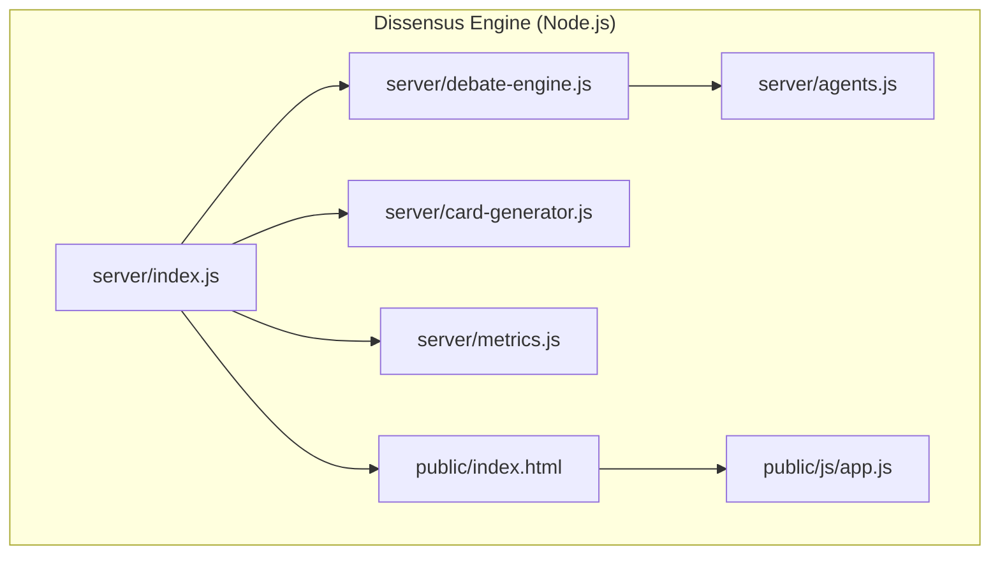
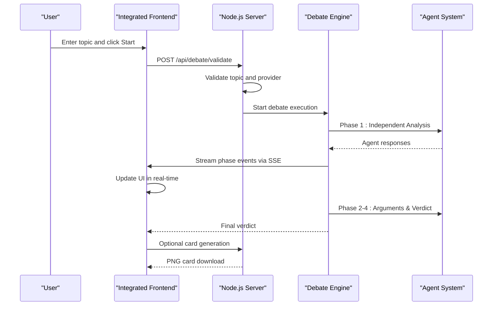
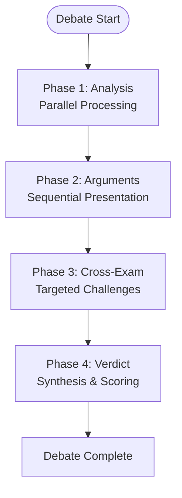
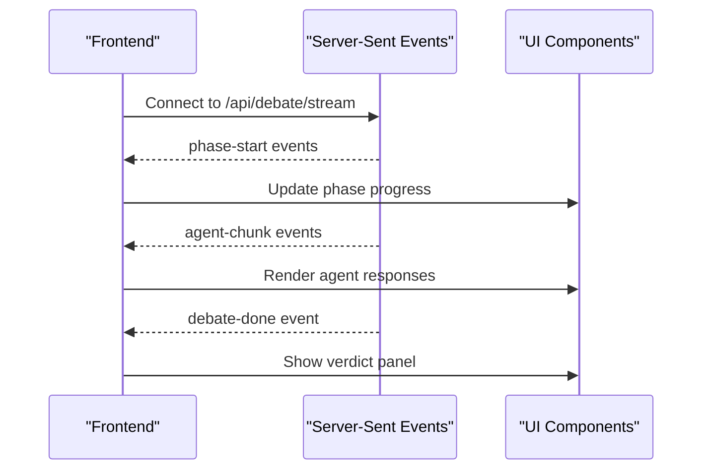
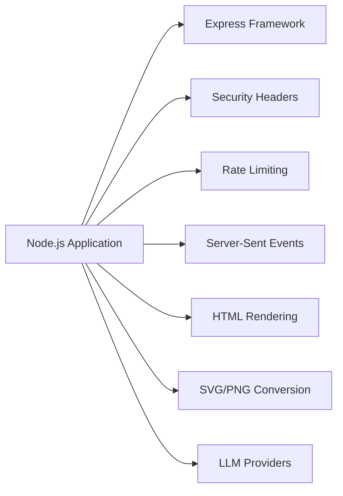

# Research & Discussion Platform

<cite>
**Referenced Files in This Document**
- [README.md](file://README.md)
- [dissensus-engine/server/index.js](file://dissensus-engine/server/index.js)
- [dissensus-engine/server/debate-engine.js](file://dissensus-engine/server/debate-engine.js)
- [dissensus-engine/server/agents.js](file://dissensus-engine/server/agents.js)
- [dissensus-engine/server/card-generator.js](file://dissensus-engine/server/card-generator.js)
- [dissensus-engine/server/metrics.js](file://dissensus-engine/server/metrics.js)
- [dissensus-engine/public/index.html](file://dissensus-engine/public/index.html)
- [dissensus-engine/public/js/app.js](file://dissensus-engine/public/js/app.js)
- [dissensus-engine/package.json](file://dissensus-engine/package.json)
</cite>

## Update Summary
**Changes Made**
- Removed all references to Python/Flask forum backend components
- Consolidated documentation to focus on the current Node.js-based architecture
- Updated architecture diagrams to reflect single deployment target approach
- Revised API documentation to match current Node.js endpoints
- Updated deployment instructions to reflect modern Node.js setup

## Table of Contents
1. [Introduction](#introduction)
2. [Project Structure](#project-structure)
3. [Core Components](#core-components)
4. [Architecture Overview](#architecture-overview)
5. [Detailed Component Analysis](#detailed-component-analysis)
6. [Dependency Analysis](#dependency-analysis)
7. [Performance Considerations](#performance-considerations)
8. [Troubleshooting Guide](#troubleshooting-guide)
9. [Conclusion](#conclusion)
10. [Appendices](#appendices)

## Introduction
This document describes a research-powered discussion platform built entirely on Node.js that combines a multi-agent debate system with a modern web interface. The platform enables users to submit topics, which are processed through a structured 4-phase dialectical debate involving three AI agents (CIPHER, NOVA, PRISM). The system is implemented as a single, production-ready Node.js application that serves both the debate engine and the frontend interface, with features for sharing debate outcomes as social media cards.

**Updated** The platform now operates as a unified Node.js application rather than a multi-service architecture, simplifying deployment and maintenance while maintaining all core functionality.

## Project Structure
The repository is organized as a single, cohesive Node.js application:
- **Dissensus Engine (Node.js)**: A production-grade server that streams multi-agent debates via Server-Sent Events, serves the frontend, and exposes comprehensive APIs for configuration, metrics, and debate management.
- **Frontend Assets**: Integrated static HTML/CSS/JS served directly by the Node.js server, providing a seamless user experience for debate interaction and visualization.

**Diagram sources**
- [dissensus-engine/server/index.js:1-382](file://dissensus-engine/server/index.js#L1-L382)
- [dissensus-engine/server/debate-engine.js:1-399](file://dissensus-engine/server/debate-engine.js#L1-L399)
- [dissensus-engine/server/agents.js:1-148](file://dissensus-engine/server/agents.js#L1-L148)
- [dissensus-engine/server/card-generator.js:1-361](file://dissensus-engine/server/card-generator.js#L1-L361)
- [dissensus-engine/server/metrics.js:1-112](file://dissensus-engine/server/metrics.js#L1-L112)
- [dissensus-engine/public/index.html:1-183](file://dissensus-engine/public/index.html#L1-L183)
- [dissensus-engine/public/js/app.js:1-620](file://dissensus-engine/public/js/app.js#L1-L620)

**Section sources**
- [README.md:20-28](file://README.md#L20-L28)

## Core Components
- **Multi-Agent Debate Engine**: Orchestrates a 4-phase dialectical process with three agents (CIPHER, NOVA, PRISM), streaming results via Server-Sent Events with real-time UI updates.
- **Agent Personality System**: Each agent (CIPHER: Skeptic, NOVA: Advocate, PRISM: Synthesizer) has distinct reasoning styles and roles in the debate process.
- **Frontend Integration**: The integrated frontend provides real-time debate visualization, phase progress tracking, and social sharing capabilities.
- **Social Sharing**: Generates shareable PNG cards from debate verdicts for social platforms with automatic LLM summarization when available.
- **Metrics & Analytics**: Comprehensive public metrics system tracking debate statistics, provider usage, and system performance.

**Updated** Removed the Python/Flask web research engine component as it no longer exists in the current architecture.

**Section sources**
- [dissensus-engine/server/debate-engine.js:41-399](file://dissensus-engine/server/debate-engine.js#L41-L399)
- [dissensus-engine/server/agents.js:8-148](file://dissensus-engine/server/agents.js#L8-L148)
- [dissensus-engine/server/card-generator.js:40-152](file://dissensus-engine/server/card-generator.js#L40-L152)
- [dissensus-engine/server/metrics.js:8-112](file://dissensus-engine/server/metrics.js#L8-L112)

## Architecture Overview
The platform operates as a single, integrated Node.js application that serves all functionality:
- **Unified Server**: The Node.js server handles all API endpoints, debate processing, and frontend serving from a single deployment target.
- **Real-time Streaming**: Multi-agent debates are streamed via Server-Sent Events with comprehensive UI updates and phase tracking.
- **Integrated Frontend**: The frontend is served directly by the Node.js server, eliminating CORS concerns and providing seamless user experience.

**Diagram sources**
- [dissensus-engine/server/index.js:183-256](file://dissensus-engine/server/index.js#L183-L256)
- [dissensus-engine/server/debate-engine.js:131-396](file://dissensus-engine/server/debate-engine.js#L131-L396)
- [dissensus-engine/public/js/app.js:192-328](file://dissensus-engine/public/js/app.js#L192-L328)

## Detailed Component Analysis

### Multi-Agent Debate Engine
Implements:
- **4-Phase Dialectical Process**: Independent Analysis, Opening Arguments, Cross-Examination, Final Verdict with structured agent interactions.
- **Parallel Execution**: Agents process in parallel during Phase 1, then sequentially for structured debate flow.
- **Streaming Architecture**: Real-time event streaming via Server-Sent Events with comprehensive UI updates.
- **Provider Integration**: Supports OpenAI, DeepSeek, and Google Gemini with configurable API keys.

Key behaviors:
- **Phase 1**: All agents analyze independently with parallel processing for optimal performance.
- **Phase 2**: Formal opening arguments with structured presentation requirements.
- **Phase 3**: Cross-examination with targeted challenges and counter-arguments.
- **Phase 4**: Final synthesis with definitive verdict format and confidence scoring.

**Diagram sources**
- [dissensus-engine/server/debate-engine.js:146-396](file://dissensus-engine/server/debate-engine.js#L146-L396)

**Section sources**
- [dissensus-engine/server/debate-engine.js:41-399](file://dissensus-engine/server/debate-engine.js#L41-L399)

### Agent Personality System
The system defines three distinct agent personalities:
- **CIPHER (Skeptic)**: Red-team auditor focusing on risks, weaknesses, and critical analysis.
- **NOVA (Advocate)**: Opportunity-finder emphasizing potential, catalysts, and positive scenarios.
- **PRISM (Synthesizer)**: Neutral analyst providing balanced assessment and definitive verdicts.

Each agent has:
- **Distinct System Prompts**: Tailored reasoning styles and argumentation approaches.
- **Unique Visual Identity**: Character portraits and color schemes for UI differentiation.
- **Structured Argumentation**: Specific formats for opening arguments and final positions.

**Section sources**
- [dissensus-engine/server/agents.js:8-148](file://dissensus-engine/server/agents.js#L8-L148)

### Frontend Integration and User Experience
The integrated frontend provides:
- **Real-time Debate Visualization**: Live streaming of agent responses with phase progress indicators.
- **Interactive Controls**: Provider/model selection, topic input, and debate management controls.
- **Social Sharing**: Direct card generation for Twitter with automatic LLM summarization.
- **Responsive Design**: Optimized for desktop and mobile viewing with smooth animations.

The frontend architecture:
- **Event-Driven Updates**: Real-time DOM manipulation based on SSE events.
- **Local Storage**: Persists user preferences and provider selections.
- **Error Handling**: Comprehensive error states with user-friendly messaging.

**Diagram sources**
- [dissensus-engine/public/js/app.js:331-399](file://dissensus-engine/public/js/app.js#L331-L399)
- [dissensus-engine/public/js/app.js:261-328](file://dissensus-engine/public/js/app.js#L261-L328)

**Section sources**
- [dissensus-engine/public/index.html:1-183](file://dissensus-engine/public/index.html#L1-L183)
- [dissensus-engine/public/js/app.js:1-620](file://dissensus-engine/public/js/app.js#L1-L620)

### Social Sharing and Card Generation
The card generator:
- **Twitter-Optimized Format**: 1200×630 pixel PNG cards with brand-consistent design.
- **Automatic Summarization**: Optional LLM-based summarization when server keys are available.
- **Content Extraction**: Intelligent parsing of debate verdicts for optimal card layout.
- **Crypto-Specific Features**: Automatic disclaimer insertion for cryptocurrency-related topics.

**Section sources**
- [dissensus-engine/server/card-generator.js:40-152](file://dissensus-engine/server/card-generator.js#L40-L152)
- [dissensus-engine/server/card-generator.js:170-361](file://dissensus-engine/server/card-generator.js#L170-L361)

### Metrics & Analytics System
The metrics system tracks:
- **Usage Statistics**: Total debates, unique topics, debates per day/hour.
- **Provider Analytics**: Usage distribution across OpenAI, DeepSeek, and Gemini.
- **System Performance**: Success rates, request volumes, and uptime monitoring.
- **Public Dashboard**: Real-time metrics accessible via /api/metrics endpoint.

**Section sources**
- [dissensus-engine/server/metrics.js:8-112](file://dissensus-engine/server/metrics.js#L8-L112)

## Dependency Analysis
The Node.js application depends on:
- **Express**: HTTP server framework for routing and middleware.
- **Helmet**: Security headers for enhanced protection against common vulnerabilities.
- **Rate Limiting**: Express-rate-limit for abuse prevention and resource protection.
- **Satori & Resvg**: HTML-to-SVG-to-PNG rendering pipeline for card generation.
- **Environment Configuration**: Dotenv for secure API key management.

**Diagram sources**
- [dissensus-engine/package.json:10-17](file://dissensus-engine/package.json#L10-L17)

**Section sources**
- [dissensus-engine/package.json:10-17](file://dissensus-engine/package.json#L10-L17)

## Performance Considerations
- **Streaming Architecture**: Server-Sent Events eliminate polling overhead and reduce latency.
- **Parallel Processing**: Phase 1 executes agents in parallel for optimal response times.
- **Memory Management**: In-memory metrics with automatic cleanup for long-running deployments.
- **Resource Limits**: Built-in rate limiting prevents abuse and ensures fair resource allocation.
- **Static Asset Serving**: Integrated frontend eliminates CDN complexity for smaller deployments.

**Updated** Removed Python-specific performance considerations as the system now operates as a unified Node.js application.

## Troubleshooting Guide
Common issues and remedies:
- **Server Not Starting**: Verify Node.js version compatibility and check port availability.
- **API Key Errors**: Ensure server-side API keys are configured in .env file for selected providers.
- **Rate Limiting Issues**: Wait for 1-minute cooldown period or adjust TRUST_PROXY settings for reverse proxies.
- **Card Generation Failures**: Check font loading and verify sufficient server resources for PNG generation.
- **Frontend Connection Issues**: Verify CORS configuration and ensure static asset serving is enabled.

**Section sources**
- [dissensus-engine/server/index.js:183-256](file://dissensus-engine/server/index.js#L183-L256)
- [dissensus-engine/server/index.js:283-317](file://dissensus-engine/server/index.js#L283-L317)
- [dissensus-engine/server/index.js:330-342](file://dissensus-engine/server/index.js#L330-L342)

## Conclusion
The platform provides a comprehensive, production-ready multi-agent debate system implemented as a single, integrated Node.js application. The unified architecture simplifies deployment while maintaining all core functionality including real-time debate streaming, sophisticated agent personalities, and social sharing capabilities. The system demonstrates how modern web technologies can create engaging, transparent AI-powered discussions with robust performance and scalability.

**Updated** The platform now operates as a streamlined single-service architecture, eliminating the complexity of multi-service deployments while preserving all essential features.

## Appendices

### API Definitions

- **Configuration API**
  - Method: GET
  - Path: /api/config
  - Response: Available providers and maximum topic length

- **Health Check API**
  - Method: GET
  - Path: /api/health
  - Response: Service status and available providers

- **Provider Information API**
  - Method: GET
  - Path: /api/providers
  - Response: Provider configurations with model details

- **Debate Validation API**
  - Method: POST
  - Path: /api/debate/validate
  - Request: { topic, provider, model }
  - Response: Validation result

- **Debate Streaming API**
  - Method: GET (SSE)
  - Path: /api/debate/stream
  - Query params: topic, provider, model
  - Response: Real-time debate events via Server-Sent Events

- **Debate Persistence APIs**
  - Method: GET
  - Path: /api/debate/:id
  - Response: Saved debate content

- **Card Generation API**
  - Method: POST
  - Path: /api/card
  - Request: { topic, verdict }
  - Response: PNG image file

- **Metrics API**
  - Method: GET
  - Path: /api/metrics
  - Response: Public metrics and statistics

**Section sources**
- [dissensus-engine/server/index.js:77-166](file://dissensus-engine/server/index.js#L77-L166)
- [dissensus-engine/server/index.js:183-256](file://dissensus-engine/server/index.js#L183-L256)
- [dissensus-engine/server/index.js:283-317](file://dissensus-engine/server/index.js#L283-L317)
- [dissensus-engine/server/index.js:330-342](file://dissensus-engine/server/index.js#L330-L342)

### Customization and Extension Guidelines
- **Agent Personalities**: Modify agent system prompts and behavior patterns in agents.js module.
- **Provider Integration**: Add new LLM providers by extending PROVIDERS configuration in debate-engine.js.
- **UI Customization**: Update styling and layout in public/index.html and CSS files.
- **Metrics Enhancement**: Extend metrics.js to track additional KPIs and analytics.
- **Card Generation**: Customize card templates and branding in card-generator.js module.

**Updated** Removed Python-specific customization guidelines as the system now operates as a unified Node.js application.