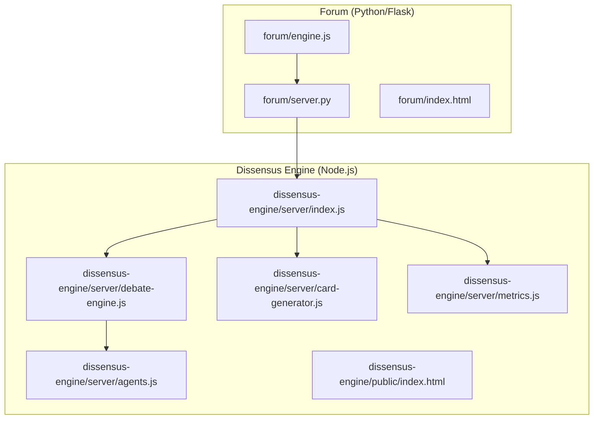
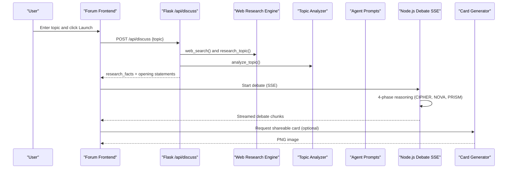
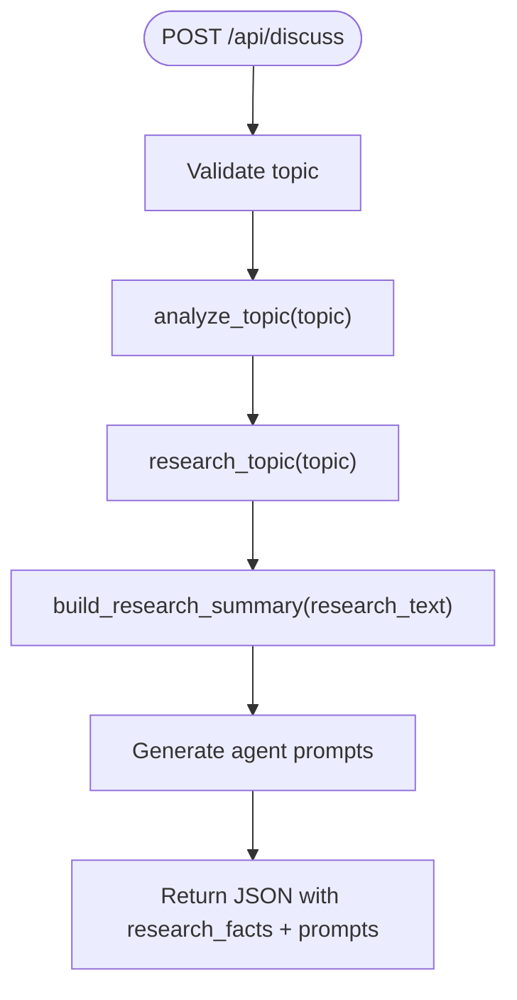
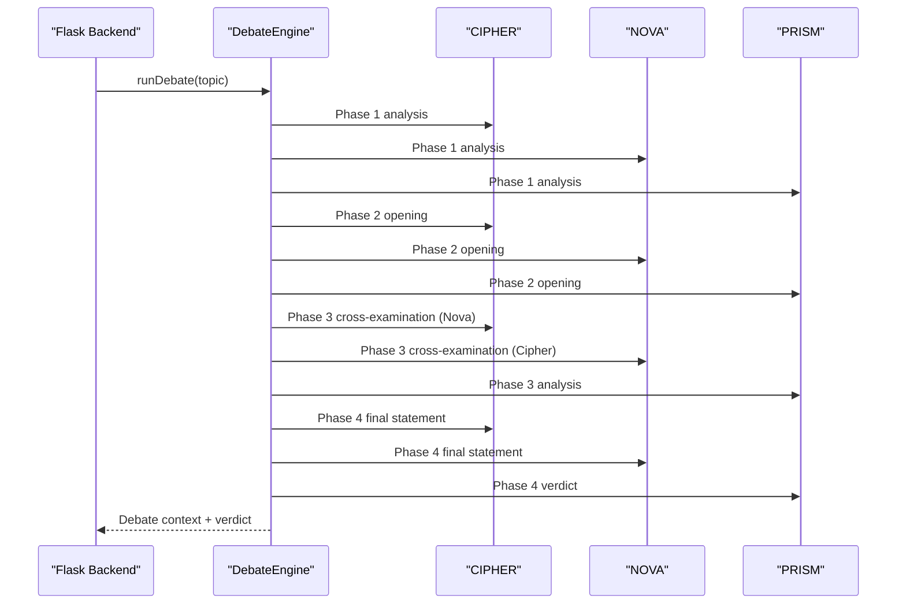
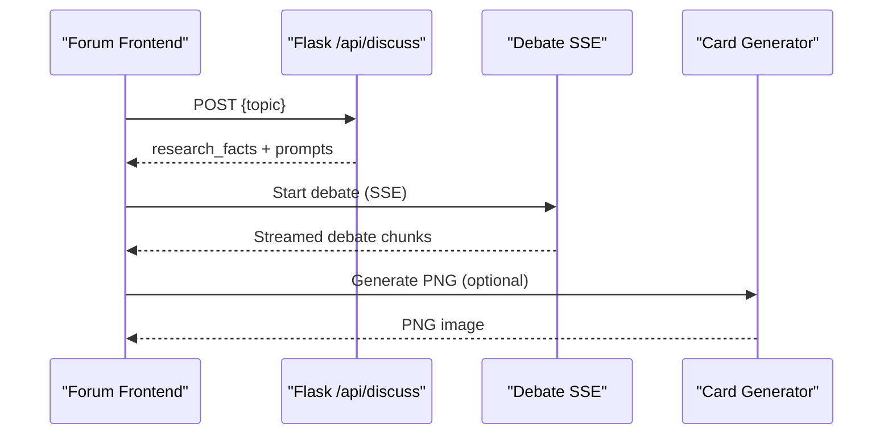
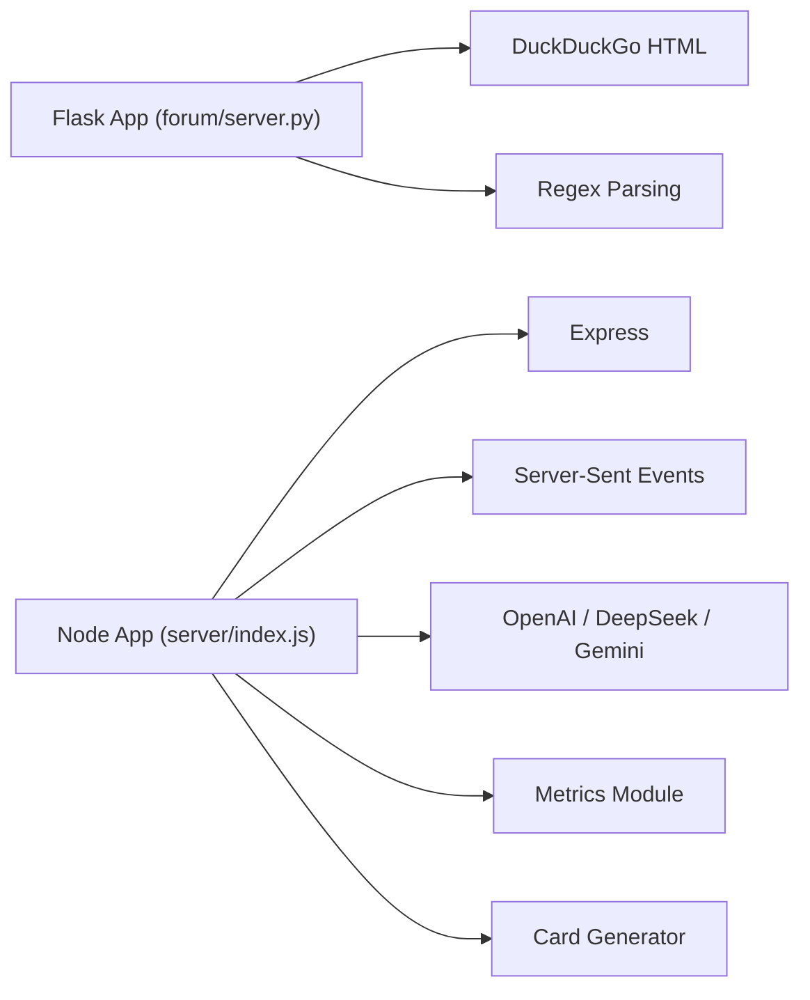

# Research & Discussion Platform

<cite>
**Referenced Files in This Document**
- [README.md](file://README.md)
- [forum/server.py](file://forum/server.py)
- [forum/index.html](file://forum/index.html)
- [forum/engine.js](file://forum/engine.js)
- [dissensus-engine/server/index.js](file://dissensus-engine/server/index.js)
- [dissensus-engine/server/debate-engine.js](file://dissensus-engine/server/debate-engine.js)
- [dissensus-engine/server/agents.js](file://dissensus-engine/server/agents.js)
- [dissensus-engine/server/card-generator.js](file://dissensus-engine/server/card-generator.js)
- [dissensus-engine/server/metrics.js](file://dissensus-engine/server/metrics.js)
- [dissensus-engine/public/index.html](file://dissensus-engine/public/index.html)
- [dissensus-engine/package.json](file://dissensus-engine/package.json)
</cite>

## Table of Contents
1. [Introduction](#introduction)
2. [Project Structure](#project-structure)
3. [Core Components](#core-components)
4. [Architecture Overview](#architecture-overview)
5. [Detailed Component Analysis](#detailed-component-analysis)
6. [Dependency Analysis](#dependency-analysis)
7. [Performance Considerations](#performance-considerations)
8. [Troubleshooting Guide](#troubleshooting-guide)
9. [Conclusion](#conclusion)
10. [Appendices](#appendices)

## Introduction
This document describes a research-powered discussion platform that combines a web research engine with a multi-agent debate system. The platform enables users to submit topics, which are analyzed by a research engine that gathers evidence from web sources, then debated by three AI agents (CIPHER, NOVA, PRISM) through a structured dialectical process. The system integrates a Flask-based Python backend for the research and topic analysis, and a Node.js-based debate engine for multi-agent reasoning and streaming outputs. It also provides a frontend interface for both the research forum and the debate engine, with features for sharing debate outcomes as social media cards.

## Project Structure
The repository is organized into modular components:
- Forum (Python/Flask): Provides a unified server hosting both static assets and the research API endpoint.
- Dissensus Engine (Node.js): A production-grade server that streams multi-agent debates via Server-Sent Events and exposes metrics and staking integrations.
- Frontend assets: Static HTML/CSS/JS for both the research forum and the debate engine.

**Diagram sources**
- [forum/server.py:1-495](file://forum/server.py#L1-L495)
- [forum/index.html:1-108](file://forum/index.html#L1-L108)
- [forum/engine.js:1-323](file://forum/engine.js#L1-L323)
- [dissensus-engine/server/index.js:1-481](file://dissensus-engine/server/index.js#L1-L481)
- [dissensus-engine/server/debate-engine.js:1-389](file://dissensus-engine/server/debate-engine.js#L1-L389)
- [dissensus-engine/server/agents.js:1-148](file://dissensus-engine/server/agents.js#L1-L148)
- [dissensus-engine/server/card-generator.js:1-361](file://dissensus-engine/server/card-generator.js#L1-L361)
- [dissensus-engine/server/metrics.js:1-152](file://dissensus-engine/server/metrics.js#L1-L152)
- [dissensus-engine/public/index.html:1-217](file://dissensus-engine/public/index.html#L1-L217)

**Section sources**
- [README.md:20-29](file://README.md#L20-L29)

## Core Components
- Web Research Engine (Python/Flask): Implements DuckDuckGo-based web search, multi-angle topic research, and topic classification heuristics. Exposes a single API endpoint to return research facts and agent-generated debate prompts.
- Topic Analyzer: Heuristic-based classification of topics into domains and question types to tailor research queries and agent responses.
- Multi-Agent Debate Engine (Node.js): Orchestrates a 4-phase dialectical process with three agents (CIPHER, NOVA, PRISM), streaming results via Server-Sent Events.
- Frontend Integration: The forum frontend calls the research API and renders research findings, then triggers the debate engine for structured reasoning and synthesis.
- Social Sharing: Generates shareable PNG cards from debate verdicts for social platforms.

**Section sources**
- [forum/server.py:39-127](file://forum/server.py#L39-L127)
- [forum/server.py:449-483](file://forum/server.py#L449-L483)
- [dissensus-engine/server/debate-engine.js:41-387](file://dissensus-engine/server/debate-engine.js#L41-L387)
- [dissensus-engine/server/agents.js:8-146](file://dissensus-engine/server/agents.js#L8-L146)
- [dissensus-engine/server/card-generator.js:40-152](file://dissensus-engine/server/card-generator.js#L40-L152)

## Architecture Overview
The platform consists of two primary services:
- Research Forum Service (Flask): Serves static assets and the /api/discuss endpoint. It performs web research, builds a concise evidence summary, and prepares agent prompts.
- Debate Engine Service (Node.js): Streams multi-agent debates via SSE, with provider/model selection, rate limiting, and metrics collection.

**Diagram sources**
- [forum/engine.js:30-226](file://forum/engine.js#L30-L226)
- [forum/server.py:449-483](file://forum/server.py#L449-L483)
- [dissensus-engine/server/debate-engine.js:121-386](file://dissensus-engine/server/debate-engine.js#L121-L386)
- [dissensus-engine/server/card-generator.js:170-358](file://dissensus-engine/server/card-generator.js#L170-L358)

## Detailed Component Analysis

### Web Research Engine (Flask)
Implements:
- DuckDuckGo-based web search with HTML parsing and snippet extraction.
- Multi-angle research tailored to domains (crypto, AI, finance, energy).
- Topic classification heuristics to infer question type, domain, and intent.
- Evidence summarization to feed agent prompts.

Key behaviors:
- Web search returns structured results with titles and snippets.
- Research topic aggregates multiple query angles and concatenates results.
- Topic analyzer infers question characteristics and domain to guide agent responses.
- Evidence summarizer filters and deduplicates facts to a fixed length.

**Diagram sources**
- [forum/server.py:449-483](file://forum/server.py#L449-L483)
- [forum/server.py:69-95](file://forum/server.py#L69-L95)
- [forum/server.py:102-127](file://forum/server.py#L102-L127)
- [forum/server.py:130-139](file://forum/server.py#L130-L139)

**Section sources**
- [forum/server.py:39-95](file://forum/server.py#L39-L95)
- [forum/server.py:102-139](file://forum/server.py#L102-L139)

### Topic Classification and Domain Detection
The analyzer detects:
- Question types: question mark, comparison, exclusivity, prediction, normative, negative sentiment.
- Domain: crypto, AI, finance, energy.
- Intent: whether the topic seeks a specific answer (list/ranking).

These heuristics influence research query construction and agent response templates.

**Section sources**
- [forum/server.py:102-127](file://forum/server.py#L102-L127)

### Agent Prompt Generation and Debate Flow
The Flask backend generates:
- Opening statements for CIPHER, NOVA, PRISM based on research facts and topic analysis.
- Cross-examination prompts and rebuttals.
- Consensus synthesis and disagreement summaries.

The Node.js debate engine orchestrates:
- Four-phase dialectical process: Independent Analysis, Opening Arguments, Cross-Examination, Final Verdict.
- Parallel execution of agent reasoning with streaming via SSE.
- Provider/model selection and API key routing.

**Diagram sources**
- [dissensus-engine/server/debate-engine.js:121-386](file://dissensus-engine/server/debate-engine.js#L121-L386)
- [dissensus-engine/server/agents.js:8-146](file://dissensus-engine/server/agents.js#L8-L146)

**Section sources**
- [forum/server.py:151-421](file://forum/server.py#L151-L421)
- [dissensus-engine/server/debate-engine.js:41-387](file://dissensus-engine/server/debate-engine.js#L41-L387)
- [dissensus-engine/server/agents.js:8-146](file://dissensus-engine/server/agents.js#L8-L146)

### Frontend Integration and User Experience
The forum frontend:
- Collects a topic and calls the Flask backend’s /api/discuss endpoint.
- Renders research facts, then streams debate phases via SSE.
- Displays synthesized consensus and remaining disagreements.

The debate engine frontend:
- Allows selecting provider/model and staking status.
- Streams debate phases with progress indicators and agent status.
- Generates shareable PNG cards from the final verdict.

**Diagram sources**
- [forum/engine.js:30-226](file://forum/engine.js#L30-L226)
- [dissensus-engine/server/index.js:220-311](file://dissensus-engine/server/index.js#L220-L311)
- [dissensus-engine/server/card-generator.js:170-358](file://dissensus-engine/server/card-generator.js#L170-L358)

**Section sources**
- [forum/index.html:1-108](file://forum/index.html#L1-L108)
- [forum/engine.js:1-323](file://forum/engine.js#L1-L323)
- [dissensus-engine/public/index.html:1-217](file://dissensus-engine/public/index.html#L1-L217)

### Social Sharing and Card Generation
The card generator:
- Extracts a concise summary and ranked items from the debate verdict.
- Produces a Twitter-optimized PNG with branding and optional disclaimers for crypto-related topics.
- Optionally summarizes the verdict using an LLM when server keys are available.

**Section sources**
- [dissensus-engine/server/card-generator.js:40-152](file://dissensus-engine/server/card-generator.js#L40-L152)
- [dissensus-engine/server/card-generator.js:170-358](file://dissensus-engine/server/card-generator.js#L170-L358)

## Dependency Analysis
- Flask backend depends on:
  - Standard libraries for HTTP, JSON, regex, SSL, and static file serving.
  - DuckDuckGo HTML scraping for research.
- Node.js backend depends on:
  - Express for HTTP routing and middleware.
  - Helmet for security headers.
  - Rate-limiting for abuse prevention.
  - SSE streaming for debate output.
  - Environment variables for provider API keys.

**Diagram sources**
- [forum/server.py:11-19](file://forum/server.py#L11-L19)
- [dissensus-engine/server/index.js:6-28](file://dissensus-engine/server/index.js#L6-L28)
- [dissensus-engine/package.json:10-19](file://dissensus-engine/package.json#L10-L19)

**Section sources**
- [dissensus-engine/package.json:10-19](file://dissensus-engine/package.json#L10-L19)

## Performance Considerations
- Research latency:
  - DuckDuckGo search timeouts and regex parsing introduce overhead. Consider caching repeated queries and tuning num_results.
- Debates:
  - SSE streaming reduces client-side latency. Ensure adequate rate limits to handle concurrent debates.
- Rendering:
  - Card generation involves HTML-to-SVG-to-PNG conversion; pre-load fonts and cache generated assets where feasible.
- Scalability:
  - Separate services enable independent scaling. Consider load balancing and persistent metrics storage for production.

[No sources needed since this section provides general guidance]

## Troubleshooting Guide
Common issues and remedies:
- Flask server not reachable:
  - Verify the server runs on the expected port and serves static files correctly.
- DuckDuckGo search failures:
  - SSL context and user-agent headers are configured; ensure outbound HTTPS is permitted.
- Debate SSE errors:
  - Confirm provider/model selection and API keys. Check rate-limiting and staking enforcement settings.
- Card generation failures:
  - Ensure sufficient server keys for optional LLM summarization and that font resources are accessible.

**Section sources**
- [forum/server.py:449-483](file://forum/server.py#L449-L483)
- [dissensus-engine/server/index.js:177-215](file://dissensus-engine/server/index.js#L177-L215)
- [dissensus-engine/server/card-generator.js:40-85](file://dissensus-engine/server/card-generator.js#L40-L85)

## Conclusion
The platform integrates a research-powered forum with a multi-agent debate system to deliver structured, evidence-based reasoning. The Flask backend focuses on research and topic analysis, while the Node.js backend handles multi-agent orchestration and streaming. Together, they provide a transparent, shareable, and extensible foundation for community-driven discussions grounded in research and dialectical synthesis.

[No sources needed since this section summarizes without analyzing specific files]

## Appendices

### API Definitions

- Flask Research API
  - Method: POST
  - Path: /api/discuss
  - Request body: { topic: string }
  - Response: research_facts[], openingStatements, crossExamination, rebuttals, synthesis

- Node.js Debate API
  - Method: GET (SSE)
  - Path: /api/debate/stream
  - Query params: topic, apiKey, provider, model, wallet
  - Response: Server-Sent Events with debate phases and final verdict

- Node.js Metrics API
  - Method: GET
  - Path: /api/metrics
  - Response: Public metrics including provider usage, debates today, recent topics

**Section sources**
- [forum/server.py:449-483](file://forum/server.py#L449-L483)
- [dissensus-engine/server/index.js:220-311](file://dissensus-engine/server/index.js#L220-L311)
- [dissensus-engine/server/index.js:429-441](file://dissensus-engine/server/index.js#L429-L441)

### Customization and Extension Guidelines
- Research parameters:
  - Adjust DuckDuckGo query construction and num_results to balance recall and latency.
  - Extend domain detection and query templates for new topics.
- Agent personalities:
  - Modify agent system prompts and response templates to align with new roles or reasoning styles.
- Debate orchestration:
  - Add new providers/models by updating provider configurations and validation logic.
- Community moderation:
  - Integrate moderation hooks and content filtering at the Flask endpoint or Node.js middleware.
- Quality control:
  - Add LLM-based fact-checking or coherence scoring for research summaries and debate outputs.

[No sources needed since this section provides general guidance]