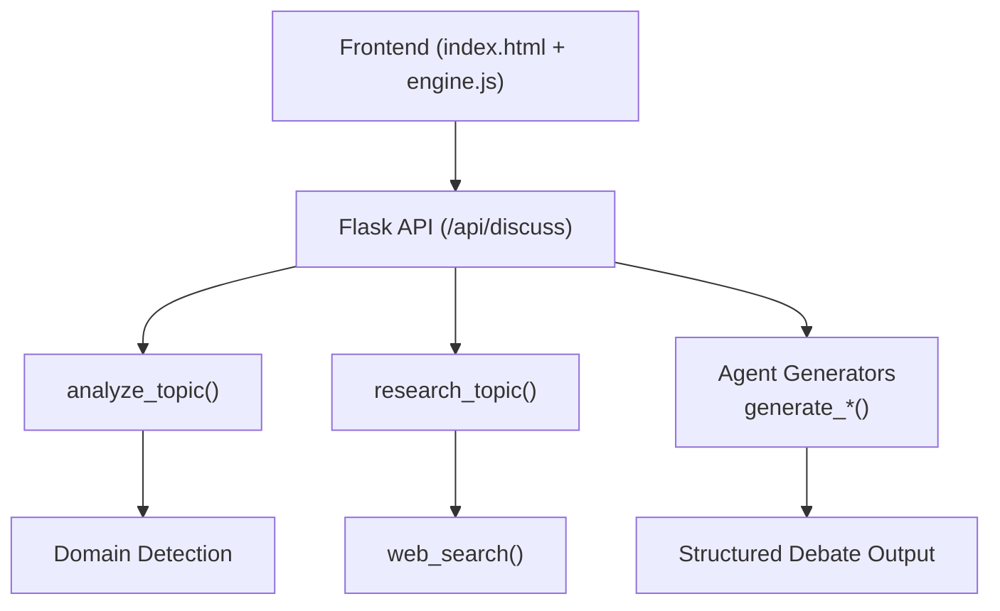
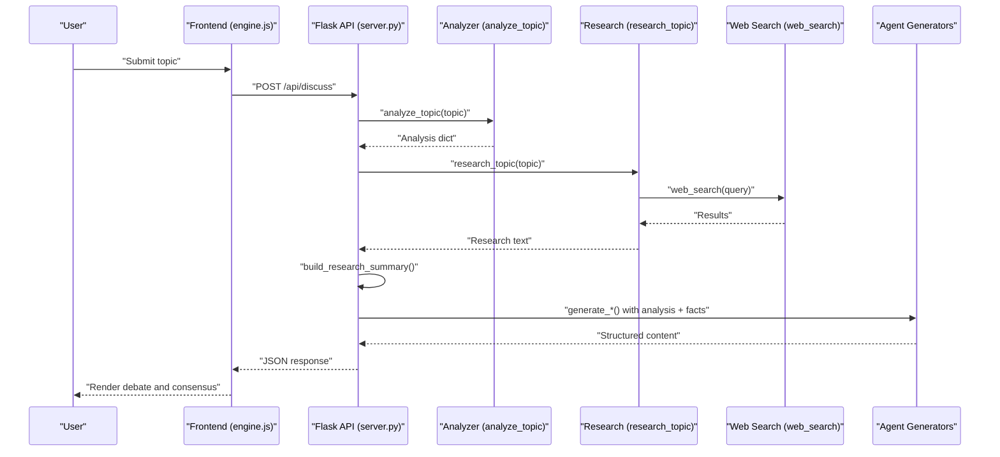
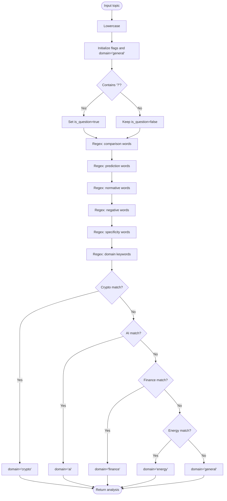
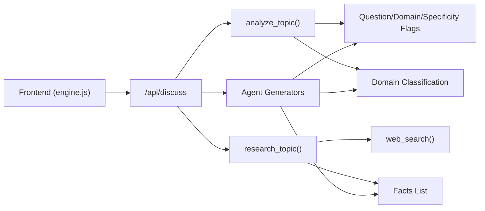

# Topic Analysis System

<cite>
**Referenced Files in This Document**
- [server.py](file://forum/server.py)
- [index.html](file://forum/index.html)
- [engine.js](file://forum/engine.js)
</cite>

## Table of Contents
1. [Introduction](#introduction)
2. [Project Structure](#project-structure)
3. [Core Components](#core-components)
4. [Architecture Overview](#architecture-overview)
5. [Detailed Component Analysis](#detailed-component-analysis)
6. [Dependency Analysis](#dependency-analysis)
7. [Performance Considerations](#performance-considerations)
8. [Troubleshooting Guide](#troubleshooting-guide)
9. [Conclusion](#conclusion)

## Introduction
This document explains the topic analysis and classification system that powers the AI Triad Forum. It focuses on the analyze_topic function, which performs natural language processing on user input to detect question types, domain classification, and research focus areas. It also documents the regex-based pattern matching for question forms, the domain detection heuristics for crypto, AI, finance, and energy, and the sentiment analysis heuristics embedded in the system. Finally, it describes how topic analysis integrates with the research engine and agent responses, how to customize and extend the analysis rules, and how to route research and synthesis accordingly.

## Project Structure
The topic analysis system lives in the unified forum server and is consumed by the frontend engine. The key files are:
- Backend topic analyzer and research pipeline: [server.py](file://forum/server.py)
- Frontend UI and client orchestration: [index.html](file://forum/index.html), [engine.js](file://forum/engine.js)

**Diagram sources**
- [server.py:449-483](file://forum/server.py#L449-L483)
- [server.py:102-127](file://forum/server.py#L102-L127)
- [server.py:69-95](file://forum/server.py#L69-L95)
- [server.py:39-66](file://forum/server.py#L39-L66)
- [index.html:1-108](file://forum/index.html#L1-L108)
- [engine.js:30-80](file://forum/engine.js#L30-L80)

**Section sources**
- [server.py:1-495](file://forum/server.py#L1-L495)
- [index.html:1-108](file://forum/index.html#L1-L108)
- [engine.js:1-323](file://forum/engine.js#L1-L323)

## Core Components
- analyze_topic: Extracts question-type flags, sentiment indicators, domain classification, and specificity signals from raw user input.
- research_topic: Orchestrates multi-angle web research based on the topic and detected domain.
- Agent generators: Produce opening statements, cross-examinations, rebuttals, and consensus synthesis tailored to the analysis.

Key outputs of analyze_topic:
- Question-type flags: is_question, is_comparison, is_exclusivity, is_prediction, is_normative, wants_specific_answer
- Sentiment and tone flags: is_negative
- Domain classification: domain
- Entities placeholder: entities

These outputs drive research strategy and agent behavior downstream.

**Section sources**
- [server.py:102-127](file://forum/server.py#L102-L127)
- [server.py:69-95](file://forum/server.py#L69-L95)
- [server.py:151-421](file://forum/server.py#L151-L421)

## Architecture Overview
The system follows a request-response flow:
1. Frontend collects a topic and sends it to /api/discuss.
2. Backend runs analyze_topic to classify the topic.
3. research_topic gathers domain-aware research results.
4. build_research_summary extracts concise facts.
5. Agent generators produce structured debate content based on analysis and facts.
6. Frontend renders the four-phase debate and final consensus.

**Diagram sources**
- [server.py:449-483](file://forum/server.py#L449-L483)
- [server.py:102-127](file://forum/server.py#L102-L127)
- [server.py:69-95](file://forum/server.py#L69-L95)
- [server.py:39-66](file://forum/server.py#L39-L66)
- [engine.js:60-80](file://forum/engine.js#L60-L80)

## Detailed Component Analysis

### analyze_topic: Natural Language Processing and Classification
Purpose:
- Detect question form indicators using regex patterns.
- Infer domain from keywords.
- Determine sentiment and specificity signals.

Processing logic:
- Lowercase normalization.
- Boolean flags derived from regex matches for comparison, exclusivity, prediction, normative statements, negative sentiment, and specificity.
- Domain detection via ordered regex checks across crypto, AI, finance, and energy.
- Returns a compact analysis dictionary for downstream use.

**Diagram sources**
- [server.py:102-127](file://forum/server.py#L102-L127)

**Section sources**
- [server.py:102-127](file://forum/server.py#L102-L127)

### Domain Detection Heuristics
- Crypto: broad coverage including blockchain, tokens, DeFi, web3, Layer 1s, NFTs, DAOs, RWA, and stablecoins.
- AI: includes AI, machine learning, GPT, and LLM.
- Finance: includes investing, stocks, markets, banking, gold, and economics.
- Energy: includes energy, nuclear, solar, climate, and carbon.

Detection order determines precedence; earlier matches take effect.

**Section sources**
- [server.py:118-125](file://forum/server.py#L118-L125)

### Regex-Based Pattern Matching for Question Forms
- Comparison: vs, versus, compare, better, or
- Exclusivity: only, sole, nothing else
- Prediction: will, future, replace, next
- Normative: should, ought, need to
- Negative sentiment: dead, fail, scam, over, obsolete
- Specificity: what, which, who, name, list, replace, alternative, competitor, top, best, rank

These flags influence research strategy and agent behavior.

**Section sources**
- [server.py:108-115](file://forum/server.py#L108-L115)

### Sentiment Analysis Heuristics
- is_negative captures negative sentiment words to bias agent framing toward more critical scrutiny when present.
- Additional sentiment categories are embedded in agent generators (positive/negative framing) but the core flag is derived from the regex set above.

**Section sources**
- [server.py:112](file://forum/server.py#L112)
- [server.py:151-193](file://forum/server.py#L151-L193)
- [server.py:196-237](file://forum/server.py#L196-L237)

### research_topic: Multi-Angle Research Strategy
Behavior:
- Conducts a main search.
- Branches into domain-specific strategies:
  - Crypto: adds market data, criticism, and support searches.
  - AI: adds trends and criticism/support searches.
  - Others: adds analysis, criticism, and support searches.
- Aggregates results into a unified research text for fact extraction.

Routing logic:
- Uses keyword presence to decide branching queries.

**Section sources**
- [server.py:69-95](file://forum/server.py#L69-L95)

### web_search: Web Research Engine
Behavior:
- Queries DuckDuckGo HTML endpoint.
- Parses snippets and titles.
- Returns structured results or an error entry.

Integration:
- Used by research_topic to gather domain-aware evidence.

**Section sources**
- [server.py:39-66](file://forum/server.py#L39-L66)

### Agent Generators: Tailored Responses Based on Analysis
- generate_cipher_opening: Emphasizes skepticism, highlights risks, and contextualizes positives.
- generate_nova_opening: Builds constructive case, quantifies upside, and counters selective skepticism.
- generate_prism_opening: Establishes analytical framework, separates core category value from exclusivity claims, and sets evaluation criteria.
- generate_cross_examination: Challenges both sides to sharpen claims, quantify risks/upside, and steel-man opposing positions.
- generate_rebuttals: Encourages recalibration, merges positions, and converges on updated stances.
- generate_consensus: Produces ranked conclusions when requested, otherwise synthesizes nuanced assessments.
- generate_disagreements: Summarizes remaining disagreements for transparency.

Routing to agent behavior:
- Exclusivity: emphasizes “only” claims are rejected; separates category value from exclusivity.
- Prediction: cautions against overconfidence; adjusts timelines.
- Specificity: pushes for ranked answers with confidence levels.
- Domain: crypto-focused synthesis includes domain-specific rankings and caveats.

**Section sources**
- [server.py:151-193](file://forum/server.py#L151-L193)
- [server.py:196-237](file://forum/server.py#L196-L237)
- [server.py:240-263](file://forum/server.py#L240-L263)
- [server.py:266-305](file://forum/server.py#L266-L305)
- [server.py:308-341](file://forum/server.py#L308-L341)
- [server.py:344-421](file://forum/server.py#L344-L421)
- [server.py:424-442](file://forum/server.py#L424-L442)

### Frontend Integration and User Experience
- The frontend collects the topic, displays progress, and renders the debate phases.
- It calls /api/discuss and expects analysis, research facts, and agent outputs.
- Example topics demonstrate typical use cases (e.g., crypto comparisons, energy strategies).

**Section sources**
- [index.html:61-85](file://forum/index.html#L61-L85)
- [engine.js:30-80](file://forum/engine.js#L30-L80)
- [engine.js:101-201](file://forum/engine.js#L101-L201)

## Dependency Analysis
High-level dependencies:
- analyze_topic depends on regex patterns and domain keyword sets.
- research_topic depends on web_search and keyword-based branching.
- Agent generators depend on analysis flags and extracted facts.
- Frontend depends on API responses to render structured debate content.

**Diagram sources**
- [server.py:102-127](file://forum/server.py#L102-L127)
- [server.py:69-95](file://forum/server.py#L69-L95)
- [server.py:39-66](file://forum/server.py#L39-L66)
- [server.py:151-421](file://forum/server.py#L151-L421)
- [engine.js:60-80](file://forum/engine.js#L60-L80)

**Section sources**
- [server.py:102-127](file://forum/server.py#L102-L127)
- [server.py:69-95](file://forum/server.py#L69-L95)
- [server.py:39-66](file://forum/server.py#L39-L66)
- [server.py:151-421](file://forum/server.py#L151-L421)
- [engine.js:60-80](file://forum/engine.js#L60-L80)

## Performance Considerations
- Regex-based analysis is O(n) in input length and very fast for typical topics.
- research_topic performs multiple web searches; latency depends on external service availability.
- web_search parsing uses regex extraction; keep patterns efficient.
- Fact summarization filters duplicates by prefix to reduce noise.
- Consider caching repeated topics and limiting concurrent requests in production deployments.

## Troubleshooting Guide
Common issues and remedies:
- Empty or missing topic: The API endpoint validates presence and returns an error; ensure the frontend sends a non-empty topic.
- Network errors during web search: web_search catches exceptions and returns an error result; retry or check connectivity.
- Unexpected domain classification: Adjust regex patterns or ordering in analyze_topic to refine detection.
- Overly generic or vague topics: Increase specificity to trigger targeted research and agent responses.
- Frontend rendering stalls: Verify the API responds with the expected structure and that the frontend handles errors gracefully.

**Section sources**
- [server.py:454-456](file://forum/server.py#L454-L456)
- [server.py:65-66](file://forum/server.py#L65-L66)
- [engine.js:203-218](file://forum/engine.js#L203-L218)

## Conclusion
The topic analysis system provides a lightweight, regex-driven classifier that detects question forms, domains, and sentiment to tailor research and agent behavior. By structuring analysis flags and domain-aware research, it enables a consistent, reproducible debate pipeline that produces nuanced, evidence-backed conclusions. Extensibility is straightforward: adjust regex patterns, add new domain keywords, and extend agent generators to incorporate additional signals or synthesis rules.