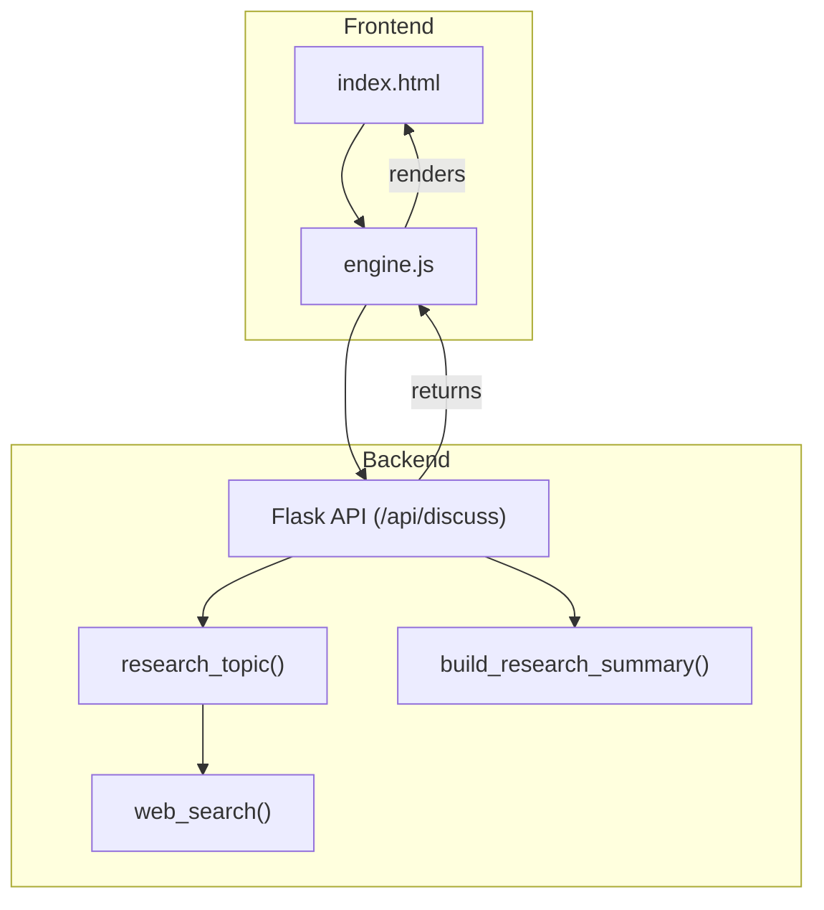
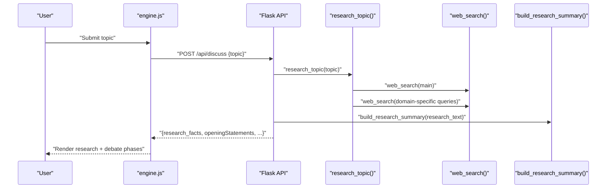
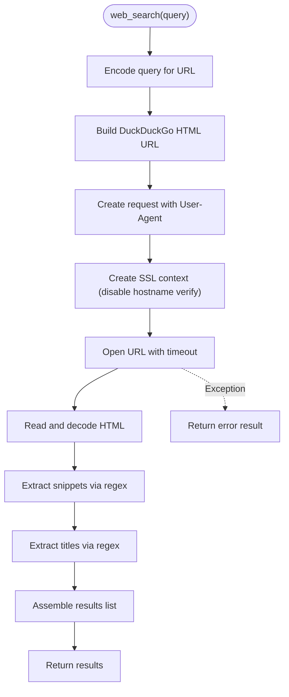
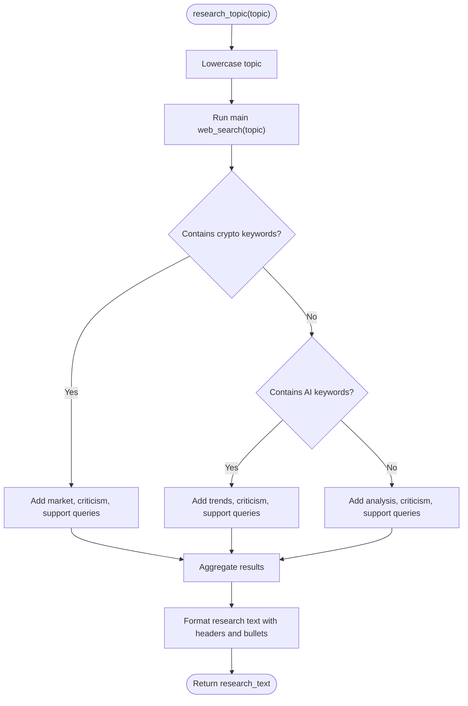
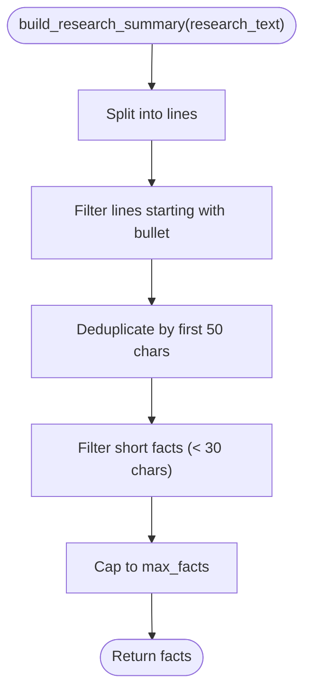
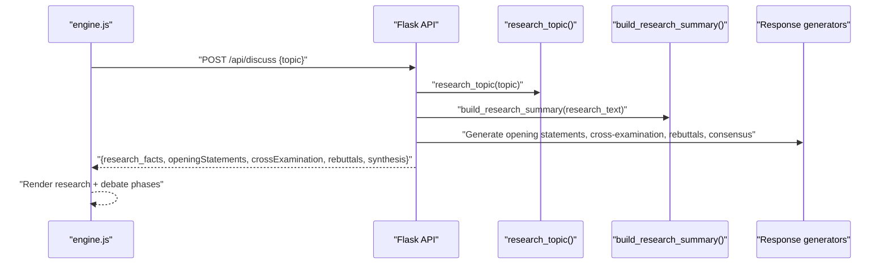
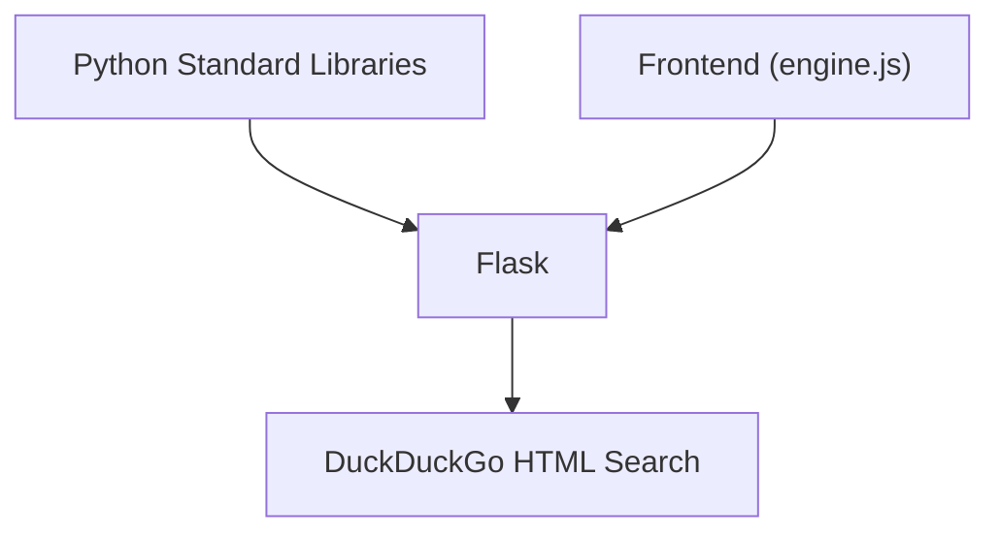

# Web Research Engine

<cite>
**Referenced Files in This Document**
- [server.py](file://forum/server.py)
- [index.html](file://forum/index.html)
- [engine.js](file://forum/engine.js)
- [README.md](file://README.md)
</cite>

## Table of Contents
1. [Introduction](#introduction)
2. [Project Structure](#project-structure)
3. [Core Components](#core-components)
4. [Architecture Overview](#architecture-overview)
5. [Detailed Component Analysis](#detailed-component-analysis)
6. [Dependency Analysis](#dependency-analysis)
7. [Performance Considerations](#performance-considerations)
8. [Troubleshooting Guide](#troubleshooting-guide)
9. [Conclusion](#conclusion)
10. [Appendices](#appendices)

## Introduction
This document explains the web research engine that powers the AI Triad Forum’s research-driven debate system. It focuses on the DuckDuckGo web scraping implementation, search result extraction algorithms, multi-domain research strategies, and the end-to-end research pipeline that synthesizes evidence into structured debate prompts. The engine orchestrates:
- DuckDuckGo HTML search via a Python Flask backend
- Domain-aware query construction for crypto, AI, finance, and energy topics
- Evidence extraction and deduplication
- Research text formatting and synthesis
- Frontend integration for interactive research and debate phases

## Project Structure
The research engine resides in the forum module and is composed of:
- A Flask API endpoint that triggers research and returns structured debate-ready content
- A DuckDuckGo-based web search function that parses HTML snippets and titles
- A multi-domain research orchestrator that builds targeted queries
- A research summary builder that filters and deduplicates facts
- A frontend that calls the API, displays research findings, and renders debate phases

**Diagram sources**
- [server.py:449-483](file://forum/server.py#L449-L483)
- [server.py:39-66](file://forum/server.py#L39-L66)
- [server.py:69-95](file://forum/server.py#L69-L95)
- [server.py:130-139](file://forum/server.py#L130-L139)
- [index.html:1-108](file://forum/index.html#L1-L108)
- [engine.js:30-226](file://forum/engine.js#L30-L226)

**Section sources**
- [README.md:20-29](file://README.md#L20-L29)
- [index.html:1-108](file://forum/index.html#L1-L108)
- [engine.js:1-323](file://forum/engine.js#L1-L323)
- [server.py:1-495](file://forum/server.py#L1-L495)

## Core Components
- web_search(query, num_results=8): Performs DuckDuckGo HTML search, constructs a request with a realistic User-Agent header, disables SSL hostname verification for compatibility, reads the HTML response, and extracts snippets and titles using regex. It returns a list of result dictionaries with title and snippet fields.
- research_topic(topic): Orchestrates multi-angle research by building domain-specific queries and aggregating results into a formatted research text. It selects different strategies based on topic keywords: crypto, AI, finance, or energy.
- build_research_summary(research_text, max_facts=15): Extracts bullet-pointed facts from the research text, filters short or duplicate entries, and returns a curated list of distinct, substantive facts.

These components integrate with the Flask API endpoint that serves the debate system.

**Section sources**
- [server.py:39-66](file://forum/server.py#L39-L66)
- [server.py:69-95](file://forum/server.py#L69-L95)
- [server.py:130-139](file://forum/server.py#L130-L139)
- [server.py:449-483](file://forum/server.py#L449-L483)

## Architecture Overview
The research engine follows a straightforward pipeline:
- The frontend sends a topic to the backend API
- The backend analyzes the topic, runs research queries, and builds a concise set of facts
- The backend returns structured content including opening statements, cross-examination, rebuttals, and a synthesized consensus
- The frontend renders the research findings and the four-phase debate

**Diagram sources**
- [server.py:449-483](file://forum/server.py#L449-L483)
- [server.py:69-95](file://forum/server.py#L69-L95)
- [server.py:39-66](file://forum/server.py#L39-L66)
- [server.py:130-139](file://forum/server.py#L130-L139)
- [engine.js:62-200](file://forum/engine.js#L62-L200)

## Detailed Component Analysis

### DuckDuckGo Web Search Implementation
The web_search function performs the following steps:
- URL encoding of the query
- Construction of a DuckDuckGo HTML search URL
- Request creation with a realistic User-Agent header
- SSL context configuration that disables hostname verification and certificate checks for compatibility
- HTTP request with a timeout
- HTML decoding and regex-based extraction of snippet and title elements
- Result assembly into a list of dictionaries

**Diagram sources**
- [server.py:39-66](file://forum/server.py#L39-L66)

**Section sources**
- [server.py:39-66](file://forum/server.py#L39-L66)

### Multi-Domain Research Strategy
The research_topic function builds domain-aware queries:
- It starts with a main query derived from the topic
- For crypto topics, it adds market data, criticism, and support queries
- For AI topics, it adds trend and criticism/support queries
- For other domains, it adds analysis/expert opinion, criticism, and support queries
- It aggregates results into a formatted research text with category headers and bullet-pointed facts

**Diagram sources**
- [server.py:69-95](file://forum/server.py#L69-L95)

**Section sources**
- [server.py:69-95](file://forum/server.py#L69-L95)

### Research Text Formatting and Fact Filtering
The build_research_summary function:
- Splits the research text into lines and filters bullet-pointed lines
- Removes duplicates by hashing the first 50 characters of each fact
- Filters out very short facts
- Returns a maximum number of curated facts

**Diagram sources**
- [server.py:130-139](file://forum/server.py#L130-L139)

**Section sources**
- [server.py:130-139](file://forum/server.py#L130-L139)

### Frontend Integration and API Endpoint
The Flask API endpoint:
- Receives a topic via POST
- Analyzes the topic to determine framing and domain
- Runs research_topic to gather evidence
- Builds a concise list of facts via build_research_summary
- Generates opening statements, cross-examination, rebuttals, and a synthesized consensus
- Returns the structured debate content

The frontend:
- Sends the topic to the backend
- Displays research facts
- Renders four debate phases: opening statements, cross-examination, rebuttals, and synthesis

**Diagram sources**
- [server.py:449-483](file://forum/server.py#L449-L483)
- [engine.js:62-200](file://forum/engine.js#L62-L200)

**Section sources**
- [server.py:449-483](file://forum/server.py#L449-L483)
- [engine.js:62-200](file://forum/engine.js#L62-L200)

## Dependency Analysis
The research engine depends on:
- Python standard libraries: urllib, ssl, re, and json for HTTP requests, SSL context handling, regex parsing, and JSON serialization
- Flask for the API endpoint and CORS handling
- Frontend JavaScript for client-side rendering and API communication

**Diagram sources**
- [server.py:7-19](file://forum/server.py#L7-L19)
- [server.py:39-66](file://forum/server.py#L39-L66)
- [engine.js:62-200](file://forum/engine.js#L62-L200)

**Section sources**
- [server.py:7-19](file://forum/server.py#L7-L19)
- [server.py:39-66](file://forum/server.py#L39-L66)
- [engine.js:62-200](file://forum/engine.js#L62-L200)

## Performance Considerations
- DuckDuckGo HTML search is used for simplicity and compatibility. It may be slower than direct APIs and is subject to DuckDuckGo’s rate limits and HTML changes.
- SSL context disables hostname verification and certificate checks to improve compatibility but reduces security. Consider enabling strict verification in production environments.
- Regex-based parsing is fast but brittle; changes in DuckDuckGo’s HTML may break extraction. Consider adding robust fallbacks or migrating to a dedicated search API.
- The research summary filters out short facts and deduplicates by prefix to keep the debate focused on meaningful, distinct claims.

[No sources needed since this section provides general guidance]

## Troubleshooting Guide
Common issues and resolutions:
- SSL certificate errors: The current SSL context disables verification. If encountering certificate failures, enable strict verification and ensure system certificates are up to date.
- DuckDuckGo HTML changes: Regex patterns may fail if DuckDuckGo updates its HTML. Update extraction patterns accordingly.
- Timeout errors: Increase the request timeout or retry logic if the search endpoint is slow.
- Empty results: Verify the query encoding and ensure the topic contains relevant keywords to trigger domain-specific strategies.

**Section sources**
- [server.py:47-49](file://forum/server.py#L47-L49)
- [server.py:51](file://forum/server.py#L51)
- [server.py:39-66](file://forum/server.py#L39-L66)

## Conclusion
The web research engine integrates DuckDuckGo HTML search with domain-aware query construction and evidence synthesis to power a structured, research-backed debate system. While the current implementation prioritizes simplicity and compatibility, future enhancements can focus on robustness, security, and extensibility to additional search sources.

[No sources needed since this section summarizes without analyzing specific files]

## Appendices

### A. Research Query Construction Examples
- Main query: Use the original topic verbatim
- Crypto: Add market data, criticism, and support variants
- AI: Add trend and criticism/support variants
- Other domains: Add analysis/expert opinion, criticism, and support variants

**Section sources**
- [server.py:74-87](file://forum/server.py#L74-L87)

### B. Extending Search Capabilities
- Replace DuckDuckGo HTML with a dedicated search API (e.g., SerpApi, Google Custom Search) for more reliable results and richer metadata
- Add pagination and result ranking to improve precision
- Integrate multiple sources and merge results with deduplication
- Implement caching to reduce repeated searches

[No sources needed since this section provides general guidance]

### C. Customizing Research Parameters
- Adjust num_results in web_search to balance breadth and depth
- Tune max_facts in build_research_summary to control the amount of evidence presented
- Modify domain-specific keywords and query templates to target niche topics

**Section sources**
- [server.py:39](file://forum/server.py#L39)
- [server.py:130](file://forum/server.py#L130)
- [server.py:76-87](file://forum/server.py#L76-L87)

### D. Integrating Additional Search Sources
- Add a new search function with a different provider
- Extend research_topic to conditionally call multiple providers
- Aggregate and deduplicate results across sources
- Update the response generators to handle richer metadata

[No sources needed since this section provides general guidance]