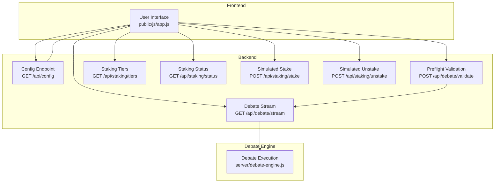
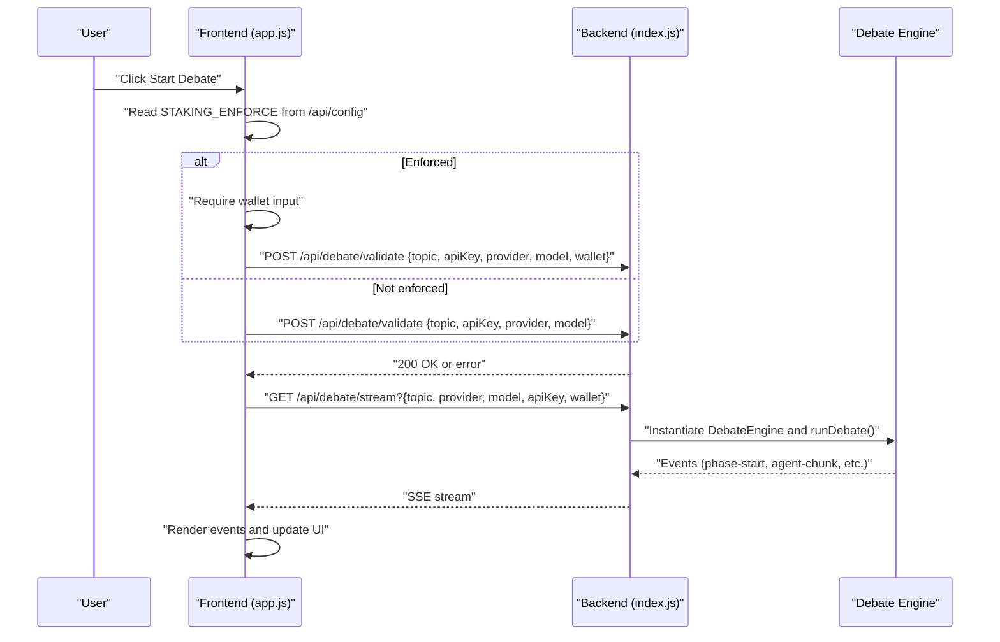
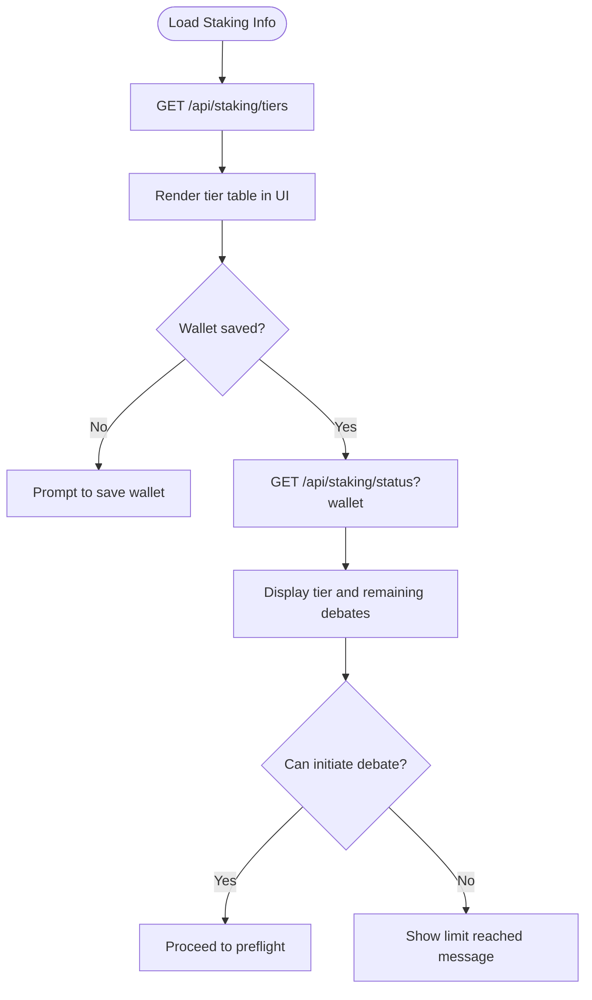
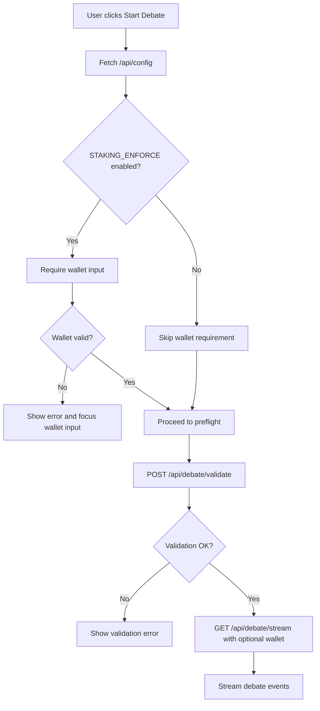
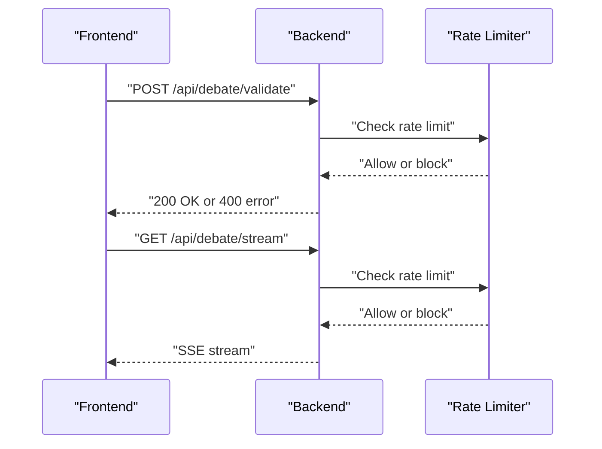
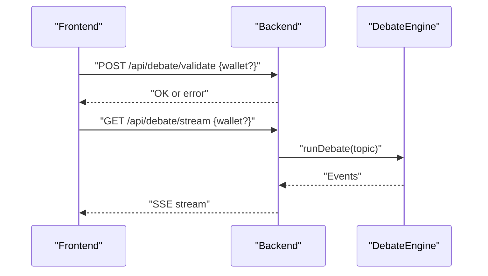
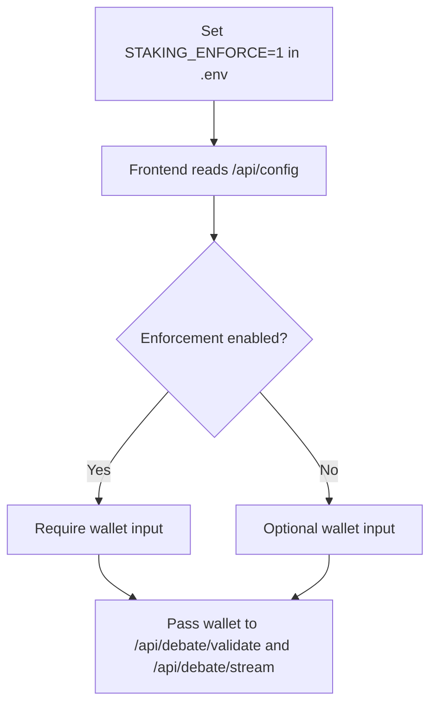
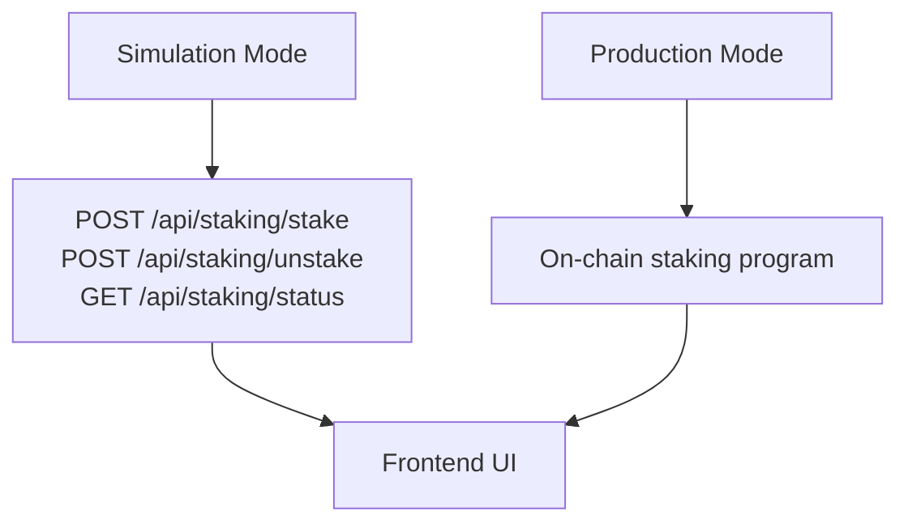
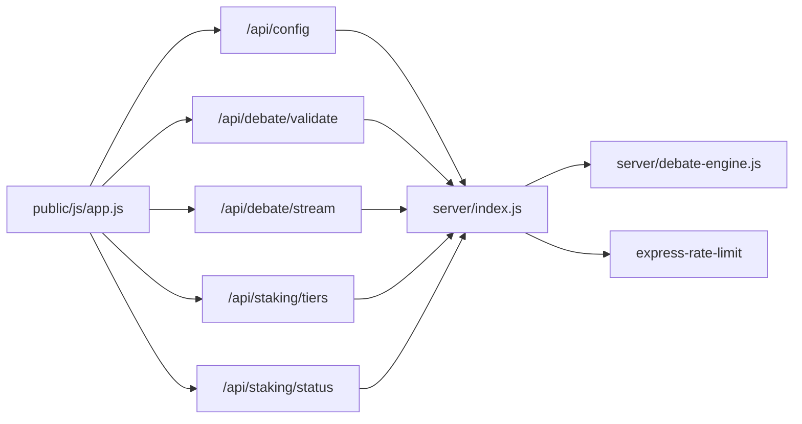

# Access Control Logic

<cite>
**Referenced Files in This Document**
- [README.md](file://dissensus-engine/README.md)
- [index.js](file://dissensus-engine/server/index.js)
- [app.js](file://dissensus-engine/public/js/app.js)
- [debate-engine.js](file://dissensus-engine/server/debate-engine.js)
- [package.json](file://dissensus-engine/package.json)
</cite>

## Table of Contents
1. [Introduction](#introduction)
2. [Project Structure](#project-structure)
3. [Core Components](#core-components)
4. [Architecture Overview](#architecture-overview)
5. [Detailed Component Analysis](#detailed-component-analysis)
6. [Dependency Analysis](#dependency-analysis)
7. [Performance Considerations](#performance-considerations)
8. [Troubleshooting Guide](#troubleshooting-guide)
9. [Conclusion](#conclusion)

## Introduction
This document explains the access control system that governs feature availability and debate initiation. It covers how staking tiers map to feature access, the debate permission system, and API endpoint protection. It documents the preflight validation workflow, the integration with debate initiation, and the enforcement mode controlled by STAKING_ENFORCE. It also describes simulation versus production behavior and how access control affects user experience across tiers.

## Project Structure
The access control logic spans the frontend and backend:
- Frontend (public/js/app.js): Manages UI state, wallet input, staking enforcement flag, and preflight validation.
- Backend (server/index.js): Implements API endpoints, input validation, rate limiting, and SSE streaming.
- Debate engine (server/debate-engine.js): Executes the 4-phase debate orchestration.
- Documentation (README.md): Describes staking tiers, enforcement mode, and endpoints.

**Diagram sources**
- [index.js:58-230](file://dissensus-engine/server/index.js#L58-L230)
- [app.js:642-674](file://dissensus-engine/public/js/app.js#L642-L674)
- [debate-engine.js:41-387](file://dissensus-engine/server/debate-engine.js#L41-L387)

**Section sources**
- [README.md:78-90](file://dissensus-engine/README.md#L78-L90)
- [index.js:58-230](file://dissensus-engine/server/index.js#L58-L230)
- [app.js:642-674](file://dissensus-engine/public/js/app.js#L642-L674)

## Core Components
- Staking tiers and daily limits: Defined in documentation and surfaced via GET /api/staking/tiers. The enforcement mode (STAKING_ENFORCE=1) controls whether a wallet is required and daily debate limits are enforced.
- Preflight validation: POST /api/debate/validate checks topic length, model validity, and API key presence before initiating SSE streaming.
- SSE debate stream: GET /api/debate/stream validates inputs, streams debate events, and records metrics.
- Frontend integration: The UI reads STAKING_ENFORCE from /api/config, optionally enforces wallet presence, and passes wallet to preflight and stream endpoints.

**Section sources**
- [README.md:78-90](file://dissensus-engine/README.md#L78-L90)
- [index.js:124-230](file://dissensus-engine/server/index.js#L124-L230)
- [app.js:13-14](file://dissensus-engine/public/js/app.js#L13-L14)

## Architecture Overview
The access control architecture combines frontend-driven preflight checks with backend validations and rate limiting. The enforcement mode toggles whether a wallet is mandatory and whether daily debate limits apply.

**Diagram sources**
- [index.js:124-230](file://dissensus-engine/server/index.js#L124-L230)
- [app.js:209-356](file://dissensus-engine/public/js/app.js#L209-L356)
- [debate-engine.js:121-386](file://dissensus-engine/server/debate-engine.js#L121-L386)

## Detailed Component Analysis

### Staking Tiers and Feature Access
- Tiers define minimum stake thresholds, daily debate limits, and unlockable features. These are exposed via GET /api/staking/tiers and rendered in the UI.
- In simulation mode, the UI allows setting a wallet and simulating stake/unstake via POST /api/staking/stake and POST /api/staking/unstake. Status is queried via GET /api/staking/status.
- In production, on-chain verification would replace simulation, but the API surface remains the same.

**Diagram sources**
- [app.js:556-568](file://dissensus-engine/public/js/app.js#L556-L568)
- [app.js:492-515](file://dissensus-engine/public/js/app.js#L492-L515)

**Section sources**
- [README.md:78-90](file://dissensus-engine/README.md#L78-L90)
- [app.js:492-568](file://dissensus-engine/public/js/app.js#L492-L568)

### Debate Permission System and canDebate() Workflow
The frontend enforces a can-debate check before allowing debate initiation:
- Read STAKING_ENFORCE from /api/config.
- If enforced, require a valid wallet (length check).
- Optionally pass wallet to preflight and stream endpoints.
- The preflight endpoint validates topic, model, and API key, and returns success or an error.

**Diagram sources**
- [app.js:209-356](file://dissensus-engine/public/js/app.js#L209-L356)
- [index.js:124-151](file://dissensus-engine/server/index.js#L124-L151)

**Section sources**
- [app.js:228-236](file://dissensus-engine/public/js/app.js#L228-L236)
- [index.js:124-151](file://dissensus-engine/server/index.js#L124-L151)

### API Endpoint Protection
- POST /api/debate/validate: Validates topic length, model, and API key presence. Returns 200 on success or 400 with an error message.
- GET /api/debate/stream: Validates inputs, sets SSE headers, streams debate events, and records metrics on completion or error.
- Rate limiting: Applied to debate and card endpoints to prevent abuse.

**Diagram sources**
- [index.js:124-230](file://dissensus-engine/server/index.js#L124-L230)

**Section sources**
- [index.js:47-53](file://dissensus-engine/server/index.js#L47-L53)
- [index.js:124-230](file://dissensus-engine/server/index.js#L124-L230)

### Integration with Debate Initiation
- The frontend calls /api/debate/validate before connecting to /api/debate/stream to avoid exposing 400 errors via EventSource.
- The wallet (when present) is passed to both endpoints to support enforcement mode and limit tracking.

**Diagram sources**
- [app.js:274-300](file://dissensus-engine/public/js/app.js#L274-L300)
- [index.js:156-230](file://dissensus-engine/server/index.js#L156-L230)
- [debate-engine.js:121-386](file://dissensus-engine/server/debate-engine.js#L121-L386)

**Section sources**
- [app.js:274-300](file://dissensus-engine/public/js/app.js#L274-L300)
- [index.js:156-230](file://dissensus-engine/server/index.js#L156-L230)

### Enforcement Mode (STAKING_ENFORCE=1)
- When enabled, the frontend requires a wallet and passes it to validation and streaming endpoints.
- The backend’s preflight and stream endpoints validate inputs and rely on the frontend to supply a wallet when enforced.
- Daily debate limits are enforced by the frontend’s staking status queries and UI messaging.

**Diagram sources**
- [README.md:88-90](file://dissensus-engine/README.md#L88-L90)
- [index.js:58-67](file://dissensus-engine/server/index.js#L58-L67)
- [app.js:642-655](file://dissensus-engine/public/js/app.js#L642-L655)

**Section sources**
- [README.md:88-90](file://dissensus-engine/README.md#L88-L90)
- [index.js:58-67](file://dissensus-engine/server/index.js#L58-L67)
- [app.js:642-655](file://dissensus-engine/public/js/app.js#L642-L655)

### Simulation vs. Production Behavior
- Simulation: The frontend exposes endpoints to simulate staking and unstaking, and to query staking status. This is intended for demos.
- Production: On-chain verification replaces simulation. The API surface remains unchanged, enabling seamless migration.

**Diagram sources**
- [README.md:78-90](file://dissensus-engine/README.md#L78-L90)
- [app.js:517-554](file://dissensus-engine/public/js/app.js#L517-L554)

**Section sources**
- [README.md:78-90](file://dissensus-engine/README.md#L78-L90)
- [app.js:517-554](file://dissensus-engine/public/js/app.js#L517-L554)

### Examples of Access Control Checks
- Topic validation: Minimum length, maximum length, and provider/model validation occur in preflight and stream endpoints.
- API key validation: Either user-provided or server-side key is required depending on configuration.
- Rate limiting: Applied to debate and card endpoints to protect resources.

**Section sources**
- [index.js:124-190](file://dissensus-engine/server/index.js#L124-L190)
- [index.js:249-291](file://dissensus-engine/server/index.js#L249-L291)

## Dependency Analysis
- Frontend depends on backend endpoints for configuration, staking, and debate orchestration.
- Backend depends on the debate engine for execution and on rate limiting for protection.
- Environment variables control server-side keys and enforcement behavior.

**Diagram sources**
- [app.js:642-674](file://dissensus-engine/public/js/app.js#L642-L674)
- [index.js:58-230](file://dissensus-engine/server/index.js#L58-L230)
- [debate-engine.js:41-387](file://dissensus-engine/server/debate-engine.js#L41-L387)
- [package.json:10-19](file://dissensus-engine/package.json#L10-L19)

**Section sources**
- [package.json:10-19](file://dissensus-engine/package.json#L10-L19)
- [index.js:58-230](file://dissensus-engine/server/index.js#L58-L230)

## Performance Considerations
- Rate limiting reduces abuse and protects downstream providers.
- SSE streaming avoids buffering large payloads and supports real-time updates.
- Preflight validation prevents wasted compute on invalid requests.

## Troubleshooting Guide
- Validation errors: Check topic length and model/provider correctness in preflight responses.
- API key issues: Ensure a valid key is provided or server-side key is configured.
- Rate limit exceeded: Wait for the next window or adjust usage.
- Wallet requirement: When STAKING_ENFORCE is enabled, ensure a valid wallet is saved and passed to endpoints.

**Section sources**
- [index.js:124-190](file://dissensus-engine/server/index.js#L124-L190)
- [app.js:274-300](file://dissensus-engine/public/js/app.js#L274-L300)

## Conclusion
The access control system integrates frontend-driven preflight checks with backend validations and rate limiting. Staking tiers and enforcement mode shape user experience by gating features and debates. In simulation mode, the frontend exposes staking endpoints for demos; production readiness is achieved by replacing simulation with on-chain verification while preserving the same API surface.