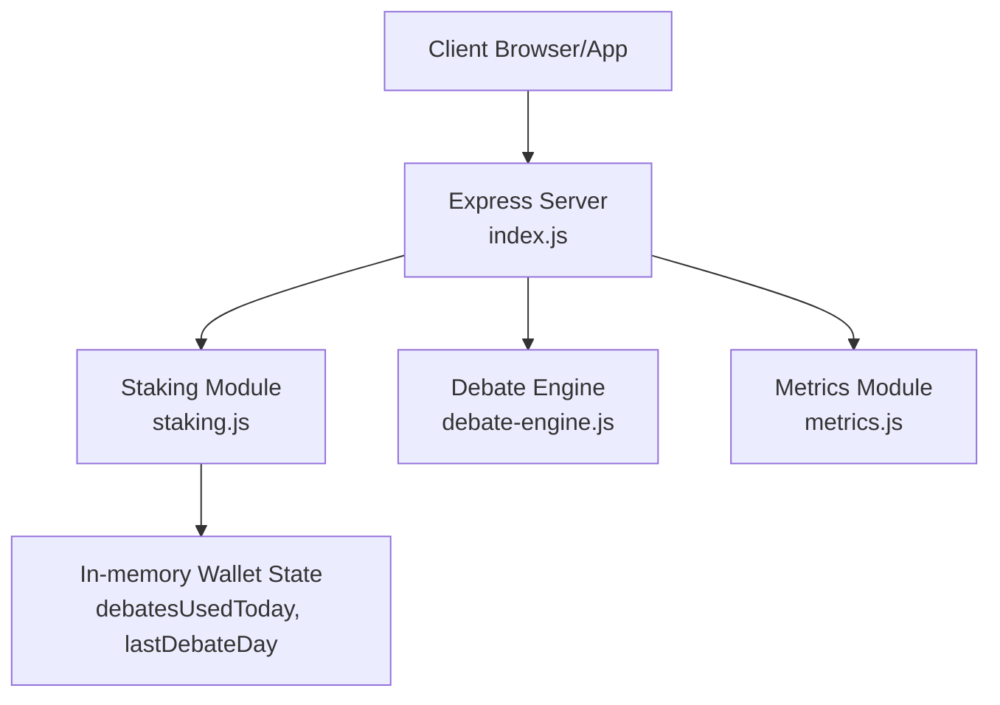
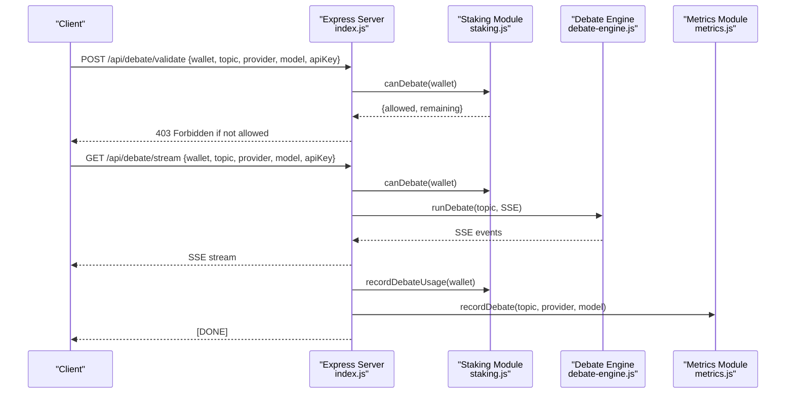
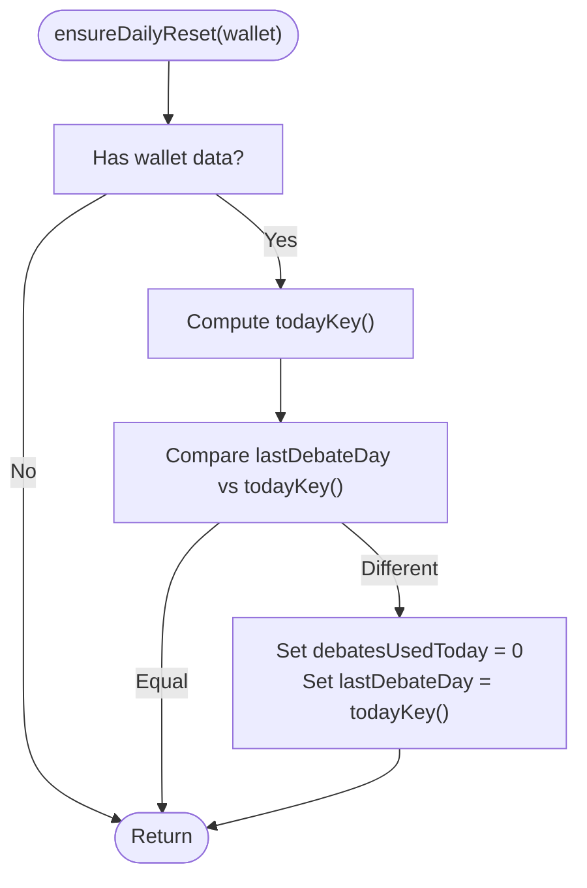
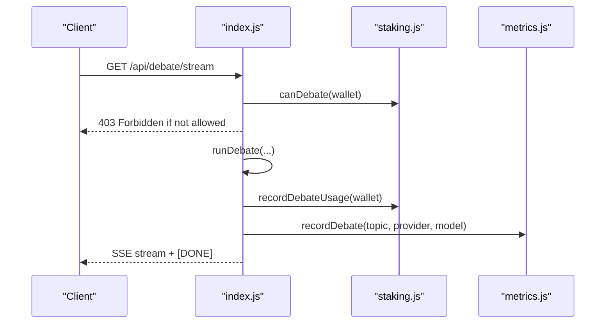
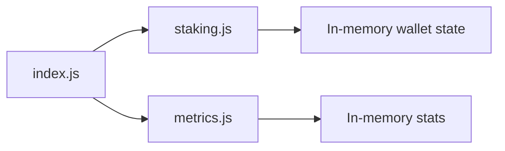

# Daily Debate Limits

<cite>
**Referenced Files in This Document**
- [index.js](file://dissensus-engine/server/index.js)
- [staking.js](file://dissensus-engine/server/staking.js)
- [metrics.js](file://dissensus-engine/server/metrics.js)
- [README.md](file://dissensus-engine/README.md)
</cite>

## Table of Contents
1. [Introduction](#introduction)
2. [Project Structure](#project-structure)
3. [Core Components](#core-components)
4. [Architecture Overview](#architecture-overview)
5. [Detailed Component Analysis](#detailed-component-analysis)
6. [Dependency Analysis](#dependency-analysis)
7. [Performance Considerations](#performance-considerations)
8. [Troubleshooting Guide](#troubleshooting-guide)
9. [Conclusion](#conclusion)

## Introduction
This document explains the daily debate limitation system used by the Dissensus AI Debate Engine. It covers per-tier debate limits (Bronze/Silver, unlimited for Gold/Whale), the daily reset mechanism, and usage tracking. It documents how the debate counter logic works, how debatesUsedToday and lastDebateDay properties cooperate, and how canDebate(), recordDebateUsage(), and ensureDailyReset() enforce limits. Edge cases such as first-time users, limit exceeded scenarios, and reset timing are addressed with practical examples.

## Project Structure
The daily debate limit system is implemented in the server module and integrated into the debate flow:
- The server exposes endpoints that validate debate requests and stream debates.
- The staking module simulates tiers and enforces daily debate limits.
- The metrics module tracks usage and resets daily aggregates.

**Diagram sources**
- [index.js](file://dissensus-engine/server/index.js)
- [staking.js](file://dissensus-engine/server/staking.js)
- [metrics.js](file://dissensus-engine/server/metrics.js)

**Section sources**
- [README.md](file://dissensus-engine/README.md)

## Core Components
- Tiers and limits: FREE (1/day), BRONZE (5/day), SILVER (20/day), GOLD (unlimited), WHALE (unlimited).
- Daily reset: A date-based key ensures debatesUsedToday resets each calendar day.
- Usage tracking: debatesUsedToday increments per debate completion; lastDebateDay stores the last reset date.
- Enforcement: canDebate() returns allowed + remaining; recordDebateUsage() increments counters; ensureDailyReset() performs date-based reset.

**Section sources**
- [staking.js](file://dissensus-engine/server/staking.js)

## Architecture Overview
The daily limit enforcement integrates with the debate flow as follows:
- Validation endpoint checks wallet and limits before allowing a debate.
- Debate stream endpoint validates, streams results, and records usage upon completion.
- Metrics module updates usage statistics and resets daily counters.

**Diagram sources**
- [index.js](file://dissensus-engine/server/index.js)
- [staking.js](file://dissensus-engine/server/staking.js)
- [metrics.js](file://dissensus-engine/server/metrics.js)

## Detailed Component Analysis

### Per-Tier Debate Limits
- FREE: 1 debate per day.
- BRONZE: 5 debates per day.
- SILVER: 20 debates per day.
- GOLD: unlimited debates per day.
- WHALE: unlimited debates per day.

These limits are enforced by mapping a staked amount to a tier and checking the tier’s debatesPerDay setting.

**Section sources**
- [staking.js](file://dissensus-engine/server/staking.js)

### Daily Reset Mechanism
- A date-based key is computed as the ISO date string (YYYY-MM-DD).
- ensureDailyReset() compares lastDebateDay with todayKey(). If different, debatesUsedToday is reset to 0 and lastDebateDay is set to todayKey().
- This ensures daily counters reset at midnight UTC.

**Diagram sources**
- [staking.js](file://dissensus-engine/server/staking.js)

**Section sources**
- [staking.js](file://dissensus-engine/server/staking.js)

### Usage Tracking and Properties
- debatesUsedToday: Tracks the number of debates performed on the current day.
- lastDebateDay: Stores the date of the last recorded debate (used for reset detection).
- These properties are initialized for new wallets and updated on each completed debate.

**Section sources**
- [staking.js](file://dissensus-engine/server/staking.js)

### Debate Counter Logic and Remaining Calculation
- getStakingInfo() ensures daily reset, determines the tier, computes remaining debates as:
  - Unlimited if debatesPerDay is -1.
  - Otherwise, max(0, debatesPerDay - debatesUsedToday).
- canDebate() returns:
  - allowed: true, remaining: "unlimited" for unlimited tiers.
  - allowed: true, remaining: number for limited tiers with remaining > 0.
  - allowed: false, remaining: 0, reason: message when limit reached.

**Section sources**
- [staking.js](file://dissensus-engine/server/staking.js)

### Special Handling of Unlimited Access Tiers
- GOLD and WHALE tiers have debatesPerDay set to -1.
- canDebate() treats -1 as unlimited and allows debates without decrementing counters.
- recordDebateUsage() still updates lastDebateDay but does not increment debatesUsedToday for unlimited tiers.

**Section sources**
- [staking.js](file://dissensus-engine/server/staking.js)

### Examples of Daily Limit Enforcement
- First-time user (no wallet data):
  - canDebate() returns allowed: true, remaining: 1 (FREE tier default).
- Bronze user at 4 debates used today:
  - canDebate() returns allowed: true, remaining: 1.
- Bronze user at 5 debates used today:
  - canDebate() returns allowed: false, remaining: 0, reason: message.
- Unlimited user (GOLD/Whale):
  - canDebate() returns allowed: true, remaining: "unlimited".

**Section sources**
- [staking.js](file://dissensus-engine/server/staking.js)

### Implementation Details

#### canDebate() Function
- Purpose: Determine if a wallet can debate today and how many remain.
- Behavior:
  - If tier is unlimited, allow and report remaining as "unlimited".
  - If remaining is a positive number, allow and report remaining.
  - Otherwise, deny with reason indicating daily limit reached.

**Section sources**
- [staking.js](file://dissensus-engine/server/staking.js)

#### recordDebateUsage() Logic
- Purpose: Increment daily usage after a debate completes.
- Behavior:
  - Initialize wallet data if missing.
  - Ensure daily reset.
  - Increment debatesUsedToday and update lastDebateDay to today.

**Section sources**
- [staking.js](file://dissensus-engine/server/staking.js)

#### ensureDailyReset() Functionality
- Purpose: Reset daily counters when the date advances.
- Behavior:
  - Compare lastDebateDay with todayKey().
  - If different, reset debatesUsedToday to 0 and set lastDebateDay to todayKey().

**Section sources**
- [staking.js](file://dissensus-engine/server/staking.js)

### Integration Points in the Debate Flow
- Validation endpoint (/api/debate/validate) calls canDebate() and returns 403 if denied.
- Stream endpoint (/api/debate/stream) calls canDebate() before streaming and recordDebateUsage() after completion.
- Metrics module records each completed debate for analytics.

**Diagram sources**
- [index.js](file://dissensus-engine/server/index.js)
- [staking.js](file://dissensus-engine/server/staking.js)
- [metrics.js](file://dissensus-engine/server/metrics.js)

**Section sources**
- [index.js](file://dissensus-engine/server/index.js)
- [metrics.js](file://dissensus-engine/server/metrics.js)

## Dependency Analysis
- index.js depends on staking.js for canDebate() and recordDebateUsage().
- index.js depends on metrics.js for recordDebate() after a debate completes.
- staking.js maintains in-memory state keyed by wallet address.
- metrics.js maintains separate daily counters and resets independently.

**Diagram sources**
- [index.js](file://dissensus-engine/server/index.js)
- [staking.js](file://dissensus-engine/server/staking.js)
- [metrics.js](file://dissensus-engine/server/metrics.js)

**Section sources**
- [index.js](file://dissensus-engine/server/index.js)
- [staking.js](file://dissensus-engine/server/staking.js)
- [metrics.js](file://dissensus-engine/server/metrics.js)

## Performance Considerations
- In-memory storage: The staking module uses an in-memory object. This is efficient for small to medium deployments but requires persistence for production.
- Date comparison: ensureDailyReset() uses string comparison of ISO dates, which is fast and reliable.
- Reset timing: Resets occur at midnight UTC; clients in different timezones may observe resets at slightly different local times.

[No sources needed since this section provides general guidance]

## Troubleshooting Guide
- Daily limit reached:
  - Symptom: 403 Forbidden on validation or stream endpoints.
  - Cause: debatesRemaining is 0 for the wallet’s tier.
  - Resolution: Stake more (simulated) to reach a higher tier or wait until the next calendar day.
- Unlimited tier still blocked:
  - Symptom: Unexpected denial despite unlimited tier.
  - Cause: Ensure STAKING_ENFORCE is enabled and a valid wallet is provided.
  - Resolution: Verify .env settings and pass a normalized wallet address.
- Reset not occurring:
  - Symptom: debatesUsedToday does not reset at midnight.
  - Cause: ensureDailyReset() relies on date comparison; ensure server time is correct.
  - Resolution: Confirm system clock and timezone settings.
- First-time user unexpectedly limited:
  - Symptom: Immediate limit despite no prior usage.
  - Cause: FREE tier default is 1 debate per day.
  - Resolution: Stake to reach BRONZE/SILVER/GOLD/Whale tiers.

**Section sources**
- [index.js](file://dissensus-engine/server/index.js)
- [staking.js](file://dissensus-engine/server/staking.js)

## Conclusion
The daily debate limitation system provides a clear, tiered access model with robust daily reset logic. It integrates seamlessly with the debate flow, offering immediate feedback when limits are reached and enabling unlimited access for higher tiers. The design is straightforward, efficient, and suitable for demonstration; production deployments should consider persistent storage and on-chain verification.