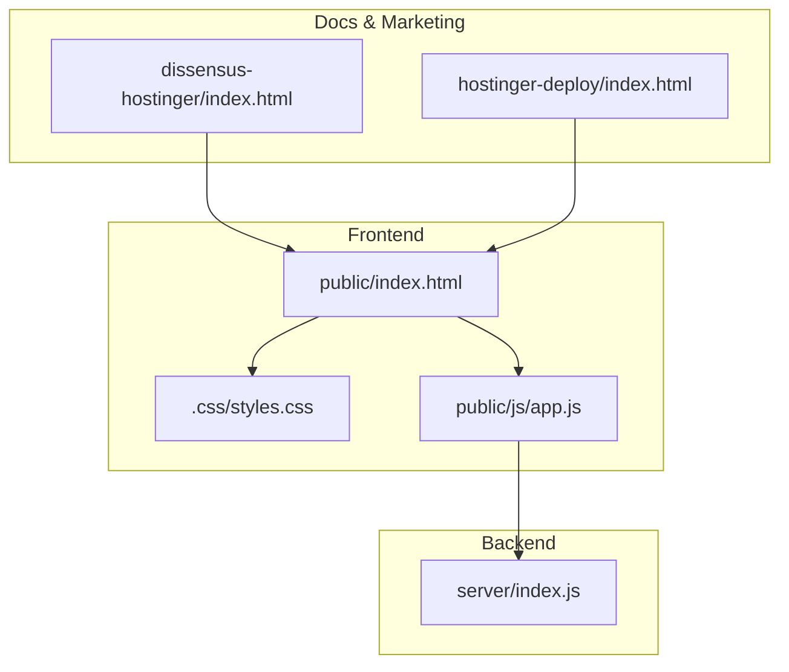
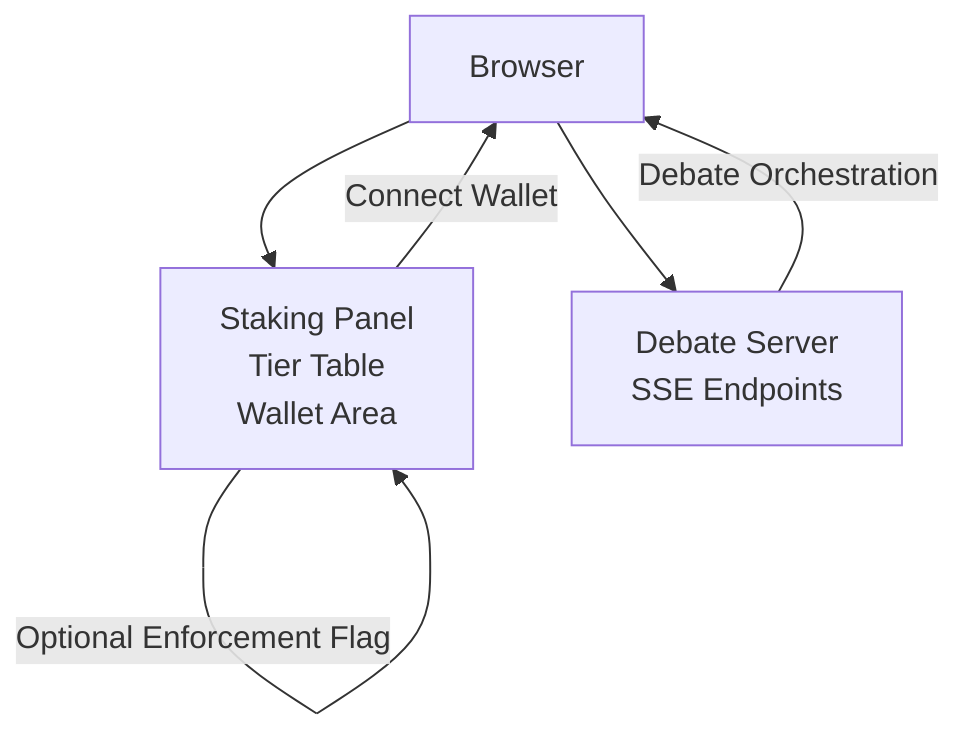
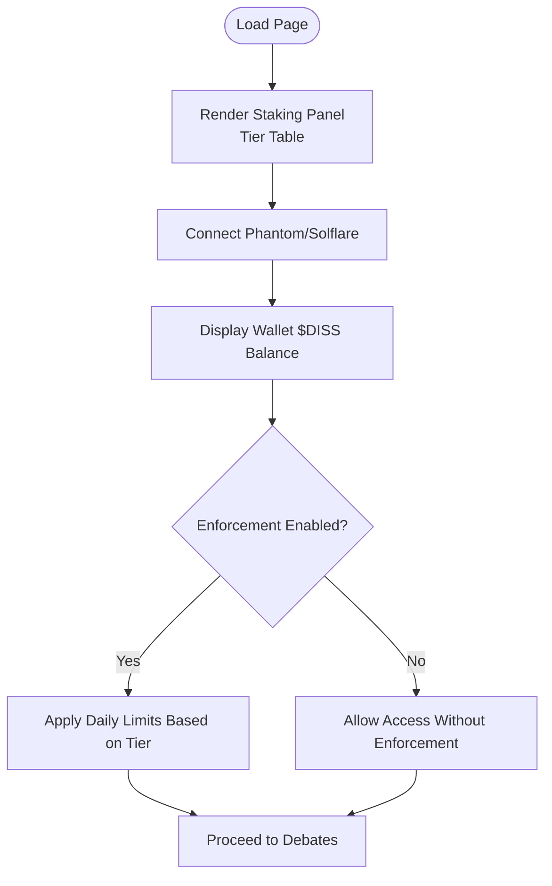
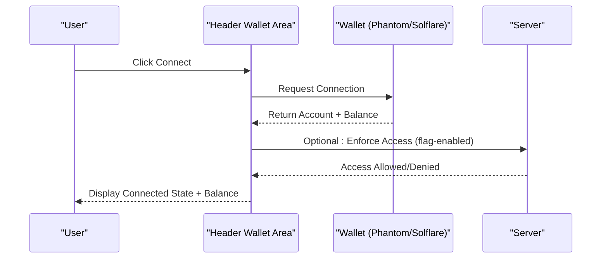
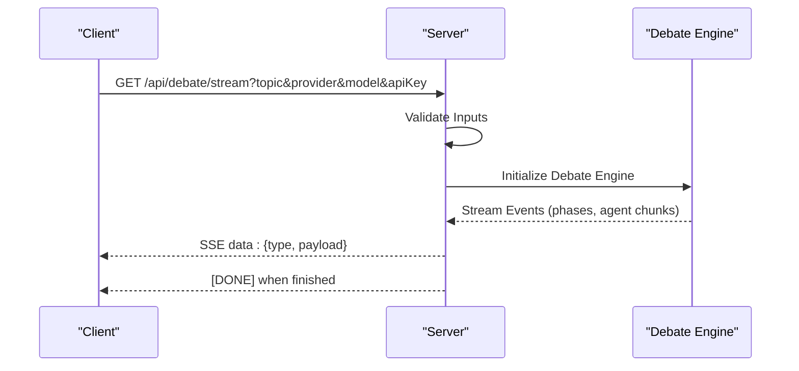
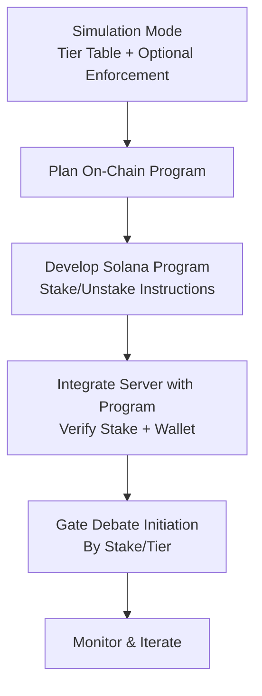
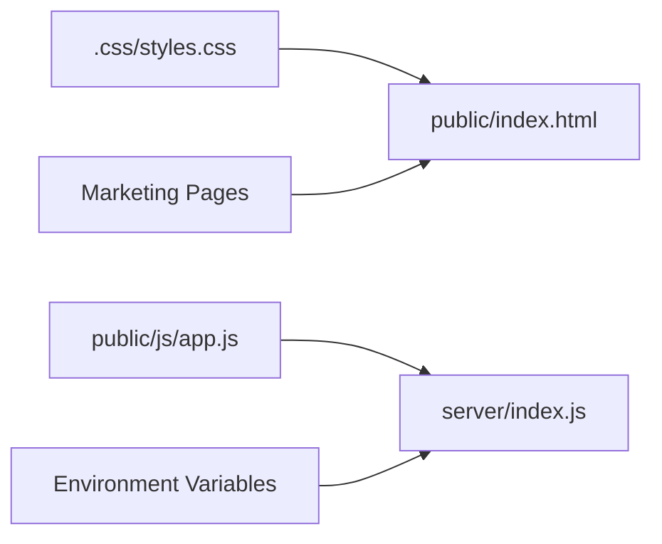

# Simulation & Production Migration

<cite>
**Referenced Files in This Document**
- [README.md](file://dissensus-engine/README.md)
- [package.json](file://dissensus-engine/package.json)
- [server/index.js](file://dissensus-engine/server/index.js)
- [public/index.html](file://dissensus-engine/public/index.html)
- [public/css/styles.css](file://dissensus-engine/public/css/styles.css)
- [public/js/app.js](file://dissensus-engine/public/js/app.js)
- [dissensus-hostinger/index.html](file://dissensus-hostinger/index.html)
- [hostinger-deploy/index.html](file://hostinger-deploy/index.html)
</cite>

## Table of Contents
1. [Introduction](#introduction)
2. [Project Structure](#project-structure)
3. [Core Components](#core-components)
4. [Architecture Overview](#architecture-overview)
5. [Detailed Component Analysis](#detailed-component-analysis)
6. [Dependency Analysis](#dependency-analysis)
7. [Performance Considerations](#performance-considerations)
8. [Troubleshooting Guide](#troubleshooting-guide)
9. [Conclusion](#conclusion)
10. [Appendices](#appendices)

## Introduction
This document explains the current simulated staking implementation and the planned migration path to production blockchain integration on Solana. It clarifies the differences between the existing simulation mode and the future on-chain enforcement, outlines the expected integration points, and provides guidance for development workflows, testing strategies, and secure gradual rollout.

The project currently exposes a staking UI and tier preview that demonstrates how stake would map to platform access. On-chain staking and enforcement are noted as upcoming features behind a staking program.

**Section sources**
- [README.md:1-180](file://dissensus-engine/README.md#L1-L180)
- [dissensus-hostinger/index.html:374-474](file://dissensus-hostinger/index.html#L374-L474)
- [hostinger-deploy/index.html:388-484](file://hostinger-deploy/index.html#L388-L484)

## Project Structure
The staking-related UI and configuration are present in the frontend assets and marketing pages. The backend server handles debate orchestration and does not yet enforce stake-based access. The staking UI is styled and controlled via CSS and JavaScript.

**Diagram sources**
- [public/index.html:1-186](file://dissensus-engine/public/index.html#L1-L186)
- [public/css/styles.css:363-482](file://dissensus-engine/public/css/styles.css#L363-L482)
- [public/js/app.js:1-554](file://dissensus-engine/public/js/app.js#L1-L554)
- [server/index.js:1-356](file://dissensus-engine/server/index.js#L1-L356)
- [dissensus-hostinger/index.html:374-474](file://dissensus-hostinger/index.html#L374-L474)
- [hostinger-deploy/index.html:388-484](file://hostinger-deploy/index.html#L388-L484)

**Section sources**
- [public/index.html:1-186](file://dissensus-engine/public/index.html#L1-L186)
- [public/css/styles.css:363-482](file://dissensus-engine/public/css/styles.css#L363-L482)
- [public/js/app.js:1-554](file://dissensus-engine/public/js/app.js#L1-L554)
- [server/index.js:1-356](file://dissensus-engine/server/index.js#L1-L356)
- [dissensus-hostinger/index.html:374-474](file://dissensus-hostinger/index.html#L374-L474)
- [hostinger-deploy/index.html:388-484](file://hostinger-deploy/index.html#L388-L484)

## Core Components
- Staking UI and tiers: The frontend defines a staking panel with tier thresholds and messaging indicating that on-chain enforcement is upcoming. The panel is styled and controlled via CSS and JavaScript.
- Wallet connection hooks: The header includes a wallet area intended for connecting Phantom/Solflare and displaying a wallet balance. The staking UI mentions optional enforcement via a server mode flag.
- Backend debate server: The server orchestrates debates and responds to SSE endpoints. It does not currently enforce stake-based access.
- Marketing pages: The marketing pages describe the staking roadmap and on-chain enforcement.

Key implementation references:
- Staking panel CSS and tier table
- Wallet header styles and messaging
- Backend SSE endpoints and configuration

**Section sources**
- [public/css/styles.css:363-482](file://dissensus-engine/public/css/styles.css#L363-L482)
- [public/index.html:1-186](file://dissensus-engine/public/index.html#L1-L186)
- [server/index.js:1-356](file://dissensus-engine/server/index.js#L1-L356)
- [dissensus-hostinger/index.html:374-474](file://dissensus-hostinger/index.html#L374-L474)
- [hostinger-deploy/index.html:388-484](file://hostinger-deploy/index.html#L388-L484)

## Architecture Overview
The current architecture separates UI concerns (frontend staking panel and wallet area) from the debate server. The staking UI is ready for wallet integration and tier enforcement, while the backend remains staking-agnostic.

**Diagram sources**
- [public/css/styles.css:363-482](file://dissensus-engine/public/css/styles.css#L363-L482)
- [public/index.html:1-186](file://dissensus-engine/public/index.html#L1-L186)
- [server/index.js:156-230](file://dissensus-engine/server/index.js#L156-L230)

## Detailed Component Analysis

### Staking UI and Tier Preview
- The staking panel displays tier thresholds and daily debate limits under a simulated regime. The marketing pages emphasize that on-chain enforcement is upcoming and that optional server-side enforcement can be enabled via a flag.
- The panel includes a note indicating optional enforcement via a server mode flag and mentions wallet connection for balance checks.

**Diagram sources**
- [public/css/styles.css:363-482](file://dissensus-engine/public/css/styles.css#L363-L482)
- [dissensus-hostinger/index.html:412-472](file://dissensus-hostinger/index.html#L412-L472)
- [hostinger-deploy/index.html:422-472](file://hostinger-deploy/index.html#L422-L472)

**Section sources**
- [public/css/styles.css:363-482](file://dissensus-engine/public/css/styles.css#L363-L482)
- [dissensus-hostinger/index.html:374-474](file://dissensus-hostinger/index.html#L374-L474)
- [hostinger-deploy/index.html:388-484](file://hostinger-deploy/index.html#L388-L484)

### Wallet Header Integration
- The header includes a wallet area with a connect button and balance display. The staking UI indicates that wallet connection verifies the real $DISS balance on Solana and that optional enforcement can be enabled server-side.

**Diagram sources**
- [public/index.html:1-186](file://dissensus-engine/public/index.html#L1-L186)
- [public/css/styles.css:69-112](file://dissensus-engine/public/css/styles.css#L69-L112)
- [dissensus-hostinger/index.html:460-462](file://dissensus-hostinger/index.html#L460-L462)
- [hostinger-deploy/index.html:470-472](file://hostinger-deploy/index.html#L470-L472)

**Section sources**
- [public/index.html:1-186](file://dissensus-engine/public/index.html#L1-L186)
- [public/css/styles.css:69-112](file://dissensus-engine/public/css/styles.css#L69-L112)
- [dissensus-hostinger/index.html:460-462](file://dissensus-hostinger/index.html#L460-L462)
- [hostinger-deploy/index.html:470-472](file://hostinger-deploy/index.html#L470-L472)

### Backend Debate Server (Current Behavior)
- The server exposes SSE endpoints for debate orchestration and does not currently enforce stake-based access. It validates inputs and streams debate events to the client.

**Diagram sources**
- [server/index.js:156-230](file://dissensus-engine/server/index.js#L156-L230)

**Section sources**
- [server/index.js:156-230](file://dissensus-engine/server/index.js#L156-L230)

### Planned Migration Path: Simulation to Production
- Simulation mode: The staking UI and tier table are fully functional and demonstrate how stake would map to access. Enforcement is optional and can be toggled server-side.
- On-chain integration: When the staking program is deployed, the server will enforce wallet + tier-based access and apply daily limits derived from on-chain stake.
- API changes: The server will need endpoints to verify wallet ownership and stake amounts, and to gate debate initiation accordingly.

**Diagram sources**
- [public/css/styles.css:363-482](file://dissensus-engine/public/css/styles.css#L363-L482)
- [dissensus-hostinger/index.html:374-381](file://dissensus-hostinger/index.html#L374-L381)
- [hostinger-deploy/index.html:388-391](file://hostinger-deploy/index.html#L388-L391)

**Section sources**
- [public/css/styles.css:363-482](file://dissensus-engine/public/css/styles.css#L363-L482)
- [dissensus-hostinger/index.html:374-381](file://dissensus-hostinger/index.html#L374-L381)
- [hostinger-deploy/index.html:388-391](file://hostinger-deploy/index.html#L388-L391)

## Dependency Analysis
- Frontend depends on CSS for staking panel styling and JavaScript for SSE communication and UI updates.
- Backend depends on environment variables for server-side API keys and rate limiting.
- Marketing pages depend on the staking UI to communicate the roadmap.

**Diagram sources**
- [public/css/styles.css:363-482](file://dissensus-engine/public/css/styles.css#L363-L482)
- [public/js/app.js:1-554](file://dissensus-engine/public/js/app.js#L1-L554)
- [server/index.js:1-356](file://dissensus-engine/server/index.js#L1-L356)
- [dissensus-hostinger/index.html:374-474](file://dissensus-hostinger/index.html#L374-L474)
- [hostinger-deploy/index.html:388-484](file://hostinger-deploy/index.html#L388-L484)

**Section sources**
- [public/css/styles.css:363-482](file://dissensus-engine/public/css/styles.css#L363-L482)
- [public/js/app.js:1-554](file://dissensus-engine/public/js/app.js#L1-L554)
- [server/index.js:1-356](file://dissensus-engine/server/index.js#L1-L356)
- [dissensus-hostinger/index.html:374-474](file://dissensus-hostinger/index.html#L374-L474)
- [hostinger-deploy/index.html:388-484](file://hostinger-deploy/index.html#L388-L484)

## Performance Considerations
- Simulation mode avoids heavy computation; performance is primarily dependent on UI rendering and SSE throughput.
- On-chain enforcement will introduce latency from RPC calls and transaction confirmations. Consider caching verified balances and tier limits with appropriate TTLs.
- Rate limiting on debate endpoints should remain in place to protect resources during migration.

[No sources needed since this section provides general guidance]

## Troubleshooting Guide
- Wallet connection issues: Verify that the wallet extension is installed and that the site is served over HTTPS. Ensure the wallet area is visible and interactive.
- Enforcement not taking effect: Confirm the server-side enforcement flag is enabled and that the UI reflects enforcement messaging.
- SSE errors: Check network tab for 4xx/5xx responses and review server logs for validation failures.

**Section sources**
- [public/css/styles.css:69-112](file://dissensus-engine/public/css/styles.css#L69-L112)
- [dissensus-hostinger/index.html:460-462](file://dissensus-hostinger/index.html#L460-L462)
- [hostinger-deploy/index.html:470-472](file://hostinger-deploy/index.html#L470-L472)
- [server/index.js:156-230](file://dissensus-engine/server/index.js#L156-L230)

## Conclusion
The project is ready to receive on-chain staking integration. The staking UI and tier preview are fully functional, and the backend is staking-agnostic. The next steps involve developing the Solana program, integrating server-side verification, and enabling enforcement flags for a secure, gradual rollout.

[No sources needed since this section summarizes without analyzing specific files]

## Appendices

### A. Simulation Mode Configuration Examples
- Enable optional enforcement server-side via a flag indicated in the staking UI messaging.
- Configure wallet connection in-app to display real $DISS balance on Solana.

References:
- [dissensus-hostinger/index.html:460-462](file://dissensus-hostinger/index.html#L460-L462)
- [hostinger-deploy/index.html:470-472](file://hostinger-deploy/index.html#L470-L472)

**Section sources**
- [dissensus-hostinger/index.html:460-462](file://dissensus-hostinger/index.html#L460-L462)
- [hostinger-deploy/index.html:470-472](file://hostinger-deploy/index.html#L470-L472)

### B. Development Workflows
- Frontend: Extend staking panel to integrate wallet connection and enforcement feedback.
- Backend: Add endpoints to verify wallet ownership and stake amounts; gate debate initiation based on verified stake and tier.
- Testing: Validate simulation mode behavior, then incrementally enable enforcement and test with representative stake tiers.

References:
- [public/css/styles.css:363-482](file://dissensus-engine/public/css/styles.css#L363-L482)
- [server/index.js:156-230](file://dissensus-engine/server/index.js#L156-L230)

**Section sources**
- [public/css/styles.css:363-482](file://dissensus-engine/public/css/styles.css#L363-L482)
- [server/index.js:156-230](file://dissensus-engine/server/index.js#L156-L230)

### C. Production Deployment Considerations
- Security: Enforce HTTPS, rate limit endpoints, and sanitize inputs. Consider two-factor verification for sensitive actions.
- Reliability: Use health checks, circuit breakers for RPC calls, and fallbacks for degraded modes.
- Monitoring: Track debate initiation rates, enforcement decisions, and RPC latencies.

[No sources needed since this section provides general guidance]