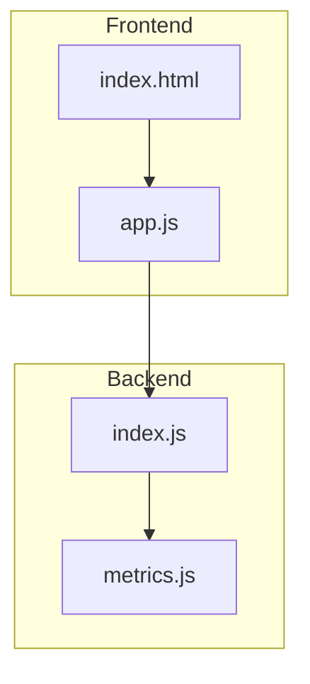
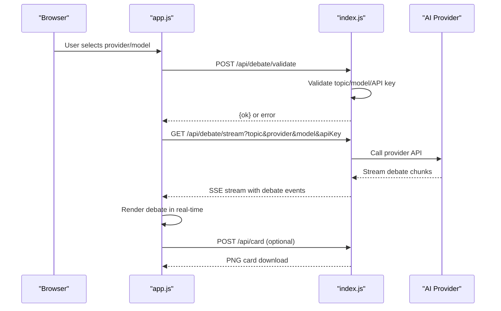
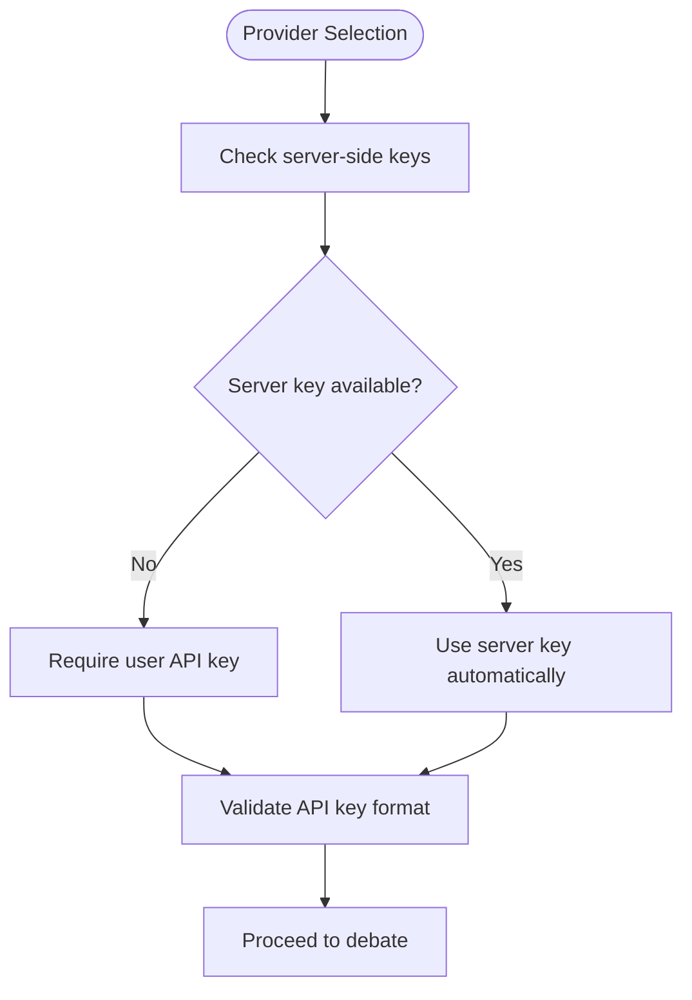
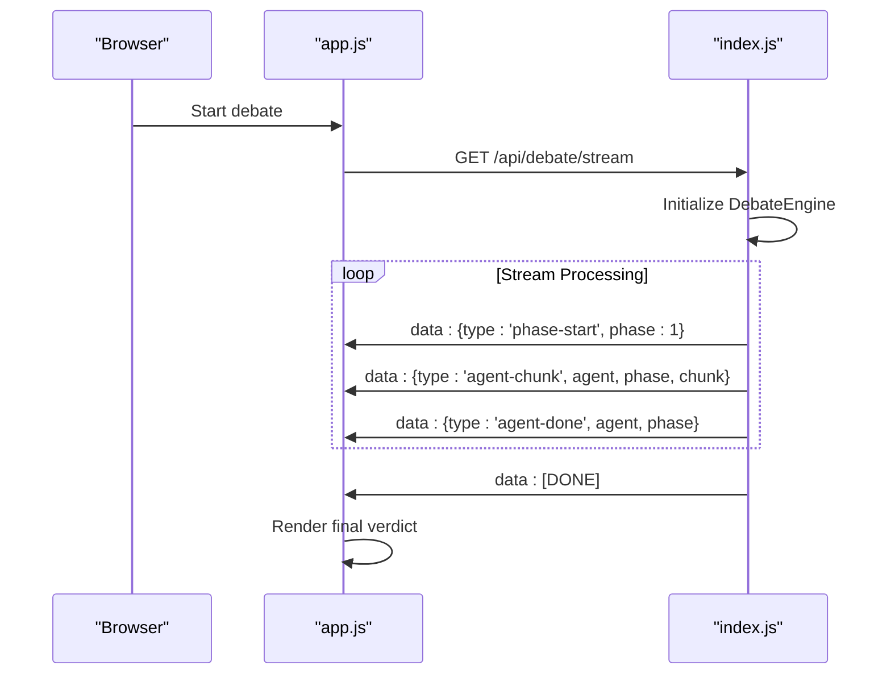
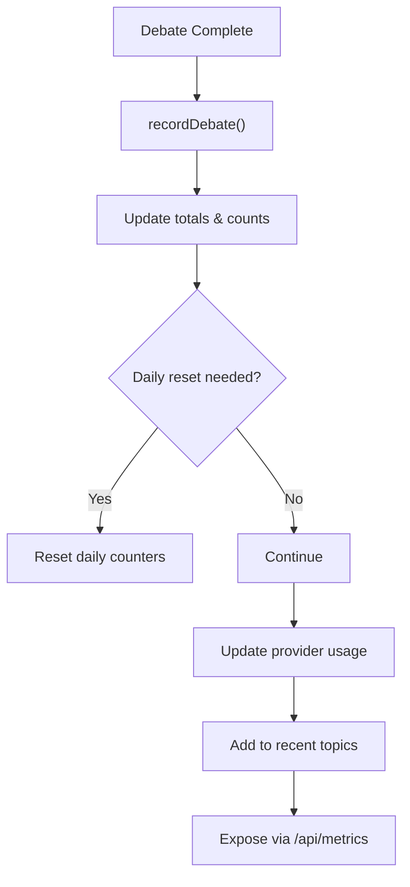
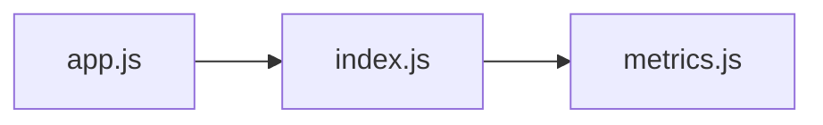

# Staking & Access Control System

<cite>
**Referenced Files in This Document**
- [index.js](file://dissensus-engine/server/index.js)
- [app.js](file://dissensus-engine/public/js/app.js)
- [index.html](file://dissensus-engine/public/index.html)
- [metrics.js](file://dissensus-engine/server/metrics.js)
- [README.md](file://dissensus-engine/README.md)
</cite>

## Update Summary
**Changes Made**
- Removed all staking system documentation including tier management, daily debate limits, and token economy features
- Updated architecture overview to reflect the removal of wallet verification and staking endpoints
- Removed all references to staking.js, solana-balance.js, and wallet-connect.js
- Updated configuration section to remove staking-related environment variables
- Revised security considerations to focus on API key management only
- Updated troubleshooting guide to remove staking-related issues

## Table of Contents
1. [Introduction](#introduction)
2. [Project Structure](#project-structure)
3. [Core Components](#core-components)
4. [Architecture Overview](#architecture-overview)
5. [Detailed Component Analysis](#detailed-component-analysis)
6. [Dependency Analysis](#dependency-analysis)
7. [Performance Considerations](#performance-considerations)
8. [Troubleshooting Guide](#troubleshooting-guide)
9. [Conclusion](#conclusion)
10. [Appendices](#appendices)

## Introduction
This document explains the current state of the Dissensus AI Debate Engine. **Important**: The staking system and token economy features have been completely removed from the codebase. The system now operates as a straightforward AI debate platform where users can engage with AI providers directly using their own API keys or server-side keys when configured.

The platform supports three AI providers (DeepSeek, Google Gemini, and OpenAI) with configurable pricing and quality levels. Users can select their preferred provider, enter their API key, choose a model, and start debating topics in real-time through a four-phase debate process.

## Project Structure
The system consists of a streamlined backend server and frontend interface:
- Backend server exposes debate endpoints, provider configuration, and metrics collection.
- Frontend provides a complete user interface for selecting providers, entering API keys, and managing debates.
- Metrics module tracks usage statistics for transparency.

**Diagram sources**
- [index.js:1-356](file://dissensus-engine/server/index.js#L1-L356)
- [app.js:1-554](file://dissensus-engine/public/js/app.js#L1-L554)
- [index.html:1-186](file://dissensus-engine/public/index.html#L1-L186)
- [metrics.js:1-112](file://dissensus-engine/server/metrics.js#L1-L112)

**Section sources**
- [index.js:1-356](file://dissensus-engine/server/index.js#L1-L356)
- [README.md:90-112](file://dissensus-engine/README.md#L90-L112)

## Core Components
- Provider configuration system with server-side key support.
- Real-time debate orchestration with four-phase process.
- SSE streaming for real-time debate display.
- Metrics collection and public dashboard.
- API key management with local storage persistence.

**Section sources**
- [index.js:58-99](file://dissensus-engine/server/index.js#L58-L99)
- [index.js:124-230](file://dissensus-engine/server/index.js#L124-L230)
- [app.js:22-53](file://dissensus-engine/public/js/app.js#L22-L53)
- [metrics.js:8-30](file://dissensus-engine/server/metrics.js#L8-L30)

## Architecture Overview
The system operates as a simple API-driven debate platform. Users connect via the web interface, select their provider and model, and receive real-time debate output through SSE streaming. All processing is handled server-side with provider APIs.

**Diagram sources**
- [app.js:208-341](file://dissensus-engine/public/js/app.js#L208-L341)
- [index.js:124-230](file://dissensus-engine/server/index.js#L124-L230)
- [index.js:257-291](file://dissensus-engine/server/index.js#L257-L291)

## Detailed Component Analysis

### Provider Configuration and API Key Management
The system supports three AI providers with flexible key management:
- DeepSeek: Most cost-effective option (~$0.008/debate)
- Google Gemini: Multiple models including free tier options
- OpenAI: Premium quality models (GPT-4o, GPT-4o Mini)

API keys can be entered by users or managed server-side for production deployments. The system automatically detects which providers have server keys configured.

**Diagram sources**
- [index.js:104-110](file://dissensus-engine/server/index.js#L104-L110)
- [app.js:59-100](file://dissensus-engine/public/js/app.js#L59-L100)

**Section sources**
- [index.js:58-99](file://dissensus-engine/server/index.js#L58-L99)
- [index.js:104-110](file://dissensus-engine/server/index.js#L104-L110)
- [app.js:22-53](file://dissensus-engine/public/js/app.js#L22-L53)
- [README.md:22-33](file://dissensus-engine/README.md#L22-L33)

### Real-Time Debate Streaming
The system implements a sophisticated four-phase debate process with real-time streaming:
1. Phase 1 - Independent Analysis
2. Phase 2 - Opening Arguments  
3. Phase 3 - Cross-Examination
4. Phase 4 - Final Verdict

Debates are streamed via Server-Sent Events (SSE) with automatic client-side rendering and smooth scrolling.

**Diagram sources**
- [app.js:344-412](file://dissensus-engine/public/js/app.js#L344-L412)
- [index.js:156-230](file://dissensus-engine/server/index.js#L156-L230)

**Section sources**
- [index.js:156-230](file://dissensus-engine/server/index.js#L156-L230)
- [app.js:344-412](file://dissensus-engine/public/js/app.js#L344-L412)

### Metrics Collection and Transparency
The system maintains comprehensive usage metrics with automatic daily reset:
- Total debates and unique topics
- Provider usage distribution
- Hourly debate patterns
- Success rates and error tracking
- Recent topics for dashboard display

Metrics are accessible via REST endpoints and a public dashboard page.

**Diagram sources**
- [metrics.js:32-73](file://dissensus-engine/server/metrics.js#L32-L73)
- [index.js:304-320](file://dissensus-engine/server/index.js#L304-L320)

**Section sources**
- [metrics.js:32-104](file://dissensus-engine/server/metrics.js#L32-L104)
- [index.js:296-320](file://dissensus-engine/server/index.js#L296-L320)

## Dependency Analysis
The current implementation has minimal dependencies focused on core functionality:
- index.js depends on debate-engine for AI provider orchestration and metrics.js for usage tracking.
- Frontend app.js depends on index.js endpoints for debate orchestration and card generation.
- metrics.js is self-contained for usage analytics.

**Diagram sources**
- [index.js:11-14](file://dissensus-engine/server/index.js#L11-L14)
- [app.js:1-14](file://dissensus-engine/public/js/app.js#L1-L14)

**Section sources**
- [index.js:11-14](file://dissensus-engine/server/index.js#L11-L14)

## Performance Considerations
- Rate limiting is applied to prevent abuse across all endpoints.
- SSE streaming is efficient for real-time debate display.
- In-memory metrics are suitable for demonstration but should be persisted in production.
- API key validation prevents unnecessary provider calls.

## Troubleshooting Guide
Common issues and resolutions:
- Missing API key:
  - Ensure you've entered a valid API key for your selected provider.
  - Check that the provider has server-side keys configured if using the hosted version.
- Invalid provider/model:
  - Verify the selected model exists for your chosen provider.
  - Check provider configuration in the server.
- Network connectivity:
  - Ensure stable internet connection for SSE streaming.
  - Check rate limit status if receiving "Too many debates" errors.
- Browser compatibility:
  - SSE streaming requires modern browser support.
  - Check console for JavaScript errors in developer tools.

**Section sources**
- [index.js:124-151](file://dissensus-engine/server/index.js#L124-L151)
- [app.js:264-279](file://dissensus-engine/public/js/app.js#L264-L279)

## Conclusion
The Dissensus AI Debate Engine now operates as a streamlined, API-first platform focused on delivering high-quality AI debates without the complexity of a staking system. The current implementation emphasizes simplicity, performance, and flexibility while maintaining robust provider integration and comprehensive metrics collection.

## Appendices

### Configuration and Environment Variables
- PORT: Server port (default: 3000)
- TRUST_PROXY: Reverse proxy configuration (default: enabled)
- TRUST_PROXY_HOPS: Number of trusted proxy hops
- Provider API keys: DEEPSEEK_API_KEY, OPENAI_API_KEY, GOOGLE_API_KEY/GEMINI_API_KEY

**Section sources**
- [index.js:16-27](file://dissensus-engine/server/index.js#L16-L27)
- [README.md:116-124](file://dissensus-engine/README.md#L116-L124)
- [README.md:65-76](file://dissensus-engine/README.md#L65-L76)

### Provider Selection and Model Configuration
The system supports three AI providers with multiple model options:
- DeepSeek: DeepSeek V3.2 (~$0.008/debate)
- Google Gemini: 2.0 Flash (~$0.006/debate), 2.5 Flash (~$0.03/debate), 2.5 Flash-Lite (~$0.006/debate)
- OpenAI: GPT-4o (~$0.15/debate), GPT-4o Mini (~$0.01/debate)

**Section sources**
- [index.js:85-99](file://dissensus-engine/server/index.js#L85-L99)
- [README.md:22-33](file://dissensus-engine/README.md#L22-L33)

### Security Considerations
- API keys are handled client-side and never stored server-side.
- Keys are saved in browser localStorage for convenience but never transmitted to servers.
- Rate limiting protects against abuse across all endpoints.
- Consider HTTPS, authentication, and input sanitization for production deployments.

**Section sources**
- [README.md:156-161](file://dissensus-engine/README.md#L156-L161)
- [index.js:47-53](file://dissensus-engine/server/index.js#L47-L53)