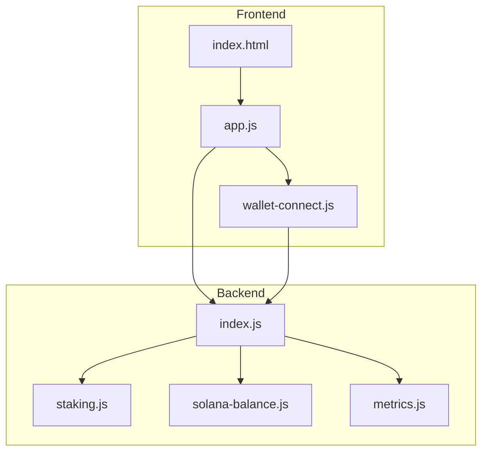
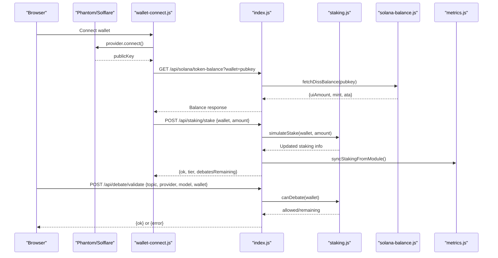
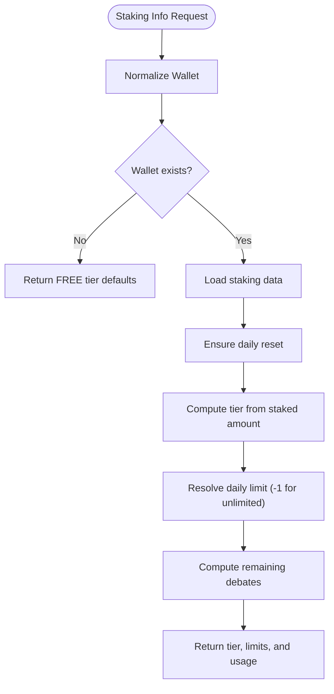
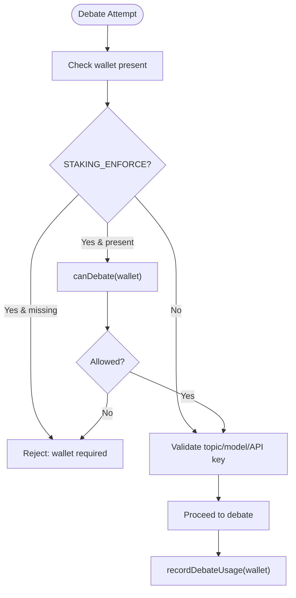
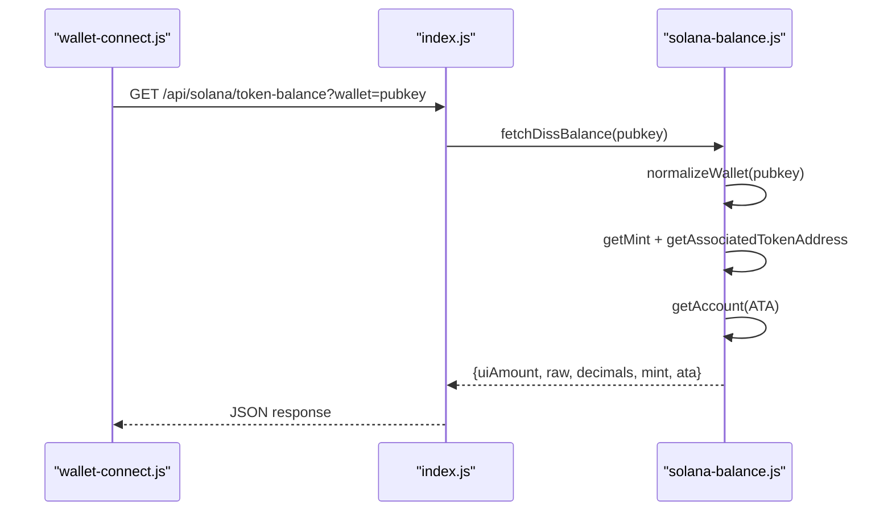
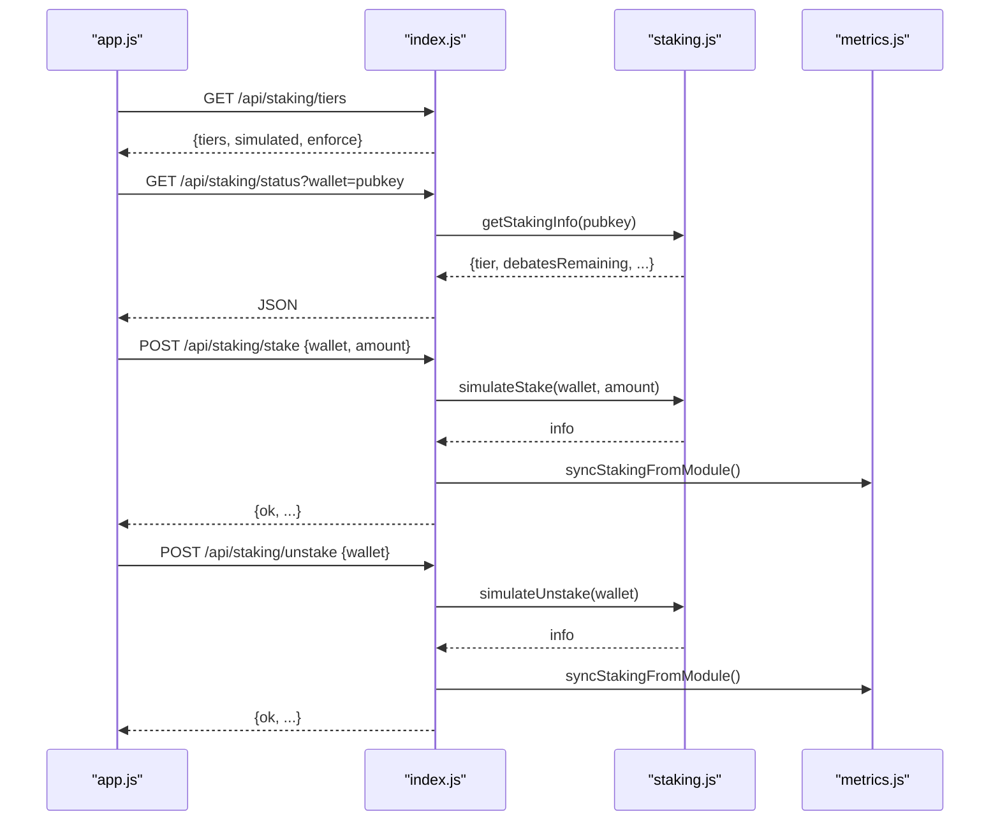
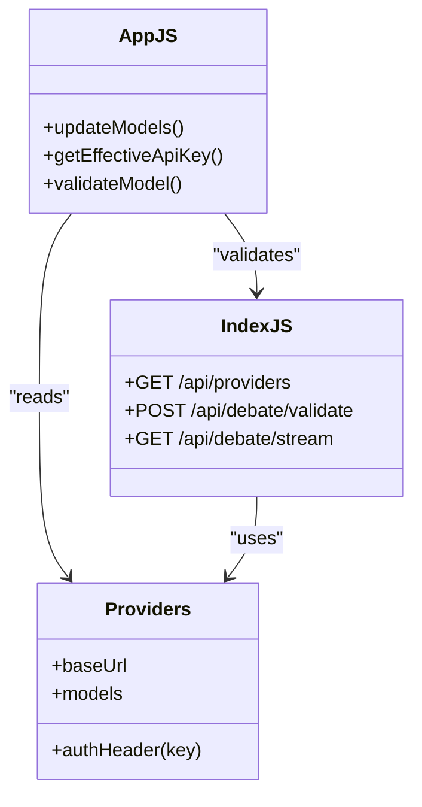
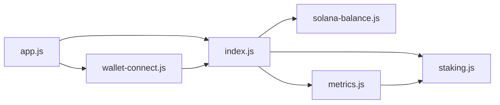

# Staking & Access Control System

<cite>
**Referenced Files in This Document**
- [staking.js](file://dissensus-engine/server/staking.js)
- [solana-balance.js](file://dissensus-engine/server/solana-balance.js)
- [index.js](file://dissensus-engine/server/index.js)
- [wallet-connect.js](file://dissensus-engine/public/js/wallet-connect.js)
- [app.js](file://dissensus-engine/public/js/app.js)
- [index.html](file://dissensus-engine/public/index.html)
- [metrics.js](file://dissensus-engine/server/metrics.js)
- [README.md](file://dissensus-engine/README.md)
</cite>

## Table of Contents
1. [Introduction](#introduction)
2. [Project Structure](#project-structure)
3. [Core Components](#core-components)
4. [Architecture Overview](#architecture-overview)
5. [Detailed Component Analysis](#detailed-component-analysis)
6. [Dependency Analysis](#dependency-analysis)
7. [Performance Considerations](#performance-considerations)
8. [Troubleshooting Guide](#troubleshooting-guide)
9. [Conclusion](#conclusion)
10. [Appendices](#appendices)

## Introduction
This document explains the staking and access control system powering the Dissensus AI Debate Engine. It covers the tier-based access model (FREE, BRONZE, SILVER, GOLD, WHALE), daily debate limits per tier, and the wallet verification process. It documents the Solana blockchain integration for balance verification, stake management, and token-based access control. It also provides configuration guidance, wallet connection workflows, security considerations, examples of tier upgrades and access restrictions, premium feature activation, simulation modes for development, production deployment considerations, troubleshooting, and the relationship between staking tiers and AI provider selection.

## Project Structure
The staking and access control system spans both backend and frontend modules:
- Backend server exposes endpoints for staking, Solana balance verification, debate validation, and streaming debates.
- Frontend integrates wallet connection via Phantom/Solflare and displays staking status and tier benefits.
- Metrics module aggregates staking data for transparency dashboards.

**Diagram sources**
- [index.js:1-481](file://dissensus-engine/server/index.js#L1-L481)
- [staking.js:1-183](file://dissensus-engine/server/staking.js#L1-L183)
- [solana-balance.js:1-83](file://dissensus-engine/server/solana-balance.js#L1-L83)
- [wallet-connect.js:1-176](file://dissensus-engine/public/js/wallet-connect.js#L1-L176)
- [app.js:1-674](file://dissensus-engine/public/js/app.js#L1-L674)
- [index.html:1-217](file://dissensus-engine/public/index.html#L1-L217)
- [metrics.js:1-152](file://dissensus-engine/server/metrics.js#L1-L152)

**Section sources**
- [index.js:1-481](file://dissensus-engine/server/index.js#L1-L481)
- [README.md:103-108](file://dissensus-engine/README.md#L103-L108)

## Core Components
- Tier thresholds and daily debate limits define access levels and feature sets.
- Staking module simulates stake/unstake and enforces daily debate quotas.
- Solana integration verifies wallet balances server-side using SPL token accounts.
- Frontend wallet connector integrates Phantom/Solflare and synchronizes staking inputs.
- Metrics module aggregates staking statistics for dashboards.

**Section sources**
- [staking.js:12-19](file://dissensus-engine/server/staking.js#L12-L19)
- [index.js:29-30](file://dissensus-engine/server/index.js#L29-L30)
- [solana-balance.js:14-20](file://dissensus-engine/server/solana-balance.js#L14-L20)
- [wallet-connect.js:17-23](file://dissensus-engine/public/js/wallet-connect.js#L17-L23)
- [metrics.js:8-9](file://dissensus-engine/server/metrics.js#L8-L9)

## Architecture Overview
The system enforces wallet-required debates and daily limits when configured. The frontend connects a wallet, displays balance, and triggers staking actions. The backend validates debate requests against staking tiers and records usage.

**Diagram sources**
- [wallet-connect.js:95-116](file://dissensus-engine/public/js/wallet-connect.js#L95-L116)
- [index.js:98-111](file://dissensus-engine/server/index.js#L98-L111)
- [solana-balance.js:26-76](file://dissensus-engine/server/solana-balance.js#L26-L76)
- [index.js:336-355](file://dissensus-engine/server/index.js#L336-L355)
- [staking.js:81-96](file://dissensus-engine/server/staking.js#L81-L96)
- [metrics.js:91-98](file://dissensus-engine/server/metrics.js#L91-L98)

## Detailed Component Analysis

### Tier-Based Access Model
- Tiers: FREE, BRONZE, SILVER, GOLD, WHALE.
- Thresholds and daily debate limits:
  - FREE: 1 debate/day.
  - BRONZE: 5 debates/day.
  - SILVER: 20 debates/day.
  - GOLD: unlimited debates.
  - WHALE: unlimited debates.
- Features per tier include basic debates, history, custom topics, premium models, and API access.

**Diagram sources**
- [staking.js:43-79](file://dissensus-engine/server/staking.js#L43-L79)

**Section sources**
- [staking.js:12-19](file://dissensus-engine/server/staking.js#L12-L19)
- [staking.js:35-41](file://dissensus-engine/server/staking.js#L35-L41)
- [staking.js:65-78](file://dissensus-engine/server/staking.js#L65-L78)

### Daily Debate Limits and Usage Tracking
- Daily reset occurs at UTC midnight; debatesUsedToday resets per day.
- canDebate returns allowed status and remaining count; unlimited tiers return “unlimited”.
- recordDebateUsage increments usage after a successful debate.

**Diagram sources**
- [index.js:177-215](file://dissensus-engine/server/index.js#L177-L215)
- [index.js:220-311](file://dissensus-engine/server/index.js#L220-L311)
- [staking.js:110-125](file://dissensus-engine/server/staking.js#L110-L125)
- [staking.js:127-136](file://dissensus-engine/server/staking.js#L127-L136)

**Section sources**
- [index.js:177-215](file://dissensus-engine/server/index.js#L177-L215)
- [index.js:220-311](file://dissensus-engine/server/index.js#L220-L311)
- [staking.js:25-33](file://dissensus-engine/server/staking.js#L25-L33)
- [staking.js:110-125](file://dissensus-engine/server/staking.js#L110-L125)
- [staking.js:127-136](file://dissensus-engine/server/staking.js#L127-L136)

### Wallet Verification and Balance Retrieval
- Frontend wallet connector detects Phantom or Solflare, connects, and fetches balance via server endpoint.
- Server-side balance retrieval uses SPL token program to fetch associated token account balance for the configured mint.

**Diagram sources**
- [wallet-connect.js:63-80](file://dissensus-engine/public/js/wallet-connect.js#L63-L80)
- [index.js:98-111](file://dissensus-engine/server/index.js#L98-L111)
- [solana-balance.js:26-76](file://dissensus-engine/server/solana-balance.js#L26-L76)

**Section sources**
- [wallet-connect.js:17-23](file://dissensus-engine/public/js/wallet-connect.js#L17-L23)
- [wallet-connect.js:63-80](file://dissensus-engine/public/js/wallet-connect.js#L63-L80)
- [solana-balance.js:14-20](file://dissensus-engine/server/solana-balance.js#L14-L20)
- [solana-balance.js:26-76](file://dissensus-engine/server/solana-balance.js#L26-L76)

### Staking Endpoints and Simulation Mode
- Endpoints:
  - GET /api/staking/tiers — lists tiers and enforcement flag.
  - GET /api/staking/status — returns tier, staked amount, and daily usage.
  - POST /api/staking/stake — sets simulated stake.
  - POST /api/staking/unstake — clears simulated stake.
- Simulation mode stores in-memory data keyed by wallet address; daily counters reset automatically.

**Diagram sources**
- [index.js:324-355](file://dissensus-engine/server/index.js#L324-L355)
- [staking.js:43-79](file://dissensus-engine/server/staking.js#L43-L79)
- [staking.js:81-108](file://dissensus-engine/server/staking.js#L81-L108)
- [metrics.js:91-98](file://dissensus-engine/server/metrics.js#L91-L98)

**Section sources**
- [index.js:324-355](file://dissensus-engine/server/index.js#L324-L355)
- [staking.js:81-108](file://dissensus-engine/server/staking.js#L81-L108)
- [metrics.js:91-98](file://dissensus-engine/server/metrics.js#L91-L98)

### Relationship Between Staking Tiers and AI Provider Selection
- Providers and models are configured server-side; users select provider and model in the UI.
- When server-side keys are configured, users can optionally override with their own keys.
- Tier features include premium models and API access; higher tiers unlock additional capabilities.

**Diagram sources**
- [debate-engine.js:14-39](file://dissensus-engine/server/debate-engine.js#L14-L39)
- [app.js:60-101](file://dissensus-engine/public/js/app.js#L60-L101)
- [index.js:138-172](file://dissensus-engine/server/index.js#L138-L172)

**Section sources**
- [index.js:138-172](file://dissensus-engine/server/index.js#L138-L172)
- [app.js:60-101](file://dissensus-engine/public/js/app.js#L60-L101)
- [README.md:22-33](file://dissensus-engine/README.md#L22-L33)

## Dependency Analysis
- index.js depends on staking.js for tier computation and debate gating, solana-balance.js for balance verification, and metrics.js for staking aggregation.
- Frontend app.js depends on wallet-connect.js for wallet operations and communicates with index.js endpoints.
- metrics.js depends on staking.js for aggregate metrics.

**Diagram sources**
- [index.js:14-24](file://dissensus-engine/server/index.js#L14-L24)
- [metrics.js:8-8](file://dissensus-engine/server/metrics.js#L8-L8)
- [app.js:1-14](file://dissensus-engine/public/js/app.js#L1-L14)
- [wallet-connect.js:1-11](file://dissensus-engine/public/js/wallet-connect.js#L1-L11)

**Section sources**
- [index.js:14-24](file://dissensus-engine/server/index.js#L14-L24)
- [metrics.js:8-8](file://dissensus-engine/server/metrics.js#L8-L8)

## Performance Considerations
- Rate limiting is applied to staking, balance, and debate endpoints to prevent abuse.
- SSE streaming for debates is efficient but should be monitored for client disconnections.
- In-memory staking data is suitable for demos; for production, consider persistence and sharding.
- Solana RPC calls are read-only and cached minimally; ensure reliable RPC endpoints for production.

[No sources needed since this section provides general guidance]

## Troubleshooting Guide
Common issues and resolutions:
- Invalid wallet address:
  - Ensure the wallet is a valid Solana public key; the system normalizes input and rejects invalid keys.
- Balance retrieval errors:
  - Verify SOLANA_RPC_URL and DISS_TOKEN_MINT environment variables; ensure the mint is correct and the ATA exists.
- Staking endpoints failing:
  - Confirm STAKING_ENFORCE setting and that the wallet parameter is present when enforced.
- Daily debate limit reached:
  - Stake more tokens to upgrade tiers; verify tier status via staking status endpoint.
- Metrics not updating:
  - Ensure debates are recorded and syncStakingFromModule is invoked after debates.

**Section sources**
- [solana-balance.js:27-44](file://dissensus-engine/server/solana-balance.js#L27-L44)
- [index.js:98-111](file://dissensus-engine/server/index.js#L98-L111)
- [index.js:336-355](file://dissensus-engine/server/index.js#L336-L355)
- [staking.js:110-125](file://dissensus-engine/server/staking.js#L110-L125)
- [metrics.js:91-98](file://dissensus-engine/server/metrics.js#L91-L98)

## Conclusion
The staking and access control system provides a robust, extensible framework for token-based access control. The current implementation is designed as a simulated demo, enabling tier-based debate limits and premium feature activation. On-chain staking will be integrated in future releases via a dedicated staking program ID. The Solana integration ensures secure, read-only balance verification, while the frontend offers seamless wallet connectivity. Production deployments should configure environment variables, enforce rate limits, and consider persistence for staking and metrics.

[No sources needed since this section summarizes without analyzing specific files]

## Appendices

### Configuration and Environment Variables
- STAKING_ENFORCE: Enables wallet requirement and daily debate limits.
- SOLANA_RPC_URL: RPC endpoint for balance checks.
- DISS_TOKEN_MINT: SPL mint address for $DISS.
- SOLANA_CLUSTER: Cluster shown in configuration.
- DISS_STAKING_PROGRAM_ID: Future on-chain staking program identifier.
- TRUST_PROXY and TRUST_PROXY_HOPS: Reverse proxy trust configuration.

**Section sources**
- [index.js:29-30](file://dissensus-engine/server/index.js#L29-L30)
- [index.js:76-83](file://dissensus-engine/server/index.js#L76-L83)
- [solana-balance.js:14-20](file://dissensus-engine/server/solana-balance.js#L14-L20)
- [README.md:138-149](file://dissensus-engine/README.md#L138-L149)

### Wallet Connection Workflow
- Detect Phantom or Solflare provider.
- Connect and retrieve public key.
- Fetch balance via server endpoint.
- Save wallet to staking inputs and refresh status.

**Section sources**
- [wallet-connect.js:17-23](file://dissensus-engine/public/js/wallet-connect.js#L17-L23)
- [wallet-connect.js:95-116](file://dissensus-engine/public/js/wallet-connect.js#L95-L116)
- [wallet-connect.js:63-80](file://dissensus-engine/public/js/wallet-connect.js#L63-L80)

### Examples and Scenarios
- Tier upgrades:
  - Stake threshold increases move users from FREE to BRONZE, SILVER, GOLD, or WHALE tiers.
- Access restrictions:
  - When STAKING_ENFORCE is enabled, debates require a valid wallet; otherwise, limits apply only when a wallet is provided.
- Premium feature activation:
  - Higher tiers grant access to premium models and API access.

**Section sources**
- [staking.js:12-19](file://dissensus-engine/server/staking.js#L12-L19)
- [index.js:183-192](file://dissensus-engine/server/index.js#L183-L192)
- [index.js:228-234](file://dissensus-engine/server/index.js#L228-L234)

### Security Considerations
- API keys are handled client-side and never stored server-side.
- Balance checks occur server-side using RPC endpoints to keep credentials private.
- Rate limiting protects endpoints from abuse.
- Consider HTTPS, authentication, and input sanitization for production.

**Section sources**
- [README.md:182-187](file://dissensus-engine/README.md#L182-L187)
- [index.js:57-64](file://dissensus-engine/server/index.js#L57-L64)