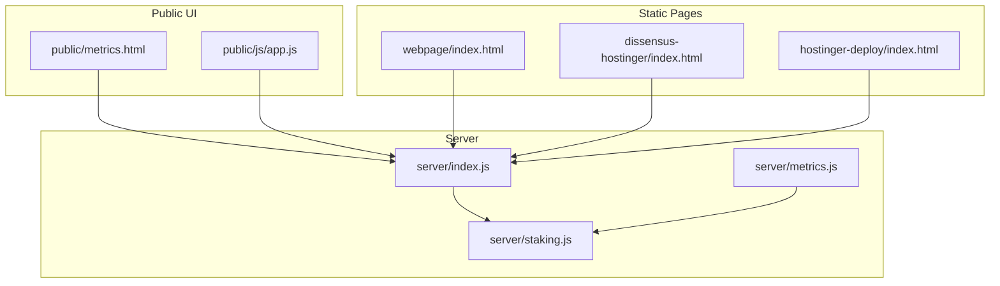
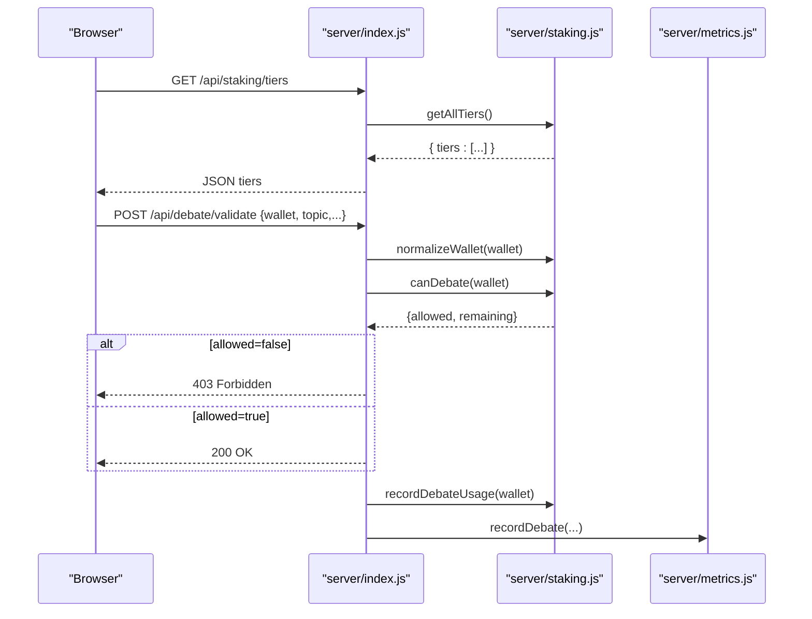
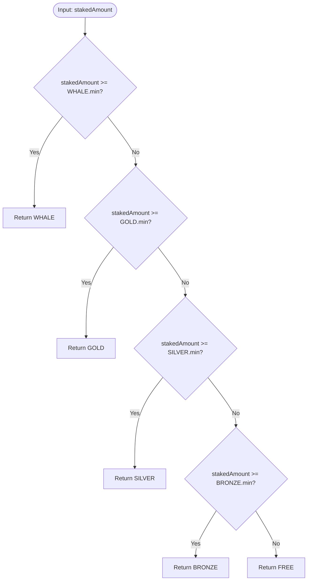
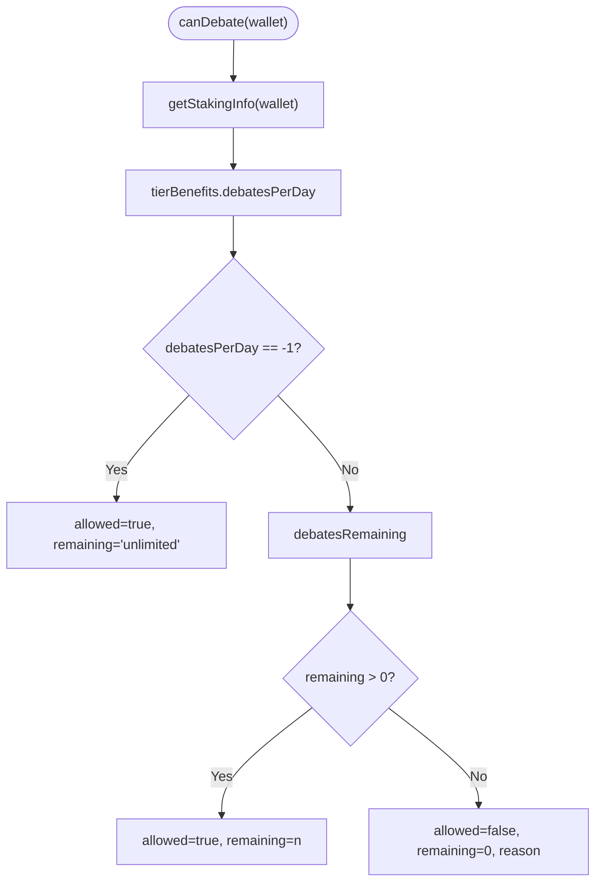
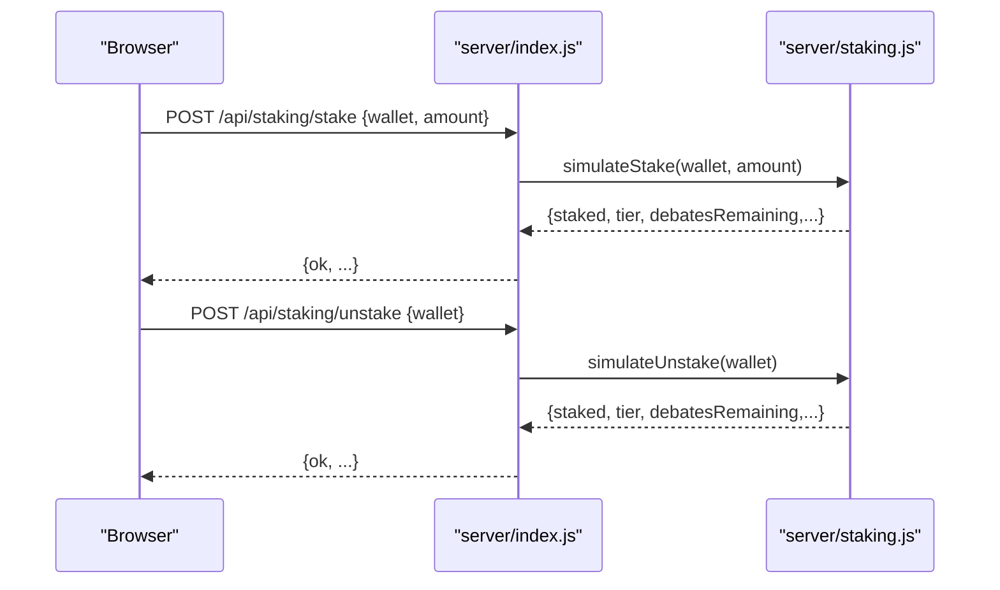
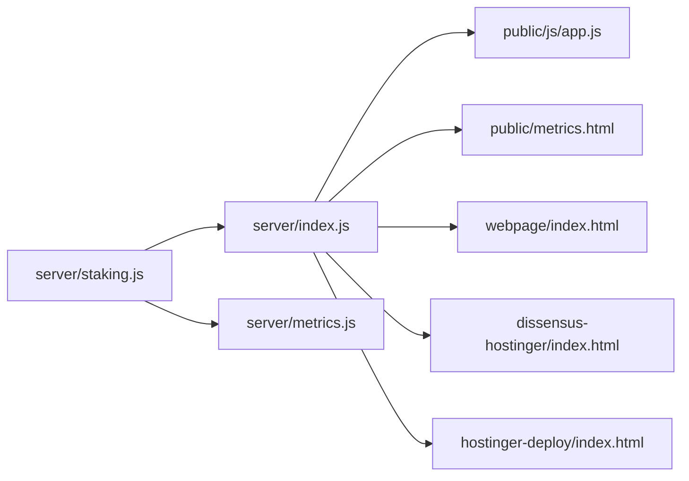

# Tier Management

<cite>
**Referenced Files in This Document**
- [staking.js](file://dissensus-engine/server/staking.js)
- [index.js](file://dissensus-engine/server/index.js)
- [metrics.html](file://dissensus-engine/public/metrics.html)
- [README.md](file://dissensus-engine/README.md)
- [metrics.js](file://dissensus-engine/server/metrics.js)
- [app.js](file://dissensus-engine/public/js/app.js)
- [index.html (webpage)](file://webpage/index.html)
- [index.html (hostinger)](file://dissensus-hostinger/index.html)
- [index.html (deploy)](file://hostinger-deploy/index.html)
</cite>

## Table of Contents
1. [Introduction](#introduction)
2. [Project Structure](#project-structure)
3. [Core Components](#core-components)
4. [Architecture Overview](#architecture-overview)
5. [Detailed Component Analysis](#detailed-component-analysis)
6. [Dependency Analysis](#dependency-analysis)
7. [Performance Considerations](#performance-considerations)
8. [Troubleshooting Guide](#troubleshooting-guide)
9. [Conclusion](#conclusion)

## Introduction
This document explains the tier management system that governs access to debates and platform features. The system defines five tiers (FREE, BRONZE, SILVER, GOLD, WHALE) with increasing minimum stake requirements, daily debate limits, and feature access. Users automatically move up or down tiers based on their staked token amounts. The system includes a simulated staking mechanism for demonstrations and a path toward on-chain enforcement.

## Project Structure
The tier management logic lives primarily in the server’s staking module and is integrated with the main server routes and frontend UI.

**Diagram sources**
- [index.js:1-200](file://dissensus-engine/server/index.js#L1-L200)
- [staking.js:1-183](file://dissensus-engine/server/staking.js#L1-L183)
- [metrics.js:1-64](file://dissensus-engine/server/metrics.js#L1-L64)
- [metrics.html:345-456](file://dissensus-engine/public/metrics.html#L345-L456)
- [app.js:1-359](file://dissensus-engine/public/js/app.js#L1-L359)
- [index.html (webpage):429-491](file://webpage/index.html#L429-L491)
- [index.html (hostinger):429-491](file://dissensus-hostinger/index.html#L429-L491)
- [index.html (deploy):422-484](file://hostinger-deploy/index.html#L422-L484)

**Section sources**
- [index.js:1-200](file://dissensus-engine/server/index.js#L1-L200)
- [README.md:80-120](file://dissensus-engine/README.md#L80-L120)

## Core Components
- Tier thresholds and benefits: defined in the staking module as a constant mapping of tier names to minimum stake, daily debate limit, and feature flags.
- Tier calculation: a deterministic function that selects the highest applicable tier based on the staked amount.
- Daily debate gating: a function that enforces tier-based daily debate limits and records usage.
- API integration: endpoints expose tier definitions, user status, and staking actions.
- UI exposure: static pages and the metrics dashboard present tier tables and distributions.

**Section sources**
- [staking.js:12-19](file://dissensus-engine/server/staking.js#L12-L19)
- [staking.js:35-41](file://dissensus-engine/server/staking.js#L35-L41)
- [staking.js:110-136](file://dissensus-engine/server/staking.js#L110-L136)
- [index.js:324-356](file://dissensus-engine/server/index.js#L324-L356)
- [metrics.html:416-435](file://dissensus-engine/public/metrics.html#L416-L435)
- [index.html (webpage):429-491](file://webpage/index.html#L429-L491)
- [index.html (hostinger):429-491](file://dissensus-hostinger/index.html#L429-L491)
- [index.html (deploy):422-484](file://hostinger-deploy/index.html#L422-L484)

## Architecture Overview
The tier management system is implemented as a server-side module with clear boundaries and integrates with the main server and UI.

**Diagram sources**
- [index.js:177-203](file://dissensus-engine/server/index.js#L177-L203)
- [index.js:324-356](file://dissensus-engine/server/index.js#L324-L356)
- [staking.js:110-136](file://dissensus-engine/server/staking.js#L110-L136)
- [metrics.js:46-64](file://dissensus-engine/server/metrics.js#L46-L64)

## Detailed Component Analysis

### Tier Definitions and Benefits
- FREE: minimum stake 0, 1 debate per day, basic features.
- BRONZE: minimum stake 100,000, 5 debates per day, includes basic features plus debate history.
- SILVER: minimum stake 500,000, 20 debates per day, includes basic features plus debate history and custom topics.
- GOLD: minimum stake 1,000,000, unlimited debates per day, premium models and API access.
- WHALE: minimum stake 10,000,000, unlimited debates per day, full feature access.

Feature flags and daily debate limits are defined centrally and used across the system.

**Section sources**
- [staking.js:12-19](file://dissensus-engine/server/staking.js#L12-L19)
- [index.html (webpage):444-473](file://webpage/index.html#L444-L473)
- [index.html (hostinger):444-473](file://dissensus-hostinger/index.html#L444-L473)
- [index.html (deploy):437-466](file://hostinger-deploy/index.html#L437-L466)

### Tier Calculation Algorithm
The algorithm determines the user’s tier by comparing the staked amount against tier thresholds in descending order. It returns the highest tier that meets or exceeds the threshold.

**Diagram sources**
- [staking.js:35-41](file://dissensus-engine/server/staking.js#L35-L41)

**Section sources**
- [staking.js:35-41](file://dissensus-engine/server/staking.js#L35-L41)

### Daily Debate Limit Enforcement
- When a wallet is provided, the system validates whether the user can debate today based on their tier’s daily limit.
- Unlimited tiers bypass daily counting.
- Usage is tracked per day and resets at midnight UTC.

**Diagram sources**
- [staking.js:110-125](file://dissensus-engine/server/staking.js#L110-L125)

**Section sources**
- [staking.js:110-125](file://dissensus-engine/server/staking.js#L110-L125)
- [index.js:177-203](file://dissensus-engine/server/index.js#L177-L203)

### Feature Permissions Matrix
The feature flags associated with each tier define access to platform capabilities. These flags are exposed via the tiers endpoint and used by the UI to render tier tables.

- FREE: basic_debates
- BRONZE: basic_debates, debate_history
- SILVER: basic_debates, debate_history, custom_topics
- GOLD: basic_debates, debate_history, custom_topics, premium_models, api_access
- WHALE: all

**Section sources**
- [staking.js:12-19](file://dissensus-engine/server/staking.js#L12-L19)
- [metrics.html:424-435](file://dissensus-engine/public/metrics.html#L424-L435)

### Unlimited Debate Access for Gold and Whale
- GOLD and WHALE tiers set the daily debate limit to a special indicator value, signaling unlimited access.
- The debate validation logic treats unlimited tiers as always allowed.

**Section sources**
- [staking.js:12-19](file://dissensus-engine/server/staking.js#L12-L19)
- [staking.js:110-125](file://dissensus-engine/server/staking.js#L110-L125)

### Tier Thresholds and Token Amounts
- Thresholds are expressed in $DISS token units.
- The UI presents these thresholds as simulated values for demonstration; production will use on-chain stake balances.

**Section sources**
- [staking.js:12-19](file://dissensus-engine/server/staking.js#L12-L19)
- [index.html (webpage):429-491](file://webpage/index.html#L429-L491)
- [index.html (hostinger):429-491](file://dissensus-hostinger/index.html#L429-L491)
- [index.html (deploy):422-484](file://hostinger-deploy/index.html#L422-L484)

### Stake Calculations and Automatic Upgrades/Downgrades
- The system simulates stake changes via dedicated endpoints.
- Upgrades occur when a user stakes more than the next tier’s minimum.
- Downgrades occur when a user unstakes below a tier’s minimum or when the simulated amount decreases.

**Diagram sources**
- [index.js:336-356](file://dissensus-engine/server/index.js#L336-L356)
- [staking.js:81-108](file://dissensus-engine/server/staking.js#L81-L108)

**Section sources**
- [index.js:336-356](file://dissensus-engine/server/index.js#L336-L356)
- [staking.js:81-108](file://dissensus-engine/server/staking.js#L81-L108)

### Tier Benefit Enumeration and UI Presentation
- The tiers endpoint returns the complete tier list with min stake, debates per day, and features.
- The metrics dashboard renders a table of tiers and displays distribution across instances.

**Section sources**
- [index.js:324-326](file://dissensus-engine/server/index.js#L324-L326)
- [metrics.html:416-435](file://dissensus-engine/public/metrics.html#L416-L435)

### Relationship Between Token Amounts and Access Privileges
- Access privileges scale with token holdings:
  - Minimum stake thresholds unlock higher tiers.
  - Higher tiers grant more debates per day and richer feature sets.
  - Unlimited tiers remove daily debate caps.

**Section sources**
- [staking.js:12-19](file://dissensus-engine/server/staking.js#L12-L19)
- [staking.js:35-41](file://dissensus-engine/server/staking.js#L35-L41)
- [index.js:177-203](file://dissensus-engine/server/index.js#L177-L203)

## Dependency Analysis
The tier management module is consumed by the main server and metrics systems. The frontend consumes the tiers endpoint and uses the enforcement flag to adjust behavior.

**Diagram sources**
- [index.js:14-23](file://dissensus-engine/server/index.js#L14-L23)
- [metrics.js:8-44](file://dissensus-engine/server/metrics.js#L8-L44)
- [app.js:1-359](file://dissensus-engine/public/js/app.js#L1-L359)
- [metrics.html:345-456](file://dissensus-engine/public/metrics.html#L345-L456)
- [index.html (webpage):429-491](file://webpage/index.html#L429-L491)
- [index.html (hostinger):429-491](file://dissensus-hostinger/index.html#L429-L491)
- [index.html (deploy):422-484](file://hostinger-deploy/index.html#L422-L484)

**Section sources**
- [index.js:14-23](file://dissensus-engine/server/index.js#L14-L23)
- [metrics.js:8-44](file://dissensus-engine/server/metrics.js#L8-L44)

## Performance Considerations
- Tier evaluation is O(1) with a small fixed number of comparisons.
- Daily reset logic ensures minimal overhead by checking date boundaries once per access.
- The simulated staking data structure is lightweight and suitable for in-memory operation.

[No sources needed since this section provides general guidance]

## Troubleshooting Guide
- Wallet enforcement: When enabled, debates require a valid wallet address; otherwise, validation fails early.
- Daily limit reached: If a user exceeds their tier’s daily debate allowance, the system denies further debates for the day.
- Unlimited tiers: Users in unlimited tiers can debate without restriction.
- On-chain migration: The system documents how to enable on-chain verification and integrate a staking program.

**Section sources**
- [index.js:29-30](file://dissensus-engine/server/index.js#L29-L30)
- [index.js:183-192](file://dissensus-engine/server/index.js#L183-L192)
- [README.md:89-108](file://dissensus-engine/README.md#L89-L108)

## Conclusion
The tier management system provides a clear, scalable framework for access control based on token holdings. It offers a smooth progression from FREE to WHALE, with increasing debate limits and feature access. The current implementation is simulated for demonstration, with documented pathways to on-chain enforcement and integration.