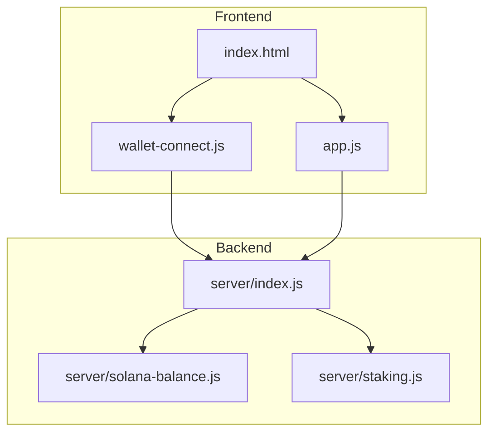
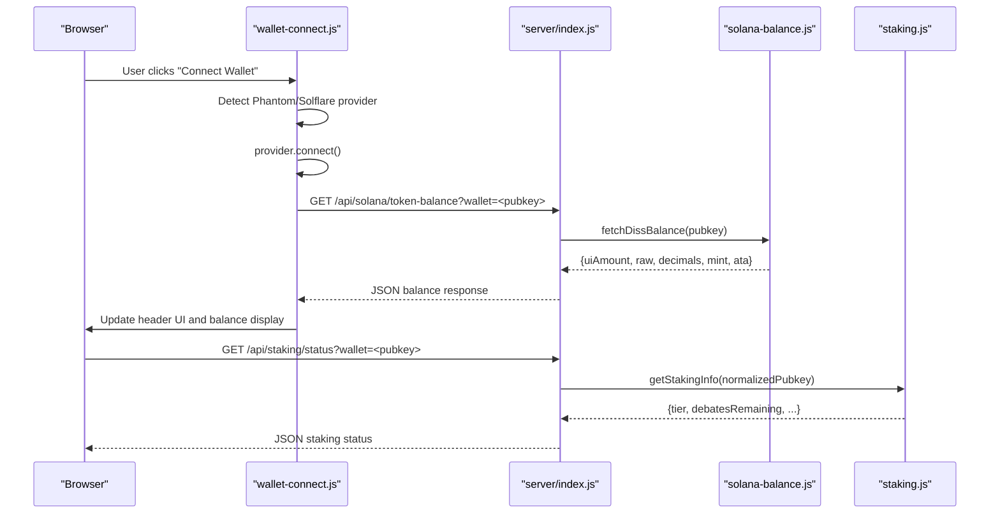
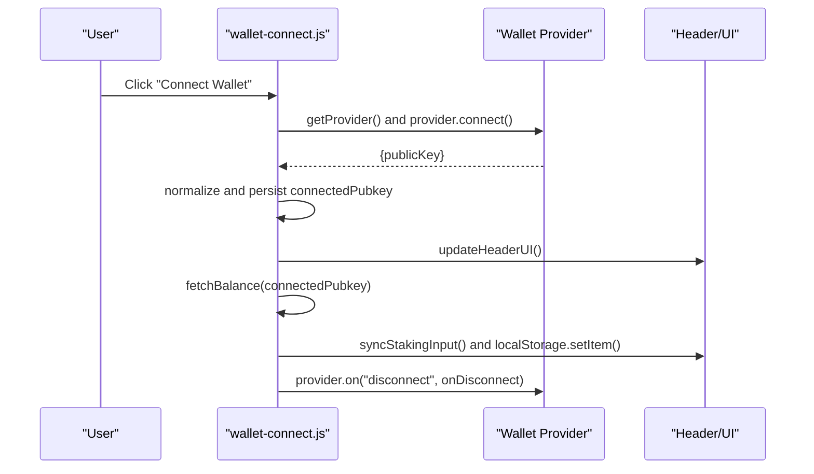
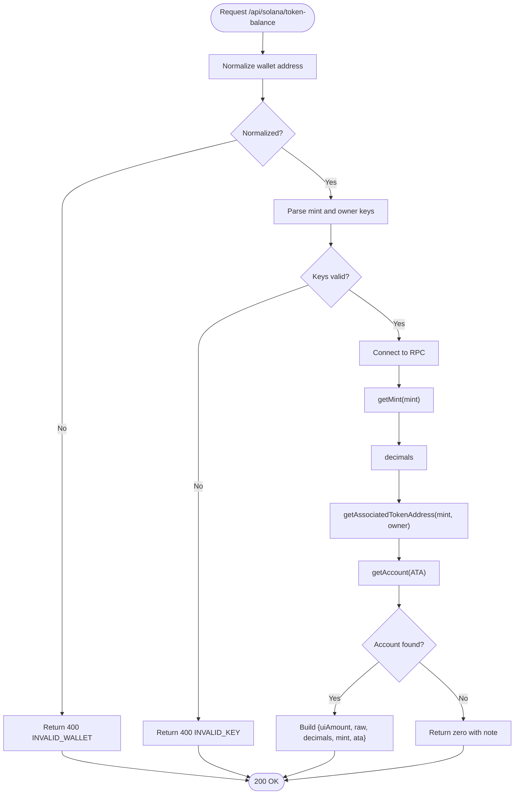
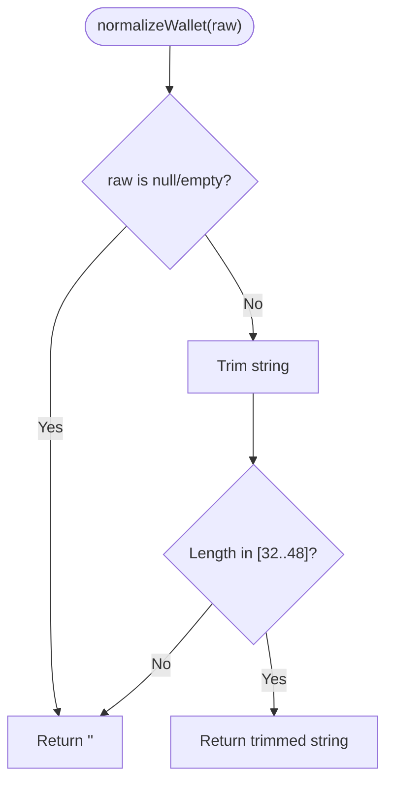
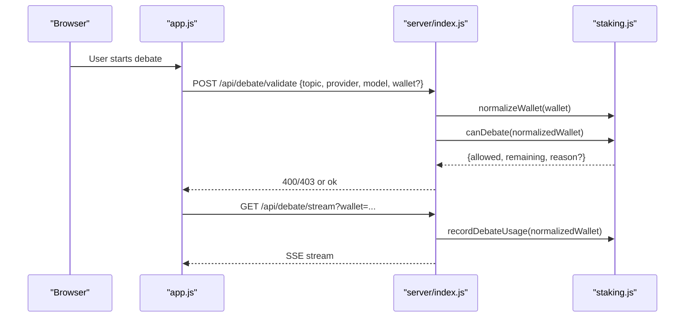
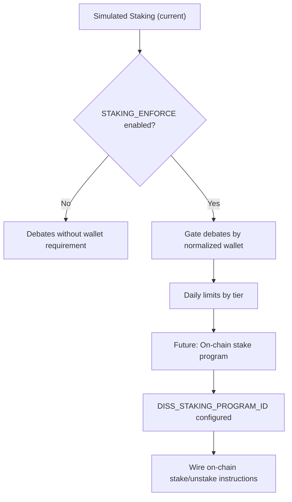
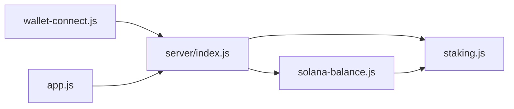

# Wallet Integration

<cite>
**Referenced Files in This Document**
- [wallet-connect.js](file://dissensus-engine/public/js/wallet-connect.js)
- [solana-balance.js](file://dissensus-engine/server/solana-balance.js)
- [staking.js](file://dissensus-engine/server/staking.js)
- [index.js](file://dissensus-engine/server/index.js)
- [app.js](file://dissensus-engine/public/js/app.js)
- [index.html](file://dissensus-engine/public/index.html)
- [README.md](file://dissensus-engine/README.md)
- [package.json](file://dissensus-engine/package.json)
</cite>

## Table of Contents
1. [Introduction](#introduction)
2. [Project Structure](#project-structure)
3. [Core Components](#core-components)
4. [Architecture Overview](#architecture-overview)
5. [Detailed Component Analysis](#detailed-component-analysis)
6. [Dependency Analysis](#dependency-analysis)
7. [Performance Considerations](#performance-considerations)
8. [Troubleshooting Guide](#troubleshooting-guide)
9. [Conclusion](#conclusion)
10. [Appendices](#appendices)

## Introduction
This document explains the wallet integration system for connecting Solana wallets, validating addresses, normalizing inputs, verifying balances, and integrating with the staking system. It covers both the development simulation and the production-ready on-chain verification path, including security considerations and the transition from simulated staking to blockchain integration.

## Project Structure
The wallet integration spans the frontend and backend:
- Frontend wallet connector handles provider detection, connection, UI updates, and balance polling.
- Backend exposes APIs for Solana balance verification and simulated staking, with rate limiting and enforcement controls.
- The staking module provides address normalization, tier logic, and daily debate gating.

**Diagram sources**
- [wallet-connect.js:1-176](file://dissensus-engine/public/js/wallet-connect.js#L1-L176)
- [index.js:1-481](file://dissensus-engine/server/index.js#L1-L481)
- [solana-balance.js:1-83](file://dissensus-engine/server/solana-balance.js#L1-L83)
- [staking.js:1-183](file://dissensus-engine/server/staking.js#L1-L183)
- [index.html:1-187](file://dissensus-engine/public/index.html#L1-L187)

**Section sources**
- [README.md:103-109](file://dissensus-engine/README.md#L103-L109)
- [package.json:1-28](file://dissensus-engine/package.json#L1-L28)

## Core Components
- Wallet connector: Detects Phantom/Solflare, connects, persists the public key, and updates UI.
- Balance verification: Server-side SPL token balance lookup using Solana web3 and spl-token libraries.
- Address normalization: Trims and validates wallet addresses for length and format.
- Staking system: Simulated tiers and daily debate limits; integrates with wallet enforcement.
- API endpoints: Solana balance, staking status/stake/unstake, debate validation/streaming, and configuration.

**Section sources**
- [wallet-connect.js:17-122](file://dissensus-engine/public/js/wallet-connect.js#L17-L122)
- [solana-balance.js:22-76](file://dissensus-engine/server/solana-balance.js#L22-L76)
- [staking.js:147-154](file://dissensus-engine/server/staking.js#L147-L154)
- [index.js:98-122](file://dissensus-engine/server/index.js#L98-L122)
- [index.js:324-355](file://dissensus-engine/server/index.js#L324-L355)

## Architecture Overview
The wallet integration follows a client-initiated connection flow, with server-side verification for balances and staking. The frontend communicates with the backend via REST endpoints, and the backend enforces staking limits when configured.

**Diagram sources**
- [wallet-connect.js:95-116](file://dissensus-engine/public/js/wallet-connect.js#L95-L116)
- [index.js:98-111](file://dissensus-engine/server/index.js#L98-L111)
- [solana-balance.js:26-76](file://dissensus-engine/server/solana-balance.js#L26-L76)
- [index.js:328-334](file://dissensus-engine/server/index.js#L328-L334)
- [staking.js:43-79](file://dissensus-engine/server/staking.js#L43-L79)

## Detailed Component Analysis

### Wallet Connection Flow
- Provider detection: Checks for Phantom or Solflare globals and falls back to prompting installation.
- Auto-connect: On page load, attempts trusted connect and updates UI accordingly.
- Persistence: Saves the connected wallet to local storage and syncs to staking input.
- Disconnect: Calls provider disconnect and resets UI.

**Diagram sources**
- [wallet-connect.js:95-134](file://dissensus-engine/public/js/wallet-connect.js#L95-L134)

**Section sources**
- [wallet-connect.js:17-23](file://dissensus-engine/public/js/wallet-connect.js#L17-L23)
- [wallet-connect.js:140-174](file://dissensus-engine/public/js/wallet-connect.js#L140-L174)

### Balance Verification Workflow
- Endpoint: GET /api/solana/token-balance?wallet=...
- Server-side steps:
  - Normalize wallet address.
  - Validate mint and owner public keys.
  - Connect to RPC and fetch SPL mint info.
  - Compute associated token account (ATA) for the mint and owner.
  - Retrieve ATA balance and convert to UI amount.
  - Handle missing accounts by returning zero with a note.

**Diagram sources**
- [index.js:98-111](file://dissensus-engine/server/index.js#L98-L111)
- [solana-balance.js:26-76](file://dissensus-engine/server/solana-balance.js#L26-L76)

**Section sources**
- [index.js:98-111](file://dissensus-engine/server/index.js#L98-L111)
- [solana-balance.js:22-76](file://dissensus-engine/server/solana-balance.js#L22-L76)

### Address Normalization and Validation
- Trims input and checks length bounds typical for Solana base58 addresses.
- Returns empty string for invalid inputs, ensuring downstream validation fails safely.

**Diagram sources**
- [staking.js:147-154](file://dissensus-engine/server/staking.js#L147-L154)

**Section sources**
- [staking.js:147-154](file://dissensus-engine/server/staking.js#L147-L154)

### Staking Integration and Daily Limits
- Simulated staking maintains per-wallet state with tier thresholds and daily debate counters.
- Enforced mode: When STAKING_ENFORCE is enabled, debates require a valid wallet and respect daily limits.
- Frontend integration: Wallet address is synchronized to the staking panel and used for preflight validation.

**Diagram sources**
- [index.js:177-215](file://dissensus-engine/server/index.js#L177-L215)
- [index.js:220-311](file://dissensus-engine/server/index.js#L220-L311)
- [app.js:209-356](file://dissensus-engine/public/js/app.js#L209-L356)
- [staking.js:110-125](file://dissensus-engine/server/staking.js#L110-L125)

**Section sources**
- [index.js:31-311](file://dissensus-engine/server/index.js#L31-L311)
- [app.js:228-236](file://dissensus-engine/public/js/app.js#L228-L236)
- [app.js:492-515](file://dissensus-engine/public/js/app.js#L492-L515)

### Transition from Simulation to Production Blockchain
- Current state: Simulated staking and daily limits in memory.
- Future state: On-chain stake/unstake via a deployed Solana program. The server exposes a placeholder endpoint indicating program readiness and future wiring.
- Environment configuration: DISS_STAKING_PROGRAM_ID signals on-chain staking availability.

**Diagram sources**
- [index.js:113-122](file://dissensus-engine/server/index.js#L113-L122)
- [README.md:78-89](file://dissensus-engine/README.md#L78-L89)

**Section sources**
- [index.js:113-122](file://dissensus-engine/server/index.js#L113-L122)
- [README.md:78-89](file://dissensus-engine/README.md#L78-L89)

## Dependency Analysis
- Frontend depends on wallet provider globals and local storage for persistence.
- Backend depends on Solana web3 and spl-token for on-chain operations.
- Both layers rely on shared normalization logic to ensure consistent wallet handling.

**Diagram sources**
- [wallet-connect.js:1-176](file://dissensus-engine/public/js/wallet-connect.js#L1-L176)
- [index.js:1-481](file://dissensus-engine/server/index.js#L1-L481)
- [solana-balance.js:1-83](file://dissensus-engine/server/solana-balance.js#L1-L83)
- [staking.js:1-183](file://dissensus-engine/server/staking.js#L1-L183)
- [app.js:1-674](file://dissensus-engine/public/js/app.js#L1-L674)

**Section sources**
- [package.json:10-19](file://dissensus-engine/package.json#L10-L19)

## Performance Considerations
- Rate limiting: Separate limits for debate, balance, and staking endpoints to prevent abuse.
- RPC efficiency: Server-side balance checks avoid exposing private RPC credentials to clients.
- Client caching: Local storage persists wallet address to reduce repeated prompts.
- SSE streaming: Debates use streaming to minimize latency and improve UX.

[No sources needed since this section provides general guidance]

## Troubleshooting Guide
Common issues and resolutions:
- Wallet provider not detected: Prompt users to install Phantom or Solflare and refresh the page.
- Balance fetch failures: Verify SOLANA_RPC_URL and DISS_TOKEN_MINT environment variables; check network connectivity.
- Invalid wallet address: Ensure the address is a valid Solana base58 string within expected length bounds.
- Staking enforcement errors: When STAKING_ENFORCE is enabled, provide a valid wallet address to start debates.
- On-chain staking not live: Confirm DISS_STAKING_PROGRAM_ID is set and review the placeholder endpoint for wiring status.

**Section sources**
- [wallet-connect.js:97-101](file://dissensus-engine/public/js/wallet-connect.js#L97-L101)
- [index.js:98-111](file://dissensus-engine/server/index.js#L98-L111)
- [solana-balance.js:26-44](file://dissensus-engine/server/solana-balance.js#L26-L44)
- [index.js:184-192](file://dissensus-engine/server/index.js#L184-L192)
- [index.js:113-122](file://dissensus-engine/server/index.js#L113-L122)

## Conclusion
The wallet integration provides a robust bridge between user wallets and the debate system. It validates and normalizes addresses, verifies balances server-side, and enforces staking-based usage limits. The design cleanly separates simulation from on-chain verification, enabling a smooth migration path to production blockchain integration.

[No sources needed since this section summarizes without analyzing specific files]

## Appendices

### API Definitions
- GET /api/solana/token-balance
  - Query: wallet (required)
  - Response: { ok, uiAmount, raw, decimals, mint, ata, note? }
  - Errors: 400 INVALID_WALLET or INVALID_KEY; 500 on internal errors

- GET /api/staking/status
  - Query: wallet (required)
  - Response: { tier, debatesRemaining, debatesUsedToday, staked, stakedAt, wallet }

- POST /api/staking/stake
  - Body: { wallet, amount }
  - Response: { ok, tier, debatesRemaining, ... }

- POST /api/staking/unstake
  - Body: { wallet }
  - Response: { ok, tier, debatesRemaining, ... }

- GET /api/debate/validate
  - Body: { topic, apiKey?, provider, model, wallet? }
  - Response: { ok } or error (400/403)

- GET /api/config
  - Response: { serverKeys, stakingEnforce, stakingSimulated, solana: { cluster, dissTokenMint, balanceCheckUrl } }

**Section sources**
- [index.js:98-111](file://dissensus-engine/server/index.js#L98-L111)
- [index.js:324-355](file://dissensus-engine/server/index.js#L324-L355)
- [index.js:177-215](file://dissensus-engine/server/index.js#L177-L215)
- [index.js:69-85](file://dissensus-engine/server/index.js#L69-L85)

### Security and Privacy Notes
- API keys are handled client-side and sent directly to providers; server stores none.
- RPC credentials are kept server-side via SOLANA_RPC_URL.
- Wallet addresses are normalized and validated before use.
- Rate limiting protects against abuse.

**Section sources**
- [README.md:182-187](file://dissensus-engine/README.md#L182-L187)
- [index.js:58-64](file://dissensus-engine/server/index.js#L58-L64)