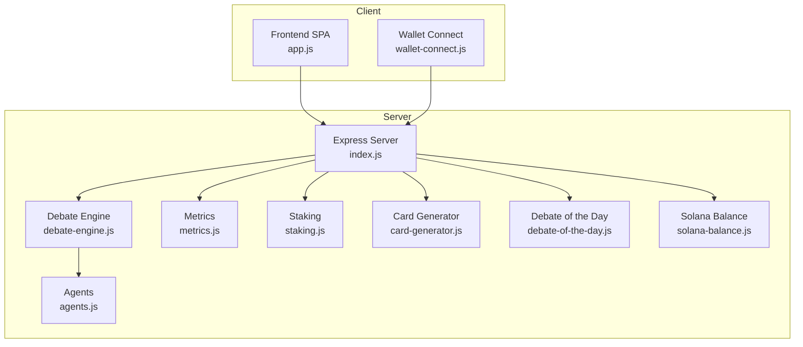
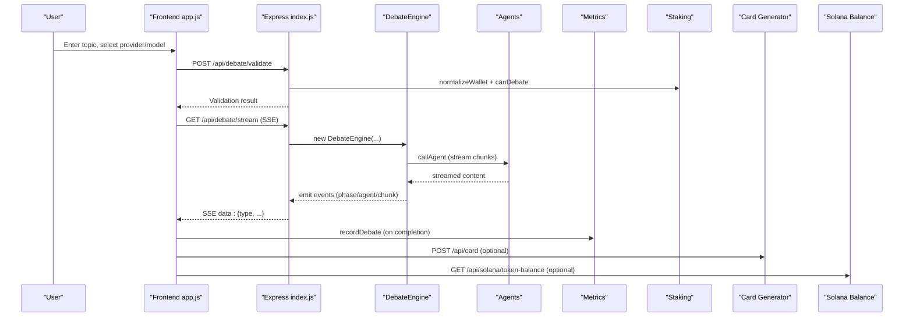
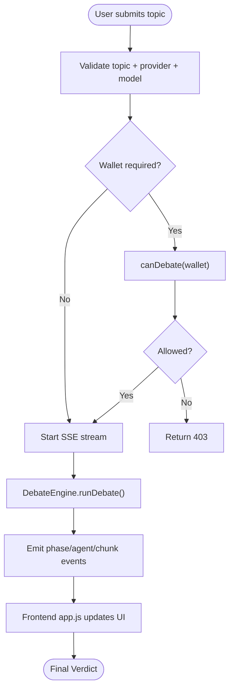
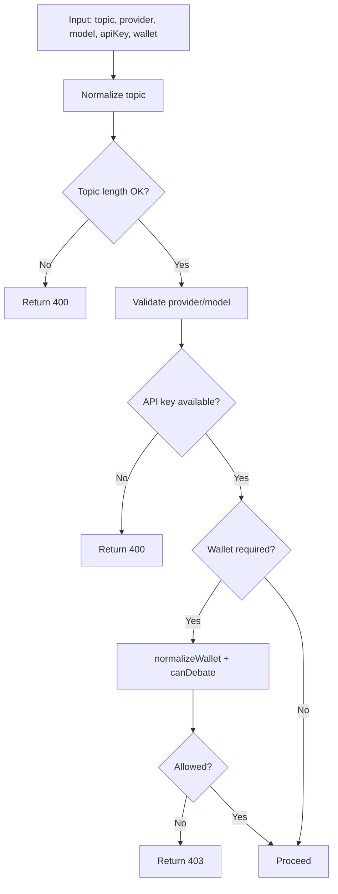
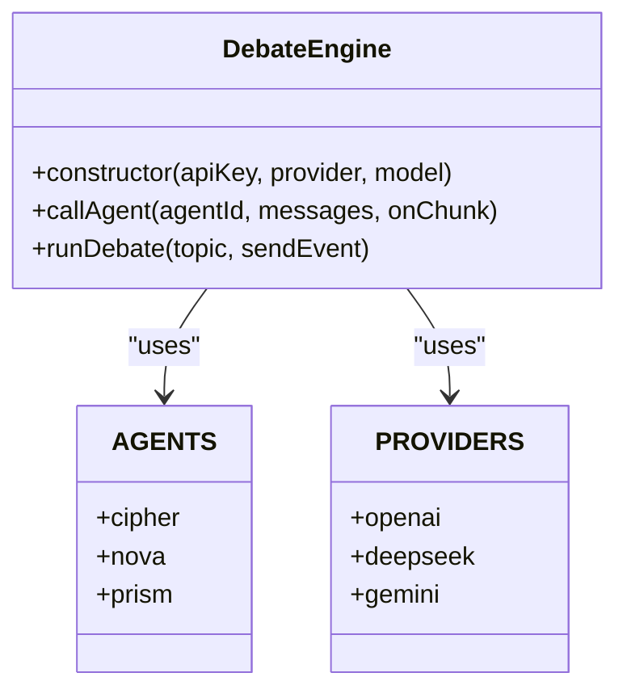
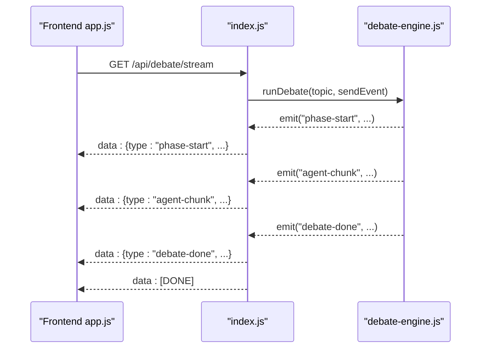
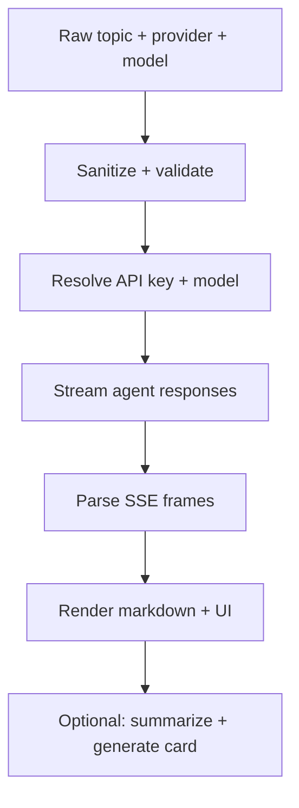
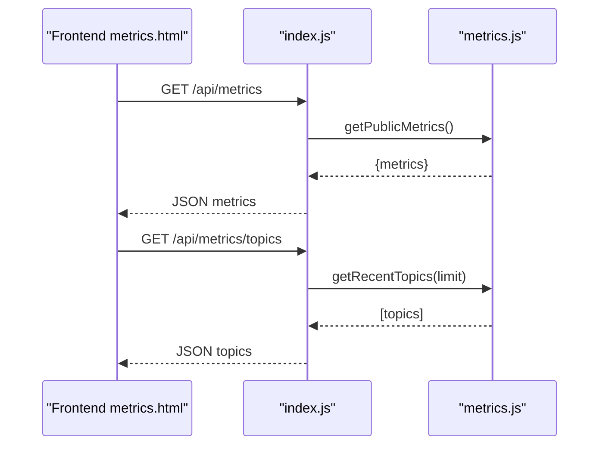
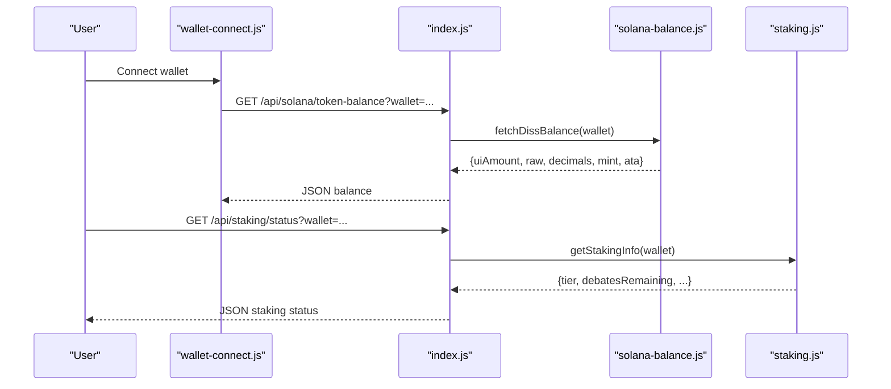
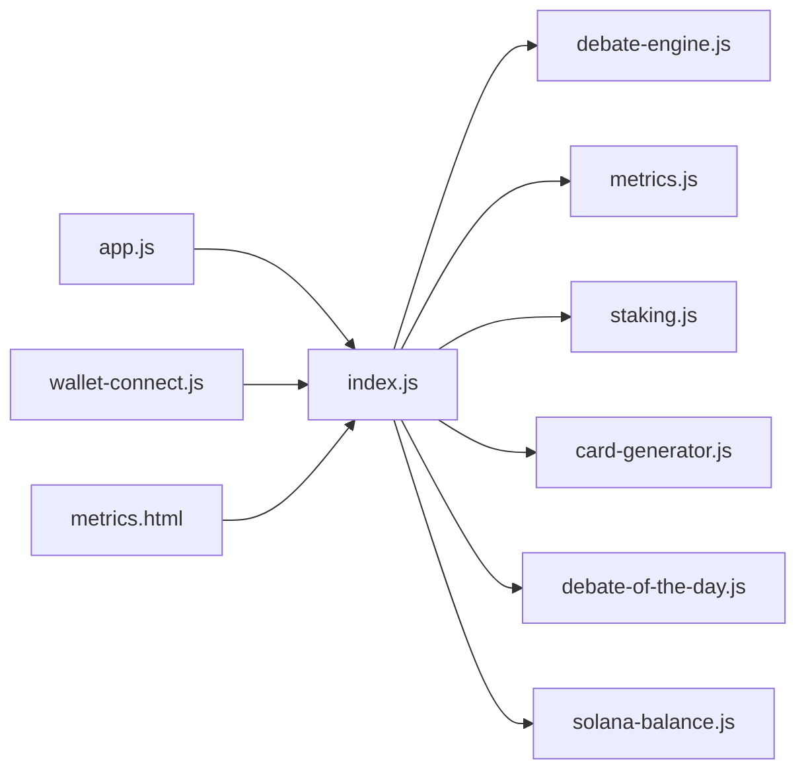

# Data Flow Architecture

<cite>
**Referenced Files in This Document**
- [index.js](file://dissensus-engine/server/index.js)
- [debate-engine.js](file://dissensus-engine/server/debate-engine.js)
- [agents.js](file://dissensus-engine/server/agents.js)
- [metrics.js](file://dissensus-engine/server/metrics.js)
- [staking.js](file://dissensus-engine/server/staking.js)
- [card-generator.js](file://dissensus-engine/server/card-generator.js)
- [debate-of-the-day.js](file://dissensus-engine/server/debate-of-the-day.js)
- [solana-balance.js](file://dissensus-engine/server/solana-balance.js)
- [app.js](file://dissensus-engine/public/js/app.js)
- [wallet-connect.js](file://dissensus-engine/public/js/wallet-connect.js)
- [metrics.html](file://dissensus-engine/public/metrics.html)
- [package.json](file://dissensus-engine/package.json)
</cite>

## Table of Contents
1. [Introduction](#introduction)
2. [Project Structure](#project-structure)
3. [Core Components](#core-components)
4. [Architecture Overview](#architecture-overview)
5. [Detailed Component Analysis](#detailed-component-analysis)
6. [Dependency Analysis](#dependency-analysis)
7. [Performance Considerations](#performance-considerations)
8. [Troubleshooting Guide](#troubleshooting-guide)
9. [Conclusion](#conclusion)
10. [Appendices](#appendices)

## Introduction
This document describes the Dissensus data flow architecture from user input through AI processing to final output delivery. It explains how debate topics traverse the validation layer, AI provider integration, real-time streaming via Server-Sent Events (SSE), and final verdict delivery. It also documents the metrics data flow from debate execution through analytics collection to the public dashboard, the blockchain data flow for wallet verification and staking status checks, and the client-side rendering pipeline. Finally, it covers caching mechanisms, validation strategies, error handling flows, and performance optimization techniques.

## Project Structure
The Dissensus engine is implemented as a Node.js/Express server with a frontend SPA that communicates with the server via REST and SSE. The server orchestrates debate execution, integrates with multiple AI providers, manages staking and metrics, and exposes endpoints for card generation and Solana balance verification.

**Diagram sources**
- [index.js:1-481](file://dissensus-engine/server/index.js#L1-L481)
- [debate-engine.js:1-389](file://dissensus-engine/server/debate-engine.js#L1-L389)
- [agents.js:1-148](file://dissensus-engine/server/agents.js#L1-L148)
- [metrics.js:1-152](file://dissensus-engine/server/metrics.js#L1-L152)
- [staking.js:1-183](file://dissensus-engine/server/staking.js#L1-L183)
- [card-generator.js:1-361](file://dissensus-engine/server/card-generator.js#L1-L361)
- [debate-of-the-day.js:1-80](file://dissensus-engine/server/debate-of-the-day.js#L1-L80)
- [solana-balance.js:1-83](file://dissensus-engine/server/solana-balance.js#L1-L83)

**Section sources**
- [package.json:1-28](file://dissensus-engine/package.json#L1-L28)

## Core Components
- Express server with middleware, rate limiting, and SSE streaming.
- Debate engine orchestrating a 4-phase dialectical process with 3 agents.
- Provider configuration and agent personalities.
- Metrics and analytics collection with in-memory storage and public dashboard.
- Staking simulation with tiered limits and daily debate caps.
- Card generator for shareable PNGs with optional LLM summarization.
- Debate-of-the-day feed with caching and fallbacks.
- Solana balance verification via server-side RPC calls.

**Section sources**
- [index.js:1-481](file://dissensus-engine/server/index.js#L1-L481)
- [debate-engine.js:1-389](file://dissensus-engine/server/debate-engine.js#L1-L389)
- [agents.js:1-148](file://dissensus-engine/server/agents.js#L1-L148)
- [metrics.js:1-152](file://dissensus-engine/server/metrics.js#L1-L152)
- [staking.js:1-183](file://dissensus-engine/server/staking.js#L1-L183)
- [card-generator.js:1-361](file://dissensus-engine/server/card-generator.js#L1-L361)
- [debate-of-the-day.js:1-80](file://dissensus-engine/server/debate-of-the-day.js#L1-L80)
- [solana-balance.js:1-83](file://dissensus-engine/server/solana-balance.js#L1-L83)

## Architecture Overview
The system follows a layered architecture:
- Presentation: Client-side SPA renders debate UI and handles SSE events.
- Application: Express routes validate inputs, enforce staking rules, and stream debate results.
- Orchestration: Debate engine coordinates agent prompts and streams chunks.
- Persistence/Analytics: In-memory metrics and recent topics.
- Integrations: Provider APIs, Solana RPC, and optional LLM summarization.

**Diagram sources**
- [app.js:209-356](file://dissensus-engine/public/js/app.js#L209-L356)
- [index.js:177-311](file://dissensus-engine/server/index.js#L177-L311)
- [debate-engine.js:121-386](file://dissensus-engine/server/debate-engine.js#L121-L386)
- [metrics.js:46-73](file://dissensus-engine/server/metrics.js#L46-L73)
- [card-generator.js:382-416](file://dissensus-engine/server/card-generator.js#L382-L416)
- [solana-balance.js:26-76](file://dissensus-engine/server/solana-balance.js#L26-L76)

## Detailed Component Analysis

### Data Journey: User Input to Final Verdict
- Input validation and normalization:
  - Topic length and content checks occur in both preflight and SSE route handlers.
  - Wallet normalization and staking enforcement are performed before debate initiation.
- Provider selection and key resolution:
  - Effective API key is chosen from user-provided key or server-side key.
  - Model validation ensures the selected provider/model combination is supported.
- Debate orchestration:
  - The engine runs 4 phases: Independent Analysis, Opening Arguments, Cross-Examination, and Final Verdict.
  - Agents are invoked in parallel for Phase 1 and sequentially for later phases.
  - Streaming chunks are emitted to the client via SSE.
- Metrics recording:
  - On successful completion, debate counts and recent topics are recorded.
- Client rendering:
  - Frontend app.js parses SSE events and updates the UI in real time.
  - Markdown rendering is sanitized to prevent XSS.

**Diagram sources**
- [index.js:177-311](file://dissensus-engine/server/index.js#L177-L311)
- [debate-engine.js:121-386](file://dissensus-engine/server/debate-engine.js#L121-L386)
- [app.js:359-427](file://dissensus-engine/public/js/app.js#L359-L427)

**Section sources**
- [index.js:177-311](file://dissensus-engine/server/index.js#L177-L311)
- [debate-engine.js:121-386](file://dissensus-engine/server/debate-engine.js#L121-L386)
- [app.js:209-427](file://dissensus-engine/public/js/app.js#L209-L427)

### Validation Layer
- Topic sanitization and length checks:
  - Minimum and maximum length enforced in both preflight and SSE route handlers.
- Provider/model validation:
  - Ensures the provider exists and the model is supported.
- API key resolution:
  - Prefers user-provided key; falls back to server-side key if configured.
- Wallet validation and staking gates:
  - Wallet normalization and daily debate limits enforced when staking is enabled.

**Diagram sources**
- [index.js:177-215](file://dissensus-engine/server/index.js#L177-L215)
- [index.js:220-311](file://dissensus-engine/server/index.js#L220-L311)
- [staking.js:147-125](file://dissensus-engine/server/staking.js#L147-L125)

**Section sources**
- [index.js:177-215](file://dissensus-engine/server/index.js#L177-L215)
- [index.js:220-311](file://dissensus-engine/server/index.js#L220-L311)
- [staking.js:147-125](file://dissensus-engine/server/staking.js#L147-L125)

### AI Provider Integration and Streaming
- Provider configuration:
  - OpenAI, DeepSeek, and Google Gemini are supported with model metadata and auth headers.
- Streaming:
  - Each agent call streams delta chunks; the engine decodes SSE frames and emits content to the client.
- Agent personalities:
  - CIPHER (Skeptic), NOVA (Advocate), PRISM (Synthesizer) define system prompts and roles.

**Diagram sources**
- [debate-engine.js:41-53](file://dissensus-engine/server/debate-engine.js#L41-L53)
- [agents.js:8-147](file://dissensus-engine/server/agents.js#L8-L147)

**Section sources**
- [debate-engine.js:14-39](file://dissensus-engine/server/debate-engine.js#L14-L39)
- [debate-engine.js:58-116](file://dissensus-engine/server/debate-engine.js#L58-L116)
- [agents.js:8-147](file://dissensus-engine/server/agents.js#L8-L147)

### Real-Time Streaming via Server-Sent Events
- SSE endpoint:
  - Sets appropriate headers and writes events with type/data payloads.
  - Emits lifecycle events: debate-start, phase-start/done, agent-start/chunk/done, debate-done.
- Client consumption:
  - Frontend reads the stream, parses JSON, and updates UI blocks per agent and phase.
  - Handles timeouts and errors gracefully.

**Diagram sources**
- [index.js:220-311](file://dissensus-engine/server/index.js#L220-L311)
- [debate-engine.js:130-386](file://dissensus-engine/server/debate-engine.js#L130-L386)
- [app.js:359-427](file://dissensus-engine/public/js/app.js#L359-L427)

**Section sources**
- [index.js:269-311](file://dissensus-engine/server/index.js#L269-L311)
- [debate-engine.js:130-386](file://dissensus-engine/server/debate-engine.js#L130-L386)
- [app.js:359-427](file://dissensus-engine/public/js/app.js#L359-L427)

### Data Transformation Pipeline
- Topic sanitization:
  - Trimmed and validated for length constraints.
- Provider/model selection:
  - Defaults chosen per provider; validated against known models.
- Streaming response formatting:
  - SSE frames parsed and normalized; malformed chunks skipped.
- Client-side rendering:
  - Markdown rendered with HTML escaping; lists and headers supported.
- Card generation:
  - Optional LLM summarization for long verdicts; extraction of list items and summary; SVG/PNG generation.

**Diagram sources**
- [index.js:177-215](file://dissensus-engine/server/index.js#L177-L215)
- [app.js:104-129](file://dissensus-engine/public/js/app.js#L104-L129)
- [card-generator.js:41-85](file://dissensus-engine/server/card-generator.js#L41-L85)

**Section sources**
- [index.js:177-215](file://dissensus-engine/server/index.js#L177-L215)
- [app.js:104-129](file://dissensus-engine/public/js/app.js#L104-L129)
- [card-generator.js:41-152](file://dissensus-engine/server/card-generator.js#L41-L152)

### Metrics Data Flow
- Collection:
  - In-memory counters for total debates, unique topics, debates today, hourly breakdown, and request success/failure.
  - Recent topics stored with provider, model, and timestamp.
- Synchronization:
  - Staking metrics synchronized from staking module on demand.
- Public dashboard:
  - Separate endpoint returns aggregated metrics; separate endpoint returns recent topics.
  - Dashboard page fetches metrics, topics, and tiers concurrently.

**Diagram sources**
- [metrics.js:46-73](file://dissensus-engine/server/metrics.js#L46-L73)
- [metrics.js:100-132](file://dissensus-engine/server/metrics.js#L100-L132)
- [index.js:429-441](file://dissensus-engine/server/index.js#L429-L441)
- [metrics.html:388-486](file://dissensus-engine/public/metrics.html#L388-L486)

**Section sources**
- [metrics.js:10-44](file://dissensus-engine/server/metrics.js#L10-L44)
- [metrics.js:46-73](file://dissensus-engine/server/metrics.js#L46-L73)
- [metrics.js:100-132](file://dissensus-engine/server/metrics.js#L100-L132)
- [index.js:429-441](file://dissensus-engine/server/index.js#L429-L441)
- [metrics.html:388-486](file://dissensus-engine/public/metrics.html#L388-L486)

### Blockchain Data Flow: Wallet Verification and Staking Status
- Wallet verification:
  - Client connects Phantom/Solflare; frontend saves wallet to local storage and staking input.
  - Server verifies wallet format and fetches SPL token balance via Solana RPC.
- Staking status:
  - Simulated staking with tiers and daily debate limits; daily resets and usage tracking.
  - Metrics dashboard displays tier distribution and active stakers.

**Diagram sources**
- [wallet-connect.js:63-80](file://dissensus-engine/public/js/wallet-connect.js#L63-L80)
- [index.js:98-111](file://dissensus-engine/server/index.js#L98-L111)
- [solana-balance.js:26-76](file://dissensus-engine/server/solana-balance.js#L26-L76)
- [index.js:328-334](file://dissensus-engine/server/index.js#L328-L334)
- [staking.js:43-79](file://dissensus-engine/server/staking.js#L43-L79)

**Section sources**
- [wallet-connect.js:63-80](file://dissensus-engine/public/js/wallet-connect.js#L63-L80)
- [index.js:98-111](file://dissensus-engine/server/index.js#L98-L111)
- [solana-balance.js:26-76](file://dissensus-engine/server/solana-balance.js#L26-L76)
- [index.js:328-334](file://dissensus-engine/server/index.js#L328-L334)
- [staking.js:43-79](file://dissensus-engine/server/staking.js#L43-L79)

### Debate-of-the-Day Feed
- Trending topic sourced from CoinGecko; cached per day based on configured timezone.
- Fallback topics generated deterministically by day of year.
- Endpoint returns a ready-to-use debate topic.

**Section sources**
- [debate-of-the-day.js:66-77](file://dissensus-engine/server/debate-of-the-day.js#L66-L77)

### Shareable Debate Card
- Generates a PNG image from the debate verdict and topic.
- Optionally summarizes long verdicts using an LLM with server-side keys.
- Enforces topic length limits and extracts key content for display.

**Section sources**
- [card-generator.js:382-416](file://dissensus-engine/server/card-generator.js#L382-L416)
- [index.js:382-416](file://dissensus-engine/server/index.js#L382-L416)

## Dependency Analysis
- Express server depends on:
  - Rate limiting, security headers, static serving, and SSE streaming.
  - Internal modules for debate orchestration, metrics, staking, card generation, and Solana balance.
- Client depends on:
  - SSE consumption via fetch with manual parsing.
  - Wallet provider integration for Phantom/Solflare.
  - Dashboard page for metrics visualization.

**Diagram sources**
- [index.js:11-24](file://dissensus-engine/server/index.js#L11-L24)
- [app.js:1-674](file://dissensus-engine/public/js/app.js#L1-L674)
- [wallet-connect.js:1-176](file://dissensus-engine/public/js/wallet-connect.js#L1-L176)
- [metrics.html:1-489](file://dissensus-engine/public/metrics.html#L1-L489)

**Section sources**
- [index.js:11-24](file://dissensus-engine/server/index.js#L11-L24)
- [package.json:10-19](file://dissensus-engine/package.json#L10-L19)

## Performance Considerations
- Streaming:
  - SSE streaming minimizes latency and memory overhead by emitting incremental chunks.
- Parallelization:
  - Phase 1 agents run in parallel to reduce total debate time.
- Caching:
  - Debate-of-the-day is cached per day; card generation caches fonts.
- Rate limiting:
  - Abuse protection via express-rate-limit on sensitive endpoints.
- Client-side:
  - Debates auto-abort after 5 minutes to prevent hanging connections.
- Recommendations:
  - Persist metrics to a time-series database in production.
  - Add Redis caching for frequently accessed endpoints.
  - Consider connection pooling for provider API calls.
  - Offload card generation to a worker queue for heavy loads.

[No sources needed since this section provides general guidance]

## Troubleshooting Guide
- SSE connection fails:
  - Verify server headers and that the client consumes the stream body.
  - Check for timeouts and rate limits.
- Validation errors:
  - Ensure topic length and provider/model are valid; confirm API key availability.
- Staking errors:
  - Confirm wallet format and daily limits; check tier benefits.
- Metrics not updating:
  - Verify in-memory counters and daily reset logic.
- Wallet balance:
  - Confirm wallet address format and RPC connectivity.

**Section sources**
- [index.js:269-311](file://dissensus-engine/server/index.js#L269-L311)
- [app.js:340-356](file://dissensus-engine/public/js/app.js#L340-L356)
- [metrics.js:75-80](file://dissensus-engine/server/metrics.js#L75-L80)
- [solana-balance.js:26-76](file://dissensus-engine/server/solana-balance.js#L26-L76)

## Conclusion
Dissensus implements a robust, real-time debate system with clear data flows from user input to final output. The architecture leverages SSE for streaming, integrates multiple AI providers, and maintains comprehensive metrics and staking controls. The client-side rendering pipeline ensures responsive feedback, while server-side integrations provide wallet verification and optional card generation. With proper persistence and caching strategies, the system can scale effectively for production deployments.

[No sources needed since this section summarizes without analyzing specific files]

## Appendices

### Data Validation and Error Handling Summary
- Input validation occurs in preflight and SSE routes.
- API key resolution prioritizes user-provided keys.
- SSE error events propagate to the client for user feedback.
- Metrics capture both successes and failures.

**Section sources**
- [index.js:177-215](file://dissensus-engine/server/index.js#L177-L215)
- [index.js:220-311](file://dissensus-engine/server/index.js#L220-L311)
- [app.js:422-426](file://dissensus-engine/public/js/app.js#L422-L426)
- [metrics.js:75-80](file://dissensus-engine/server/metrics.js#L75-L80)