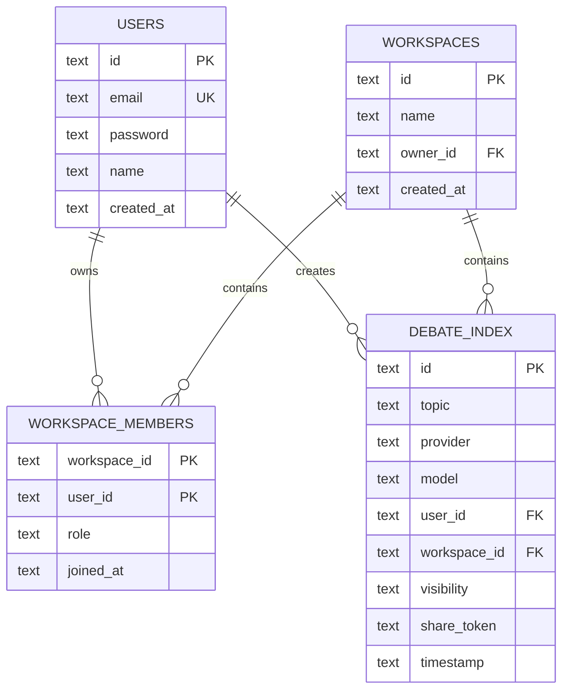
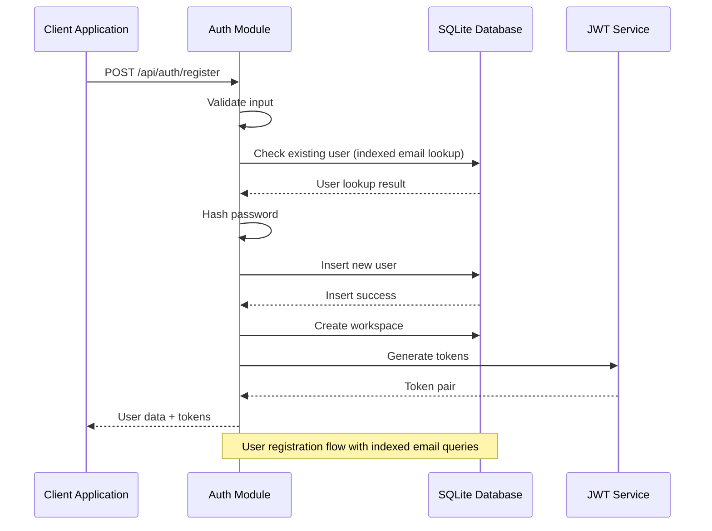
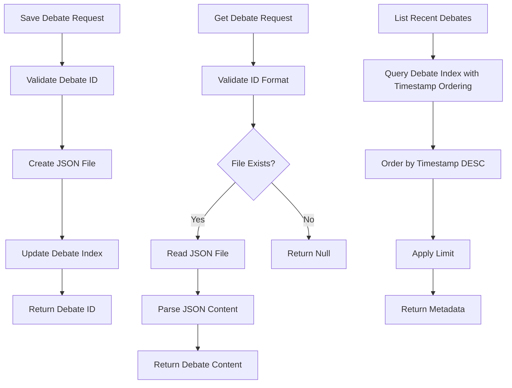

# Database Storage System

<cite>
**Referenced Files in This Document**
- [db.js](file://dissensus-engine/server/db.js)
- [auth.js](file://dissensus-engine/server/auth.js)
- [workspace.js](file://dissensus-engine/server/workspace.js)
- [debate-store.js](file://dissensus-engine/server/debate-store.js)
- [index.js](file://dissensus-engine/server/index.js)
- [package.json](file://dissensus-engine/package.json)
- [Dockerfile](file://dissensus-engine/Dockerfile)
- [docker-compose.yml](file://dissensus-engine/docker-compose.yml)
</cite>

## Update Summary
**Changes Made**
- Updated storage architecture to reflect migration from file-based to SQLite database backend
- Added comprehensive SQLite database schema documentation with proper indexing
- Updated debate persistence system to show enhanced query performance with new debate_index table
- Revised storage strategy to show hybrid approach with SQLite for metadata and JSON files for content
- Enhanced performance optimizations section with SQLite-specific configurations

## Table of Contents
1. [Introduction](#introduction)
2. [System Architecture](#system-architecture)
3. [Database Schema Design](#database-schema-design)
4. [Storage Architecture](#storage-architecture)
5. [Core Database Operations](#core-database-operations)
6. [Data Persistence Strategy](#data-persistence-strategy)
7. [Performance Optimizations](#performance-optimizations)
8. [Security Considerations](#security-considerations)
9. [Deployment Configuration](#deployment-configuration)
10. [Troubleshooting Guide](#troubleshooting-guide)
11. [Conclusion](#conclusion)

## Introduction

The Dissensus AI Debate Engine implements a hybrid database storage system that combines SQLite for relational data with filesystem storage for debate content. This dual-storage approach optimizes performance for different types of data while maintaining simplicity and reliability. The system serves 3000+ daily debates with robust user authentication, workspace management, and debate persistence capabilities.

**Updated**: The system has migrated from pure file-based storage to a SQLite database backend with enhanced indexing for improved query performance and data management.

## System Architecture

The database storage system follows a layered architecture pattern with clear separation between relational data (users, workspaces) and document-like data (debate content), now with SQLite as the central database backend.

```mermaid
graph TB
subgraph "Application Layer"
API[API Endpoints]
Auth[Authentication Module]
Workspace[Workspace Management]
DebateStore[Debate Storage]
end
subgraph "Database Layer"
SQLite[SQLite Database]
Tables[Relational Tables]
Indexes[Database Indexes]
DebateIndex[Debate Index Table]
end
subgraph "File System Layer"
DataDir[/app/data Directory]
DebateFiles[Debate JSON Files]
end
API --> Auth
API --> Workspace
API --> DebateStore
Auth --> SQLite
Workspace --> SQLite
DebateStore --> SQLite
DebateStore --> DataDir
DataDir --> DebateFiles
SQLite --> Tables
SQLite --> Indexes
SQLite --> DebateIndex
```

**Diagram sources**
- [db.js:15-44](file://dissensus-engine/server/db.js#L15-L44)
- [debate-store.js:6](file://dissensus-engine/server/debate-store.js#L6-L32)

## Database Schema Design

The system uses SQLite with five main tables providing a comprehensive foundation for user management, workspace collaboration, and debate persistence with enhanced indexing for performance optimization.



**Diagram sources**
- [db.js:16-44](file://dissensus-engine/server/db.js#L16-L44)
- [debate-store.js:17-32](file://dissensus-engine/server/debate-store.js#L17-L32)

### Table Relationships and Constraints

The schema enforces referential integrity through foreign key constraints and provides efficient querying through strategic indexing. Each table serves a specific purpose in the overall data model:

- **Users table**: Stores user authentication and profile information with unique email constraint
- **Workspaces table**: Manages collaborative groups with ownership tracking and foreign key relationships
- **Workspace_members table**: Handles membership relationships with role assignments and composite primary key
- **Debate_index table**: Maintains metadata for all debate records with comprehensive indexing for performance

**Section sources**
- [db.js:16-44](file://dissensus-engine/server/db.js#L16-L44)
- [auth.js:38-46](file://dissensus-engine/server/auth.js#L38-L46)
- [workspace.js:4-9](file://dissensus-engine/server/workspace.js#L4-L9)

## Storage Architecture

The system employs a hybrid storage strategy combining SQLite for relational data with filesystem storage for debate content, optimized for different access patterns and data characteristics.

```mermaid
graph LR
subgraph "Runtime Storage"
RuntimeDB[dissensus.db]
RuntimeData[data/debates/ directory]
end
subgraph "Persistent Storage"
PersistentVolume[Docker Volume /app/data]
HostFS[Host File System]
end
RuntimeDB --> PersistentVolume
RuntimeData --> PersistentVolume
PersistentVolume --> HostFS
subgraph "Container Configuration"
DockerMount[volume: ./data:/app/data]
ContainerPath[/app/data]
end
DockerMount --> PersistentVolume
ContainerPath --> RuntimeDB
ContainerPath --> RuntimeData
```

**Diagram sources**
- [Dockerfile:21](file://dissensus-engine/Dockerfile#L21)
- [docker-compose.yml:10](file://dissensus-engine/docker-compose.yml#L10)

### Data Organization Strategy

The storage system organizes data across multiple layers:

1. **Relational Data**: Stored in SQLite database file with ACID compliance and foreign key constraints
2. **Document Data**: Stored as JSON files in dedicated directory structure for debate content
3. **Index Data**: Maintained in SQLite debate_index table for efficient querying and filtering
4. **Metadata**: Stored alongside debate content for quick access and visibility controls

**Section sources**
- [debate-store.js:6](file://dissensus-engine/server/debate-store.js#L6-L14)
- [debate-store.js:48-65](file://dissensus-engine/server/debate-store.js#L48-L65)

## Core Database Operations

The system provides comprehensive database operations through specialized modules that handle different aspects of data management with enhanced SQLite integration.

### Authentication and User Management

User authentication operations leverage SQLite for secure credential storage and session management with proper indexing for email lookups.



**Diagram sources**
- [auth.js:18-51](file://dissensus-engine/server/auth.js#L18-L51)

### Workspace Management Operations

Workspace operations combine user management with collaborative features, utilizing foreign key relationships for data integrity with efficient membership queries.

**Section sources**
- [auth.js:18-51](file://dissensus-engine/server/auth.js#L18-L51)
- [workspace.js:4-29](file://dissensus-engine/server/workspace.js#L4-L29)

### Debate Storage and Retrieval

Debate content management implements a sophisticated indexing system that balances performance with data accessibility, now with comprehensive SQLite-backed metadata management.



**Diagram sources**
- [debate-store.js:48-91](file://dissensus-engine/server/debate-store.js#L48-L91)

**Section sources**
- [debate-store.js:48-118](file://dissensus-engine/server/debate-store.js#L48-L118)

## Data Persistence Strategy

The system implements a multi-layered persistence strategy that optimizes for different data access patterns and retention requirements with enhanced SQLite integration.

### Debate Content Persistence

Debate content is stored as JSON files with metadata maintained in the SQLite database for efficient querying and filtering, now with comprehensive indexing.

| Data Type | Storage Location | Retention Policy | Access Pattern | Index Usage |
|-----------|------------------|------------------|----------------|-------------|
| Debate Content | `/app/data/debates/*.json` | Permanent | Random Access | Direct file system |
| Debate Metadata | SQLite `debate_index` table | Permanent | Sequential/Filtered | Timestamp, user_id, workspace_id, share_token |
| User Profiles | SQLite `users` table | Permanent | Random Access | Email index |
| Workspace Data | SQLite `workspaces` table | Permanent | Hierarchical | Foreign key relationships |
| Membership Data | SQLite `workspace_members` table | Permanent | Composite queries | Composite primary key |

### Indexing Strategy

The system employs strategic indexing to optimize query performance across different access patterns:

- **Timestamp Index**: Optimizes chronological queries for recent debates with descending order sorting
- **User ID Index**: Enables user-specific data retrieval with workspace filtering
- **Workspace ID Index**: Supports workspace-based filtering and membership queries
- **Share Token Index**: Facilitates public sharing functionality with token-based access
- **Email Index**: Ensures fast user authentication and registration validation

**Section sources**
- [debate-store.js:17-32](file://dissensus-engine/server/debate-store.js#L17-L32)
- [db.js:42-43](file://dissensus-engine/server/db.js#L42-L43)

## Performance Optimizations

The database storage system incorporates several performance optimizations to handle high-volume operations efficiently with SQLite-specific enhancements.

### SQLite Configuration

The system utilizes SQLite-specific optimizations for optimal performance:

- **WAL Mode**: Enables concurrent read operations without blocking through Write-Ahead Logging
- **Foreign Key Constraints**: Maintains data integrity with minimal overhead through enforced relationships
- **Prepared Statements**: Reduces parsing overhead for repeated operations through statement preparation
- **Strategic Indexing**: Optimizes query performance for common access patterns with multiple indexes
- **Composite Primary Keys**: Efficiently manages workspace membership relationships

### Caching Strategy

The system implements intelligent caching for frequently accessed data:

- **Debate of the Day Cache**: Prevents external API calls for trending topics
- **File System Cache**: Reduces disk I/O through efficient file access patterns
- **Memory Optimization**: Balances memory usage with performance requirements
- **Query Result Caching**: Leverages SQLite's built-in caching mechanisms

**Section sources**
- [db.js:11](file://dissensus-engine/server/db.js#L11)
- [debate-of-the-day.js:18](file://dissensus-engine/server/debate-of-the-day.js#L18)

## Security Considerations

The database storage system implements comprehensive security measures to protect user data and maintain system integrity.

### Data Protection Measures

- **Password Hashing**: Uses bcrypt for secure password storage with salt generation
- **JWT Token Security**: Implements proper token signing and validation with configurable secrets
- **CSRF Protection**: Includes cross-site request forgery prevention through token verification
- **Input Validation**: Sanitizes all user inputs to prevent injection attacks and validates debate IDs
- **Access Control**: Enforces strict access control through database-level constraints

### Access Control

The system enforces strict access control through:

- **Authentication Middleware**: Validates user credentials for protected routes with indexed email lookups
- **Authorization Checks**: Verifies user permissions for sensitive operations through database queries
- **Visibility Controls**: Manages debate sharing through visibility settings with share token validation
- **Role-Based Access**: Supports different permission levels for workspace members with foreign key enforcement

**Section sources**
- [auth.js:114-123](file://dissensus-engine/server/auth.js#L114-L123)
- [debate-store.js:93-106](file://dissensus-engine/server/debate-store.js#L93-L106)

## Deployment Configuration

The database storage system is designed for containerized deployment with persistent volume configuration for data durability.

### Docker Configuration

The system uses multi-stage Docker builds to optimize for production deployment:

- **Build Stage**: Compiles native dependencies for better performance including better-sqlite3
- **Runtime Stage**: Uses slim Node.js image for reduced footprint with production dependencies
- **Volume Mounting**: Persists data outside the container for durability through /app/data
- **Environment Configuration**: Supports runtime customization through environment variables including JWT_SECRET

### Volume Management

Data persistence is achieved through Docker volume mounting:

- **Host Directory**: `/app/data` mounted from local filesystem for both database and debate content
- **Debate Storage**: Separate directory for debate content files with proper permissions
- **Database File**: SQLite database file stored with application data for ACID compliance
- **Backup Strategy**: Volume snapshots for disaster recovery and easy migration

**Section sources**
- [Dockerfile:1-26](file://dissensus-engine/Dockerfile#L1-L26)
- [docker-compose.yml:1-12](file://dissensus-engine/docker-compose.yml#L1-L12)

## Troubleshooting Guide

Common database-related issues and their solutions:

### Connection Issues

**Problem**: Database connection failures during startup
**Solution**: Verify data directory permissions and SQLite file accessibility

**Problem**: Foreign key constraint violations
**Solution**: Check referential integrity and ensure proper data insertion order

### Performance Issues

**Problem**: Slow query performance on debate listings
**Solution**: Verify index usage and consider query optimization with proper timestamp ordering

**Problem**: High memory usage with large debate collections
**Solution**: Implement pagination and optimize data retrieval patterns

### Data Integrity Issues

**Problem**: Missing or corrupted debate files
**Solution**: Implement backup procedures and verify file system integrity

**Problem**: Authentication failures after deployment
**Solution**: Check JWT secret configuration and environment variable setup

**Problem**: Index corruption or missing indexes
**Solution**: Recreate indexes using the CREATE INDEX statements in debate-store.js

**Section sources**
- [db.js:5](file://dissensus-engine/server/db.js#L5-L6)
- [auth.js:7](file://dissensus-engine/server/auth.js#L7-L14)

## Conclusion

The Dissensus AI Debate Engine's database storage system demonstrates a well-architected hybrid approach that effectively balances performance, scalability, and maintainability. By migrating to SQLite as the central database backend while maintaining filesystem storage for debate content, the system achieves optimal performance for both relational data management and document-based content storage.

The implementation showcases best practices in database design, including proper indexing strategies, foreign key constraints, and security measures. The containerized deployment approach ensures data persistence while maintaining the benefits of cloud-native infrastructure.

This storage architecture successfully supports the system's high-volume requirements, handling thousands of daily debates with robust user management, workspace collaboration, and comprehensive debate persistence capabilities. The modular design allows for easy maintenance and potential scaling as the platform grows.

**Updated**: The migration to SQLite has significantly improved query performance through strategic indexing, enhanced data integrity through foreign key constraints, and simplified deployment through centralized database management while maintaining the flexibility of filesystem storage for debate content.