# Integration Patterns

<cite>
**Referenced Files in This Document**
- [index.js](file://dissensus-engine/server/index.js)
- [debate-engine.js](file://dissensus-engine/server/debate-engine.js)
- [card-generator.js](file://dissensus-engine/server/card-generator.js)
- [solana-balance.js](file://dissensus-engine/server/solana-balance.js)
- [staking.js](file://dissensus-engine/server/staking.js)
- [metrics.js](file://dissensus-engine/server/metrics.js)
- [debate-of-the-day.js](file://dissensus-engine/server/debate-of-the-day.js)
- [agents.js](file://dissensus-engine/server/agents.js)
- [app.js](file://dissensus-engine/public/js/app.js)
- [wallet-connect.js](file://dissensus-engine/public/js/wallet-connect.js)
- [package.json](file://dissensus-engine/package.json)
- [README.md](file://dissensus-engine/README.md)
</cite>

## Table of Contents
1. [Introduction](#introduction)
2. [Project Structure](#project-structure)
3. [Core Components](#core-components)
4. [Architecture Overview](#architecture-overview)
5. [Detailed Component Analysis](#detailed-component-analysis)
6. [Dependency Analysis](#dependency-analysis)
7. [Performance Considerations](#performance-considerations)
8. [Troubleshooting Guide](#troubleshooting-guide)
9. [Conclusion](#conclusion)
10. [Appendices](#appendices)

## Introduction
This document explains the integration patterns and external service connectivity in the Dissensus system. It covers:
- AI provider integrations (OpenAI, DeepSeek, Google Gemini) with API key management and a provider abstraction layer
- Blockchain integration for Solana wallet verification and token balance checks
- Research engine integration with web search APIs and topic analysis services
- Card generation service integration with image processing libraries and social sharing workflows
- Rate limiting, error handling, retry mechanisms, and fallback strategies
- API key security, credential management, and environment-based configuration
- Plugin architecture for adding new AI providers and external services

## Project Structure
The Dissensus engine is a Node.js/Express application with a frontend that communicates with a server that orchestrates AI providers, blockchain checks, and content generation.

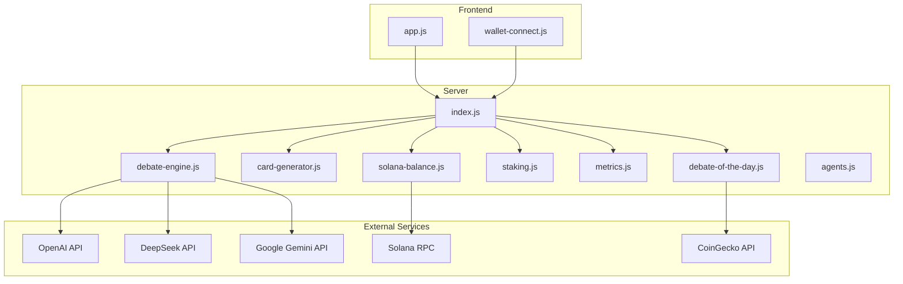

**Diagram sources**
- [index.js:1-481](file://dissensus-engine/server/index.js#L1-L481)
- [debate-engine.js:1-389](file://dissensus-engine/server/debate-engine.js#L1-L389)
- [card-generator.js:1-361](file://dissensus-engine/server/card-generator.js#L1-L361)
- [solana-balance.js:1-83](file://dissensus-engine/server/solana-balance.js#L1-L83)
- [staking.js:1-183](file://dissensus-engine/server/staking.js#L1-L183)
- [metrics.js:1-152](file://dissensus-engine/server/metrics.js#L1-L152)
- [debate-of-the-day.js:1-80](file://dissensus-engine/server/debate-of-the-day.js#L1-L80)
- [agents.js:1-148](file://dissensus-engine/server/agents.js#L1-L148)
- [app.js:1-674](file://dissensus-engine/public/js/app.js#L1-L674)
- [wallet-connect.js:1-176](file://dissensus-engine/public/js/wallet-connect.js#L1-L176)

**Section sources**
- [README.md:110-134](file://dissensus-engine/README.md#L110-L134)
- [package.json:1-28](file://dissensus-engine/package.json#L1-L28)

## Core Components
- Provider abstraction and AI orchestration: The server defines provider configurations and streams responses from OpenAI, DeepSeek, and Gemini.
- Card generation pipeline: Generates shareable PNGs using Satori and Resvg, optionally summarizing long verdicts via a server-side LLM.
- Solana integration: Server-side RPC queries for token balances, keeping credentials off the client.
- Staking and limits: Simulated staking tiers and daily debate limits, with enforcement controlled by environment.
- Metrics and transparency: In-memory analytics and public dashboards.
- Research engine: Trending topics sourced from CoinGecko with fallbacks.

**Section sources**
- [index.js:11-31](file://dissensus-engine/server/index.js#L11-L31)
- [debate-engine.js:14-39](file://dissensus-engine/server/debate-engine.js#L14-L39)
- [card-generator.js:41-85](file://dissensus-engine/server/card-generator.js#L41-L85)
- [solana-balance.js:26-76](file://dissensus-engine/server/solana-balance.js#L26-L76)
- [staking.js:13-79](file://dissensus-engine/server/staking.js#L13-L79)
- [metrics.js:10-44](file://dissensus-engine/server/metrics.js#L10-L44)
- [debate-of-the-day.js:37-77](file://dissensus-engine/server/debate-of-the-day.js#L37-L77)

## Architecture Overview
The system uses a layered architecture:
- Presentation: Frontend app and wallet connector
- Application: Express routes, SSE streaming, and orchestration
- Integrations: AI providers, blockchain RPC, and third-party APIs
- Persistence: In-memory metrics and simulated staking state

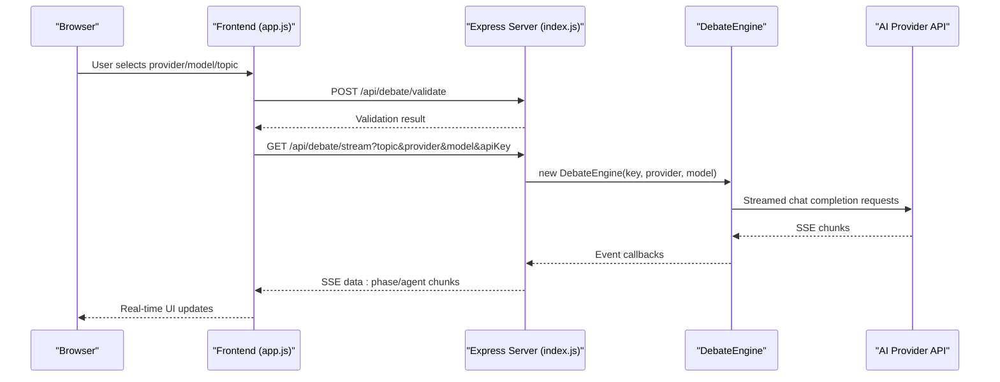

**Diagram sources**
- [index.js:220-311](file://dissensus-engine/server/index.js#L220-L311)
- [debate-engine.js:58-116](file://dissensus-engine/server/debate-engine.js#L58-L116)
- [app.js:209-356](file://dissensus-engine/public/js/app.js#L209-L356)

**Section sources**
- [index.js:220-311](file://dissensus-engine/server/index.js#L220-L311)
- [app.js:209-356](file://dissensus-engine/public/js/app.js#L209-L356)

## Detailed Component Analysis

### AI Provider Integration and Abstraction
- Provider configuration: Centralized provider registry with base URLs, models, and auth header generators.
- Key resolution: Effective key prioritizes user-provided keys, then server-side keys, then fails with a clear error.
- Streaming: Each agent call streams incremental tokens and emits structured events for the UI.

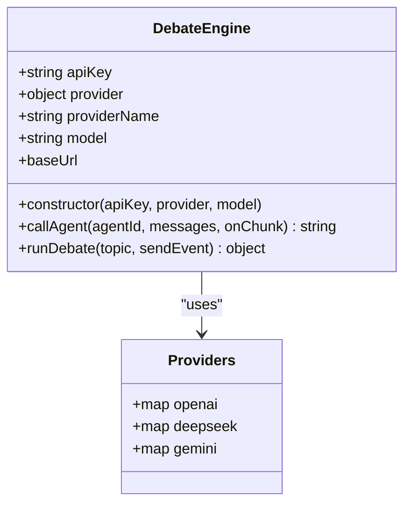

**Diagram sources**
- [debate-engine.js:41-53](file://dissensus-engine/server/debate-engine.js#L41-L53)
- [debate-engine.js:14-39](file://dissensus-engine/server/debate-engine.js#L14-L39)

**Section sources**
- [index.js:157-163](file://dissensus-engine/server/index.js#L157-L163)
- [debate-engine.js:41-116](file://dissensus-engine/server/debate-engine.js#L41-L116)

### API Key Management and Security
- Client-side key handling: Keys are stored in browser local storage per provider and sent to the provider directly.
- Server-side keys: Optional keys in environment for production to avoid exposing secrets to clients.
- Configuration endpoint: Exposes which providers have server-side keys and platform-specific hints.

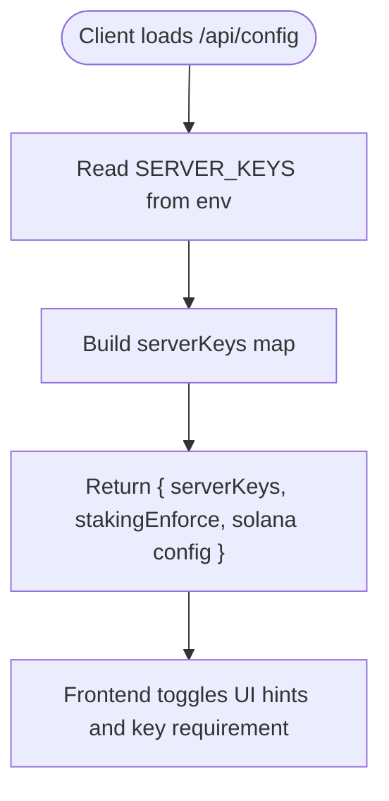

**Diagram sources**
- [index.js:69-85](file://dissensus-engine/server/index.js#L69-L85)
- [index.js:40-45](file://dissensus-engine/server/index.js#L40-L45)
- [app.js:642-655](file://dissensus-engine/public/js/app.js#L642-L655)

**Section sources**
- [index.js:40-45](file://dissensus-engine/server/index.js#L40-L45)
- [index.js:69-85](file://dissensus-engine/server/index.js#L69-L85)
- [README.md:182-186](file://dissensus-engine/README.md#L182-L186)

### Blockchain Integration: Solana Wallet Verification and Token Balance
- Server-side balance checks: Validates and normalizes wallet addresses, queries SPL token accounts via Solana RPC, and returns UI-friendly balances.
- Wallet connector: Frontend connects Phantom/Solflare, reads the public key, and triggers server-side balance retrieval.

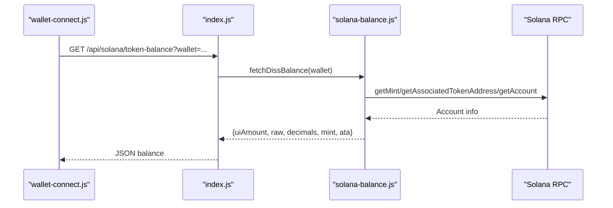

**Diagram sources**
- [wallet-connect.js:63-80](file://dissensus-engine/public/js/wallet-connect.js#L63-L80)
- [index.js:98-111](file://dissensus-engine/server/index.js#L98-L111)
- [solana-balance.js:26-76](file://dissensus-engine/server/solana-balance.js#L26-L76)

**Section sources**
- [solana-balance.js:26-76](file://dissensus-engine/server/solana-balance.js#L26-L76)
- [index.js:98-111](file://dissensus-engine/server/index.js#L98-L111)
- [wallet-connect.js:63-80](file://dissensus-engine/public/js/wallet-connect.js#L63-L80)

### Research Engine Integration: Web Search and Trending Topics
- Trending topics: Daily cached topic sourced from CoinGecko with a deterministic fallback list.
- Fallback strategy: If CoinGecko fails, a rotating fallback topic is used.

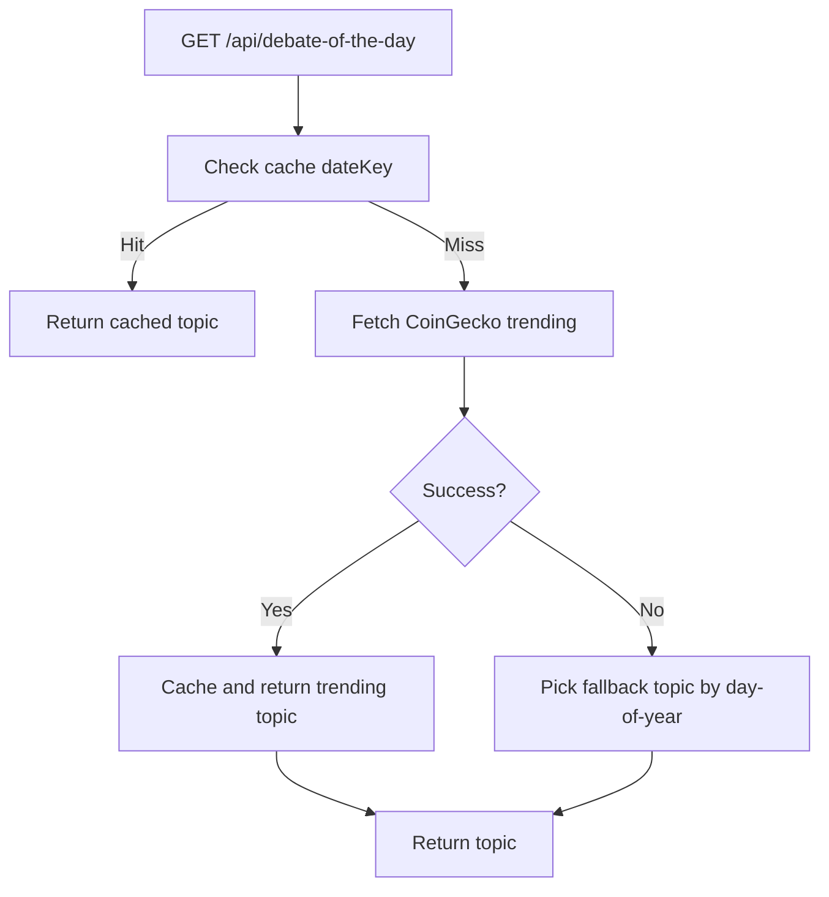

**Diagram sources**
- [debate-of-the-day.js:66-77](file://dissensus-engine/server/debate-of-the-day.js#L66-L77)
- [debate-of-the-day.js:37-58](file://dissensus-engine/server/debate-of-the-day.js#L37-L58)

**Section sources**
- [debate-of-the-day.js:66-77](file://dissensus-engine/server/debate-of-the-day.js#L66-L77)

### Card Generation Service: Image Processing and Social Sharing
- Summarization: When a verdict exceeds a threshold, the server optionally summarizes it using a configured provider to fit card constraints.
- Rendering: Uses Satori to render an SVG from a virtual DOM and Resvg to export a PNG.
- Social sharing: Frontend posts topic and verdict to generate a downloadable PNG.

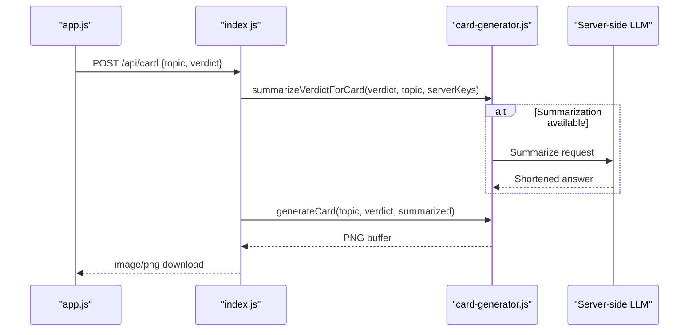

**Diagram sources**
- [index.js:382-416](file://dissensus-engine/server/index.js#L382-L416)
- [card-generator.js:41-85](file://dissensus-engine/server/card-generator.js#L41-L85)
- [card-generator.js:170-358](file://dissensus-engine/server/card-generator.js#L170-L358)
- [app.js:606-639](file://dissensus-engine/public/js/app.js#L606-L639)

**Section sources**
- [card-generator.js:41-85](file://dissensus-engine/server/card-generator.js#L41-L85)
- [card-generator.js:170-358](file://dissensus-engine/server/card-generator.js#L170-L358)
- [index.js:382-416](file://dissensus-engine/server/index.js#L382-L416)
- [app.js:606-639](file://dissensus-engine/public/js/app.js#L606-L639)

### Staking and Limits: Simulated Tiers and Daily Caps
- Simulated staking: In-memory tiers and daily debate caps; supports unlimited tiers for higher tiers.
- Enforcement: When enabled, debates require a wallet and enforce daily limits based on tier.
- Frontend integration: Wallet sync and staking status panel.

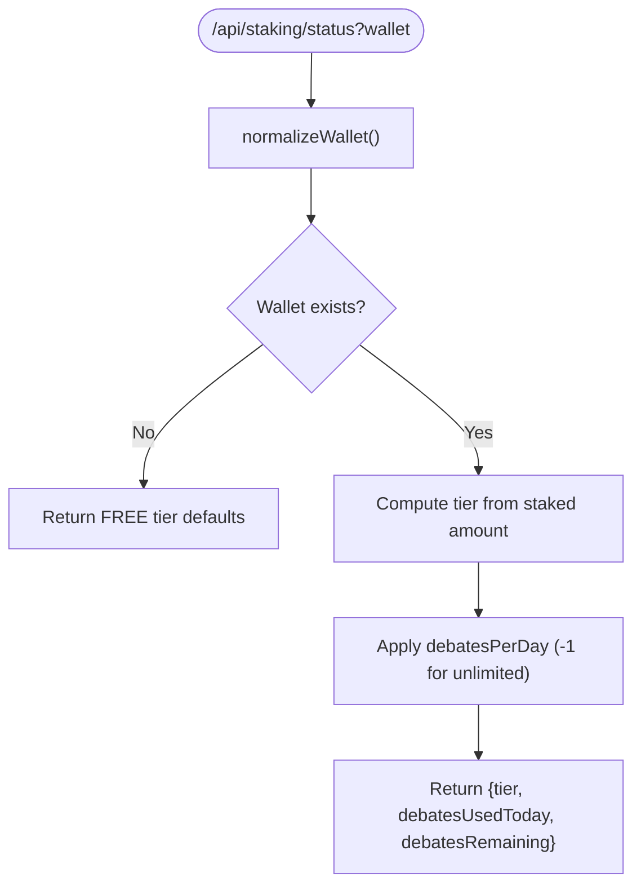

**Diagram sources**
- [staking.js:43-79](file://dissensus-engine/server/staking.js#L43-L79)
- [staking.js:110-125](file://dissensus-engine/server/staking.js#L110-L125)
- [index.js:328-334](file://dissensus-engine/server/index.js#L328-L334)

**Section sources**
- [staking.js:13-79](file://dissensus-engine/server/staking.js#L13-L79)
- [index.js:328-334](file://dissensus-engine/server/index.js#L328-L334)

### Metrics and Transparency
- In-memory metrics: Tracks debates, provider usage, recent topics, hourly activity, and request success/failure.
- Public endpoints: JSON metrics and a dashboard page.
- Sync: Staking aggregates are periodically synced into metrics.

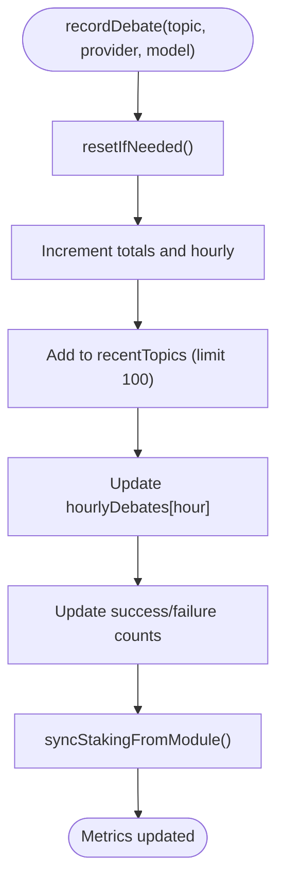

**Diagram sources**
- [metrics.js:46-73](file://dissensus-engine/server/metrics.js#L46-L73)
- [metrics.js:91-98](file://dissensus-engine/server/metrics.js#L91-L98)
- [metrics.js:100-132](file://dissensus-engine/server/metrics.js#L100-L132)

**Section sources**
- [metrics.js:10-44](file://dissensus-engine/server/metrics.js#L10-L44)
- [metrics.js:100-132](file://dissensus-engine/server/metrics.js#L100-L132)

### Plugin Architecture: Extending Providers and Services
- Adding AI providers: Extend the provider registry in the debate engine with base URLs, models, and auth header logic.
- External services: Add new endpoints in the server and integrate via helper modules similar to solana-balance or debate-of-the-day.

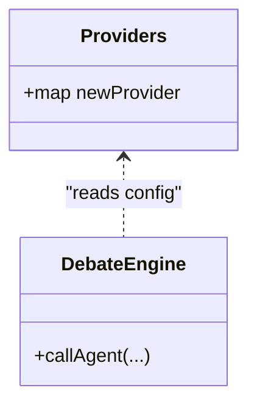

**Diagram sources**
- [debate-engine.js:14-39](file://dissensus-engine/server/debate-engine.js#L14-L39)
- [README.md:152-154](file://dissensus-engine/README.md#L152-L154)

**Section sources**
- [debate-engine.js:14-39](file://dissensus-engine/server/debate-engine.js#L14-L39)
- [README.md:152-154](file://dissensus-engine/README.md#L152-L154)

## Dependency Analysis
External dependencies and runtime integrations:
- Express server with rate limiting and security middleware
- AI providers via OpenAI-compatible chat completions
- Solana web3 and spl-token SDKs for RPC queries
- Satori and Resvg for image generation
- CoinGecko for trending topics

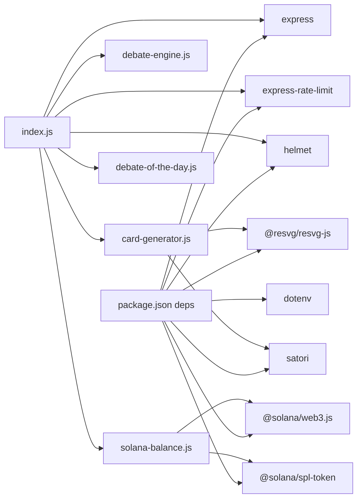

**Diagram sources**
- [package.json:10-18](file://dissensus-engine/package.json#L10-L18)
- [index.js:6-28](file://dissensus-engine/server/index.js#L6-L28)

**Section sources**
- [package.json:10-18](file://dissensus-engine/package.json#L10-L18)
- [index.js:6-28](file://dissensus-engine/server/index.js#L6-L28)

## Performance Considerations
- Streaming: SSE streaming reduces latency and memory overhead for long debates.
- Rate limiting: Per-endpoint rate limits protect resources and manage provider quotas.
- Client-side timeouts: Frontend aborts long debates to prevent hanging connections.
- Image generation: Summarization reduces token usage and rendering complexity for long verdicts.

[No sources needed since this section provides general guidance]

## Troubleshooting Guide
Common issues and remedies:
- API key errors: Ensure keys are set in environment for server-side usage or entered by the user; the server validates model availability and key presence.
- Rate limits: The server enforces per-minute limits; reduce frequency or increase allowance in production.
- Wallet validation: Invalid or missing wallet addresses cause balance checks to fail; normalize and validate inputs.
- Provider errors: The engine surfaces provider HTTP errors with status codes; verify credentials and model support.
- Metrics and dashboards: In-memory resets daily; persistent storage recommended for production.

**Section sources**
- [index.js:157-215](file://dissensus-engine/server/index.js#L157-L215)
- [index.js:303-310](file://dissensus-engine/server/index.js#L303-L310)
- [solana-balance.js:26-44](file://dissensus-engine/server/solana-balance.js#L26-L44)
- [metrics.js:75-80](file://dissensus-engine/server/metrics.js#L75-L80)

## Conclusion
Dissensus integrates external services through a clean provider abstraction, secure API key handling, and robust middleware. The architecture supports extensibility for new AI providers and external services while maintaining performance and reliability via streaming, rate limiting, and fallback strategies.

[No sources needed since this section summarizes without analyzing specific files]

## Appendices

### Environment Variables and Configuration
- Server-side keys: OPENAI_API_KEY, DEEPSEEK_API_KEY, GOOGLE_API_KEY or GEMINI_API_KEY
- Blockchain: SOLANA_RPC_URL, DISS_TOKEN_MINT, SOLANA_CLUSTER
- Staking: STAKING_ENFORCE, DISS_STAKING_PROGRAM_ID
- Proxy and security: TRUST_PROXY, TRUST_PROXY_HOPS
- Research engine: DEBATE_OF_THE_DAY_TZ

**Section sources**
- [index.js:40-45](file://dissensus-engine/server/index.js#L40-L45)
- [index.js:79-83](file://dissensus-engine/server/index.js#L79-L83)
- [README.md:138-149](file://dissensus-engine/README.md#L138-L149)