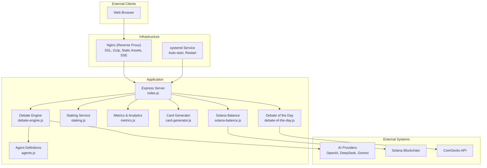
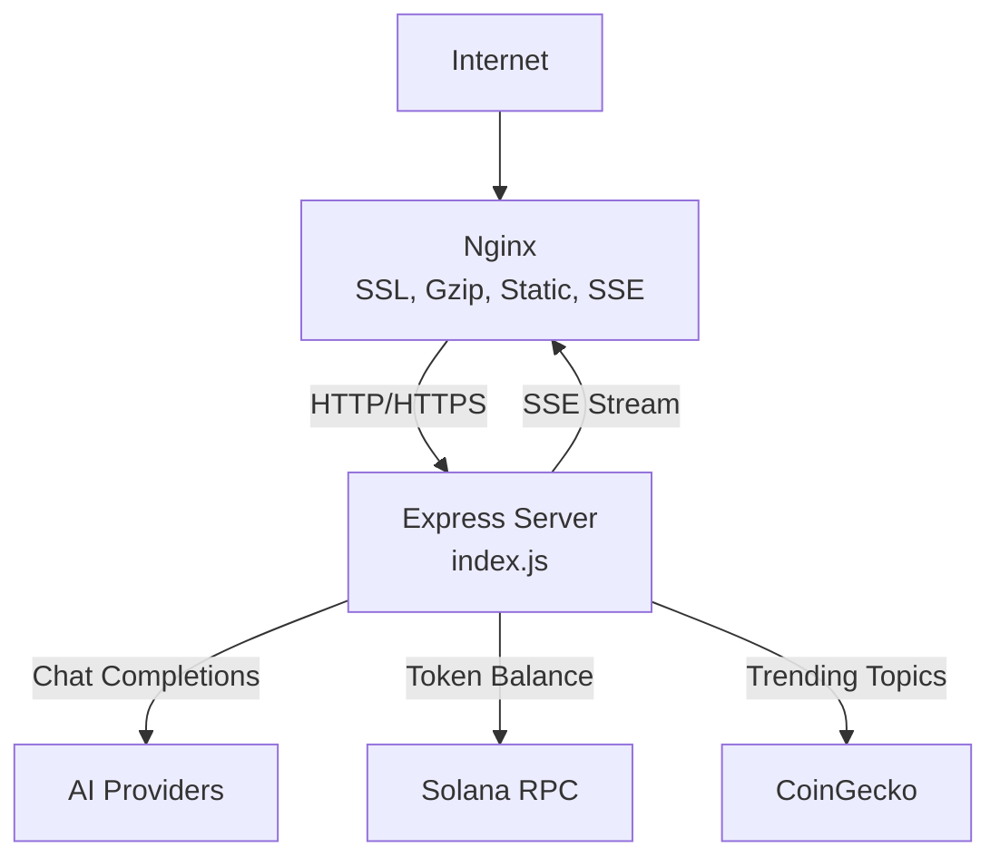
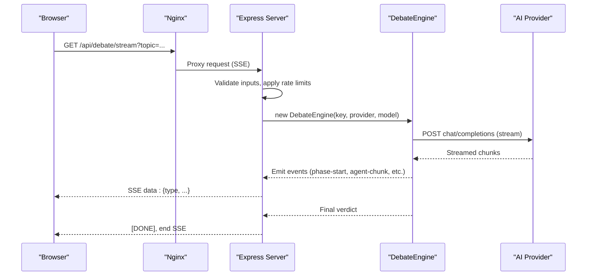
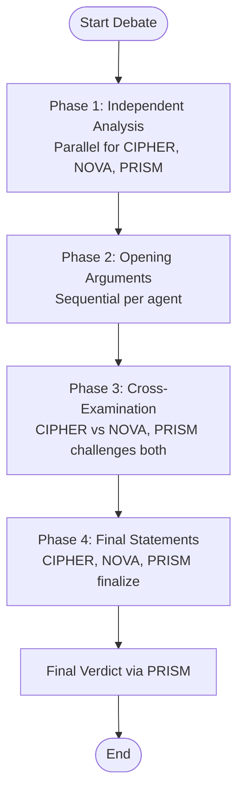
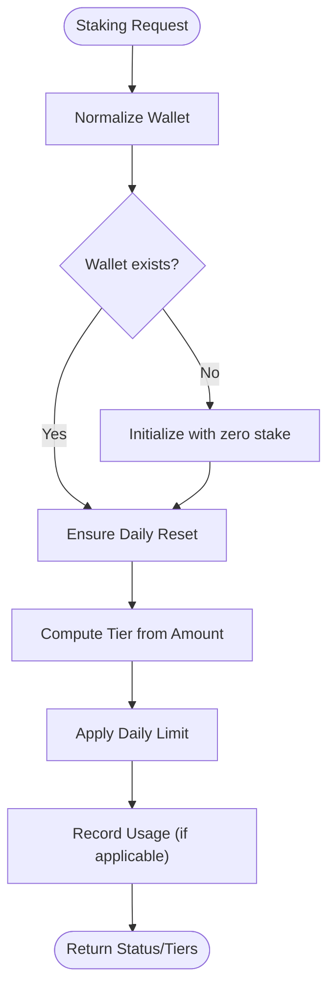
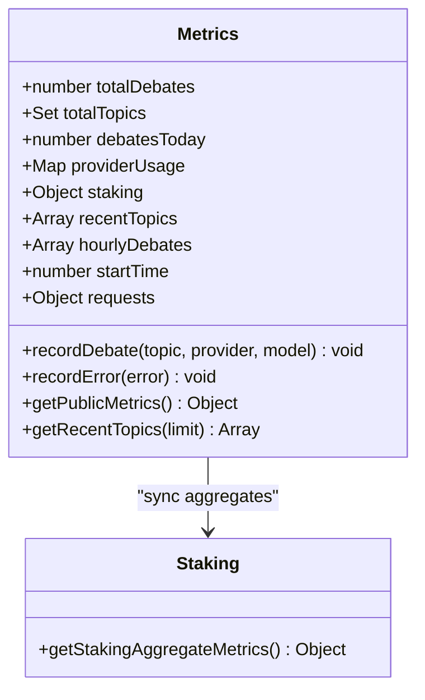
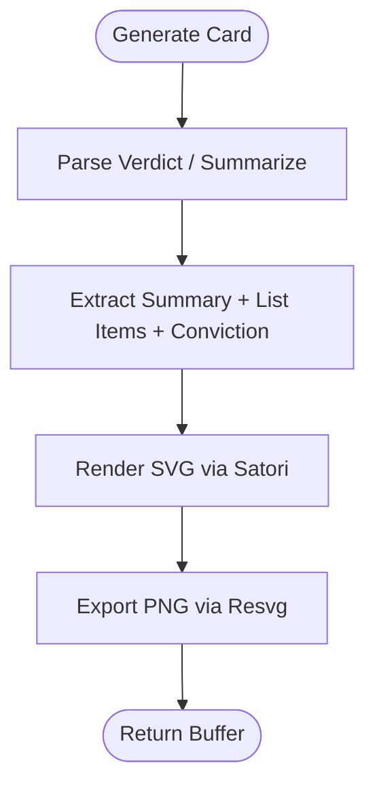
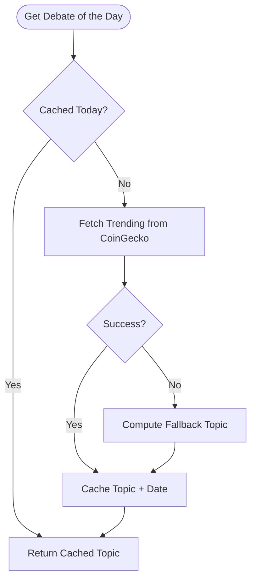
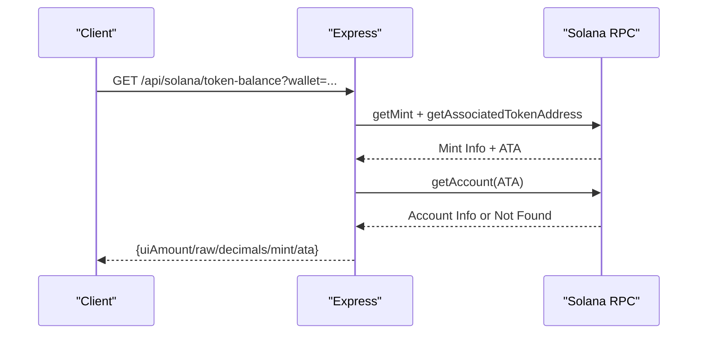
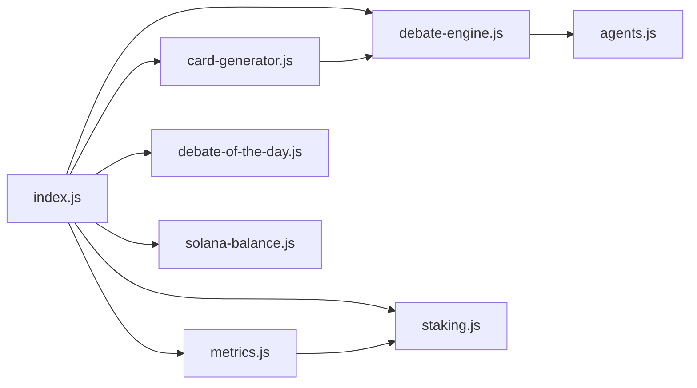

# Microservices Architecture

<cite>
**Referenced Files in This Document**
- [index.js](file://dissensus-engine/server/index.js)
- [debate-engine.js](file://dissensus-engine/server/debate-engine.js)
- [agents.js](file://dissensus-engine/server/agents.js)
- [staking.js](file://dissensus-engine/server/staking.js)
- [metrics.js](file://dissensus-engine/server/metrics.js)
- [card-generator.js](file://dissensus-engine/server/card-generator.js)
- [debate-of-the-day.js](file://dissensus-engine/server/debate-of-the-day.js)
- [solana-balance.js](file://dissensus-engine/server/solana-balance.js)
- [package.json](file://dissensus-engine/package.json)
- [index.html](file://dissensus-engine/public/index.html)
- [DEPLOY-VPS.md](file://dissensus-engine/docs/DEPLOY-VPS.md)
- [nginx-dissensus.conf](file://dissensus-engine/docs/configs/nginx-dissensus.conf)
- [dissensus-nginx-ssl.conf](file://dissensus-engine/docs/configs/dissensus-nginx-ssl.conf)
- [dissensus.service](file://dissensus-engine/docs/configs/dissensus.service)
</cite>

## Table of Contents
1. [Introduction](#introduction)
2. [Project Structure](#project-structure)
3. [Core Components](#core-components)
4. [Architecture Overview](#architecture-overview)
5. [Detailed Component Analysis](#detailed-component-analysis)
6. [Dependency Analysis](#dependency-analysis)
7. [Performance Considerations](#performance-considerations)
8. [Troubleshooting Guide](#troubleshooting-guide)
9. [Conclusion](#conclusion)
10. [Appendices](#appendices)

## Introduction
This document describes the microservices architecture of the Dissensus AI debate platform. The system centers around a single Express.js web server that orchestrates debate orchestration, integrates with AI providers, manages simulated staking and analytics, and exposes a metrics dashboard. The architecture leverages a reverse proxy (Nginx) for SSL termination, compression, static asset delivery, and Server-Sent Events (SSE) streaming. The platform is designed for VPS deployment with systemd service management and automated monitoring hooks.

## Project Structure
The Dissensus platform is organized into:
- Frontend presentation layer: static HTML/CSS/JS served from the public directory
- Backend business logic layer: Express server with modularized services
- External integration layer: AI providers (OpenAI, DeepSeek, Google Gemini), Solana blockchain read operations, and third-party trending data

**Diagram sources**
- [index.js:1-481](file://dissensus-engine/server/index.js#L1-L481)
- [debate-engine.js:1-389](file://dissensus-engine/server/debate-engine.js#L1-L389)
- [agents.js:1-148](file://dissensus-engine/server/agents.js#L1-L148)
- [staking.js:1-183](file://dissensus-engine/server/staking.js#L1-L183)
- [metrics.js:1-152](file://dissensus-engine/server/metrics.js#L1-L152)
- [card-generator.js:1-361](file://dissensus-engine/server/card-generator.js#L1-L361)
- [debate-of-the-day.js:1-80](file://dissensus-engine/server/debate-of-the-day.js#L1-L80)
- [solana-balance.js:1-83](file://dissensus-engine/server/solana-balance.js#L1-L83)
- [nginx-dissensus.conf:1-81](file://dissensus-engine/docs/configs/nginx-dissensus.conf#L1-L81)
- [dissensus.service:1-27](file://dissensus-engine/docs/configs/dissensus.service#L1-L27)

**Section sources**
- [index.js:1-481](file://dissensus-engine/server/index.js#L1-L481)
- [package.json:1-28](file://dissensus-engine/package.json#L1-L28)
- [index.html:1-217](file://dissensus-engine/public/index.html#L1-L217)

## Core Components
- Express server (index.js): Central API gateway handling SSE streaming, rate-limited endpoints, health checks, provider configuration, staking, metrics, debate orchestration, and card generation. It also serves static assets and falls back to the SPA index.
- Debate engine (debate-engine.js): Implements a 4-phase dialectical process across three agents (CIPHER, NOVA, PRISM), streams provider responses, and emits structured events for clients.
- Agent definitions (agents.js): Defines personalities and system prompts for each agent.
- Staking service (staking.js): Simulates tiered access control and debate quotas; integrates with metrics.
- Metrics & analytics (metrics.js): Tracks usage statistics, provider usage, recent topics, and aggregates staking metrics.
- Card generator (card-generator.js): Produces shareable PNG cards optimized for social media.
- Debate of the day (debate-of-the-day.js): Retrieves trending topics from CoinGecko with fallbacks.
- Solana balance (solana-balance.js): Reads SPL token balances for wallets via Solana web3 SDK.
- Frontend (public/index.html): SPA UI for configuring debates, viewing progress, and sharing results.

Responsibilities mapped to services:
- Debate orchestration: Express server routes + Debate engine
- User access control: Express routes + Staking service
- Analytics tracking: Metrics service
- Research processing: Debate engine + AI providers

**Section sources**
- [index.js:69-481](file://dissensus-engine/server/index.js#L69-L481)
- [debate-engine.js:41-389](file://dissensus-engine/server/debate-engine.js#L41-L389)
- [agents.js:8-148](file://dissensus-engine/server/agents.js#L8-L148)
- [staking.js:1-183](file://dissensus-engine/server/staking.js#L1-L183)
- [metrics.js:1-152](file://dissensus-engine/server/metrics.js#L1-L152)
- [card-generator.js:1-361](file://dissensus-engine/server/card-generator.js#L1-L361)
- [debate-of-the-day.js:1-80](file://dissensus-engine/server/debate-of-the-day.js#L1-L80)
- [solana-balance.js:1-83](file://dissensus-engine/server/solana-balance.js#L1-L83)
- [index.html:1-217](file://dissensus-engine/public/index.html#L1-L217)

## Architecture Overview
The system employs a reverse proxy pattern:
- Nginx terminates TLS, compresses responses, serves static assets, and proxies API requests to the Express server.
- SSE streaming is handled with proxy_buffering off to ensure real-time delivery.
- The Express server encapsulates all business logic and delegates specialized tasks to modular services.

**Diagram sources**
- [DEPLOY-VPS.md:711-740](file://dissensus-engine/docs/DEPLOY-VPS.md#L711-L740)
- [nginx-dissensus.conf:1-81](file://dissensus-engine/docs/configs/nginx-dissensus.conf#L1-L81)
- [index.js:220-311](file://dissensus-engine/server/index.js#L220-L311)

**Section sources**
- [DEPLOY-VPS.md:26-23](file://dissensus-engine/docs/DEPLOY-VPS.md#L26-L23)
- [nginx-dissensus.conf:42-60](file://dissensus-engine/docs/configs/nginx-dissensus.conf#L42-L60)

## Detailed Component Analysis

### Express Server and API Gateway
The Express server defines:
- Health checks, provider configuration, and rate-limited endpoints
- SSE streaming for debates with client event emission
- Staking endpoints for tiers, status, stake/unstake simulation
- Metrics endpoints and dashboard
- Card generation endpoint
- Debate-of-the-day retrieval
- Solana balance read-only endpoint

**Diagram sources**
- [index.js:220-311](file://dissensus-engine/server/index.js#L220-L311)
- [debate-engine.js:58-116](file://dissensus-engine/server/debate-engine.js#L58-L116)

**Section sources**
- [index.js:69-481](file://dissensus-engine/server/index.js#L69-L481)

### Debate Engine and Agent Orchestration
The debate engine coordinates a 4-phase process:
- Phase 1: Independent analysis (parallel)
- Phase 2: Opening arguments
- Phase 3: Cross-examination
- Phase 4: Final verdict

**Diagram sources**
- [debate-engine.js:121-386](file://dissensus-engine/server/debate-engine.js#L121-L386)
- [agents.js:8-148](file://dissensus-engine/server/agents.js#L8-L148)

**Section sources**
- [debate-engine.js:41-389](file://dissensus-engine/server/debate-engine.js#L41-L389)
- [agents.js:1-148](file://dissensus-engine/server/agents.js#L1-L148)

### Staking Service (Simulated)
The staking module simulates tiered access and daily debate limits:
- Wallet normalization and validation
- Tier thresholds and benefits
- Daily reset logic
- Usage tracking and enforcement

**Diagram sources**
- [staking.js:21-136](file://dissensus-engine/server/staking.js#L21-L136)

**Section sources**
- [staking.js:1-183](file://dissensus-engine/server/staking.js#L1-L183)

### Metrics and Analytics
The metrics service tracks:
- Total debates, unique topics, debates today
- Provider usage distribution
- Staking aggregates (total staked, active stakers, tier distribution)
- Recent topics with timestamps
- Hourly activity and uptime metrics

**Diagram sources**
- [metrics.js:10-152](file://dissensus-engine/server/metrics.js#L10-L152)
- [staking.js:157-169](file://dissensus-engine/server/staking.js#L157-L169)

**Section sources**
- [metrics.js:1-152](file://dissensus-engine/server/metrics.js#L1-L152)

### Card Generator
Generates shareable PNG cards for social media:
- Parses verdict content to extract summary, list items, and overall conviction
- Uses Satori + Resvg to render SVG to PNG
- Adds optional disclaimers for crypto-related topics

**Diagram sources**
- [card-generator.js:87-152](file://dissensus-engine/server/card-generator.js#L87-L152)
- [card-generator.js:170-361](file://dissensus-engine/server/card-generator.js#L170-L361)

**Section sources**
- [card-generator.js:1-361](file://dissensus-engine/server/card-generator.js#L1-L361)

### Debate of the Day
Retrieves trending topics from CoinGecko with timezone-aware caching and fallbacks.

**Diagram sources**
- [debate-of-the-day.js:66-77](file://dissensus-engine/server/debate-of-the-day.js#L66-L77)

**Section sources**
- [debate-of-the-day.js:1-80](file://dissensus-engine/server/debate-of-the-day.js#L1-L80)

### Solana Balance Reader
Reads SPL token balances for a wallet owner using Solana web3 SDK and SPL Token program.

**Diagram sources**
- [solana-balance.js:26-76](file://dissensus-engine/server/solana-balance.js#L26-L76)
- [index.js:98-111](file://dissensus-engine/server/index.js#L98-L111)

**Section sources**
- [solana-balance.js:1-83](file://dissensus-engine/server/solana-balance.js#L1-L83)
- [index.js:88-122](file://dissensus-engine/server/index.js#L88-L122)

## Dependency Analysis
Internal dependencies:
- index.js imports and composes all services (debate-engine, agents, staking, metrics, card-generator, debate-of-the-day, solana-balance)
- Debate engine depends on agents and provider configurations
- Metrics depends on staking for aggregates
- Card generator optionally uses server-side keys to summarize long verdicts

External dependencies:
- AI providers (OpenAI, DeepSeek, Google Gemini) accessed via HTTP/HTTPS
- Solana RPC for read-only balance queries
- CoinGecko for trending topics

**Diagram sources**
- [index.js:11-24](file://dissensus-engine/server/index.js#L11-L24)
- [debate-engine.js:11-11](file://dissensus-engine/server/debate-engine.js#L11-L11)
- [metrics.js:8-8](file://dissensus-engine/server/metrics.js#L8-L8)

**Section sources**
- [package.json:10-19](file://dissensus-engine/package.json#L10-L19)

## Performance Considerations
- SSE streaming: Nginx disables buffering for /api/debate/stream to ensure real-time delivery; timeouts extended for long debates.
- Rate limiting: Applied to sensitive endpoints (debates, staking, metrics, Solana balance) to prevent abuse.
- Static assets: Served directly by Nginx with caching headers to reduce server load.
- Compression: Enabled via Nginx gzip to reduce bandwidth.
- Provider costs: Costs per model are embedded in provider configuration; choose models accordingly.

[No sources needed since this section provides general guidance]

## Troubleshooting Guide
Common operational issues and remedies:
- 502 Bad Gateway: Indicates the Express server is not running; check systemd status and logs.
- SSE not streaming: Verify Nginx configuration has proxy_buffering off for /api/debate/stream.
- SSL certificate issues: Confirm DNS points to VPS and ports 80/443 are open; re-run Certbot.
- Out of memory: Add swap space on constrained VPS instances.
- Service management: Use systemctl commands to start, stop, restart, and inspect logs.

**Section sources**
- [DEPLOY-VPS.md:601-690](file://dissensus-engine/docs/DEPLOY-VPS.md#L601-L690)
- [dissensus.service:1-27](file://dissensus-engine/docs/configs/dissensus.service#L1-L27)
- [nginx-dissensus.conf:42-60](file://dissensus-engine/docs/configs/nginx-dissensus.conf#L42-L60)

## Conclusion
The Dissensus microservices architecture centers on a robust Express server that orchestrates debate orchestration, integrates AI providers, manages simulated staking, and maintains transparent analytics. The reverse proxy (Nginx) provides SSL, compression, static asset serving, and critical SSE streaming support. The design emphasizes separation of concerns, with clear boundaries between the frontend presentation layer, backend business logic, and external integrations. Deployment is streamlined via systemd and documented VPS procedures, enabling reliable operation in production environments.

[No sources needed since this section summarizes without analyzing specific files]

## Appendices

### API Surface Overview
- GET /api/config: Server-side provider key availability, staking enforcement, Solana cluster and mint
- GET /api/health: Service health and supported providers
- GET /api/providers: Provider and model metadata
- POST /api/debate/validate: Preflight validation for debate creation
- GET /api/debate/stream: SSE endpoint for live debate
- GET /api/solana/token-balance: Read-only SPL balance
- GET /api/solana/staking-status: On-chain staking program status (placeholder)
- GET /api/staking/tiers: Tier thresholds and features
- GET /api/staking/status: Current staking status for a wallet
- POST /api/staking/stake: Simulate stake
- POST /api/staking/unstake: Simulate unstake
- GET /api/debate-of-the-day: Trending topic
- POST /api/card: Generate shareable PNG
- GET /api/metrics: Public metrics
- GET /api/metrics/topics: Recent topics
- GET /metrics: Metrics dashboard page

**Section sources**
- [index.js:69-445](file://dissensus-engine/server/index.js#L69-L445)