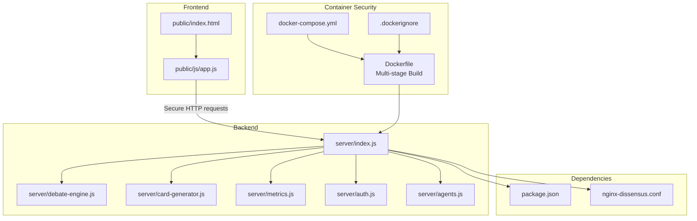
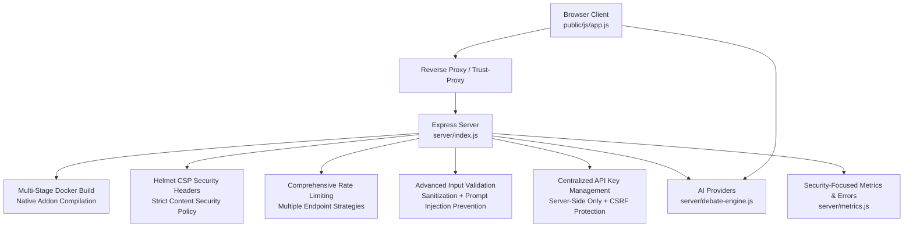
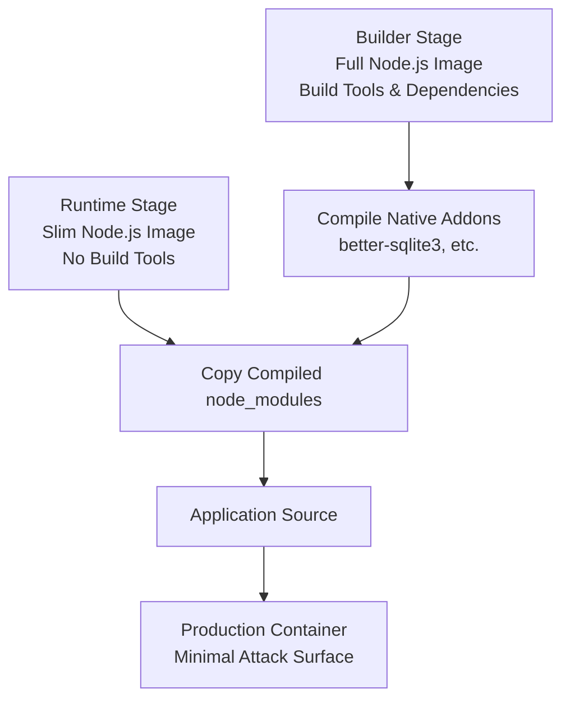
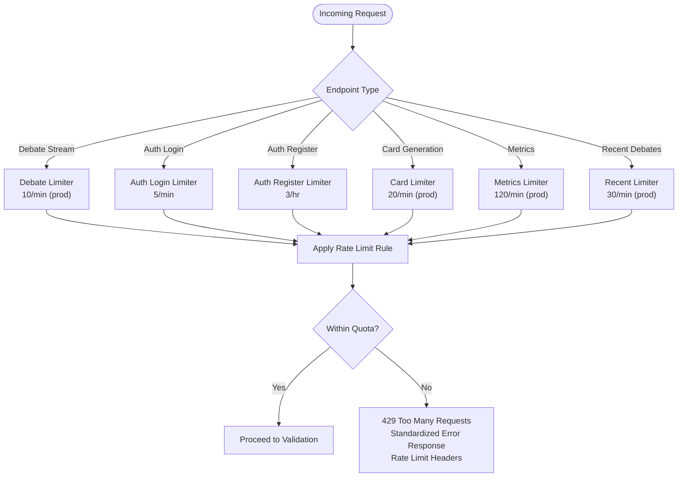
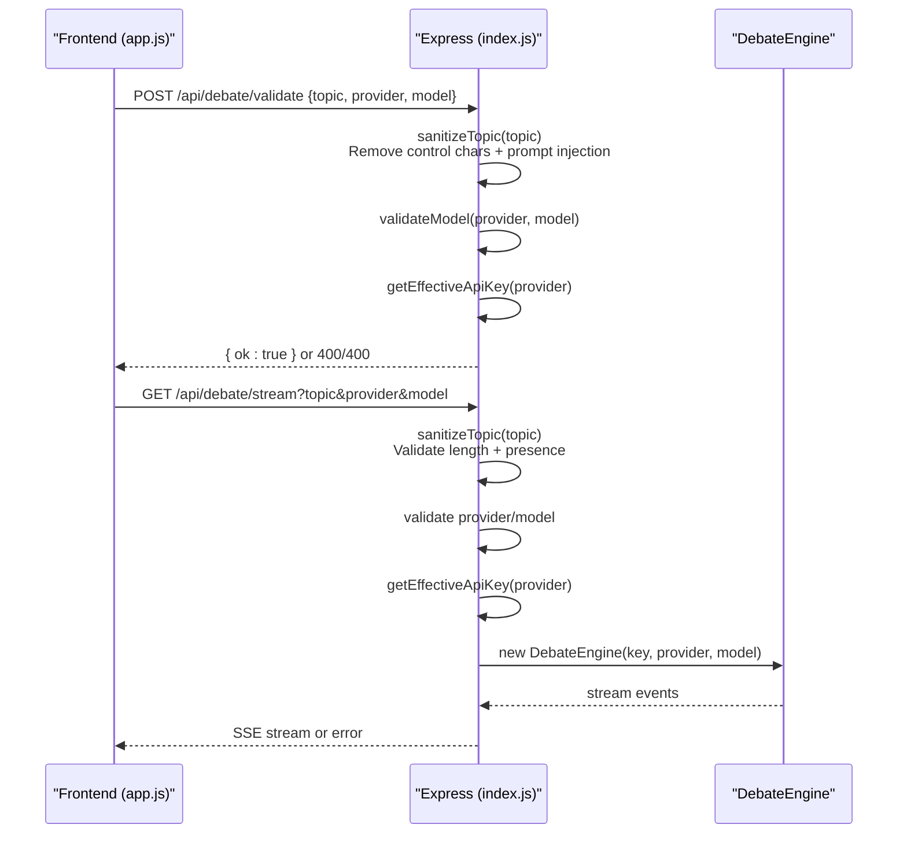
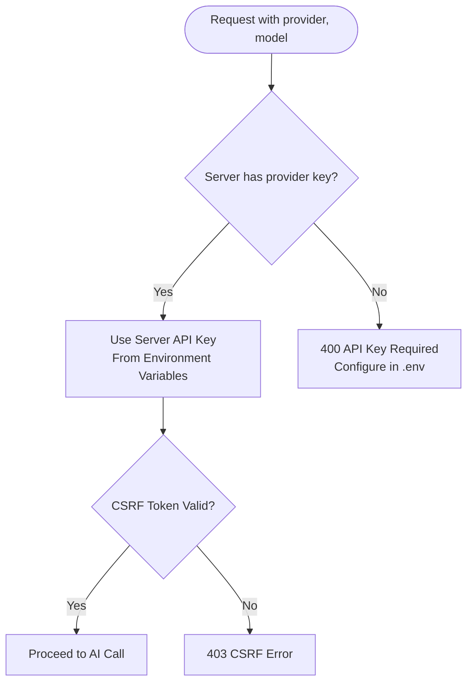
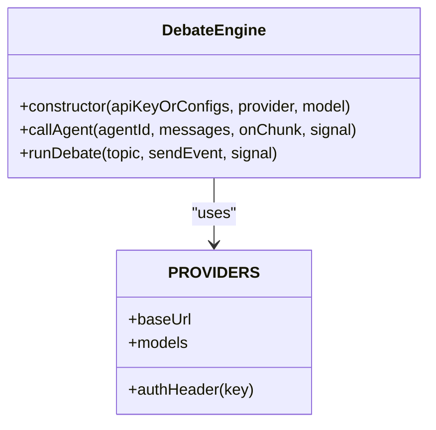
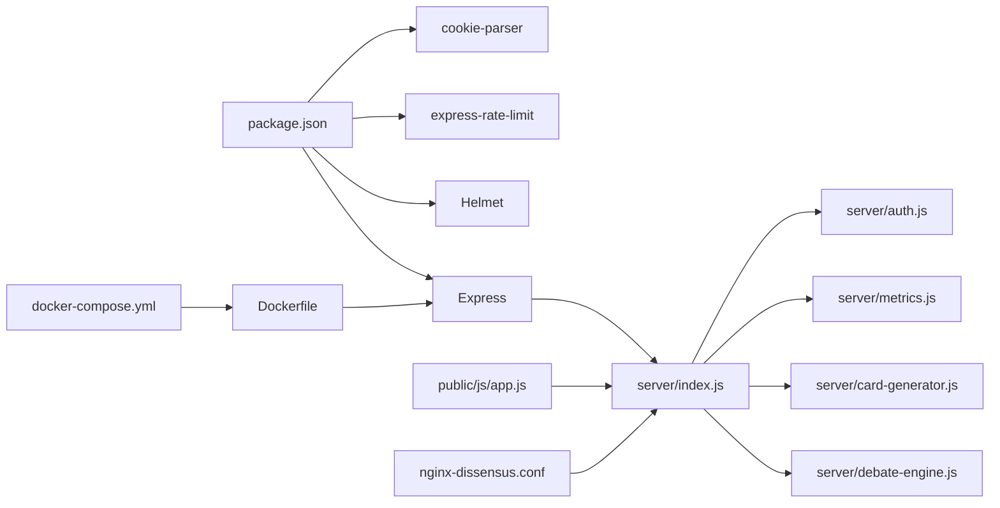

# Security Architecture

<cite>
**Referenced Files in This Document**
- [Dockerfile](file://dissensus-engine/Dockerfile)
- [.dockerignore](file://dissensus-engine/.dockerignore)
- [docker-compose.yml](file://dissensus-engine/docker-compose.yml)
- [package.json](file://dissensus-engine/package.json)
- [index.js](file://dissensus-engine/server/index.js)
- [auth.js](file://dissensus-engine/server/auth.js)
- [app.js](file://dissensus-engine/public/js/app.js)
- [debate-engine.js](file://dissensus-engine/server/debate-engine.js)
- [card-generator.js](file://dissensus-engine/server/card-generator.js)
- [metrics.js](file://dissensus-engine/server/metrics.js)
- [nginx-dissensus.conf](file://dissensus-engine/docs/configs/nginx-dissensus.conf)
- [QUICK-REFERENCE.md](file://dissensus-engine/docs/QUICK-REFERENCE.md)
- [index.html](file://dissensus-engine/public/index.html)
- [agents.js](file://dissensus-engine/server/agents.js)
</cite>

## Update Summary
**Changes Made**
- Enhanced Docker multi-stage build with native addon compilation tools for better security and performance
- Implemented comprehensive Helmet.js Content Security Policy with strict security directives
- Added SameSite=Lax cookie configuration for CSRF protection and enhanced authentication security
- Expanded rate limiting strategy with per-endpoint quotas for different resource types
- Strengthened server-side API key management with environment-based configuration
- Improved reverse proxy security headers and operational security guidance

## Table of Contents
1. [Introduction](#introduction)
2. [Project Structure](#project-structure)
3. [Core Components](#core-components)
4. [Architecture Overview](#architecture-overview)
5. [Detailed Component Analysis](#detailed-component-analysis)
6. [Dependency Analysis](#dependency-analysis)
7. [Performance Considerations](#performance-considerations)
8. [Troubleshooting Guide](#troubleshooting-guide)
9. [Conclusion](#conclusion)
10. [Appendices](#appendices)

## Introduction
This document describes the Dissensus security architecture and threat mitigation strategies. It covers multi-layered protections across input validation, rate limiting, API key management, access control, blockchain integration safeguards, Express.js middleware configuration, API security patterns, AI provider integration hygiene, data privacy, authentication, monitoring, logging, and incident response. The analysis focuses on the production-ready Express server, frontend client, and supporting modules documented in the repository.

**Updated** Enhanced API security with comprehensive Content Security Policy (CSP) directives, SameSite=Lax cookie configuration for CSRF protection, multi-stage Docker build with native addon compilation tools, and expanded rate limiting strategies for different endpoint types.

## Project Structure
The security architecture spans the backend Express server, frontend client, and shared utilities. Key security-relevant areas include:
- Express server middleware and route handlers with enhanced security configurations including Helmet CSP and comprehensive rate limiting
- Frontend input sanitization and error handling with XSS prevention
- AI provider integration with centralized server-side credential management
- Comprehensive rate limiting with per-endpoint quotas for different resource types
- Enhanced input validation with prompt injection prevention
- Metrics and error recording for observability with security-focused logging
- Multi-stage Docker build with native addon compilation for enhanced security
- Reverse proxy security headers and operational security guidance with environment-based configurations
- CSRF protection and enhanced authentication security with JWT tokens and cookie management

**Diagram sources**
- [index.js:1-668](file://dissensus-engine/server/index.js#L1-L668)
- [app.js:1-896](file://dissensus-engine/public/js/app.js#L1-L896)
- [debate-engine.js:1-469](file://dissensus-engine/server/debate-engine.js#L1-L469)
- [card-generator.js](file://dissensus-engine/server/card-generator.js)
- [metrics.js](file://dissensus-engine/server/metrics.js)
- [auth.js:1-126](file://dissensus-engine/server/auth.js#L1-L126)
- [Dockerfile:1-26](file://dissensus-engine/Dockerfile#L1-L26)
- [docker-compose.yml:1-12](file://dissensus-engine/docker-compose.yml#L1-L12)
- [.dockerignore:1-8](file://dissensus-engine/.dockerignore#L1-L8)
- [package.json:1-31](file://dissensus-engine/package.json#L1-L31)
- [nginx-dissensus.conf:1-81](file://dissensus-engine/docs/configs/nginx-dissensus.conf#L1-L81)

**Section sources**
- [index.js:1-668](file://dissensus-engine/server/index.js#L1-L668)
- [app.js:1-896](file://dissensus-engine/public/js/app.js#L1-L896)
- [package.json:1-31](file://dissensus-engine/package.json#L1-L31)
- [nginx-dissensus.conf:1-81](file://dissensus-engine/docs/configs/nginx-dissensus.conf#L1-L81)
- [Dockerfile:1-26](file://dissensus-engine/Dockerfile#L1-L26)
- [docker-compose.yml:1-12](file://dissensus-engine/docker-compose.yml#L1-L12)
- [.dockerignore:1-8](file://dissensus-engine/.dockerignore#L1-L8)

## Core Components
- Express server with Helmet CSP configuration, comprehensive rate limiting, and trust-proxy configuration
- Multi-stage Docker build with native addon compilation tools for enhanced security and performance
- Centralized server-side API key management with environment-based configuration
- Comprehensive input validation and parameter sanitization with prompt injection prevention
- Enhanced rate limiting strategy with per-endpoint quotas for different resource types including debate streams, authentication, card generation, and metrics
- CSRF protection and enhanced authentication security with JWT tokens, SameSite=Lax cookies, and cookie-based session management
- Metrics and error recording for monitoring and incident detection with security-focused logging
- AI provider integration with controlled credential exposure and timeout protection
- Frontend XSS prevention via HTML escaping and markdown rendering
- Comprehensive error handling to prevent information leakage
- Reverse proxy security headers and operational security guidance

**Updated** Enhanced API security with comprehensive Content Security Policy (CSP) directives, SameSite=Lax cookie configuration for CSRF protection, multi-stage Docker build with native addon compilation tools, and expanded rate limiting strategies for different endpoint types.

**Section sources**
- [index.js:62-76](file://dissensus-engine/server/index.js#L62-L76)
- [index.js:26-32](file://dissensus-engine/server/index.js#L26-L32)
- [index.js:78](file://dissensus-engine/server/index.js#L78)
- [index.js:250-265](file://dissensus-engine/server/index.js#L250-L265)
- [auth.js:93-123](file://dissensus-engine/server/auth.js#L93-L123)
- [app.js:121-147](file://dissensus-engine/public/js/app.js#L121-L147)
- [Dockerfile:1-26](file://dissensus-engine/Dockerfile#L1-L26)

## Architecture Overview
The security architecture follows layered defense-in-depth with enhanced API security:
- Transport and network: reverse proxy and trust-proxy configuration with Helmet security headers and comprehensive CSP directives
- Container security: multi-stage Docker build with native addon compilation tools for enhanced security and reduced attack surface
- Application: enhanced Helmet CSP configuration, comprehensive rate limiting, advanced input validation, and secure error handling
- Access control: server-side API key management with centralized configuration, CSRF protection, and JWT-based authentication with SameSite=Lax cookies
- Data protection: comprehensive XSS prevention, input sanitization, and prompt injection protection
- Observability: metrics, error recording, and operational logging with security-focused error reporting

**Diagram sources**
- [index.js:26-32](file://dissensus-engine/server/index.js#L26-L32)
- [index.js:62-76](file://dissensus-engine/server/index.js#L62-L76)
- [index.js:82-104](file://dissensus-engine/server/index.js#L82-L104)
- [index.js:156-160](file://dissensus-engine/server/index.js#L156-L160)
- [debate-engine.js:66-163](file://dissensus-engine/server/debate-engine.js#L66-L163)
- [metrics.js](file://dissensus-engine/server/metrics.js)
- [app.js:121-147](file://dissensus-engine/public/js/app.js#L121-L147)
- [Dockerfile:1-26](file://dissensus-engine/Dockerfile#L1-L26)

## Detailed Component Analysis

### Enhanced Express Security Middleware and Configuration
- **Enhanced** Helmet CSP Configuration: implemented comprehensive Content Security Policy directives with strict security controls
  - defaultSrc: "'self'" - only load resources from same origin
  - scriptSrc: "'self'" - only execute scripts from same origin
  - styleSrc: "'self', 'https://fonts.googleapis.com'" - allow styles from self and Google Fonts
  - imgSrc: "'self', 'data:'" - allow images from self and data URIs
  - connectSrc: "'self'" - allow connections only to same origin
  - fontSrc: "'self', 'https://fonts.gstatic.com'" - allow fonts from self and Google Fonts
  - objectSrc: "'none'" - block plugins
  - frameAncestors: "'none'" - prevent clickjacking
- **Enhanced** Cookie Security Configuration: implemented SameSite=Lax cookies for CSRF protection
  - token cookie: httpOnly=true, secure=true in production, sameSite='lax'
  - csrf_token cookie: httpOnly=false (JS needs to read this), secure=true in production, sameSite='lax'
- Trust proxy: configured via environment variable to support reverse proxies and accurate client IP resolution for rate limiting
- Body parsing: JSON body limit enforced for payload safety (50kb limit for card payloads)
- Static serving: public assets served securely

**Updated** Enhanced security headers and configurations for production deployment with comprehensive CSP directives and SameSite=Lax cookie configuration for CSRF protection.

Operational guidance:
- Configure TRUST_PROXY and TRUST_PROXY_HOPS according to your reverse proxy stack
- Keep CSP strict for maximum security; adjust only if required by the app's rendering needs
- Store all API keys in environment variables only
- Ensure JWT_SECRET is properly configured in production environments

**Section sources**
- [index.js:62-76](file://dissensus-engine/server/index.js#L62-L76)
- [index.js:26-32](file://dissensus-engine/server/index.js#L26-L32)
- [index.js:78](file://dissensus-engine/server/index.js#L78)
- [index.js:250-265](file://dissensus-engine/server/index.js#L250-L265)

### Multi-Stage Docker Build Security Enhancement
- **Enhanced** Multi-stage Docker build with native addon compilation tools:
  - Stage 1: Full Node.js image with build tools for compiling native addons like better-sqlite3
  - Stage 2: Slim Node.js runtime image without build tools for production deployment
  - Native addon compilation occurs only in the builder stage, reducing attack surface in production
- **Enhanced** Security isolation between build and runtime environments:
  - Production container runs without gcc, g++, make, or other build dependencies
  - Only compiled node_modules are copied to the runtime container
- **Enhanced** Reduced attack surface and improved security posture:
  - Smaller attack surface in production container
  - Elimination of build tools reduces potential exploitation vectors
  - Better compliance with container security best practices

**Updated** Multi-stage Docker build with native addon compilation tools for enhanced security and performance.

**Diagram sources**
- [Dockerfile:1-26](file://dissensus-engine/Dockerfile#L1-L26)

**Section sources**
- [Dockerfile:1-26](file://dissensus-engine/Dockerfile#L1-L26)
- [.dockerignore:1-8](file://dissensus-engine/.dockerignore#L1-L8)
- [docker-compose.yml:1-12](file://dissensus-engine/docker-compose.yml#L1-L12)

### Comprehensive Rate Limiting Strategy
- **Enhanced** Multiple rate limiters for different endpoint types:
  - Global debate endpoint: per-minute limits with differentiated thresholds for production and development (10/min in prod, 100/min in dev)
  - Authentication endpoints: separate limiters for login (5 attempts/minute) and registration (3 attempts/hour)
  - Card generation endpoint: separate rate limiter to control image generation throughput (20/min in prod, 100/min in dev)
  - Metrics endpoint: per-minute limits for public analytics (120/min in prod, 300/min in dev)
  - Recent debates endpoint: moderate rate limiting (30/min in prod, 100/min in dev)
- **Enhanced** Standardized error responses with rate limiting headers
- **Enhanced** Support for both standard and legacy rate limiting headers

**Diagram sources**
- [index.js:82-104](file://dissensus-engine/server/index.js#L82-L104)
- [index.js:561-567](file://dissensus-engine/server/index.js#L561-L567)
- [index.js:608-614](file://dissensus-engine/server/index.js#L608-L614)
- [index.js:447-453](file://dissensus-engine/server/index.js#L447-L453)

**Section sources**
- [index.js:82-104](file://dissensus-engine/server/index.js#L82-L104)
- [index.js:561-567](file://dissensus-engine/server/index.js#L561-L567)
- [index.js:608-614](file://dissensus-engine/server/index.js#L608-L614)
- [index.js:447-453](file://dissensus-engine/server/index.js#L447-L453)

### Advanced Input Validation and Parameter Sanitization
- **Enhanced** Server-side validation with comprehensive sanitization:
  - Topic length bounds (3-500 characters) and presence checks
  - Prompt injection prevention by stripping control characters and system prompt manipulation attempts
  - Provider/model validation against known configurations
  - Advanced sanitization removing sequences that could manipulate LLM system prompts
- Client-side sanitization:
  - HTML escaping to prevent XSS in rendered markdown
  - Markdown renderer escapes unsafe tags and attributes

**Diagram sources**
- [index.js:45-57](file://dissensus-engine/server/index.js#L45-L57)
- [index.js:162-169](file://dissensus-engine/server/index.js#L162-L169)
- [index.js:156-160](file://dissensus-engine/server/index.js#L156-L160)
- [app.js:201-247](file://dissensus-engine/public/js/app.js#L201-L247)
- [debate-engine.js:66-163](file://dissensus-engine/server/debate-engine.js#L66-L163)

**Section sources**
- [index.js:45-57](file://dissensus-engine/server/index.js#L45-L57)
- [index.js:162-169](file://dissensus-engine/server/index.js#L162-L169)
- [index.js:156-160](file://dissensus-engine/server/index.js#L156-L160)
- [app.js:121-147](file://dissensus-engine/public/js/app.js#L121-L147)

### Centralized API Key Management and Access Control
- **Enhanced** Server-side keys: loaded from environment variables only (DEEPSEEK_API_KEY, OPENAI_API_KEY, GEMINI_API_KEY)
- **Enhanced** Effective key resolution: API keys are ALWAYS loaded from server-side environment variables
- **Enhanced** Key availability: server exposes provider availability via configuration endpoint without revealing actual keys
- **Enhanced** CSRF protection: implemented with CSRF token validation for state-changing operations
- **Enhanced** JWT authentication: secure token-based authentication with proper cookie configuration including SameSite=Lax

**Diagram sources**
- [index.js:156-160](file://dissensus-engine/server/index.js#L156-L160)
- [index.js:35-39](file://dissensus-engine/server/index.js#L35-L39)
- [auth.js:114-123](file://dissensus-engine/server/auth.js#L114-L123)

**Section sources**
- [index.js:34-39](file://dissensus-engine/server/index.js#L34-L39)
- [index.js:156-160](file://dissensus-engine/server/index.js#L156-L160)
- [auth.js:93-123](file://dissensus-engine/server/auth.js#L93-L123)

### AI Provider Integration Security
- **Enhanced** Controlled credential exposure: server-side keys are never sent to the client; availability is indicated via configuration endpoint
- Provider-specific base URLs and authentication headers are encapsulated within the debate engine
- **Enhanced** Timeout protection: per-call timeout (90 seconds) prevents resource exhaustion
- Optional LLM summarization for shareable cards uses server-side keys when available
- **Enhanced** Per-agent configuration support with individual provider/model settings

**Diagram sources**
- [debate-engine.js:41-61](file://dissensus-engine/server/debate-engine.js#L41-L61)
- [debate-engine.js:14-39](file://dissensus-engine/server/debate-engine.js#L14-L39)

**Section sources**
- [debate-engine.js:66-163](file://dissensus-engine/server/debate-engine.js#L66-L163)
- [card-generator.js](file://dissensus-engine/server/card-generator.js)

### Frontend XSS Prevention and Content Safety
- **Enhanced** HTML escaping before markdown rendering prevents script injection in LLM outputs
- Markdown renderer escapes tags and attributes, then applies safe transformations
- **Enhanced** Comprehensive XSS prevention through multiple layers of sanitization
- Client-side error messages avoid exposing internal details

**Section sources**
- [app.js:121-147](file://dissensus-engine/public/js/app.js#L121-L147)
- [app.js:201-247](file://dissensus-engine/public/js/app.js#L201-L247)

### Security-Focused Metrics, Logging, and Monitoring
- **Enhanced** In-memory metrics capture debates, provider usage, recent topics, and request success/failure rates
- **Enhanced** Error recording centralizes exceptions for diagnostics with security-focused error reporting
- **Enhanced** Public metrics endpoint exposes aggregated stats with rate limiting
- **Enhanced** Security-focused error handling prevents information leakage

**Section sources**
- [metrics.js](file://dissensus-engine/server/metrics.js)
- [index.js:616-622](file://dissensus-engine/server/index.js#L616-L622)

### Reverse Proxy Security Enhancements
- **Enhanced** Nginx configuration with comprehensive security headers:
  - X-Frame-Options: "SAMEORIGIN" - prevents clickjacking
  - X-Content-Type-Options: "nosniff" - prevents MIME type sniffing
  - X-XSS-Protection: "1; mode=block" - enables XSS filtering
  - Referrer-Policy: "strict-origin-when-cross-origin" - controls referrer information
- **Enhanced** SSE streaming optimization with proper proxy buffering configuration
- Static asset optimization with caching headers for performance and security

**Section sources**
- [nginx-dissensus.conf:11-16](file://dissensus-engine/docs/configs/nginx-dissensus.conf#L11-L16)
- [nginx-dissensus.conf:23-40](file://dissensus-engine/docs/configs/nginx-dissensus.conf#L23-L40)
- [nginx-dissensus.conf:42-60](file://dissensus-engine/docs/configs/nginx-dissensus.conf#L42-L60)

## Dependency Analysis
The server depends on Express, Helmet, and express-rate-limit for transport and rate limiting. AI provider integrations are encapsulated within the debate engine. Frontend communicates with the server via HTTP endpoints and SSE. Reverse proxy security is handled by Nginx configuration. The multi-stage Docker build ensures optimal security and performance.

**Diagram sources**
- [package.json:10-22](file://dissensus-engine/package.json#L10-L22)
- [index.js:7-19](file://dissensus-engine/server/index.js#L7-L19)
- [Dockerfile:1-26](file://dissensus-engine/Dockerfile#L1-L26)

**Section sources**
- [package.json:10-22](file://dissensus-engine/package.json#L10-L22)
- [index.js:7-19](file://dissensus-engine/server/index.js#L7-L19)
- [Dockerfile:1-26](file://dissensus-engine/Dockerfile#L1-L26)

## Performance Considerations
- **Enhanced** Rate limit tuning: adjust per-endpoint quotas based on provider costs and infrastructure capacity
- **Enhanced** Multi-stage Docker build improves performance by eliminating build tools from production containers
- Body size limits: keep JSON payloads small to reduce memory pressure (50kb limit for card payloads)
- SSE streaming: client aborts after ten minutes to prevent resource leaks
- Font loading: card generator fetches fonts over HTTPS; ensure CDN reliability for image generation
- **Enhanced** Timeout protection: per-call AI API timeouts prevent resource exhaustion
- **Enhanced** CSP directives: strict security policies may impact some dynamic content loading
- **Enhanced** Cookie security: SameSite=Lax configuration balances security and usability

## Troubleshooting Guide
- Health checks: use the health endpoint to verify service availability
- Logs: journalctl for systemd-managed service logs; nginx error logs for reverse proxy issues
- Rate limit errors: inspect 429 responses and review per-endpoint limits
- API key issues: confirm server-side keys and provider availability via configuration endpoint
- **Enhanced** Security-related errors: check error logs for security-focused diagnostic information
- **Enhanced** CSP violations: monitor browser console for CSP policy violations
- **Enhanced** CSRF errors: verify CSRF token generation and validation
- **Enhanced** Docker build issues: ensure multi-stage build completes successfully without native addon compilation errors
- **Enhanced** Cookie security: verify SameSite=Lax configuration and cookie domain settings
- Operational commands: refer to quick-reference for systemctl, journalctl, and curl verification

**Section sources**
- [index.js:125-131](file://dissensus-engine/server/index.js#L125-L131)
- [QUICK-REFERENCE.md:75-95](file://dissensus-engine/docs/QUICK-REFERENCE.md#L75-L95)
- [QUICK-REFERENCE.md:141-164](file://dissensus-engine/docs/QUICK-REFERENCE.md#L141-L164)

## Conclusion
Dissensus employs a comprehensive layered security model combining transport hardening, strict input validation, robust rate limiting, centralized API key management, and enhanced authentication security. The architecture minimizes credential exposure, prevents XSS and prompt injection attacks, implements comprehensive CSP directives, and provides observability through security-focused metrics and logging. The enhanced API security with server-side key management, comprehensive input sanitization, Helmet CSP configuration, SameSite=Lax cookie protection, and multi-stage Docker build ensures secure deployment and maintenance.

## Appendices

### Enhanced Security Configuration Checklist
- **Enhanced** Enable and configure trust proxy for your reverse proxy stack
- **Enhanced** Set appropriate rate limits per endpoint with production defaults
- **Enhanced** Store ALL API keys in environment variables only; never commit secrets
- **Enhanced** Validate and sanitize all user inputs on both client and server with prompt injection prevention
- **Enhanced** Monitor metrics and logs for security anomalies
- **Enhanced** Review CSP directives regularly for improved security posture
- **Enhanced** Implement comprehensive CSRF protection for state-changing operations with SameSite=Lax cookies
- **Enhanced** Regularly audit server-side key configuration and access patterns
- **Enhanced** Implement comprehensive error handling to prevent information leakage
- **Enhanced** Configure reverse proxy security headers for additional protection
- **Enhanced** Utilize multi-stage Docker build with native addon compilation for enhanced security
- **Enhanced** Ensure JWT_SECRET is properly configured and rotated in production environments
- **Enhanced** Verify cookie security configuration including SameSite and Secure flags
- **Enhanced** Test rate limiting configuration under various load conditions