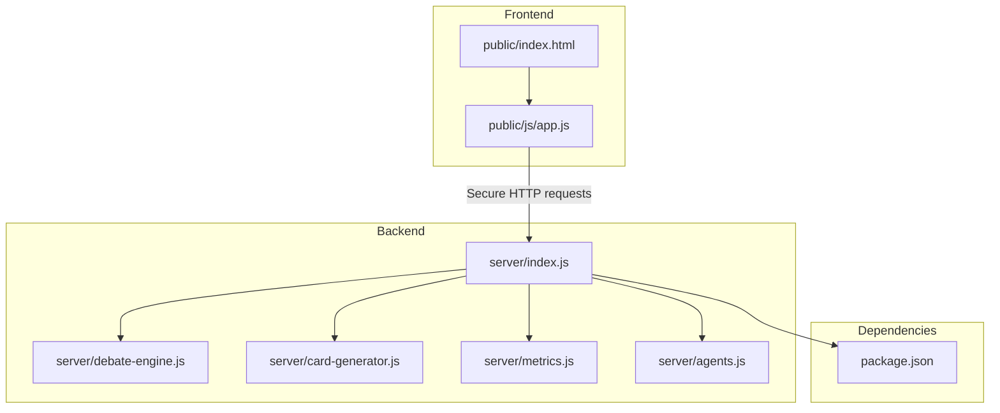
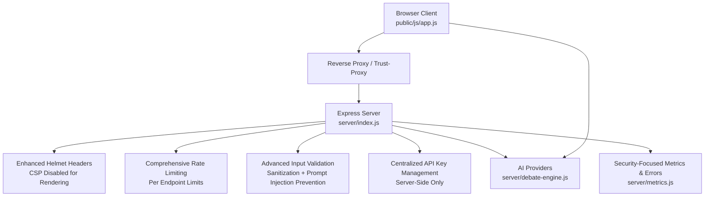
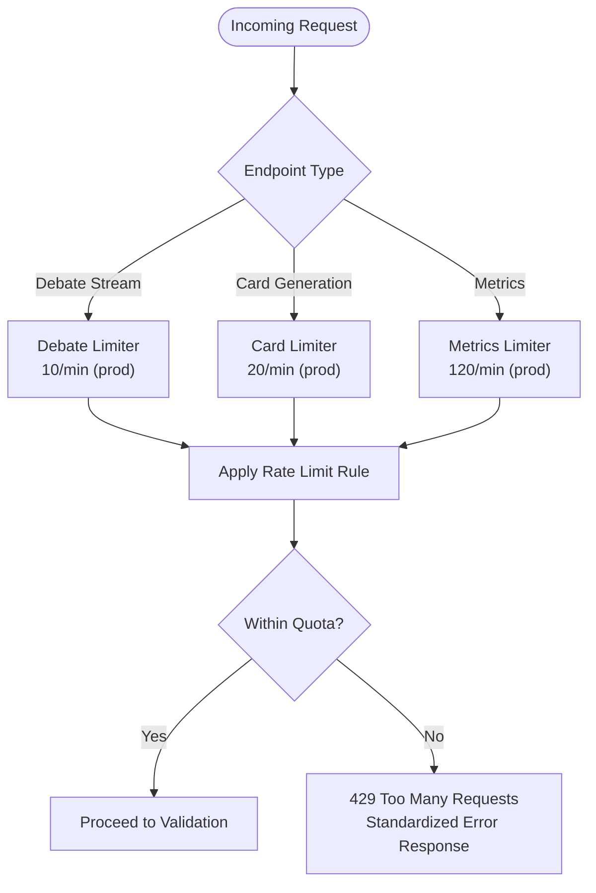
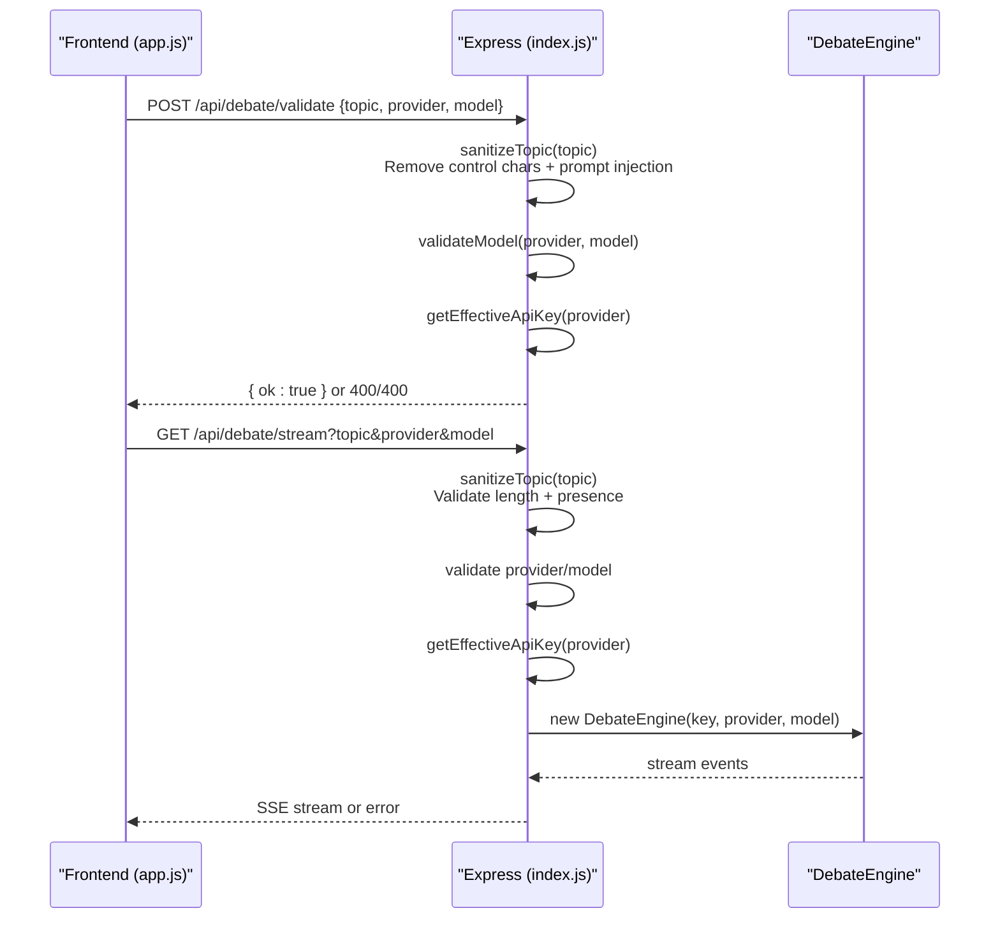
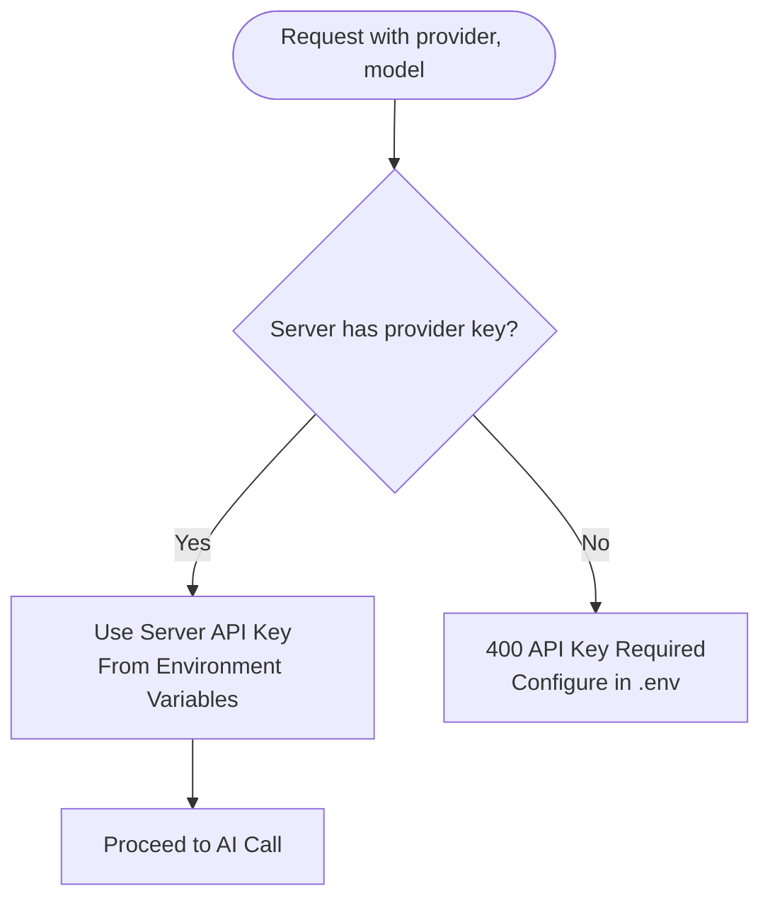
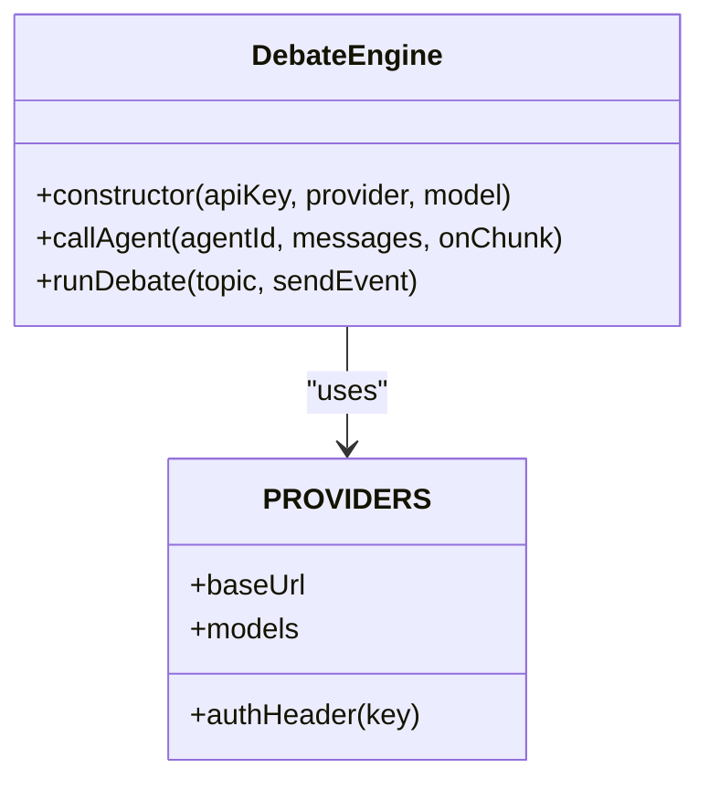
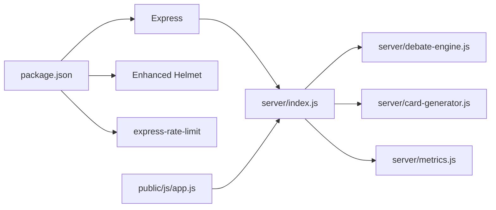

# Security Architecture

<cite>
**Referenced Files in This Document**
- [package.json](file://dissensus-engine/package.json)
- [index.js](file://dissensus-engine/server/index.js)
- [app.js](file://dissensus-engine/public/js/app.js)
- [debate-engine.js](file://dissensus-engine/server/debate-engine.js)
- [card-generator.js](file://dissensus-engine/server/card-generator.js)
- [metrics.js](file://dissensus-engine/server/metrics.js)
- [QUICK-REFERENCE.md](file://dissensus-engine/docs/QUICK-REFERENCE.md)
- [index.html](file://dissensus-engine/public/index.html)
- [agents.js](file://dissensus-engine/server/agents.js)
</cite>

## Update Summary
**Changes Made**
- Enhanced API security with centralized server-side key management
- Implemented comprehensive input sanitization and validation
- Added robust rate limiting with per-endpoint quotas
- Removed client-side API key handling in favor of server-side configuration
- Strengthened XSS prevention through HTML escaping and markdown rendering
- Improved error handling to prevent information leakage

## Table of Contents
1. [Introduction](#introduction)
2. [Project Structure](#project-structure)
3. [Core Components](#core-components)
4. [Architecture Overview](#architecture-overview)
5. [Detailed Component Analysis](#detailed-component-analysis)
6. [Dependency Analysis](#dependency-analysis)
7. [Performance Considerations](#performance-considerations)
8. [Troubleshooting Guide](#troubleshooting-guide)
9. [Conclusion](#conclusion)
10. [Appendices](#appendices)

## Introduction
This document describes the Dissensus security architecture and threat mitigation strategies. It covers multi-layered protections across input validation, rate limiting, API key management, access control, blockchain integration safeguards, Express.js middleware configuration, API security patterns, AI provider integration hygiene, data privacy, authentication, monitoring, logging, and incident response. The analysis focuses on the production-ready Express server, frontend client, and supporting modules documented in the repository.

**Updated** Enhanced API security with server-side key management, comprehensive input sanitization, and robust rate limiting mechanisms.

## Project Structure
The security architecture spans the backend Express server, frontend client, and shared utilities. Key security-relevant areas include:
- Express server middleware and route handlers with enhanced security configurations
- Frontend input sanitization and error handling with XSS prevention
- AI provider integration with centralized server-side credential management
- Comprehensive rate limiting with per-endpoint quotas
- Enhanced input validation with prompt injection prevention
- Metrics and error recording for observability with security-focused logging
- Deployment and operational security guidance with environment-based configurations

**Diagram sources**
- [index.js:1-382](file://dissensus-engine/server/index.js#L1-L382)
- [app.js:1-620](file://dissensus-engine/public/js/app.js#L1-L620)
- [debate-engine.js:1-399](file://dissensus-engine/server/debate-engine.js#L1-L399)
- [card-generator.js:1-361](file://dissensus-engine/server/card-generator.js#L1-L361)
- [metrics.js:1-112](file://dissensus-engine/server/metrics.js#L1-L112)
- [package.json:1-26](file://dissensus-engine/package.json#L1-L26)

**Section sources**
- [index.js:1-382](file://dissensus-engine/server/index.js#L1-L382)
- [app.js:1-620](file://dissensus-engine/public/js/app.js#L1-L620)
- [package.json:1-26](file://dissensus-engine/package.json#L1-L26)

## Core Components
- Express server with Helmet, rate limiting, and trust-proxy configuration
- Centralized server-side API key management with environment-based configuration
- Comprehensive input validation and parameter sanitization with prompt injection prevention
- Enhanced rate limiting strategy with per-endpoint quotas for different resource types
- Staking-based access control (simulated) with tiered quotas
- Metrics and error recording for monitoring and incident detection with security-focused logging
- AI provider integration with controlled credential exposure and timeout protection
- Frontend XSS prevention via HTML escaping and markdown rendering
- Comprehensive error handling to prevent information leakage

**Updated** Enhanced API security with centralized server-side key management and comprehensive input sanitization.

**Section sources**
- [index.js:30-53](file://dissensus-engine/server/index.js#L30-L53)
- [index.js:120-128](file://dissensus-engine/server/index.js#L120-L128)
- [index.js:37-53](file://dissensus-engine/server/index.js#L37-L53)
- [index.js:65-72](file://dissensus-engine/server/index.js#L65-L72)
- [app.js:86-112](file://dissensus-engine/public/js/app.js#L86-L112)

## Architecture Overview
The security architecture follows layered defense-in-depth with enhanced API security:
- Transport and network: reverse proxy and trust-proxy configuration with Helmet security headers
- Application: enhanced Helmet configuration, comprehensive rate limiting, advanced input validation, and secure error handling
- Access control: server-side API key management with centralized configuration and staking enforcement
- Data protection: comprehensive XSS prevention, input sanitization, and prompt injection protection
- Observability: metrics, error recording, and operational logging with security-focused error reporting

**Diagram sources**
- [index.js:25-28](file://dissensus-engine/server/index.js#L25-L28)
- [index.js:58-61](file://dissensus-engine/server/index.js#L58-L61)
- [index.js:65-72](file://dissensus-engine/server/index.js#L65-L72)
- [index.js:37-53](file://dissensus-engine/server/index.js#L37-L53)
- [index.js:120-128](file://dissensus-engine/server/index.js#L120-L128)
- [debate-engine.js:58-126](file://dissensus-engine/server/debate-engine.js#L58-L126)
- [metrics.js:59-64](file://dissensus-engine/server/metrics.js#L59-L64)
- [app.js:86-112](file://dissensus-engine/public/js/app.js#L86-L112)

## Detailed Component Analysis

### Enhanced Express Security Middleware and Configuration
- Helmet: applied with selective CSP and COEP disabled to maintain compatibility with client-side rendering and external resources
- Trust proxy: configured via environment variable to support reverse proxies and accurate client IP resolution for rate limiting
- Body parsing: JSON body limit enforced for payload safety (50kb limit for card payloads)
- Static serving: public assets served securely
- **Updated** Enhanced security headers and configurations for production deployment

Operational guidance:
- Configure TRUST_PROXY and TRUST_PROXY_HOPS according to your reverse proxy stack
- Keep CSP disabled only if required by the app's rendering needs; otherwise enable CSP for stricter controls
- Store all API keys in environment variables only

**Section sources**
- [index.js:58-61](file://dissensus-engine/server/index.js#L58-L61)
- [index.js:25-28](file://dissensus-engine/server/index.js#L25-L28)
- [index.js:62](file://dissensus-engine/server/index.js#L62)

### Comprehensive Rate Limiting Strategy
- Global debate endpoint: per-minute limits with differentiated thresholds for production and development (10/min in prod, 100/min in dev)
- Card generation endpoint: separate rate limiter to control image generation throughput (20/min in prod, 100/min in dev)
- Metrics endpoint: per-minute limits for public analytics (120/min in prod, 300/min in dev)
- **Updated** Enhanced rate limiting with per-endpoint quotas and standardized error responses

**Diagram sources**
- [index.js:65-72](file://dissensus-engine/server/index.js#L65-L72)
- [index.js:275-281](file://dissensus-engine/server/index.js#L275-L281)
- [index.js:322-328](file://dissensus-engine/server/index.js#L322-L328)

**Section sources**
- [index.js:65-72](file://dissensus-engine/server/index.js#L65-L72)
- [index.js:275-281](file://dissensus-engine/server/index.js#L275-L281)
- [index.js:322-328](file://dissensus-engine/server/index.js#L322-L328)

### Advanced Input Validation and Parameter Sanitization
- **Enhanced** Server-side validation with comprehensive sanitization:
  - Topic length bounds (3-500 characters) and presence checks
  - Prompt injection prevention by stripping control characters and system prompt manipulation attempts
  - Provider/model validation against known configurations
  - **Updated** Advanced sanitization removing sequences that could manipulate LLM system prompts
- Client-side sanitization:
  - HTML escaping to prevent XSS in rendered markdown
  - Markdown renderer escapes unsafe tags and attributes

**Diagram sources**
- [index.js:37-53](file://dissensus-engine/server/index.js#L37-L53)
- [index.js:142-166](file://dissensus-engine/server/index.js#L142-L166)
- [index.js:183-256](file://dissensus-engine/server/index.js#L183-L256)
- [app.js:244-328](file://dissensus-engine/public/js/app.js#L244-L328)
- [debate-engine.js:58-126](file://dissensus-engine/server/debate-engine.js#L58-L126)

**Section sources**
- [index.js:37-53](file://dissensus-engine/server/index.js#L37-L53)
- [index.js:142-166](file://dissensus-engine/server/index.js#L142-L166)
- [index.js:183-256](file://dissensus-engine/server/index.js#L183-L256)
- [app.js:86-112](file://dissensus-engine/public/js/app.js#L86-L112)

### Centralized API Key Management and Access Control
- **Enhanced** Server-side keys: loaded from environment variables only (DEEPSEEK_API_KEY, OPENAI_API_KEY, GEMINI_API_KEY)
- **Updated** Effective key resolution: API keys are ALWAYS loaded from server-side environment variables
- **Removed** Client-side API key handling - client requests NEVER provide or influence API key selection
- **Updated** Key availability: server exposes provider availability via configuration endpoint without revealing actual keys
- Staking enforcement: when enabled, wallet address is required and daily debate quotas are enforced

**Diagram sources**
- [index.js:120-128](file://dissensus-engine/server/index.js#L120-L128)
- [index.js:31-35](file://dissensus-engine/server/index.js#L31-L35)

**Section sources**
- [index.js:30-35](file://dissensus-engine/server/index.js#L30-L35)
- [index.js:120-128](file://dissensus-engine/server/index.js#L120-L128)
- [index.js:77-86](file://dissensus-engine/server/index.js#L77-L86)

### Staking-Based Access Control (Simulated)
- Enforced via environment flag and wallet normalization
- Daily debate quotas and tier-based allowances are integrated into request flow
- Staking endpoints expose simulated status, stake/unstake, and tiers

**Diagram sources**
- [index.js:184-192](file://dissensus-engine/server/index.js#L184-L192)
- [index.js:224-234](file://dissensus-engine/server/index.js#L224-L234)

**Section sources**
- [index.js:30-31](file://dissensus-engine/server/index.js#L30-L31)
- [index.js:184-192](file://dissensus-engine/server/index.js#L184-L192)
- [index.js:224-234](file://dissensus-engine/server/index.js#L224-L234)

### AI Provider Integration Security
- **Enhanced** Controlled credential exposure: server-side keys are never sent to the client; availability is indicated via configuration endpoint
- Provider-specific base URLs and authentication headers are encapsulated within the debate engine
- **Updated** Timeout protection: per-call timeout (90 seconds) prevents resource exhaustion
- Optional LLM summarization for shareable cards uses server-side keys when available

**Diagram sources**
- [debate-engine.js:41-53](file://dissensus-engine/server/debate-engine.js#L41-L53)
- [debate-engine.js:14-39](file://dissensus-engine/server/debate-engine.js#L14-L39)

**Section sources**
- [debate-engine.js:58-126](file://dissensus-engine/server/debate-engine.js#L58-L126)
- [card-generator.js:40-85](file://dissensus-engine/server/card-generator.js#L40-L85)

### Frontend XSS Prevention and Content Safety
- **Enhanced** HTML escaping before markdown rendering prevents script injection in LLM outputs
- Markdown renderer escapes tags and attributes, then applies safe transformations
- **Updated** Comprehensive XSS prevention through multiple layers of sanitization
- Client-side error messages avoid exposing internal details

**Section sources**
- [app.js:86-112](file://dissensus-engine/public/js/app.js#L86-L112)
- [app.js:244-328](file://dissensus-engine/public/js/app.js#L244-L328)

### Security-Focused Metrics, Logging, and Monitoring
- **Enhanced** In-memory metrics capture debates, provider usage, recent topics, and request success/failure rates
- **Updated** Error recording centralizes exceptions for diagnostics with security-focused error reporting
- **Updated** Public metrics endpoint exposes aggregated stats with rate limiting
- **Updated** Security-focused error handling prevents information leakage

**Section sources**
- [metrics.js:32-64](file://dissensus-engine/server/metrics.js#L32-L64)
- [index.js:330-346](file://dissensus-engine/server/index.js#L330-L346)

## Dependency Analysis
The server depends on Express, Helmet, and express-rate-limit for transport and rate limiting. AI provider integrations are encapsulated within the debate engine. Frontend communicates with the server via HTTP endpoints and SSE.

**Diagram sources**
- [package.json:10-17](file://dissensus-engine/package.json#L10-L17)
- [index.js:6-15](file://dissensus-engine/server/index.js#L6-L15)

**Section sources**
- [package.json:10-17](file://dissensus-engine/package.json#L10-L17)
- [index.js:6-15](file://dissensus-engine/server/index.js#L6-L15)

## Performance Considerations
- **Updated** Rate limit tuning: adjust per-endpoint quotas based on provider costs and infrastructure capacity
- Body size limits: keep JSON payloads small to reduce memory pressure (50kb limit for card payloads)
- SSE streaming: client aborts after ten minutes to prevent resource leaks
- Font loading: card generator fetches fonts over HTTPS; ensure CDN reliability for image generation
- **Updated** Timeout protection: per-call AI API timeouts prevent resource exhaustion

## Troubleshooting Guide
- Health checks: use the health endpoint to verify service availability
- Logs: journalctl for systemd-managed service logs; nginx error logs for reverse proxy issues
- Rate limit errors: inspect 429 responses and review per-endpoint limits
- API key issues: confirm server-side keys and provider availability via configuration endpoint
- **Updated** Security-related errors: check error logs for security-focused diagnostic information
- Operational commands: refer to quick-reference for systemctl, journalctl, and curl verification

**Section sources**
- [index.js:93-99](file://dissensus-engine/server/index.js#L93-L99)
- [QUICK-REFERENCE.md:75-95](file://dissensus-engine/docs/QUICK-REFERENCE.md#L75-L95)
- [QUICK-REFERENCE.md:141-164](file://dissensus-engine/docs/QUICK-REFERENCE.md#L141-L164)

## Conclusion
Dissensus employs a comprehensive layered security model combining transport hardening, strict input validation, robust rate limiting, centralized API key management, and simulated staking-based access control. The architecture minimizes credential exposure, prevents XSS and prompt injection attacks, and provides observability through security-focused metrics and logging. The enhanced API security with server-side key management and comprehensive input sanitization ensures secure deployment and maintenance.

## Appendices

### Enhanced Security Configuration Checklist
- **Updated** Enable and configure trust proxy for your reverse proxy stack
- **Updated** Set appropriate rate limits per endpoint with production defaults
- **Updated** Store ALL API keys in environment variables only; never commit secrets
- **Updated** Validate and sanitize all user inputs on both client and server with prompt injection prevention
- **Updated** Monitor metrics and logs for security anomalies
- **Updated** Review CSP and COEP settings periodically for improved security posture
- **Updated** Regularly audit server-side key configuration and access patterns
- **Updated** Implement comprehensive error handling to prevent information leakage