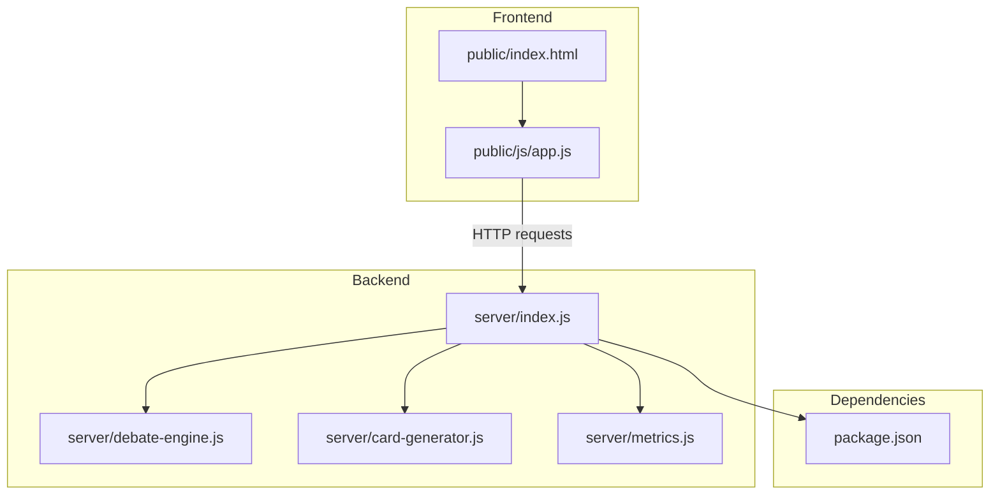
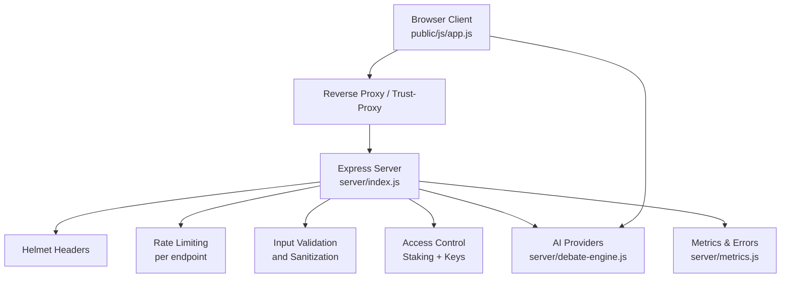
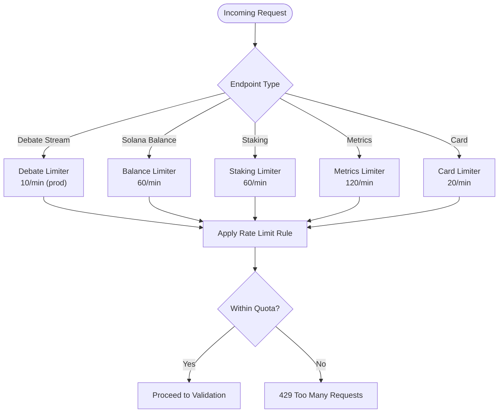
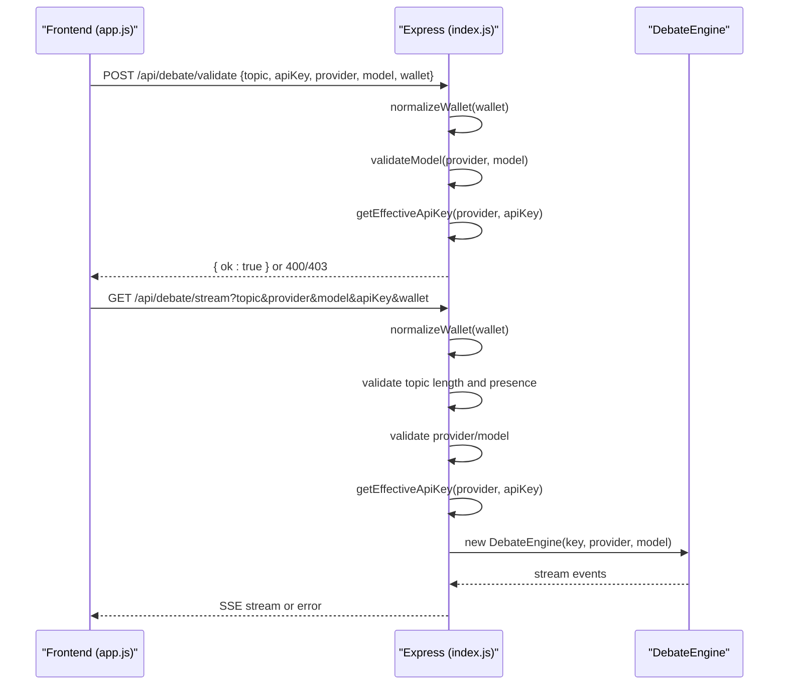
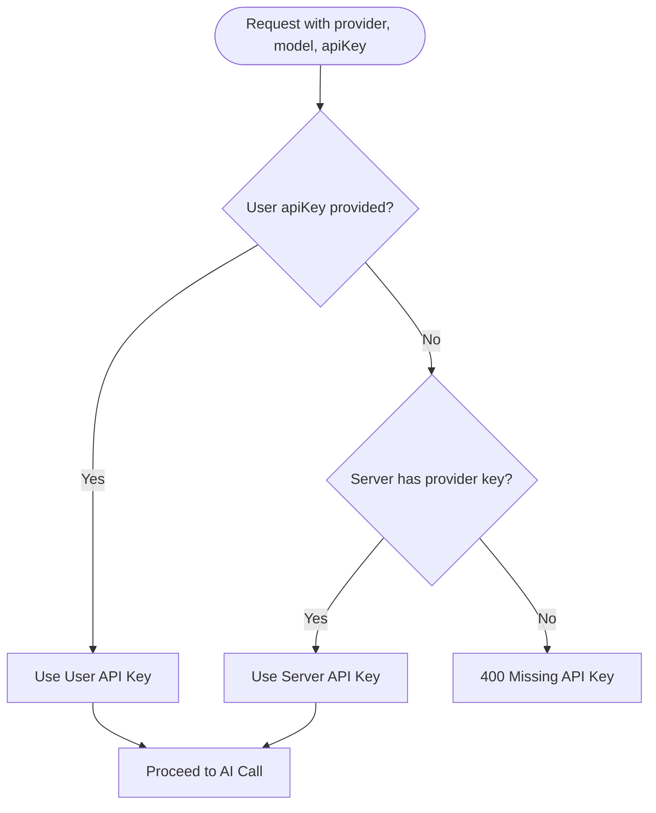
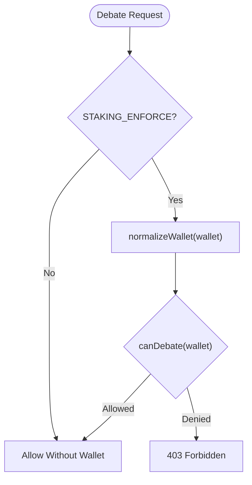
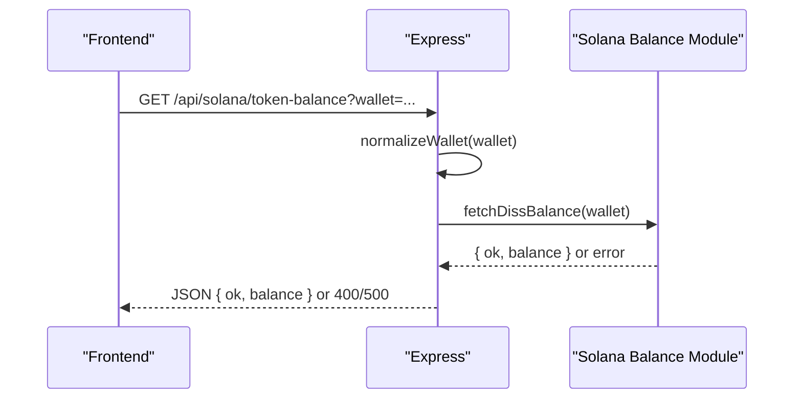
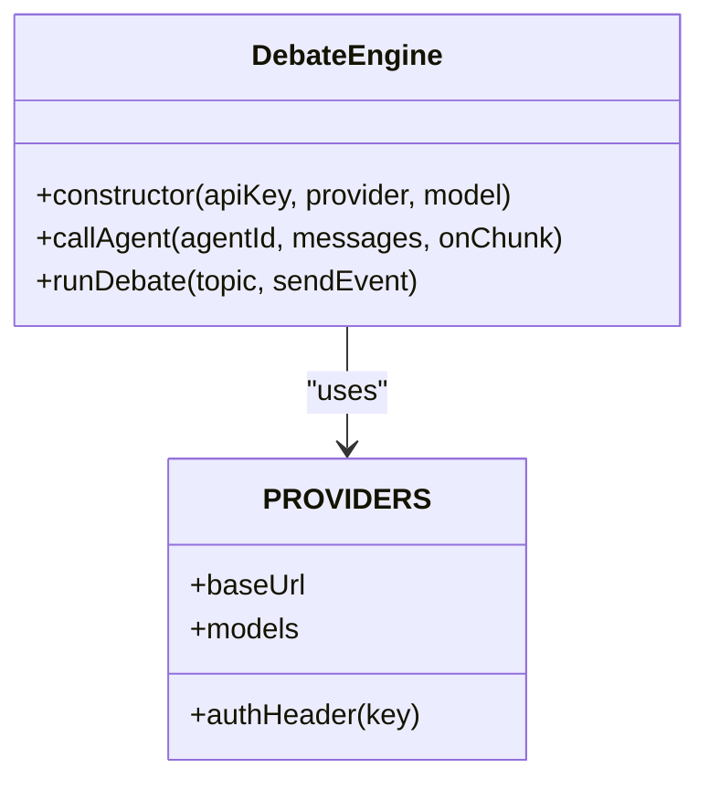
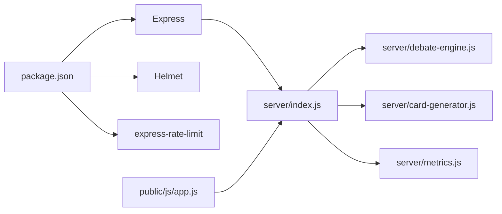

# Security Architecture

<cite>
**Referenced Files in This Document**
- [package.json](file://dissensus-engine/package.json)
- [index.js](file://dissensus-engine/server/index.js)
- [app.js](file://dissensus-engine/public/js/app.js)
- [debate-engine.js](file://dissensus-engine/server/debate-engine.js)
- [card-generator.js](file://dissensus-engine/server/card-generator.js)
- [metrics.js](file://dissensus-engine/server/metrics.js)
- [QUICK-REFERENCE.md](file://dissensus-engine/docs/QUICK-REFERENCE.md)
- [index.html](file://dissensus-engine/public/index.html)
</cite>

## Table of Contents
1. [Introduction](#introduction)
2. [Project Structure](#project-structure)
3. [Core Components](#core-components)
4. [Architecture Overview](#architecture-overview)
5. [Detailed Component Analysis](#detailed-component-analysis)
6. [Dependency Analysis](#dependency-analysis)
7. [Performance Considerations](#performance-considerations)
8. [Troubleshooting Guide](#troubleshooting-guide)
9. [Conclusion](#conclusion)
10. [Appendices](#appendices)

## Introduction
This document describes the Dissensus security architecture and threat mitigation strategies. It covers multi-layered protections across input validation, rate limiting, API key management, access control, blockchain integration safeguards, Express.js middleware configuration, API security patterns, AI provider integration hygiene, data privacy, authentication, monitoring, logging, and incident response. The analysis focuses on the production-ready Express server, frontend client, and supporting modules documented in the repository.

## Project Structure
The security architecture spans the backend Express server, frontend client, and shared utilities. Key security-relevant areas include:
- Express server middleware and route handlers
- Frontend input sanitization and error handling
- AI provider integration and credential management
- Staking-based access control (simulated)
- Metrics and error recording for observability
- Deployment and operational security guidance

**Diagram sources**
- [index.js:1-481](file://dissensus-engine/server/index.js#L1-L481)
- [app.js:1-674](file://dissensus-engine/public/js/app.js#L1-L674)
- [debate-engine.js:1-389](file://dissensus-engine/server/debate-engine.js#L1-L389)
- [card-generator.js:1-361](file://dissensus-engine/server/card-generator.js#L1-L361)
- [metrics.js:1-152](file://dissensus-engine/server/metrics.js#L1-L152)
- [package.json:1-28](file://dissensus-engine/package.json#L1-L28)

**Section sources**
- [index.js:1-481](file://dissensus-engine/server/index.js#L1-L481)
- [app.js:1-674](file://dissensus-engine/public/js/app.js#L1-L674)
- [package.json:1-28](file://dissensus-engine/package.json#L1-L28)

## Core Components
- Express server with Helmet, rate limiting, and trust-proxy configuration
- Input validation and parameter sanitization in routes and client
- API key management with server-side keys and optional user overrides
- Staking-based access control (simulated) with tiered quotas
- Metrics and error recording for monitoring and incident detection
- AI provider integration with controlled credential exposure
- Frontend XSS prevention via HTML escaping and markdown rendering

**Section sources**
- [index.js:48-133](file://dissensus-engine/server/index.js#L48-L133)
- [app.js:103-129](file://dissensus-engine/public/js/app.js#L103-L129)
- [debate-engine.js:41-53](file://dissensus-engine/server/debate-engine.js#L41-L53)
- [metrics.js:46-80](file://dissensus-engine/server/metrics.js#L46-L80)

## Architecture Overview
The security architecture follows layered defense-in-depth:
- Transport and network: reverse proxy and trust-proxy configuration
- Application: Helmet, rate limiting, input validation, and error handling
- Access control: staking enforcement and provider key precedence
- Data protection: client-side XSS prevention and minimal data exposure
- Observability: metrics, error recording, and operational logging

**Diagram sources**
- [index.js:32-64](file://dissensus-engine/server/index.js#L32-L64)
- [index.js:157-215](file://dissensus-engine/server/index.js#L157-L215)
- [index.js:220-311](file://dissensus-engine/server/index.js#L220-L311)
- [debate-engine.js:41-53](file://dissensus-engine/server/debate-engine.js#L41-L53)
- [metrics.js:46-80](file://dissensus-engine/server/metrics.js#L46-L80)
- [app.js:103-129](file://dissensus-engine/public/js/app.js#L103-L129)

## Detailed Component Analysis

### Express Security Middleware and Configuration
- Helmet: applied with selective CSP and COEP disabled to maintain compatibility with client-side rendering and external resources.
- Trust proxy: configured via environment variable to support reverse proxies and accurate client IP resolution for rate limiting.
- Body parsing: JSON body limit enforced for payload safety.
- Static serving: public assets served securely.

Operational guidance:
- Configure TRUST_PROXY and TRUST_PROXY_HOPS according to your reverse proxy stack.
- Keep CSP disabled only if required by the app’s rendering needs; otherwise enable CSP for stricter controls.

**Section sources**
- [index.js:32-55](file://dissensus-engine/server/index.js#L32-L55)
- [package.json:10-19](file://dissensus-engine/package.json#L10-L19)

### Rate Limiting Strategy
- Global debate endpoint: per-minute limits with differentiated thresholds for production and development.
- Solana balance endpoint: separate rate limiter to protect on-chain queries.
- Staking endpoints: per-minute limits to prevent abuse of simulated staking operations.
- Metrics endpoints: per-minute limits for public analytics.
- Card generation: per-minute limits to control image generation throughput.

**Diagram sources**
- [index.js:57-64](file://dissensus-engine/server/index.js#L57-L64)
- [index.js:90-96](file://dissensus-engine/server/index.js#L90-L96)
- [index.js:316-322](file://dissensus-engine/server/index.js#L316-L322)
- [index.js:421-427](file://dissensus-engine/server/index.js#L421-L427)
- [index.js:374-380](file://dissensus-engine/server/index.js#L374-L380)

**Section sources**
- [index.js:57-64](file://dissensus-engine/server/index.js#L57-L64)
- [index.js:90-96](file://dissensus-engine/server/index.js#L90-L96)
- [index.js:316-322](file://dissensus-engine/server/index.js#L316-L322)
- [index.js:421-427](file://dissensus-engine/server/index.js#L421-L427)
- [index.js:374-380](file://dissensus-engine/server/index.js#L374-L380)

### Input Validation and Parameter Sanitization
- Server-side validation:
  - Topic length bounds and presence checks.
  - Provider/model validation against known configurations.
  - Wallet normalization and staking enforcement when enabled.
  - API key precedence: user-provided key overrides server-side key when present.
- Client-side sanitization:
  - HTML escaping to prevent XSS in rendered markdown.
  - Markdown renderer escapes unsafe tags and attributes.

**Diagram sources**
- [index.js:177-215](file://dissensus-engine/server/index.js#L177-L215)
- [index.js:220-311](file://dissensus-engine/server/index.js#L220-L311)
- [app.js:274-356](file://dissensus-engine/public/js/app.js#L274-L356)
- [debate-engine.js:41-53](file://dissensus-engine/server/debate-engine.js#L41-L53)

**Section sources**
- [index.js:177-215](file://dissensus-engine/server/index.js#L177-L215)
- [index.js:220-311](file://dissensus-engine/server/index.js#L220-L311)
- [app.js:103-129](file://dissensus-engine/public/js/app.js#L103-L129)

### API Key Management and Access Control
- Server-side keys: loaded from environment variables and exposed to the client only as availability indicators.
- Effective key resolution: user-provided key takes precedence; otherwise server-side key is used when configured.
- Staking enforcement: when enabled, wallet address is required and daily debate quotas are enforced via staking module integration.

**Diagram sources**
- [index.js:157-163](file://dissensus-engine/server/index.js#L157-L163)
- [index.js:69-85](file://dissensus-engine/server/index.js#L69-L85)

**Section sources**
- [index.js:40-45](file://dissensus-engine/server/index.js#L40-L45)
- [index.js:157-163](file://dissensus-engine/server/index.js#L157-L163)
- [index.js:69-85](file://dissensus-engine/server/index.js#L69-L85)

### Staking-Based Access Control (Simulated)
- Enforced via environment flag and wallet normalization.
- Daily debate quotas and tier-based allowances are integrated into request flow.
- Staking endpoints expose simulated status, stake/unstake, and tiers.

**Diagram sources**
- [index.js:184-192](file://dissensus-engine/server/index.js#L184-L192)
- [index.js:224-234](file://dissensus-engine/server/index.js#L224-L234)

**Section sources**
- [index.js:30-31](file://dissensus-engine/server/index.js#L30-L31)
- [index.js:184-192](file://dissensus-engine/server/index.js#L184-L192)
- [index.js:224-234](file://dissensus-engine/server/index.js#L224-L234)

### Blockchain Integration Safeguards
- On-chain balance endpoint: validates wallet parameter and returns normalized errors without leaking internal failures.
- Private key protection: server-side keys are managed in environment variables; no private key material is exposed to clients.
- Staking program integration: placeholder endpoint indicates on-chain staking readiness and instructions.

**Diagram sources**
- [index.js:98-111](file://dissensus-engine/server/index.js#L98-L111)

**Section sources**
- [index.js:88-122](file://dissensus-engine/server/index.js#L88-L122)

### AI Provider Integration Security
- Controlled credential exposure: server-side keys are never sent to the client; availability is indicated via configuration endpoint.
- Provider-specific base URLs and authentication headers are encapsulated within the debate engine.
- Optional LLM summarization for shareable cards uses server-side keys when available.

**Diagram sources**
- [debate-engine.js:41-53](file://dissensus-engine/server/debate-engine.js#L41-L53)
- [debate-engine.js:14-39](file://dissensus-engine/server/debate-engine.js#L14-L39)

**Section sources**
- [debate-engine.js:41-85](file://dissensus-engine/server/debate-engine.js#L41-L85)
- [card-generator.js:41-85](file://dissensus-engine/server/card-generator.js#L41-L85)

### Frontend XSS Prevention and Content Safety
- HTML escaping before markdown rendering prevents script injection in LLM outputs.
- Markdown renderer escapes tags and attributes, then applies safe transformations.
- Client-side error messages avoid exposing internal details.

**Section sources**
- [app.js:103-129](file://dissensus-engine/public/js/app.js#L103-L129)
- [app.js:209-356](file://dissensus-engine/public/js/app.js#L209-L356)

### Metrics, Logging, and Monitoring
- In-memory metrics capture debates, provider usage, recent topics, and request success/failure rates.
- Error recording centralizes exceptions for diagnostics.
- Public metrics endpoint exposes aggregated stats with rate limiting.

**Section sources**
- [metrics.js:46-132](file://dissensus-engine/server/metrics.js#L46-L132)
- [index.js:429-441](file://dissensus-engine/server/index.js#L429-L441)

## Dependency Analysis
The server depends on Express, Helmet, and express-rate-limit for transport and rate limiting. AI provider integrations are encapsulated within the debate engine. Frontend communicates with the server via HTTP endpoints and SSE.

**Diagram sources**
- [package.json:10-19](file://dissensus-engine/package.json#L10-L19)
- [index.js:6-25](file://dissensus-engine/server/index.js#L6-L25)

**Section sources**
- [package.json:10-19](file://dissensus-engine/package.json#L10-L19)
- [index.js:6-25](file://dissensus-engine/server/index.js#L6-L25)

## Performance Considerations
- Rate limit tuning: adjust per-endpoint quotas based on provider costs and infrastructure capacity.
- Body size limits: keep JSON payloads small to reduce memory pressure.
- SSE streaming: client aborts after five minutes to prevent resource leaks.
- Font loading: card generator fetches fonts over HTTPS; ensure CDN reliability for image generation.

[No sources needed since this section provides general guidance]

## Troubleshooting Guide
- Health checks: use the health endpoint to verify service availability.
- Logs: journalctl for systemd-managed service logs; nginx error logs for reverse proxy issues.
- Rate limit errors: inspect 429 responses and review per-endpoint limits.
- API key issues: confirm server-side keys and provider availability via configuration endpoint.
- Operational commands: refer to quick-reference for systemctl, journalctl, and curl verification.

**Section sources**
- [index.js:127-133](file://dissensus-engine/server/index.js#L127-L133)
- [QUICK-REFERENCE.md:75-95](file://dissensus-engine/docs/QUICK-REFERENCE.md#L75-L95)
- [QUICK-REFERENCE.md:141-164](file://dissensus-engine/docs/QUICK-REFERENCE.md#L141-L164)

## Conclusion
Dissensus employs a layered security model combining transport hardening, strict input validation, robust rate limiting, controlled API key management, and simulated staking-based access control. The architecture minimizes credential exposure, prevents XSS, and provides observability through metrics and logging. Operational guidance supports secure deployment and maintenance.

[No sources needed since this section summarizes without analyzing specific files]

## Appendices

### Security Configuration Checklist
- Enable and configure trust proxy for your reverse proxy stack.
- Set appropriate rate limits per endpoint.
- Store API keys in environment variables; never commit secrets.
- Validate and sanitize all user inputs on both client and server.
- Monitor metrics and logs for anomalies.
- Review CSP and COEP settings periodically for improved security posture.

[No sources needed since this section provides general guidance]