# System Architecture

<cite>
**Referenced Files in This Document**
- [README.md](file://README.md)
- [dissensus-engine/README.md](file://dissensus-engine/README.md)
- [dissensus-engine/package.json](file://dissensus-engine/package.json)
- [dissensus-engine/server/index.js](file://dissensus-engine/server/index.js)
- [dissensus-engine/server/debate-engine.js](file://dissensus-engine/server/debate-engine.js)
- [dissensus-engine/server/metrics.js](file://dissensus-engine/server/metrics.js)
- [dissensus-engine/server/card-generator.js](file://dissensus-engine/server/card-generator.js)
- [dissensus-engine/server/agents.js](file://dissensus-engine/server/agents.js)
- [dissensus-engine/public/index.html](file://dissensus-engine/public/index.html)
- [dissensus-engine/public/js/app.js](file://dissensus-engine/public/js/app.js)
- [dissensus-engine/docs/DEPLOY-VPS.md](file://dissensus-engine/docs/DEPLOY-VPS.md)
- [diss-launch-kit/website/index.html](file://diss-launch-kit/website/index.html)
</cite>

## Update Summary
**Changes Made**
- Removed references to legacy forum system and Python backend components
- Updated deployment topology to reflect current single-node VPS approach with Node.js-only architecture
- Simplified architecture to focus on core AI debate engine without blockchain integration
- Updated system context diagrams to reflect streamlined Node.js-only deployment
- Removed staking-related dependencies and configurations from package.json

## Table of Contents
1. [Introduction](#introduction)
2. [Project Structure](#project-structure)
3. [Core Components](#core-components)
4. [Architecture Overview](#architecture-overview)
5. [Detailed Component Analysis](#detailed-component-analysis)
6. [Dependency Analysis](#dependency-analysis)
7. [Performance Considerations](#performance-considerations)
8. [Troubleshooting Guide](#troubleshooting-guide)
9. [Conclusion](#conclusion)
10. [Appendices](#appendices)

## Introduction
This document describes the Dissensus system architecture, focusing on the AI debate engine and frontend applications. The system follows a modern Node.js architecture with a microservices-style composition:
- Express.js server layer with Server-Sent Events (SSE) for real-time debate streaming
- AI debate orchestration with three specialized agent personalities
- Frontend applications for user interaction and content presentation
- Single-node VPS deployment with Nginx reverse proxy and SSL termination

The architecture emphasizes modularity, scalability, and clear separation of concerns across the AI debate orchestration, real-time streaming, and user interface layers. The system has been streamlined to focus on core debate functionality without legacy components.

## Project Structure
The repository organizes functionality into distinct modules:
- dissensus-engine: Express.js server, debate orchestration, SSE streaming, metrics, and frontend assets
- diss-launch-kit: Landing page website for brand and marketing information
- Root-level documentation and deployment guides

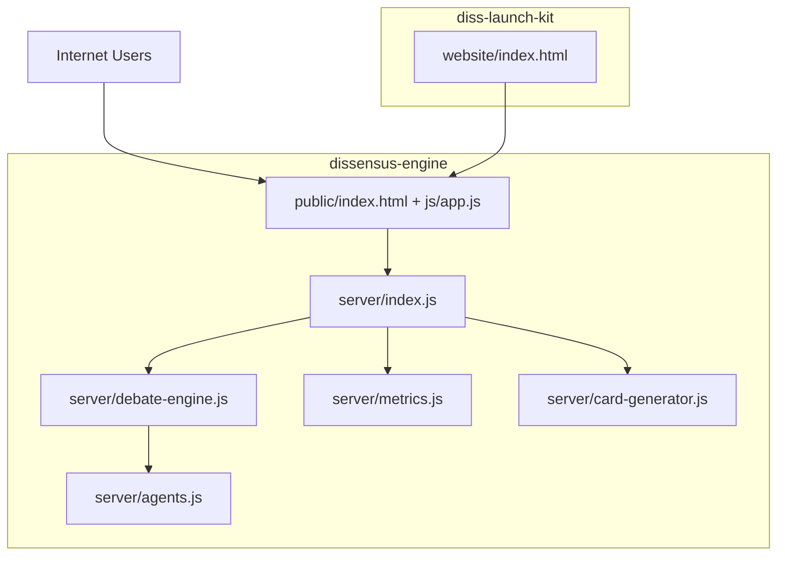

**Diagram sources**
- [dissensus-engine/server/index.js:1-382](file://dissensus-engine/server/index.js#L1-L382)
- [dissensus-engine/server/debate-engine.js:1-399](file://dissensus-engine/server/debate-engine.js#L1-L399)
- [dissensus-engine/server/metrics.js:1-112](file://dissensus-engine/server/metrics.js#L1-L112)
- [dissensus-engine/server/card-generator.js:1-361](file://dissensus-engine/server/card-generator.js#L1-L361)
- [dissensus-engine/server/agents.js:1-148](file://dissensus-engine/server/agents.js#L1-L148)
- [dissensus-engine/public/index.html:1-183](file://dissensus-engine/public/index.html#L1-L183)
- [dissensus-engine/public/js/app.js:1-620](file://dissensus-engine/public/js/app.js#L1-L620)
- [diss-launch-kit/website/index.html:1-451](file://diss-launch-kit/website/index.html#L1-L451)

**Section sources**
- [README.md:20-29](file://README.md#L20-L29)
- [dissensus-engine/README.md:110-134](file://dissensus-engine/README.md#L110-L134)

## Core Components
- Express.js Server (dissensus-engine/server/index.js)
  - Provides SSE streaming endpoint for real-time debate events
  - Exposes APIs for provider configuration, debate validation, metrics, and debate persistence
  - Implements rate limiting, security headers, and graceful shutdown
- Debate Engine (dissensus-engine/server/debate-engine.js)
  - Orchestrates a 4-phase dialectical process across three AI agents (CIPHER, NOVA, PRISM)
  - Integrates with OpenAI, DeepSeek, and Google Gemini providers
  - Streams incremental agent outputs via SSE
- Metrics (dissensus-engine/server/metrics.js)
  - Tracks in-memory statistics for transparency dashboard
  - Aggregates provider usage, debates, and performance metrics
- Card Generator (dissensus-engine/server/card-generator.js)
  - Generates shareable PNG cards for Twitter/X with debate outcomes
  - Includes optional LLM summarization for long verdicts
- Agents (dissensus-engine/server/agents.js)
  - Defines personality profiles and system prompts for each AI agent
  - Provides distinct reasoning styles and roles in the debate process
- Frontend (dissensus-engine/public)
  - React-like UI rendering with markdown rendering and SSE consumption
  - Provider/model selection and debate card generation
- Landing Page (diss-launch-kit/website/index.html)
  - Marketing and informational site with navigation to the debate app

**Section sources**
- [dissensus-engine/server/index.js:1-382](file://dissensus-engine/server/index.js#L1-L382)
- [dissensus-engine/server/debate-engine.js:1-399](file://dissensus-engine/server/debate-engine.js#L1-L399)
- [dissensus-engine/server/metrics.js:1-112](file://dissensus-engine/server/metrics.js#L1-L112)
- [dissensus-engine/server/card-generator.js:1-361](file://dissensus-engine/server/card-generator.js#L1-L361)
- [dissensus-engine/server/agents.js:1-148](file://dissensus-engine/server/agents.js#L1-L148)
- [dissensus-engine/public/index.html:1-183](file://dissensus-engine/public/index.html#L1-L183)
- [dissensus-engine/public/js/app.js:1-620](file://dissensus-engine/public/js/app.js#L1-L620)
- [diss-launch-kit/website/index.html:1-451](file://diss-launch-kit/website/index.html#L1-L451)

## Architecture Overview
The system employs a modern layered architecture:
- Presentation Layer: Frontend apps (debate UI and landing page)
- API Layer: Express.js server handling SSE, validation, and integrations
- Orchestration Layer: Debate engine coordinating multi-agent AI workflows
- Integration Layer: AI providers (OpenAI, DeepSeek, Gemini)
- Persistence Layer: In-memory metrics and debate storage

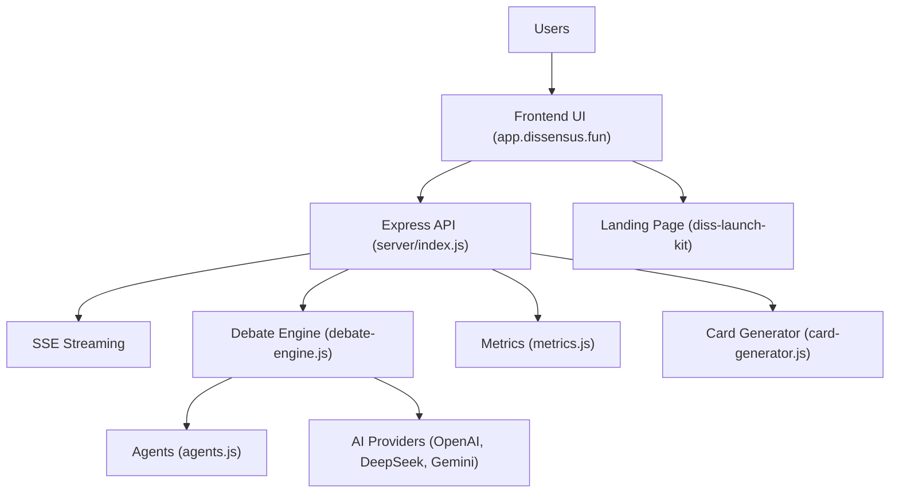

**Diagram sources**
- [dissensus-engine/server/index.js:1-382](file://dissensus-engine/server/index.js#L1-L382)
- [dissensus-engine/server/debate-engine.js:1-399](file://dissensus-engine/server/debate-engine.js#L1-L399)
- [dissensus-engine/server/metrics.js:1-112](file://dissensus-engine/server/metrics.js#L1-L112)
- [dissensus-engine/server/card-generator.js:1-361](file://dissensus-engine/server/card-generator.js#L1-L361)
- [dissensus-engine/server/agents.js:1-148](file://dissensus-engine/server/agents.js#L1-L148)

## Detailed Component Analysis

### Express.js Server Layer
The Express server provides:
- SSE endpoint for real-time debate streaming
- Validation and rate-limited endpoints for providers, metrics, and debate persistence
- Health checks and configuration exposure
- Security middleware and graceful shutdown
- Debate persistence with ID-based retrieval

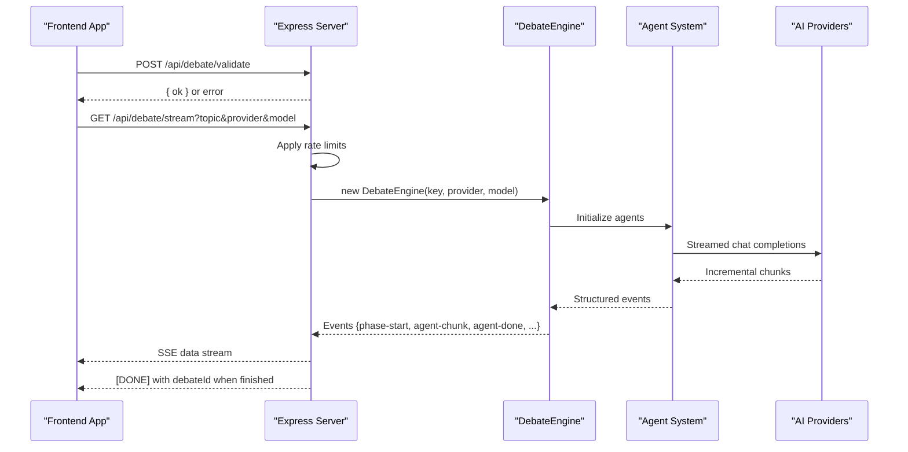

**Diagram sources**
- [dissensus-engine/server/index.js:183-256](file://dissensus-engine/server/index.js#L183-L256)
- [dissensus-engine/server/debate-engine.js:131-396](file://dissensus-engine/server/debate-engine.js#L131-L396)

**Section sources**
- [dissensus-engine/server/index.js:26-382](file://dissensus-engine/server/index.js#L26-L382)
- [dissensus-engine/package.json:1-26](file://dissensus-engine/package.json#L1-L26)

### Real-Time Streaming Architecture (SSE)
The SSE implementation streams structured debate events:
- Headers configured to disable buffering and maintain streaming
- Client consumes via fetch with manual parsing of data blocks
- Events include phase transitions, agent turns, and final verdict with debate ID
- Automatic cleanup and graceful error handling

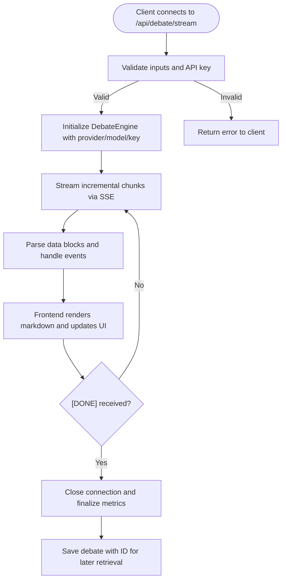

**Diagram sources**
- [dissensus-engine/server/index.js:183-256](file://dissensus-engine/server/index.js#L183-L256)
- [dissensus-engine/public/js/app.js:286-341](file://dissensus-engine/public/js/app.js#L286-L341)

**Section sources**
- [dissensus-engine/server/index.js:212-256](file://dissensus-engine/server/index.js#L212-L256)
- [dissensus-engine/public/js/app.js:342-427](file://dissensus-engine/public/js/app.js#L342-L427)

### AI Providers Integration
The debate engine integrates with multiple providers:
- OpenAI (GPT-4o, GPT-4o Mini)
- DeepSeek (DeepSeek V3.2)
- Google Gemini (2.0 Flash, 2.5 Flash, 2.5 Flash-Lite)

Provider configuration includes base URLs, authentication headers, and model metadata. The engine streams incremental responses and emits structured events for the UI.

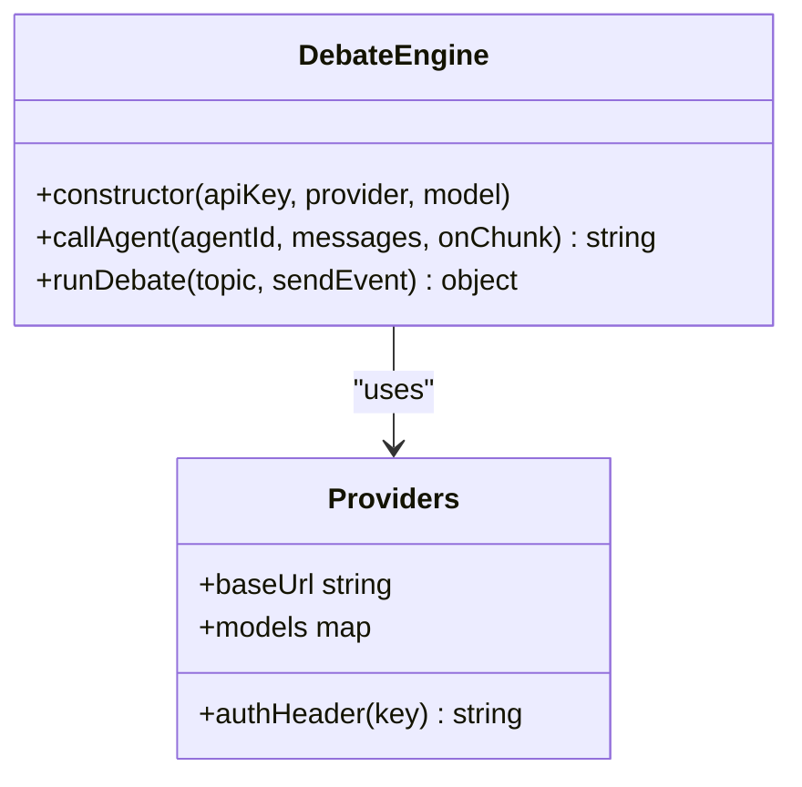

**Diagram sources**
- [dissensus-engine/server/debate-engine.js:14-39](file://dissensus-engine/server/debate-engine.js#L14-L39)
- [dissensus-engine/server/debate-engine.js:41-53](file://dissensus-engine/server/debate-engine.js#L41-L53)

**Section sources**
- [dissensus-engine/server/debate-engine.js:14-39](file://dissensus-engine/server/debate-engine.js#L14-L39)
- [dissensus-engine/server/debate-engine.js:58-116](file://dissensus-engine/server/debate-engine.js#L58-L116)

### Agent System Architecture
The system defines three distinct agent personalities with specialized reasoning approaches:
- CIPHER: The Skeptic - adversarial red-team auditor
- NOVA: The Advocate - blue-sky opportunity finder  
- PRISM: The Synthesizer - neutral analyst and referee

Each agent has unique system prompts, reasoning styles, and roles in the 4-phase debate process.

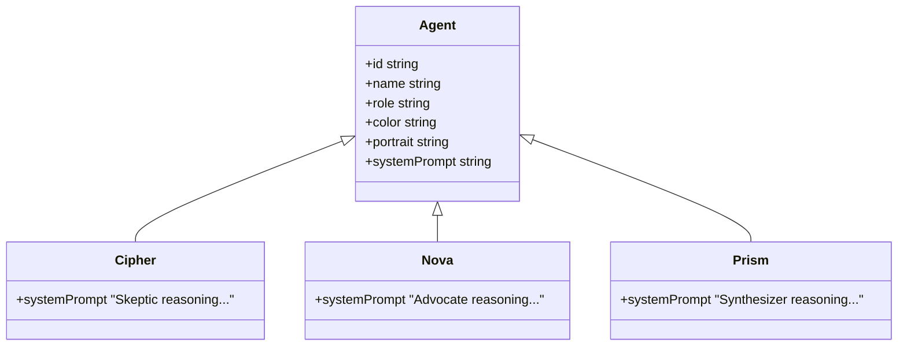

**Diagram sources**
- [dissensus-engine/server/agents.js:8-148](file://dissensus-engine/server/agents.js#L8-L148)

**Section sources**
- [dissensus-engine/server/agents.js:8-148](file://dissensus-engine/server/agents.js#L8-L148)

### Card Generation System
The card generator creates shareable PNG cards for social media:
- Twitter-optimized 1200×630 dimensions
- Automatic truncation of long verdicts
- Optional LLM summarization for complex debates
- Crypto disclosure for cryptocurrency topics

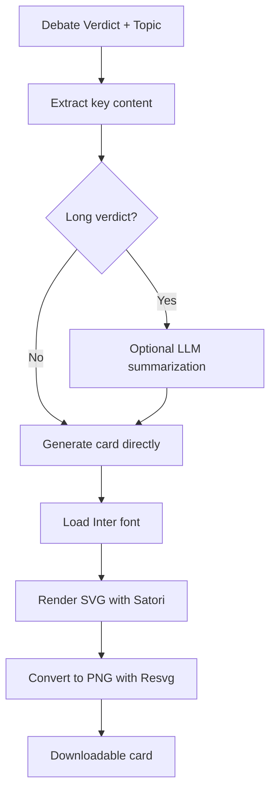

**Diagram sources**
- [dissensus-engine/server/card-generator.js:170-361](file://dissensus-engine/server/card-generator.js#L170-L361)

**Section sources**
- [dissensus-engine/server/card-generator.js:1-361](file://dissensus-engine/server/card-generator.js#L1-L361)

### Frontend Applications
- Debate UI (dissensus-engine/public)
  - Provider/model selection, API key handling, SSE consumption
  - Debate card generation and metrics dashboard
  - Saved debate permalink support
- Landing Page (diss-launch-kit/website)
  - Informational site with navigation to the debate app and project overview

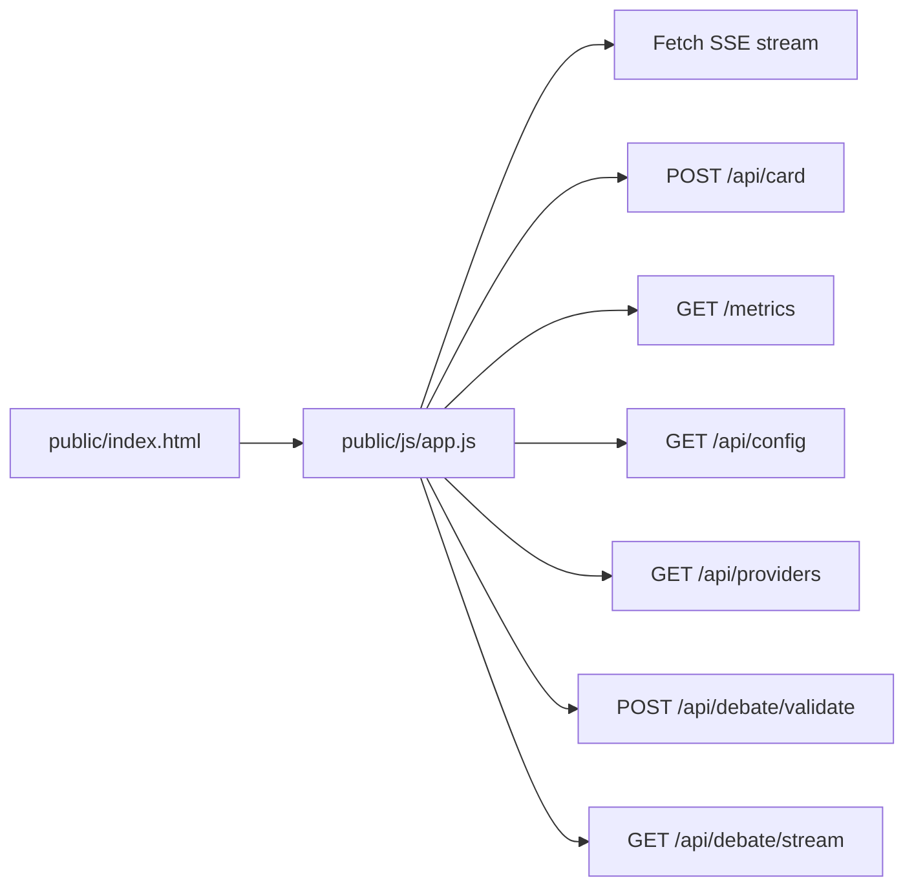

**Diagram sources**
- [dissensus-engine/public/index.html:1-183](file://dissensus-engine/public/index.html#L1-L183)
- [dissensus-engine/public/js/app.js:1-620](file://dissensus-engine/public/js/app.js#L1-L620)

**Section sources**
- [dissensus-engine/public/index.html:1-183](file://dissensus-engine/public/index.html#L1-L183)
- [dissensus-engine/public/js/app.js:1-620](file://dissensus-engine/public/js/app.js#L1-L620)
- [diss-launch-kit/website/index.html:1-451](file://diss-launch-kit/website/index.html#L1-L451)

## Dependency Analysis
The system exhibits clear module boundaries and minimal coupling:
- Express server depends on debate engine, metrics, card generator, and agents modules
- Frontend depends on server APIs and local state management
- AI provider integrations are abstracted behind a provider configuration object
- All components are self-contained within the Node.js ecosystem

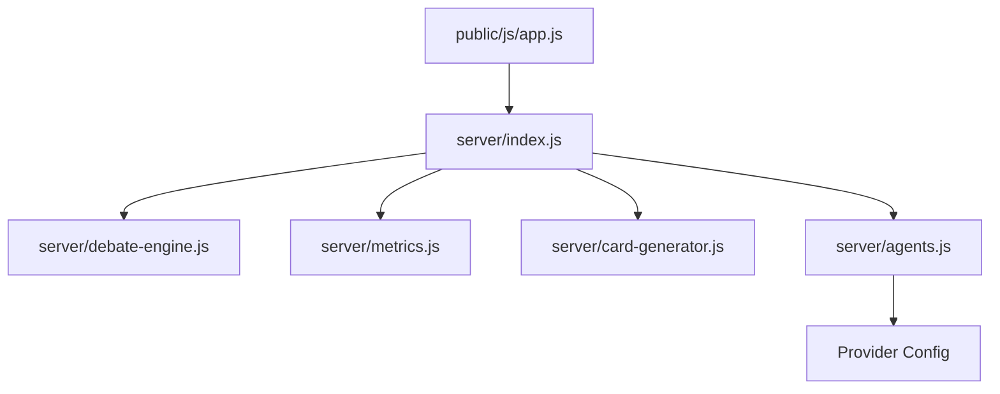

**Diagram sources**
- [dissensus-engine/server/index.js:11-16](file://dissensus-engine/server/index.js#L11-L16)
- [dissensus-engine/server/debate-engine.js:11-12](file://dissensus-engine/server/debate-engine.js#L11-L12)
- [dissensus-engine/server/metrics.js:1-8](file://dissensus-engine/server/metrics.js#L1-L8)
- [dissensus-engine/server/card-generator.js:7-9](file://dissensus-engine/server/card-generator.js#L7-L9)
- [dissensus-engine/server/agents.js:1-7](file://dissensus-engine/server/agents.js#L1-L7)

**Section sources**
- [dissensus-engine/server/index.js:1-382](file://dissensus-engine/server/index.js#L1-L382)
- [dissensus-engine/server/debate-engine.js:1-399](file://dissensus-engine/server/debate-engine.js#L1-L399)
- [dissensus-engine/server/card-generator.js:1-361](file://dissensus-engine/server/card-generator.js#L1-L361)

## Performance Considerations
- SSE Streaming
  - Nginx configuration disables buffering for /api/debate/stream to ensure real-time delivery
  - Client-side fetch with manual parsing avoids EventSource limitations for error reporting
- Rate Limiting
  - Express rate limiter protects endpoints from abuse; configurable per environment
- Memory and CPU
  - Lightweight Node.js server suitable for single-node VPS deployment
- Caching and Compression
  - Nginx serves static assets with caching and gzip compression
- Scalability
  - Stateless design allows horizontal scaling of the Express server behind a load balancer
  - Current deployment uses single-node VPS for simplicity and cost-effectiveness

## Troubleshooting Guide
Common issues and resolutions:
- SSE streaming not working
  - Verify Nginx has proxy_buffering off for /api/debate/stream
  - Check proxy_read_timeout and proxy_send_timeout for long debates
- 502 Bad Gateway
  - Confirm Express service is running and listening on port 3000
  - Review systemd status and logs
- SSL Certificate Issues
  - Ensure DNS points to VPS and port 80 is reachable for Let's Encrypt
- Out of Memory
  - Add swap space on constrained VPS instances
- Provider API Errors
  - Validate API keys and model availability; check provider quotas and rate limits

**Section sources**
- [dissensus-engine/docs/DEPLOY-VPS.md:627-641](file://dissensus-engine/docs/DEPLOY-VPS.md#L627-L641)
- [dissensus-engine/docs/DEPLOY-VPS.md:601-672](file://dissensus-engine/docs/DEPLOY-VPS.md#L601-L672)

## Conclusion
Dissensus combines a real-time AI debate engine with a modern Node.js architecture. The streamlined architecture supports clear separation of concerns, enabling independent scaling and maintenance of each component. The Express server layer provides robust SSE streaming, while the AI debate engine offers flexible multi-agent orchestration with three distinct agent personalities. The simplified architecture focuses on core debate functionality without legacy components, making it ideal for single-node VPS deployment.

## Appendices

### System Context Diagrams
High-level user interaction and AI provider integration flows:

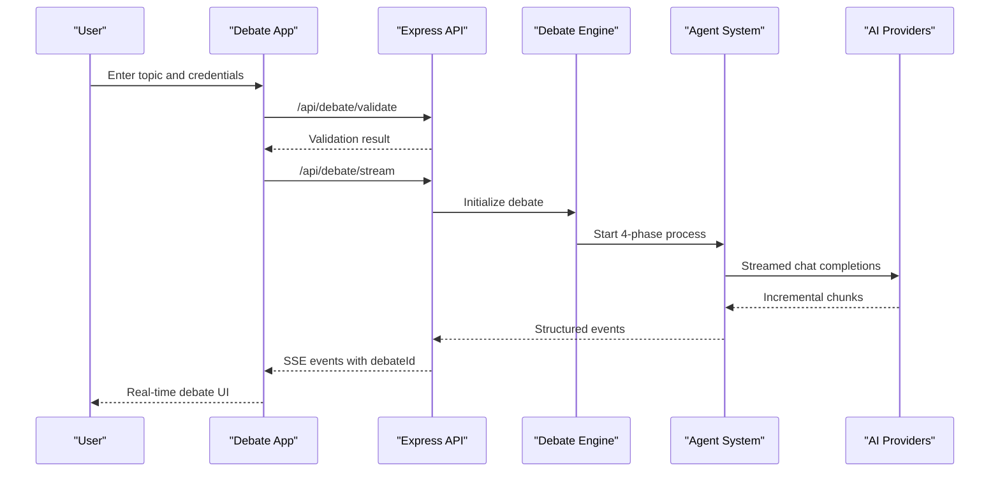

**Diagram sources**
- [dissensus-engine/public/js/app.js:209-341](file://dissensus-engine/public/js/app.js#L209-L341)
- [dissensus-engine/server/index.js:183-256](file://dissensus-engine/server/index.js#L183-L256)

### Deployment Topology
Current single-node VPS deployment with Node.js-only architecture:
- Nginx as reverse proxy and SSL terminator
- Express server behind systemd with automatic restarts
- Environment-specific configuration via .env files
- Firewall rules allowing only 80/443 and loopback to Node.js

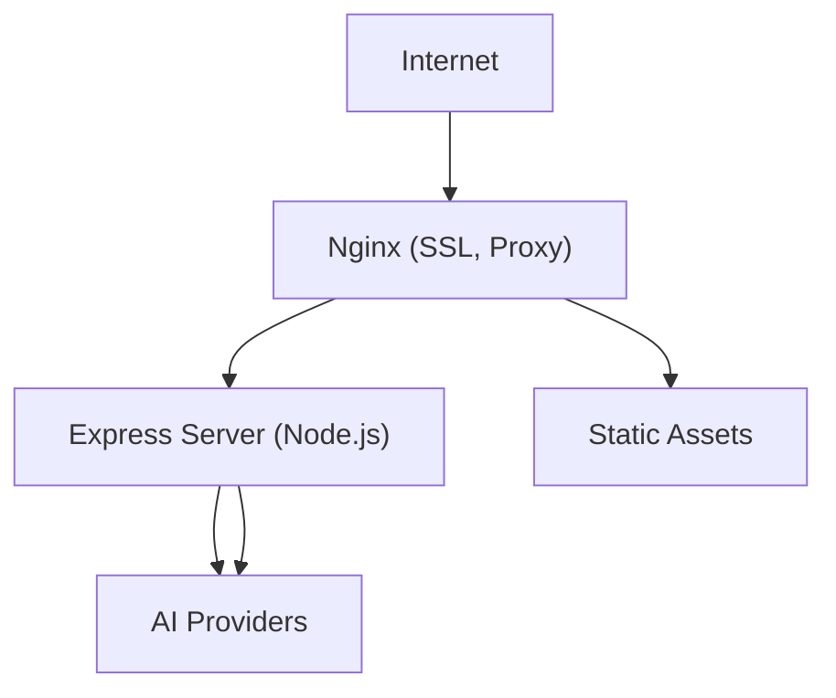

**Diagram sources**
- [dissensus-engine/docs/DEPLOY-VPS.md:711-740](file://dissensus-engine/docs/DEPLOY-VPS.md#L711-L740)