# System Architecture

<cite>
**Referenced Files in This Document**
- [README.md](file://README.md)
- [dissensus-engine/README.md](file://dissensus-engine/README.md)
- [dissensus-engine/package.json](file://dissensus-engine/package.json)
- [dissensus-engine/server/index.js](file://dissensus-engine/server/index.js)
- [dissensus-engine/server/debate-engine.js](file://dissensus-engine/server/debate-engine.js)
- [dissensus-engine/server/solana-balance.js](file://dissensus-engine/server/solana-balance.js)
- [dissensus-engine/server/staking.js](file://dissensus-engine/server/staking.js)
- [dissensus-engine/server/metrics.js](file://dissensus-engine/server/metrics.js)
- [dissensus-engine/public/index.html](file://dissensus-engine/public/index.html)
- [dissensus-engine/public/js/app.js](file://dissensus-engine/public/js/app.js)
- [dissensus-engine/docs/DEPLOY-VPS.md](file://dissensus-engine/docs/DEPLOY-VPS.md)
- [forum/server.py](file://forum/server.py)
- [forum/engine.js](file://forum/engine.js)
- [diss-launch-kit/website/index.html](file://diss-launch-kit/website/index.html)
</cite>

## Table of Contents
1. [Introduction](#introduction)
2. [Project Structure](#project-structure)
3. [Core Components](#core-components)
4. [Architecture Overview](#architecture-overview)
5. [Detailed Component Analysis](#detailed-component-analysis)
6. [Dependency Analysis](#dependency-analysis)
7. [Performance Considerations](#performance-considerations)
8. [Troubleshooting Guide](#troubleshooting-guide)
9. [Conclusion](#conclusion)
10. [Appendices](#appendices)

## Introduction
This document describes the Dissensus system architecture, focusing on the AI debate engine, research platform, frontend applications, and blockchain integration. The system follows a microservices-style composition:
- Express.js server layer with Server-Sent Events (SSE) for real-time debate streaming
- Python-based research engine for web research and structured debate synthesis
- Blockchain integration for Solana wallet verification and simulated staking
- Frontend applications for user interaction and content presentation

The architecture emphasizes modularity, scalability, and clear separation of concerns across the AI debate orchestration, research synthesis, and user interface layers.

## Project Structure
The repository organizes functionality into distinct modules:
- dissensus-engine: Express.js server, debate orchestration, SSE streaming, Solana integration, metrics, and frontend assets
- forum: Python Flask-based research engine and UI for structured debate synthesis
- diss-launch-kit: Landing page website for brand and token information
- Root-level documentation and deployment guides

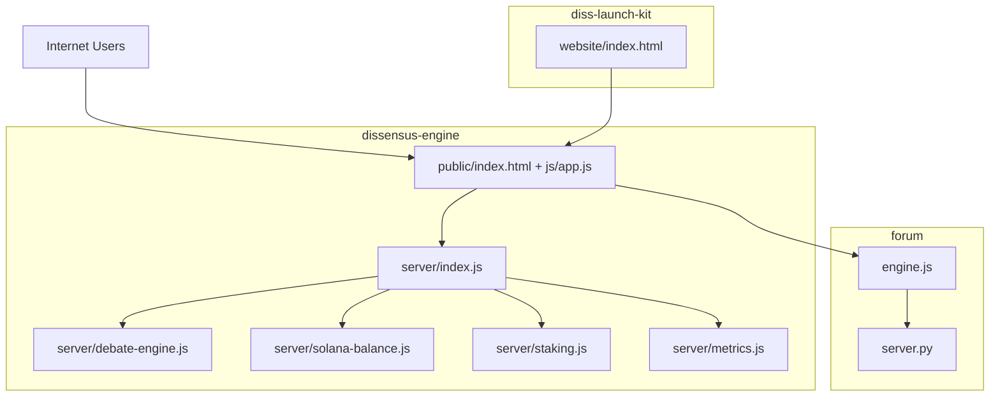

**Diagram sources**
- [dissensus-engine/server/index.js:1-481](file://dissensus-engine/server/index.js#L1-L481)
- [dissensus-engine/server/debate-engine.js:1-389](file://dissensus-engine/server/debate-engine.js#L1-L389)
- [dissensus-engine/server/solana-balance.js:1-83](file://dissensus-engine/server/solana-balance.js#L1-L83)
- [dissensus-engine/server/staking.js:1-183](file://dissensus-engine/server/staking.js#L1-L183)
- [dissensus-engine/server/metrics.js:1-152](file://dissensus-engine/server/metrics.js#L1-L152)
- [dissensus-engine/public/index.html:1-217](file://dissensus-engine/public/index.html#L1-L217)
- [dissensus-engine/public/js/app.js:1-674](file://dissensus-engine/public/js/app.js#L1-L674)
- [forum/server.py:1-495](file://forum/server.py#L1-L495)
- [forum/engine.js:1-323](file://forum/engine.js#L1-L323)
- [diss-launch-kit/website/index.html:1-541](file://diss-launch-kit/website/index.html#L1-L541)

**Section sources**
- [README.md:20-29](file://README.md#L20-L29)
- [dissensus-engine/README.md:110-134](file://dissensus-engine/README.md#L110-L134)

## Core Components
- Express.js Server (dissensus-engine/server/index.js)
  - Provides SSE streaming endpoint for real-time debate events
  - Exposes APIs for provider configuration, debate validation, staking, metrics, and Solana balance
  - Implements rate limiting, security headers, and graceful shutdown
- Debate Engine (dissensus-engine/server/debate-engine.js)
  - Orchestrates a 4-phase dialectical process across three AI agents
  - Integrates with OpenAI, DeepSeek, and Google Gemini providers
  - Streams incremental agent outputs via SSE
- Solana Integration (dissensus-engine/server/solana-balance.js)
  - Reads SPL token balances for a given wallet via server-side RPC
  - Normalizes wallet addresses and exposes mint configuration
- Staking Module (dissensus-engine/server/staking.js)
  - Simulates tiered staking with daily debate limits
  - Enforces optional wallet requirement via environment flag
- Metrics (dissensus-engine/server/metrics.js)
  - Tracks in-memory statistics for transparency dashboard
  - Aggregates provider usage, debates, and staking metrics
- Frontend (dissensus-engine/public)
  - React-like UI rendering with markdown rendering and SSE consumption
  - Wallet integration and debate card generation
- Research Platform (forum/server.py, forum/engine.js)
  - Python-based web research and structured debate synthesis
  - Flask API for topic analysis, research gathering, and agent-generated content
- Landing Page (diss-launch-kit/website/index.html)
  - Marketing and token information site with navigation to the debate app

**Section sources**
- [dissensus-engine/server/index.js:1-481](file://dissensus-engine/server/index.js#L1-L481)
- [dissensus-engine/server/debate-engine.js:1-389](file://dissensus-engine/server/debate-engine.js#L1-L389)
- [dissensus-engine/server/solana-balance.js:1-83](file://dissensus-engine/server/solana-balance.js#L1-L83)
- [dissensus-engine/server/staking.js:1-183](file://dissensus-engine/server/staking.js#L1-L183)
- [dissensus-engine/server/metrics.js:1-152](file://dissensus-engine/server/metrics.js#L1-L152)
- [dissensus-engine/public/index.html:1-217](file://dissensus-engine/public/index.html#L1-L217)
- [dissensus-engine/public/js/app.js:1-674](file://dissensus-engine/public/js/app.js#L1-L674)
- [forum/server.py:1-495](file://forum/server.py#L1-L495)
- [forum/engine.js:1-323](file://forum/engine.js#L1-L323)
- [diss-launch-kit/website/index.html:1-541](file://diss-launch-kit/website/index.html#L1-L541)

## Architecture Overview
The system employs a layered architecture:
- Presentation Layer: Frontend apps (debate UI and landing page)
- API Layer: Express.js server handling SSE, validation, and integrations
- Orchestration Layer: Debate engine coordinating multi-agent AI workflows
- Integration Layer: AI providers, Solana RPC, and research synthesis
- Persistence Layer: In-memory metrics and simulated staking (planned persistence for production)

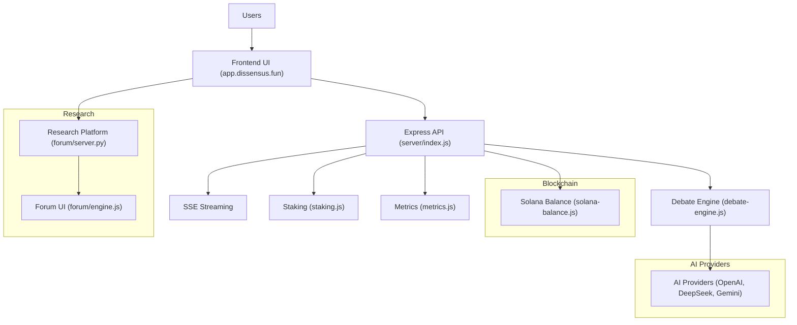

**Diagram sources**
- [dissensus-engine/server/index.js:1-481](file://dissensus-engine/server/index.js#L1-L481)
- [dissensus-engine/server/debate-engine.js:1-389](file://dissensus-engine/server/debate-engine.js#L1-L389)
- [dissensus-engine/server/solana-balance.js:1-83](file://dissensus-engine/server/solana-balance.js#L1-L83)
- [dissensus-engine/server/staking.js:1-183](file://dissensus-engine/server/staking.js#L1-L183)
- [dissensus-engine/server/metrics.js:1-152](file://dissensus-engine/server/metrics.js#L1-L152)
- [forum/server.py:1-495](file://forum/server.py#L1-L495)
- [forum/engine.js:1-323](file://forum/engine.js#L1-L323)

## Detailed Component Analysis

### Express.js Server Layer
The Express server provides:
- SSE endpoint for real-time debate streaming
- Validation and rate-limited endpoints for providers, staking, metrics, and Solana balance
- Health checks and configuration exposure
- Security middleware and graceful shutdown

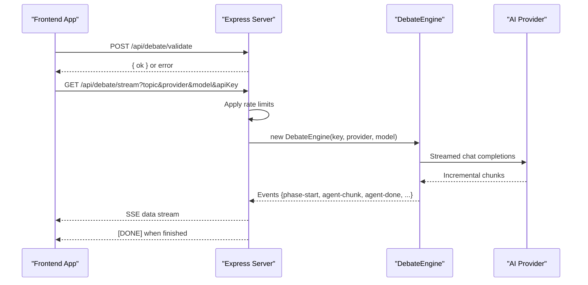

**Diagram sources**
- [dissensus-engine/server/index.js:177-311](file://dissensus-engine/server/index.js#L177-L311)
- [dissensus-engine/server/debate-engine.js:121-386](file://dissensus-engine/server/debate-engine.js#L121-L386)

**Section sources**
- [dissensus-engine/server/index.js:26-481](file://dissensus-engine/server/index.js#L26-L481)
- [dissensus-engine/package.json:1-28](file://dissensus-engine/package.json#L1-L28)

### Real-Time Streaming Architecture (SSE)
The SSE implementation streams structured debate events:
- Headers configured to disable buffering and maintain streaming
- Client consumes via fetch with manual parsing of data blocks
- Events include phase transitions, agent turns, and final verdict

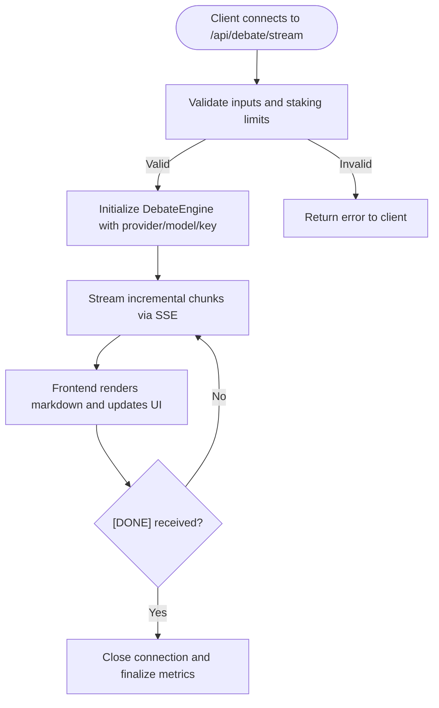

**Diagram sources**
- [dissensus-engine/server/index.js:220-311](file://dissensus-engine/server/index.js#L220-L311)
- [dissensus-engine/public/js/app.js:294-356](file://dissensus-engine/public/js/app.js#L294-L356)

**Section sources**
- [dissensus-engine/server/index.js:269-311](file://dissensus-engine/server/index.js#L269-L311)
- [dissensus-engine/public/js/app.js:358-427](file://dissensus-engine/public/js/app.js#L358-L427)

### AI Providers Integration
The debate engine integrates with multiple providers:
- OpenAI (GPT-4o, GPT-4o Mini)
- DeepSeek (DeepSeek V3.2)
- Google Gemini (2.0 Flash, 2.5 Flash, 2.5 Flash-Lite)

Provider configuration includes base URLs, authentication headers, and model metadata. The engine streams incremental responses and emits structured events for the UI.

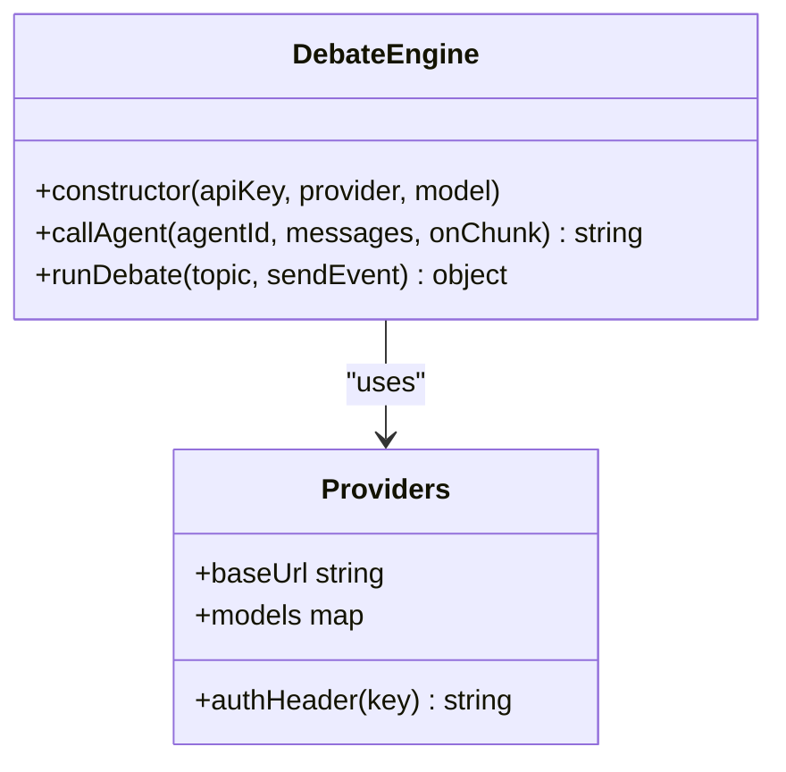

**Diagram sources**
- [dissensus-engine/server/debate-engine.js:41-53](file://dissensus-engine/server/debate-engine.js#L41-L53)
- [dissensus-engine/server/debate-engine.js:14-39](file://dissensus-engine/server/debate-engine.js#L14-L39)

**Section sources**
- [dissensus-engine/server/debate-engine.js:14-39](file://dissensus-engine/server/debate-engine.js#L14-L39)
- [dissensus-engine/server/debate-engine.js:58-116](file://dissensus-engine/server/debate-engine.js#L58-L116)

### Solana Blockchain Integration Layer
The Solana integration reads SPL token balances server-side:
- Validates wallet and mint inputs
- Uses @solana/web3.js and @solana/spl-token
- Returns normalized balance, raw amount, decimals, and ATA address
- Exposed via GET /api/solana/token-balance

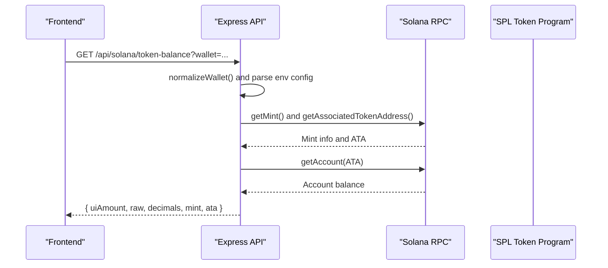

**Diagram sources**
- [dissensus-engine/server/solana-balance.js:26-76](file://dissensus-engine/server/solana-balance.js#L26-L76)
- [dissensus-engine/server/index.js:98-111](file://dissensus-engine/server/index.js#L98-L111)

**Section sources**
- [dissensus-engine/server/solana-balance.js:1-83](file://dissensus-engine/server/solana-balance.js#L1-L83)
- [dissensus-engine/server/index.js:88-122](file://dissensus-engine/server/index.js#L88-L122)

### Python-Based Research Engine
The research platform performs:
- Web search via DuckDuckGo HTML scraping
- Topic analysis and domain classification
- Agent-generated content synthesis (opening statements, cross-examination, rebuttals, consensus)
- Flask API serving both static assets and backend endpoints

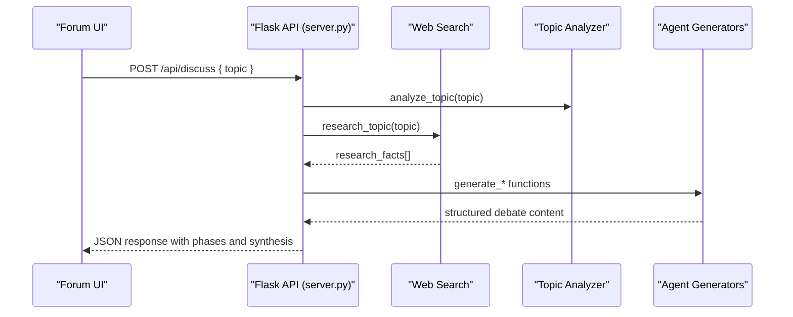

**Diagram sources**
- [forum/server.py:449-483](file://forum/server.py#L449-L483)
- [forum/server.py:68-140](file://forum/server.py#L68-L140)
- [forum/server.py:150-421](file://forum/server.py#L150-L421)
- [forum/engine.js:30-226](file://forum/engine.js#L30-L226)

**Section sources**
- [forum/server.py:1-495](file://forum/server.py#L1-L495)
- [forum/engine.js:1-323](file://forum/engine.js#L1-L323)

### Frontend Applications
- Debate UI (dissensus-engine/public)
  - Provider/model selection, API key handling, SSE consumption
  - Wallet integration and simulated staking controls
  - Debate card generation and metrics dashboard
- Landing Page (diss-launch-kit/website)
  - Informational site with navigation to the debate app and token details

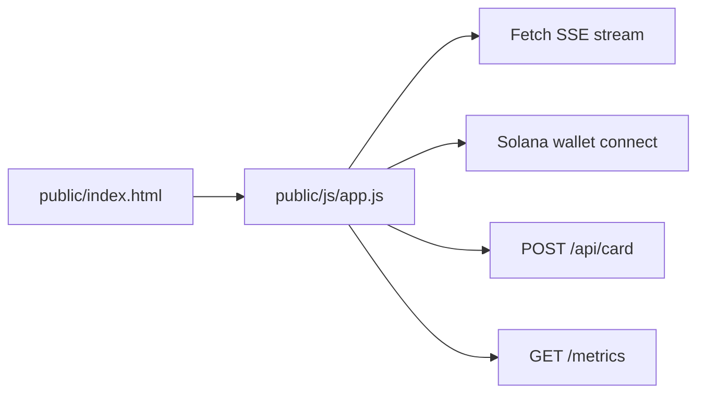

**Diagram sources**
- [dissensus-engine/public/index.html:1-217](file://dissensus-engine/public/index.html#L1-L217)
- [dissensus-engine/public/js/app.js:1-674](file://dissensus-engine/public/js/app.js#L1-L674)

**Section sources**
- [dissensus-engine/public/index.html:1-217](file://dissensus-engine/public/index.html#L1-L217)
- [dissensus-engine/public/js/app.js:1-674](file://dissensus-engine/public/js/app.js#L1-L674)
- [diss-launch-kit/website/index.html:1-541](file://diss-launch-kit/website/index.html#L1-L541)

## Dependency Analysis
The system exhibits clear module boundaries and minimal coupling:
- Express server depends on debate engine, staking, metrics, and Solana modules
- Frontend depends on server APIs and local state management
- Research platform is decoupled and can be scaled independently
- AI provider integrations are abstracted behind a provider configuration object

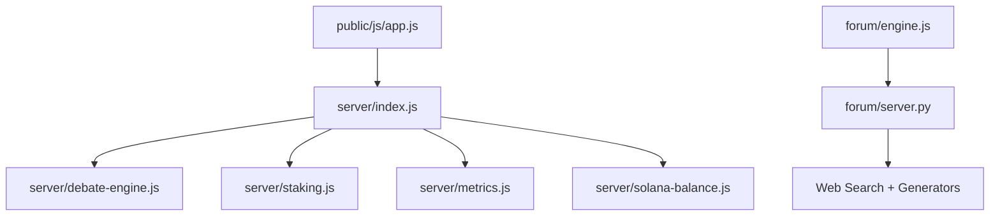

**Diagram sources**
- [dissensus-engine/server/index.js:11-24](file://dissensus-engine/server/index.js#L11-L24)
- [dissensus-engine/server/debate-engine.js:11-13](file://dissensus-engine/server/debate-engine.js#L11-L13)
- [dissensus-engine/server/staking.js:1-7](file://dissensus-engine/server/staking.js#L1-L7)
- [dissensus-engine/server/metrics.js:1-8](file://dissensus-engine/server/metrics.js#L1-L8)
- [dissensus-engine/server/solana-balance.js:1-9](file://dissensus-engine/server/solana-balance.js#L1-L9)
- [dissensus-engine/public/js/app.js:1-6](file://dissensus-engine/public/js/app.js#L1-L6)
- [forum/engine.js:1-9](file://forum/engine.js#L1-L9)
- [forum/server.py:11-19](file://forum/server.py#L11-L19)

**Section sources**
- [dissensus-engine/server/index.js:1-481](file://dissensus-engine/server/index.js#L1-L481)
- [dissensus-engine/server/debate-engine.js:1-389](file://dissensus-engine/server/debate-engine.js#L1-L389)
- [forum/server.py:1-495](file://forum/server.py#L1-L495)

## Performance Considerations
- SSE Streaming
  - Nginx configuration disables buffering for /api/debate/stream to ensure real-time delivery
  - Client-side fetch with manual parsing avoids EventSource limitations for error reporting
- Rate Limiting
  - Express rate limiter protects endpoints from abuse; configurable per environment
- Memory and CPU
  - Lightweight Node.js server; Python research engine can be scaled separately
- Caching and Compression
  - Nginx serves static assets with caching and gzip compression
- Scalability
  - Stateless design allows horizontal scaling of the Express server behind a load balancer
  - Research engine can be containerized and scaled independently

[No sources needed since this section provides general guidance]

## Troubleshooting Guide
Common issues and resolutions:
- SSE streaming not working
  - Verify Nginx has proxy_buffering off for /api/debate/stream
  - Check proxy_read_timeout and proxy_send_timeout for long debates
- 502 Bad Gateway
  - Confirm Express service is running and listening on port 3000
  - Review systemd status and logs
- SSL Certificate Issues
  - Ensure DNS points to VPS and port 80 is reachable for Let's Encrypt
- Out of Memory
  - Add swap space on constrained VPS instances
- Provider API Errors
  - Validate API keys and model availability; check provider quotas and rate limits

**Section sources**
- [dissensus-engine/docs/DEPLOY-VPS.md:627-641](file://dissensus-engine/docs/DEPLOY-VPS.md#L627-L641)
- [dissensus-engine/docs/DEPLOY-VPS.md:601-672](file://dissensus-engine/docs/DEPLOY-VPS.md#L601-L672)

## Conclusion
Dissensus combines a real-time AI debate engine with a research-driven synthesis platform and blockchain integration. The modular architecture supports clear separation of concerns, enabling independent scaling and maintenance of each component. The Express server layer provides robust SSE streaming, while the Python research engine offers flexible web research and structured debate synthesis. The Solana integration and staking simulation prepare the platform for on-chain governance and token-gated features.

[No sources needed since this section summarizes without analyzing specific files]

## Appendices

### System Context Diagrams
High-level user interaction and blockchain verification flows:

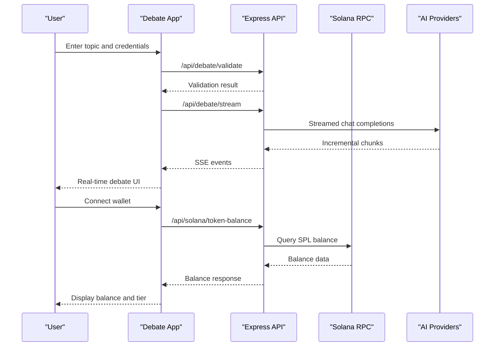

**Diagram sources**
- [dissensus-engine/public/js/app.js:209-356](file://dissensus-engine/public/js/app.js#L209-L356)
- [dissensus-engine/server/index.js:98-111](file://dissensus-engine/server/index.js#L98-L111)
- [dissensus-engine/server/solana-balance.js:26-76](file://dissensus-engine/server/solana-balance.js#L26-L76)

### Deployment Topology
Recommended deployment topology for production:
- Nginx as reverse proxy and SSL terminator
- Express server behind systemd with automatic restarts
- Separate Python research engine service
- Environment-specific configuration via .env files
- Firewall rules allowing only 80/443 and loopback to Node.js

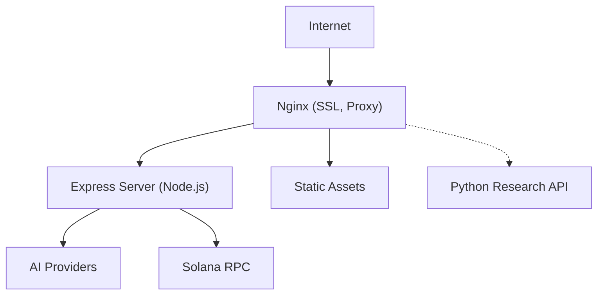

**Diagram sources**
- [dissensus-engine/docs/DEPLOY-VPS.md:711-740](file://dissensus-engine/docs/DEPLOY-VPS.md#L711-L740)