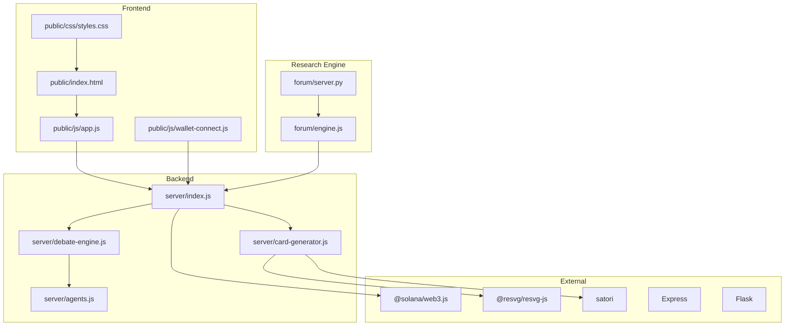
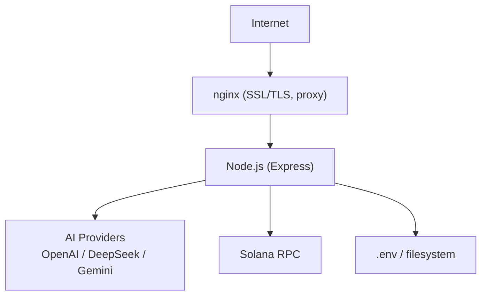
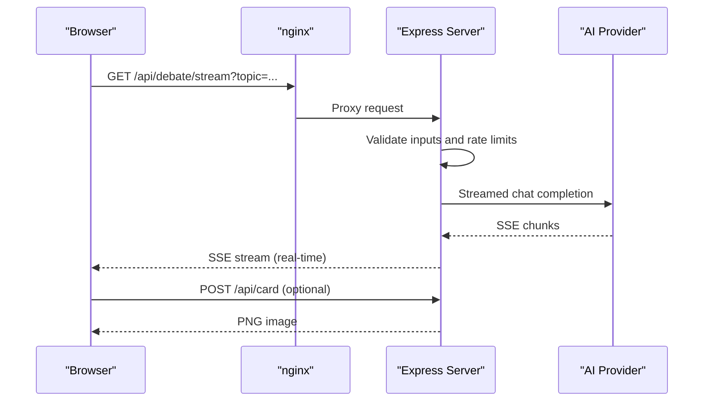
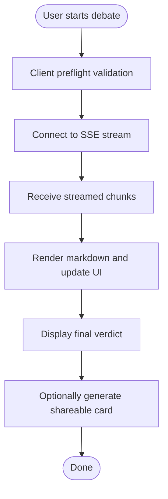
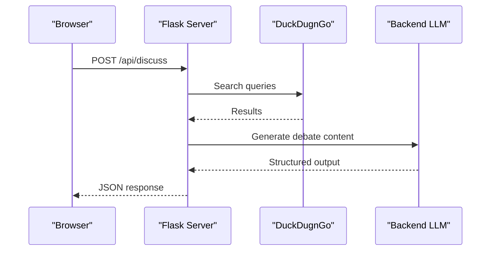
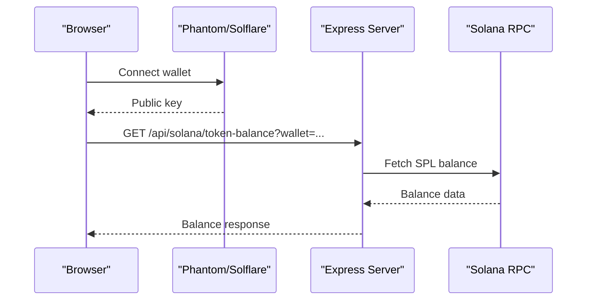

# Technology Stack & Dependencies

<cite>
**Referenced Files in This Document**
- [package.json](file://dissensus-engine/package.json)
- [README.md](file://dissensus-engine/README.md)
- [server/index.js](file://dissensus-engine/server/index.js)
- [server/debate-engine.js](file://dissensus-engine/server/debate-engine.js)
- [server/agents.js](file://dissensus-engine/server/agents.js)
- [server/card-generator.js](file://dissensus-engine/server/card-generator.js)
- [public/index.html](file://dissensus-engine/public/index.html)
- [public/js/app.js](file://dissensus-engine/public/js/app.js)
- [public/js/wallet-connect.js](file://dissensus-engine/public/js/wallet-connect.js)
- [public/css/styles.css](file://dissensus-engine/public/css/styles.css)
- [docs/DEPLOY-VPS.md](file://dissensus-engine/docs/DEPLOY-VPS.md)
- [docs/configs/dissensus.service](file://dissensus-engine/docs/configs/dissensus.service)
- [forum/server.py](file://forum/server.py)
- [forum/engine.js](file://forum/engine.js)
- [README.md](file://README.md)
</cite>

## Table of Contents
1. [Introduction](#introduction)
2. [Project Structure](#project-structure)
3. [Core Components](#core-components)
4. [Architecture Overview](#architecture-overview)
5. [Detailed Component Analysis](#detailed-component-analysis)
6. [Dependency Analysis](#dependency-analysis)
7. [Performance Considerations](#performance-considerations)
8. [Troubleshooting Guide](#troubleshooting-guide)
9. [Conclusion](#conclusion)
10. [Appendices](#appendices)

## Introduction
This document provides a comprehensive technology stack and dependency guide for the Dissensus platform. It covers the Node.js/Express backend, Python Flask research engine, HTML/CSS/JavaScript frontend, and blockchain integration with Solana. It also documents AI provider integrations (OpenAI, DeepSeek, Google Gemini), external libraries (@solana/web3.js, @resvg/resvg-js, satori), and deployment infrastructure (nginx, systemd). Version requirements, licensing, rationale for technology choices, dependency management guidance, security considerations, upgrade paths, and environment requirements are included.

## Project Structure
The Dissensus platform consists of:
- Node.js/Express backend (dissensus-engine): debate orchestration, SSE streaming, Solana integration, and card generation
- HTML/CSS/JavaScript frontend: interactive debate UI, wallet connection, and real-time streaming
- Python Flask research engine (forum): web research and topic analysis
- Deployment assets: nginx configuration, systemd unit, and VPS deployment guide

**Diagram sources**
- [server/index.js:1-481](file://dissensus-engine/server/index.js#L1-L481)
- [server/debate-engine.js:1-389](file://dissensus-engine/server/debate-engine.js#L1-L389)
- [server/agents.js:1-148](file://dissensus-engine/server/agents.js#L1-L148)
- [server/card-generator.js:1-361](file://dissensus-engine/server/card-generator.js#L1-L361)
- [public/index.html:1-217](file://dissensus-engine/public/index.html#L1-L217)
- [public/js/app.js:1-674](file://dissensus-engine/public/js/app.js#L1-L674)
- [public/js/wallet-connect.js:1-176](file://dissensus-engine/public/js/wallet-connect.js#L1-L176)
- [forum/server.py:1-495](file://forum/server.py#L1-L495)
- [forum/engine.js:1-323](file://forum/engine.js#L1-L323)

**Section sources**
- [README.md:20-29](file://README.md#L20-L29)
- [README.md:110-134](file://dissensus-engine/README.md#L110-L134)

## Core Components
- Backend server (Express): SSE streaming, rate limiting, provider routing, Solana balance checks, metrics, and card generation
- Debate engine: multi-agent orchestration with OpenAI, DeepSeek, and Google Gemini
- Frontend: real-time debate UI, wallet integration, and shareable card generation
- Research engine: web search and topic analysis powered by Flask
- Blockchain integration: Solana wallet connection and server-side SPL token balance verification

**Section sources**
- [server/index.js:1-481](file://dissensus-engine/server/index.js#L1-L481)
- [server/debate-engine.js:1-389](file://dissensus-engine/server/debate-engine.js#L1-L389)
- [public/js/app.js:1-674](file://dissensus-engine/public/js/app.js#L1-L674)
- [forum/server.py:1-495](file://forum/server.py#L1-L495)

## Architecture Overview
The platform uses a reverse proxy (nginx) to terminate TLS and forward requests to the Node.js server. The backend streams debate results via Server-Sent Events and integrates with AI providers and Solana.

**Diagram sources**
- [docs/DEPLOY-VPS.md:272-383](file://dissensus-engine/docs/DEPLOY-VPS.md#L272-L383)
- [server/index.js:26-122](file://dissensus-engine/server/index.js#L26-L122)

**Section sources**
- [docs/DEPLOY-VPS.md:711-740](file://dissensus-engine/docs/DEPLOY-VPS.md#L711-L740)

## Detailed Component Analysis

### Node.js/Express Backend
- Server initialization, middleware, and security headers
- SSE streaming for real-time debate results
- Provider configuration and key routing
- Solana integration (balance checks, staking placeholders)
- Metrics and transparency dashboard
- Card generation pipeline using satori and resvg

**Diagram sources**
- [server/index.js:220-311](file://dissensus-engine/server/index.js#L220-L311)
- [server/debate-engine.js:58-116](file://dissensus-engine/server/debate-engine.js#L58-L116)
- [server/card-generator.js:170-358](file://dissensus-engine/server/card-generator.js#L170-L358)

**Section sources**
- [server/index.js:1-481](file://dissensus-engine/server/index.js#L1-L481)
- [server/debate-engine.js:1-389](file://dissensus-engine/server/debate-engine.js#L1-L389)
- [server/card-generator.js:1-361](file://dissensus-engine/server/card-generator.js#L1-L361)

### AI Provider Integrations
Supported providers and models:
- OpenAI: GPT-4o, GPT-4o Mini
- DeepSeek: DeepSeek V3.2
- Google Gemini: 2.0 Flash, 2.5 Flash, 2.5 Flash-Lite

Provider configuration and model validation are handled centrally.

**Section sources**
- [server/debate-engine.js:14-39](file://dissensus-engine/server/debate-engine.js#L14-L39)
- [README.md:22-33](file://dissensus-engine/README.md#L22-L33)

### HTML/CSS/JavaScript Frontend
- Main UI: topic input, provider/model selection, wallet integration
- Real-time streaming: SSE consumption and markdown rendering
- Wallet connection: Phantom/Solflare integration with server-side balance verification
- Shareable debate cards: server-side generation with satori and resvg

**Diagram sources**
- [public/js/app.js:209-356](file://dissensus-engine/public/js/app.js#L209-L356)
- [public/js/app.js:359-427](file://dissensus-engine/public/js/app.js#L359-L427)

**Section sources**
- [public/index.html:1-217](file://dissensus-engine/public/index.html#L1-L217)
- [public/js/app.js:1-674](file://dissensus-engine/public/js/app.js#L1-L674)
- [public/js/wallet-connect.js:1-176](file://dissensus-engine/public/js/wallet-connect.js#L1-L176)
- [public/css/styles.css:1-800](file://dissensus-engine/public/css/styles.css#L1-L800)

### Python Flask Research Engine
- Web search via DuckDuckGo HTML scraping
- Topic analysis and research synthesis
- Unified server serving static assets and API endpoints

**Diagram sources**
- [forum/server.py:449-483](file://forum/server.py#L449-L483)
- [forum/engine.js:30-226](file://forum/engine.js#L30-L226)

**Section sources**
- [forum/server.py:1-495](file://forum/server.py#L1-L495)
- [forum/engine.js:1-323](file://forum/engine.js#L1-L323)

### Blockchain Integration with Solana
- Client-side wallet connection (Phantom/Solflare)
- Server-side SPL token balance verification
- Placeholder for on-chain staking program integration

**Diagram sources**
- [public/js/wallet-connect.js:95-134](file://dissensus-engine/public/js/wallet-connect.js#L95-L134)
- [server/index.js:98-111](file://dissensus-engine/server/index.js#L98-L111)

**Section sources**
- [public/js/wallet-connect.js:1-176](file://dissensus-engine/public/js/wallet-connect.js#L1-L176)
- [server/index.js:88-122](file://dissensus-engine/server/index.js#L88-L122)

## Dependency Analysis

### Backend Dependencies (Node.js)
- @solana/web3.js: Solana wallet and RPC integration
- @resvg/resvg-js: SVG to PNG conversion for shareable cards
- satori: HTML to SVG rendering for cards
- express: Web server and routing
- express-rate-limit: Request throttling
- helmet: Security headers

**Section sources**
- [package.json:10-19](file://dissensus-engine/package.json#L10-L19)

### Frontend Libraries
- @solana/web3.js: Client-side wallet connection (referenced in wallet UI)
- @resvg/resvg-js and satori: Server-side card generation

**Section sources**
- [public/js/wallet-connect.js:9-23](file://dissensus-engine/public/js/wallet-connect.js#L9-L23)
- [server/card-generator.js:7-8](file://dissensus-engine/server/card-generator.js#L7-L8)

### Research Engine Dependencies (Python)
- Flask: Web framework
- flask-cors: Cross-origin support
- urllib/ssl: Web scraping and HTTPS handling

**Section sources**
- [forum/server.py:11-15](file://forum/server.py#L11-L15)

### Deployment Infrastructure
- nginx: Reverse proxy, SSL termination, static asset caching, SSE streaming
- systemd: Service management and auto-start
- Let's Encrypt: Free SSL certificates

**Section sources**
- [docs/DEPLOY-VPS.md:272-383](file://dissensus-engine/docs/DEPLOY-VPS.md#L272-L383)
- [docs/configs/dissensus.service:1-27](file://dissensus-engine/docs/configs/dissensus.service#L1-L27)

## Performance Considerations
- SSE streaming: nginx must disable buffering for /api/debate/stream to ensure real-time delivery
- Rate limiting: configurable per environment to prevent abuse
- Card generation: server-side summarization reduces payload sizes for Twitter-friendly images
- Static assets: nginx serves CSS/JS/images directly with caching headers

[No sources needed since this section provides general guidance]

## Troubleshooting Guide
Common issues and resolutions:
- SSE not streaming: verify nginx has proxy_buffering off for /api/debate/stream
- SSL certificate failures: ensure DNS points to VPS and port 80 is open
- Service not running: check systemd status and journalctl logs
- Memory pressure: add swap space on constrained VPS instances

**Section sources**
- [docs/DEPLOY-VPS.md:627-641](file://dissensus-engine/docs/DEPLOY-VPS.md#L627-L641)
- [docs/DEPLOY-VPS.md:657-672](file://dissensus-engine/docs/DEPLOY-VPS.md#L657-L672)

## Conclusion
The Dissensus platform combines a modern Node.js/Express backend with a reactive frontend, integrates multiple AI providers, and leverages Solana for wallet and token interactions. The Python Flask research engine augments debates with real-world data. The deployment stack (nginx + systemd) ensures reliable, scalable operation with robust security and monitoring.

[No sources needed since this section summarizes without analyzing specific files]

## Appendices

### Version Requirements and Licensing
- Node.js: 18+ recommended; 20 LTS for production
- Python: 3.x for Flask engine
- Dependencies pinned in package.json with MIT license for the backend module

**Section sources**
- [README.md:37-40](file://dissensus-engine/README.md#L37-L40)
- [package.json:26-27](file://dissensus-engine/package.json#L26-L27)

### Security Considerations
- API keys: stored server-side in .env; never persisted client-side
- Helmet: security headers enabled (CSP disabled to support inline scripts)
- Trust proxy: configurable for reverse proxy environments
- Rate limiting: protects against abuse

**Section sources**
- [server/index.js:50-64](file://dissensus-engine/server/index.js#L50-L64)
- [server/index.js:32-38](file://dissensus-engine/server/index.js#L32-L38)

### Upgrade Paths
- Backend: npm audit, npm outdated, targeted dependency updates with regression testing
- Frontend: rebuild assets, verify wallet and card generation
- Research engine: pip install -r requirements.txt equivalents if applicable
- Infrastructure: nginx and systemd updates with service restarts

**Section sources**
- [README.md:156-181](file://dissensus-engine/README.md#L156-L181)
- [docs/DEPLOY-VPS.md:554-572](file://dissensus-engine/docs/DEPLOY-VPS.md#L554-L572)

### Environment Requirements
- Development: Node.js + npm, optional Python + pip for research engine
- Production: VPS with nginx, systemd, and SSL; environment variables configured

**Section sources**
- [README.md:37-56](file://dissensus-engine/README.md#L37-L56)
- [docs/DEPLOY-VPS.md:26-36](file://dissensus-engine/docs/DEPLOY-VPS.md#L26-L36)