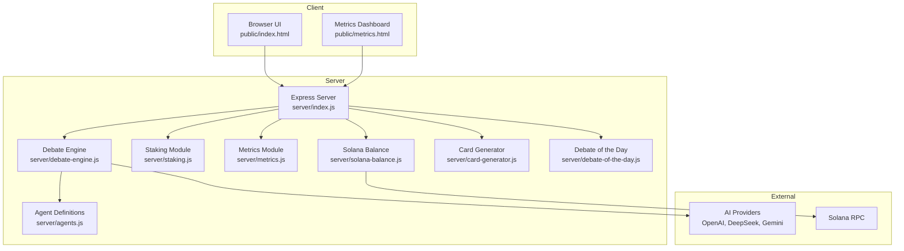
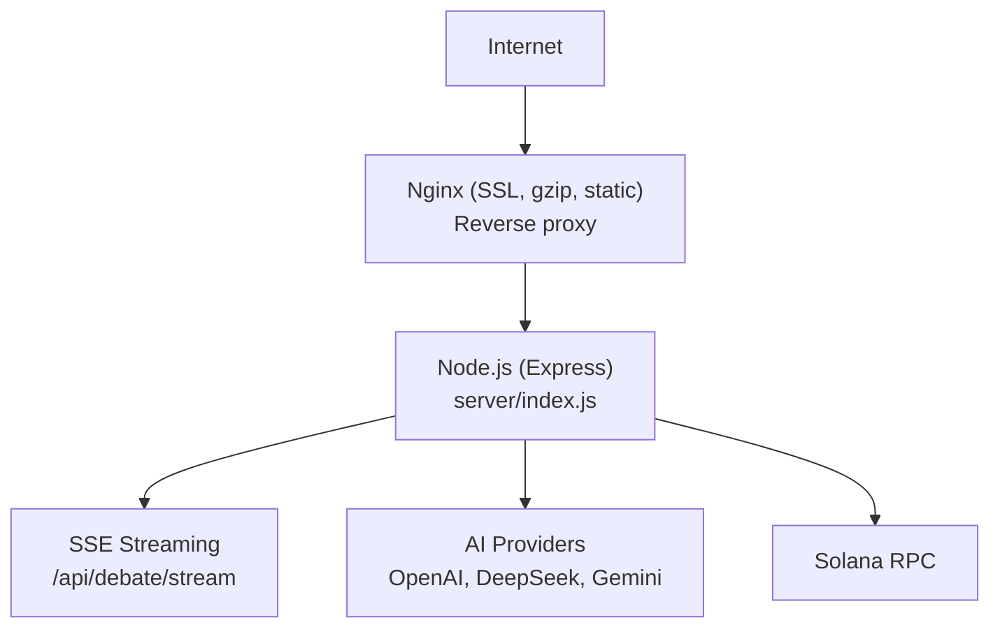
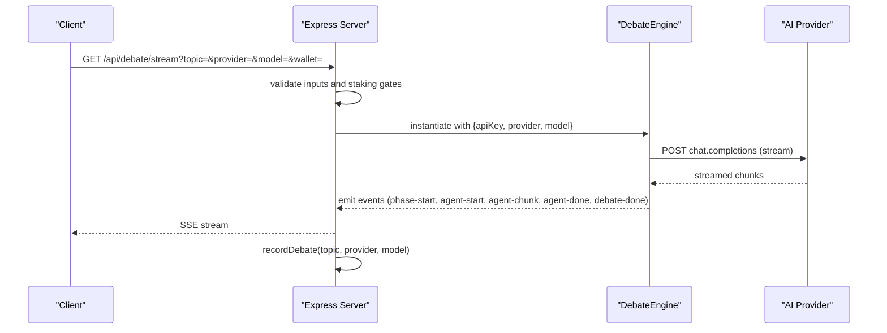
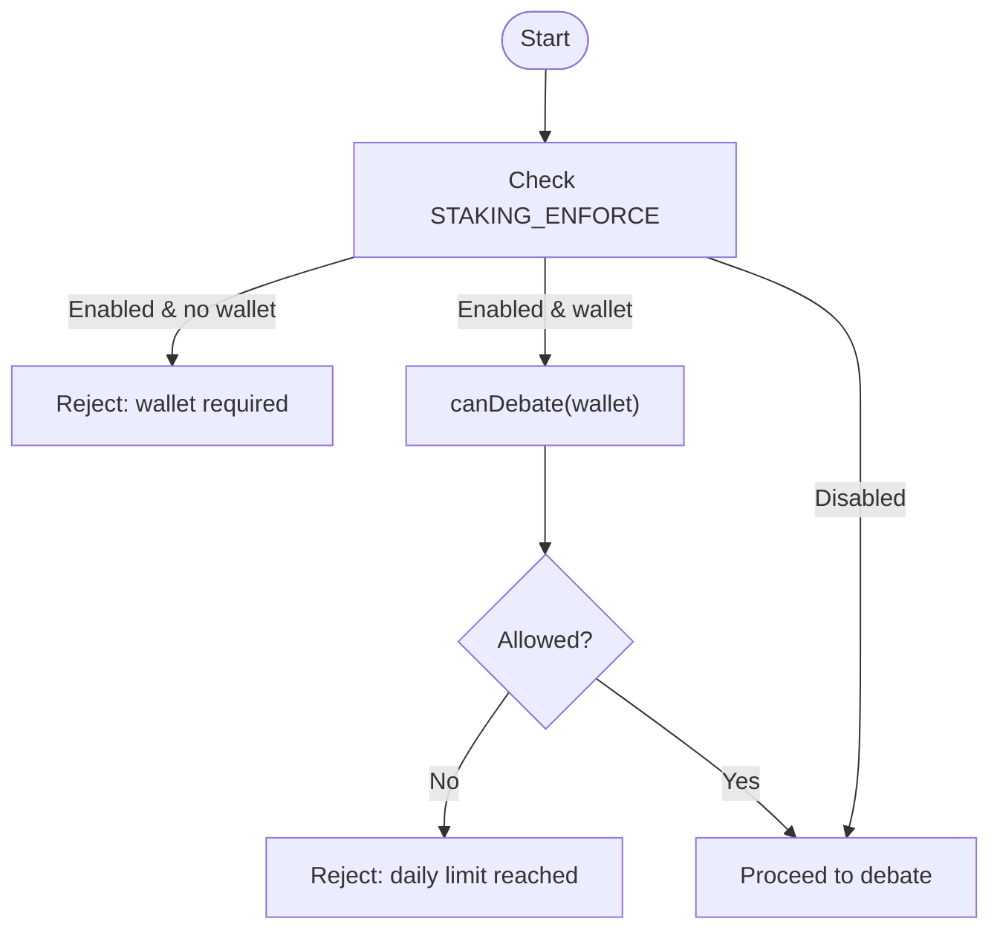
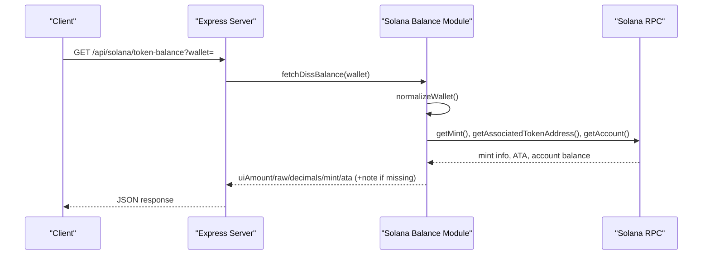
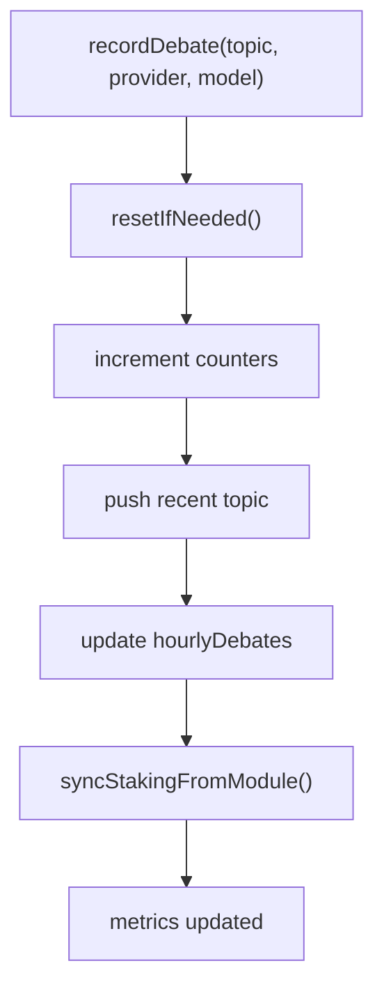
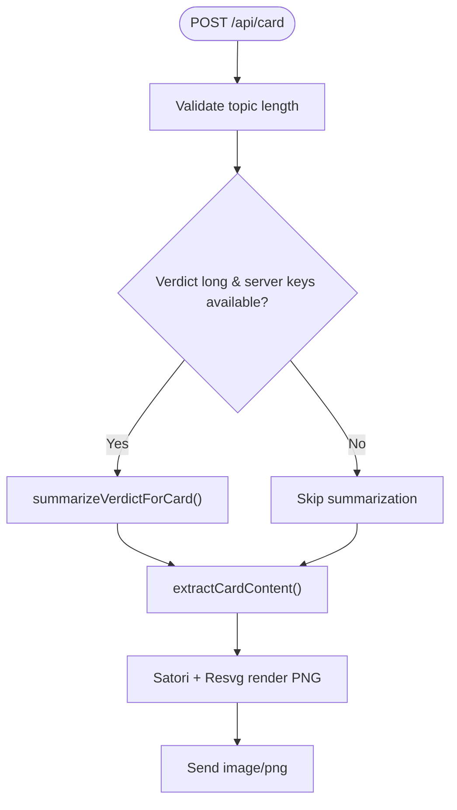
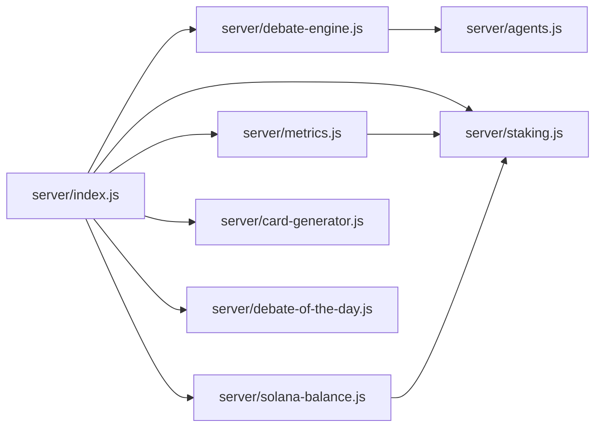
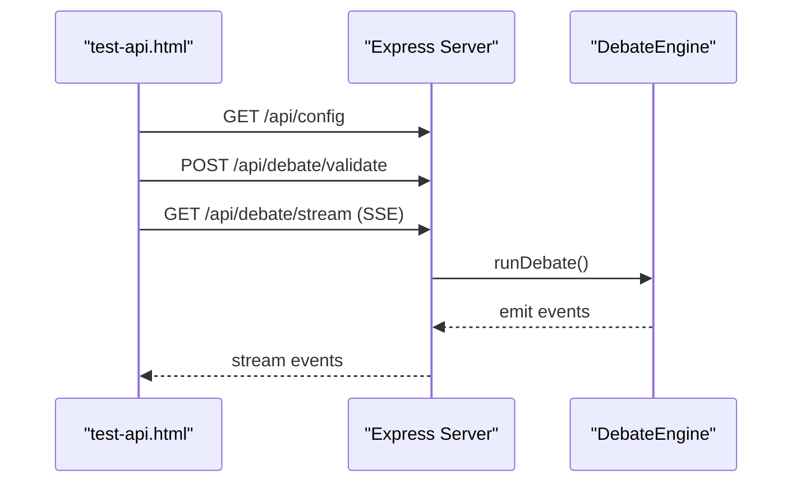

# Troubleshooting & FAQ

<cite>
**Referenced Files in This Document**
- [README.md](file://dissensus-engine/README.md)
- [package.json](file://dissensus-engine/package.json)
- [index.js](file://dissensus-engine/server/index.js)
- [debate-engine.js](file://dissensus-engine/server/debate-engine.js)
- [staking.js](file://dissensus-engine/server/staking.js)
- [metrics.js](file://dissensus-engine/server/metrics.js)
- [solana-balance.js](file://dissensus-engine/server/solana-balance.js)
- [agents.js](file://dissensus-engine/server/agents.js)
- [card-generator.js](file://dissensus-engine/server/card-generator.js)
- [debate-of-the-day.js](file://dissensus-engine/server/debate-of-the-day.js)
- [test-api.html](file://dissensus-engine/public/test-api.html)
- [metrics.html](file://dissensus-engine/public/metrics.html)
- [DEPLOY-VPS.md](file://dissensus-engine/docs/DEPLOY-VPS.md)
- [QUICK-REFERENCE.md](file://dissensus-engine/docs/QUICK-REFERENCE.md)
- [deploy-env-to-vps.ps1](file://dissensus-engine/deploy-env-to-vps.ps1)
</cite>

## Table of Contents
1. [Introduction](#introduction)
2. [Project Structure](#project-structure)
3. [Core Components](#core-components)
4. [Architecture Overview](#architecture-overview)
5. [Detailed Component Analysis](#detailed-component-analysis)
6. [Dependency Analysis](#dependency-analysis)
7. [Performance Considerations](#performance-considerations)
8. [Troubleshooting Guide](#troubleshooting-guide)
9. [Conclusion](#conclusion)
10. [Appendices](#appendices)

## Introduction
This document provides comprehensive troubleshooting and FAQ guidance for the Dissensus AI Debate Engine. It covers API integration issues, deployment failures, performance bottlenecks, and user support scenarios. It also includes debugging techniques for the debate engine, staking system, and blockchain integration, along with step-by-step resolution guides for environment setup, dependency conflicts, and configuration errors. Guidance is included for performance optimization, memory management, resource monitoring, diagnostics, rollbacks, emergency fixes, and escalation paths.

## Project Structure
The debate engine is a Node.js/Express application with:
- An Express server exposing SSE endpoints and static assets
- A debate orchestrator implementing a 4-phase dialectical process
- Simulated staking and metrics systems
- Solana integration for token balance queries
- Utilities for generating shareable debate cards and selecting “Debate of the Day”
- Deployment and quick-reference documentation

**Diagram sources**
- [index.js:1-481](file://dissensus-engine/server/index.js#L1-L481)
- [debate-engine.js:1-389](file://dissensus-engine/server/debate-engine.js#L1-L389)
- [staking.js:1-183](file://dissensus-engine/server/staking.js#L1-L183)
- [metrics.js:1-152](file://dissensus-engine/server/metrics.js#L1-L152)
- [solana-balance.js:1-83](file://dissensus-engine/server/solana-balance.js#L1-L83)
- [card-generator.js:1-361](file://dissensus-engine/server/card-generator.js#L1-L361)
- [debate-of-the-day.js:1-80](file://dissensus-engine/server/debate-of-the-day.js#L1-L80)
- [agents.js:1-148](file://dissensus-engine/server/agents.js#L1-L148)

**Section sources**
- [README.md:110-134](file://dissensus-engine/README.md#L110-L134)
- [package.json:1-28](file://dissensus-engine/package.json#L1-L28)

## Core Components
- Express server with middleware, rate limits, and SSE streaming
- Debate engine orchestrating 4 phases with parallel agent execution
- Simulated staking with tier-based limits and daily resets
- Metrics system for transparency and analytics
- Solana balance retrieval via server-side RPC
- Card generator for social sharing
- “Debate of the Day” sourced from CoinGecko with fallbacks

Key endpoints and behaviors:
- Health and configuration: GET /api/health, GET /api/config
- Providers and models: GET /api/providers
- Validation and streaming debate: POST /api/debate/validate, GET /api/debate/stream
- Staking: GET /api/staking/tiers, GET /api/staking/status, POST /api/staking/stake, POST /api/staking/unstake
- Solana balance: GET /api/solana/token-balance
- Metrics: GET /api/metrics, GET /api/metrics/topics, GET /metrics
- Card generation: POST /api/card
- Debate of the day: GET /api/debate-of-the-day

**Section sources**
- [index.js:69-133](file://dissensus-engine/server/index.js#L69-L133)
- [index.js:177-311](file://dissensus-engine/server/index.js#L177-L311)
- [index.js:324-355](file://dissensus-engine/server/index.js#L324-L355)
- [index.js:98-122](file://dissensus-engine/server/index.js#L98-L122)
- [index.js:429-445](file://dissensus-engine/server/index.js#L429-L445)
- [index.js:382-416](file://dissensus-engine/server/index.js#L382-L416)
- [index.js:360-369](file://dissensus-engine/server/index.js#L360-L369)

## Architecture Overview
The system uses a reverse proxy (Nginx) to handle TLS, compression, static assets, and SSE streaming without buffering. The Node.js server exposes endpoints, streams debate results via Server-Sent Events, integrates with AI providers, and optionally queries Solana balances.

**Diagram sources**
- [DEPLOY-VPS.md:711-740](file://dissensus-engine/docs/DEPLOY-VPS.md#L711-L740)
- [index.js:269-311](file://dissensus-engine/server/index.js#L269-L311)

**Section sources**
- [DEPLOY-VPS.md:272-386](file://dissensus-engine/docs/DEPLOY-VPS.md#L272-L386)

## Detailed Component Analysis

### Debate Engine (4-Phase Orchestration)
The debate engine coordinates three agents (CIPHER, NOVA, PRISM) through:
- Phase 1: Parallel independent analysis
- Phase 2: Opening arguments
- Phase 3: Cross-examination
- Phase 4: Final verdict

It streams tokens via SSE and records errors and debates.

**Diagram sources**
- [index.js:220-311](file://dissensus-engine/server/index.js#L220-L311)
- [debate-engine.js:121-386](file://dissensus-engine/server/debate-engine.js#L121-L386)

**Section sources**
- [debate-engine.js:14-39](file://dissensus-engine/server/debate-engine.js#L14-L39)
- [agents.js:8-148](file://dissensus-engine/server/agents.js#L8-L148)

### Staking System (Simulated)
Simulates tiered staking with daily debate limits and normalization of wallet addresses. Enforced via environment flag and integrated into debate gating.

**Diagram sources**
- [index.js:224-234](file://dissensus-engine/server/index.js#L224-L234)
- [staking.js:110-125](file://dissensus-engine/server/staking.js#L110-L125)

**Section sources**
- [README.md:78-89](file://dissensus-engine/README.md#L78-L89)
- [staking.js:12-19](file://dissensus-engine/server/staking.js#L12-L19)
- [staking.js:147-154](file://dissensus-engine/server/staking.js#L147-L154)

### Solana Integration
Server-side SPL token balance retrieval using configured RPC and mint. Normalizes wallet addresses and handles missing accounts gracefully.

**Diagram sources**
- [index.js:98-111](file://dissensus-engine/server/index.js#L98-L111)
- [solana-balance.js:26-76](file://dissensus-engine/server/solana-balance.js#L26-L76)

**Section sources**
- [README.md:103-109](file://dissensus-engine/README.md#L103-L109)
- [solana-balance.js:14-21](file://dissensus-engine/server/solana-balance.js#L14-L21)

### Metrics and Transparency
In-memory metrics track debates, provider usage, recent topics, hourly activity, and request success rates. Staking aggregates are synchronized periodically.

**Diagram sources**
- [metrics.js:46-98](file://dissensus-engine/server/metrics.js#L46-L98)

**Section sources**
- [README.md:91-101](file://dissensus-engine/README.md#L91-L101)
- [metrics.js:10-44](file://dissensus-engine/server/metrics.js#L10-L44)

### Card Generator
Generates shareable PNGs optimized for social media. Optionally summarizes long verdicts using a server-side key.

**Diagram sources**
- [index.js:382-416](file://dissensus-engine/server/index.js#L382-L416)
- [card-generator.js:41-85](file://dissensus-engine/server/card-generator.js#L41-L85)
- [card-generator.js:87-152](file://dissensus-engine/server/card-generator.js#L87-L152)
- [card-generator.js:170-358](file://dissensus-engine/server/card-generator.js#L170-L358)

**Section sources**
- [card-generator.js:14-39](file://dissensus-engine/server/card-generator.js#L14-L39)

## Dependency Analysis
- Express server depends on debate engine, staking, metrics, Solana module, and card generator
- Debate engine depends on agent definitions and provider configurations
- Metrics module depends on staking aggregates
- Solana module depends on web3 and spl-token libraries
- Frontend pages depend on server endpoints and static assets

**Diagram sources**
- [index.js:11-24](file://dissensus-engine/server/index.js#L11-L24)
- [debate-engine.js:11-11](file://dissensus-engine/server/debate-engine.js#L11-L11)
- [metrics.js:8-8](file://dissensus-engine/server/metrics.js#L8-L8)

**Section sources**
- [package.json:10-19](file://dissensus-engine/package.json#L10-L19)

## Performance Considerations
- SSE streaming requires Nginx to disable buffering for /api/debate/stream
- Rate limiting protects endpoints; adjust for environments with higher loads
- Memory usage grows with concurrent debates; monitor with system tools
- Card generation uses CPU for rendering; consider throttling or caching
- Provider latency affects streaming; choose appropriate models and regions

[No sources needed since this section provides general guidance]

## Troubleshooting Guide

### API Integration Problems
Symptoms:
- 400/403 responses from debate endpoints
- Missing or invalid API keys
- Provider-specific errors during streaming

Resolution steps:
- Confirm API keys are set in environment or provided by the client
- Validate provider/model combinations via /api/providers
- Use /api/debate/validate to preflight inputs
- Inspect server logs for detailed error messages

Common causes and fixes:
- Unknown provider or invalid model: ensure provider and model are valid
- Missing topic or invalid length: topic must be 3–500 characters
- API key required: set server-side key or pass client key
- Streaming stalls: verify Nginx SSE configuration

**Section sources**
- [index.js:157-215](file://dissensus-engine/server/index.js#L157-L215)
- [index.js:255-267](file://dissensus-engine/server/index.js#L255-L267)
- [index.js:138-152](file://dissensus-engine/server/index.js#L138-L152)
- [test-api.html:13-48](file://dissensus-engine/public/test-api.html#L13-L48)

### Deployment Failures
Symptoms:
- 502 Bad Gateway from Nginx
- Connection refused on port 3000
- SSL certificate issuance failures

Resolution steps:
- Check service status and logs
- Verify Nginx configuration for SSE buffering
- Ensure firewall allows ports 80/443
- Confirm DNS points to VPS IP

Emergency actions:
- Restart services and reload Nginx
- Add swap if memory constrained
- Re-check SSL certificate and renewal

**Section sources**
- [DEPLOY-VPS.md:601-690](file://dissensus-engine/docs/DEPLOY-VPS.md#L601-L690)
- [QUICK-REFERENCE.md:75-96](file://dissensus-engine/docs/QUICK-REFERENCE.md#L75-L96)

### Performance Issues
Symptoms:
- Slow streaming, delayed SSE chunks
- High CPU usage during card generation
- Memory pressure under load

Resolution steps:
- Confirm Nginx disables buffering for SSE
- Reduce concurrent debates or increase resources
- Monitor memory and CPU with system tools
- Consider caching or rate limiting

**Section sources**
- [DEPLOY-VPS.md:326-344](file://dissensus-engine/docs/DEPLOY-VPS.md#L326-L344)
- [QUICK-REFERENCE.md:117-137](file://dissensus-engine/docs/QUICK-REFERENCE.md#L117-L137)

### User Support Scenarios
Common issues:
- Users cannot start debates due to daily limits
- Wallet address not recognized
- Metrics page not loading

Resolution steps:
- Explain staking tiers and daily limits
- Normalize wallet addresses and confirm format
- Verify same-origin policy for metrics page

**Section sources**
- [README.md:78-89](file://dissensus-engine/README.md#L78-L89)
- [staking.js:147-154](file://dissensus-engine/server/staking.js#L147-L154)
- [metrics.html:388-486](file://dissensus-engine/public/metrics.html#L388-L486)

### Debugging Techniques

#### Debugging the Debate Engine
- Use the built-in API tester page to validate endpoints
- Observe SSE event types and chunk delivery
- Check server logs for error events and stack traces

**Diagram sources**
- [test-api.html:9-48](file://dissensus-engine/public/test-api.html#L9-L48)
- [index.js:220-311](file://dissensus-engine/server/index.js#L220-L311)

**Section sources**
- [test-api.html:1-52](file://dissensus-engine/public/test-api.html#L1-L52)

#### Debugging the Staking System
- Verify wallet normalization and tier computation
- Check daily reset logic and debate usage tracking
- Confirm staking enforcement flag behavior

**Section sources**
- [staking.js:21-33](file://dissensus-engine/server/staking.js#L21-L33)
- [staking.js:110-125](file://dissensus-engine/server/staking.js#L110-L125)

#### Debugging Blockchain Integration
- Validate wallet and mint formats
- Confirm RPC URL and mint configuration
- Handle missing token accounts gracefully

**Section sources**
- [solana-balance.js:26-76](file://dissensus-engine/server/solana-balance.js#L26-L76)

### Environment Setup Problems
Symptoms:
- Missing environment variables
- Dependency installation failures
- Port conflicts or permission denied

Resolution steps:
- Copy and edit .env.example with required keys
- Install production dependencies
- Ensure correct permissions and port availability

**Section sources**
- [README.md:65-77](file://dissensus-engine/README.md#L65-L77)
- [deploy-env-to-vps.ps1:13-36](file://dissensus-engine/deploy-env-to-vps.ps1#L13-L36)

### Dependency Conflicts
Symptoms:
- Package installation errors
- Version mismatches causing runtime issues

Resolution steps:
- Clean install with production flags
- Pin compatible versions as documented
- Rebuild native modules if needed

**Section sources**
- [package.json:10-19](file://dissensus-engine/package.json#L10-L19)
- [DEPLOY-VPS.md:154-161](file://dissensus-engine/docs/DEPLOY-VPS.md#L154-L161)

### Configuration Errors
Symptoms:
- Incorrect trust proxy settings causing rate limit errors
- Wrong Solana cluster or mint
- Misconfigured Nginx for SSE

Resolution steps:
- Review trust proxy and hops settings
- Verify Solana RPC URL and mint
- Validate Nginx SSE block settings

**Section sources**
- [index.js:32-38](file://dissensus-engine/server/index.js#L32-L38)
- [README.md:136-150](file://dissensus-engine/README.md#L136-L150)
- [solana-balance.js:14-21](file://dissensus-engine/server/solana-balance.js#L14-L21)
- [DEPLOY-VPS.md:326-344](file://dissensus-engine/docs/DEPLOY-VPS.md#L326-L344)

### Diagnostics and Monitoring
- Use systemd/journald for live logs
- Monitor Nginx access and error logs
- Track server health via /api/health
- Inspect metrics dashboard for trends

**Section sources**
- [DEPLOY-VPS.md:536-552](file://dissensus-engine/docs/DEPLOY-VPS.md#L536-L552)
- [QUICK-REFERENCE.md:117-137](file://dissensus-engine/docs/QUICK-REFERENCE.md#L117-L137)

### Rollback and Emergency Fixes
- Keep backups of previous deployments
- Restart services and reload Nginx after fixes
- Add swap if memory is exhausted
- Revert configuration changes incrementally

**Section sources**
- [QUICK-REFERENCE.md:141-164](file://dissensus-engine/docs/QUICK-REFERENCE.md#L141-L164)

### Escalation Paths
- For infrastructure issues, verify firewall and DNS
- For provider outages, check provider status and quotas
- For persistent bugs, collect logs and reproduce with minimal setup

**Section sources**
- [DEPLOY-VPS.md:416-452](file://dissensus-engine/docs/DEPLOY-VPS.md#L416-L452)

## Conclusion
This guide consolidates practical troubleshooting steps, debugging techniques, and operational procedures for the Dissensus AI Debate Engine. By validating configurations, monitoring logs, and following the provided sequences and diagrams, teams can quickly diagnose and resolve API integration, deployment, performance, and user support issues.

## Appendices

### Frequently Asked Questions (FAQ)

- How do I fix “Too many debates” errors?
  - Reduce client-side frequency or increase limits via staking tiers.

- Why is my debate not streaming?
  - Check Nginx SSE buffering settings and firewall rules.

- How do I configure server-side API keys?
  - Set keys in .env and restart the service.

- What is the staking enforcement flag?
  - When enabled, debates require a wallet and enforce daily limits.

- How do I verify the server is healthy?
  - Use /api/health and review logs.

- How do I generate a debate card?
  - Submit a topic and verdict to /api/card; server may summarize if keys are available.

- How do I check recent topics and provider usage?
  - Visit /metrics or call /api/metrics and /api/metrics/topics.

- How do I troubleshoot Solana balance queries?
  - Confirm wallet and mint formats, and check RPC connectivity.

- How do I update the engine safely?
  - Backup, upload new files, install dependencies, restart service, verify health.

- How do I renew SSL?
  - Use certbot renewal or force renewal if needed.

**Section sources**
- [README.md:65-101](file://dissensus-engine/README.md#L65-L101)
- [index.js:69-85](file://dissensus-engine/server/index.js#L69-L85)
- [index.js:429-445](file://dissensus-engine/server/index.js#L429-L445)
- [solana-balance.js:26-76](file://dissensus-engine/server/solana-balance.js#L26-L76)
- [DEPLOY-VPS.md:554-572](file://dissensus-engine/docs/DEPLOY-VPS.md#L554-L572)
- [QUICK-REFERENCE.md:99-113](file://dissensus-engine/docs/QUICK-REFERENCE.md#L99-L113)